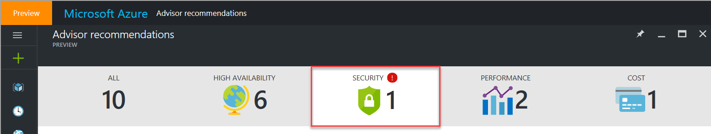
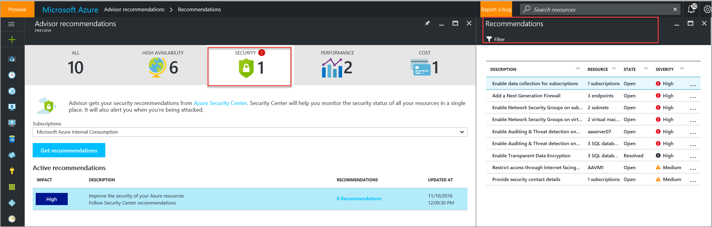

# Advisor Security recommendations

Azure Advisor provides you with a consistent, consolidated view of recommendations for all your Azure resources. It integrates with Azure Security Center to bring you security recommendations. You can get security recommendations from the **Security** tab on the Advisor dashboard.

Security Center helps you prevent, detect, and respond to threats with increased visibility into and control over the security of your Azure resources. It periodically analyzes the security state of your Azure resources. When Security Center identifies potential security vulnerabilities, it creates recommendations. The recommendations guide you through the process of configuring the controls you need. 

For more information about security recommendations, see [Managing security recommendations in Azure Security Center](https://azure.microsoft.com/en-us/documentation/articles/security-center-recommendations/).

## How to access Security recommendations in Azure Advisor

1. Sign in to the [Azure portal](https://portal.azure.com).

2. In the left pane, click **More services**.

3. In the service menu pane, under **Monitoring and Management**, click **Azure Advisor**.  
 The Advisor dashboard is displayed.

4. On the Advisor dashboard, click the **Security** tab.

5. Select the subscription for which you want to receive recommendations, and then click **Get recommendations**.

> [!NOTE]
> To access Advisor recommendations, you must first *register your subscription* with Advisor. A subscription is registered when a *subscription Owner* launches the Advisor dashboard and clicks the **Get recommendations** button. This is a *one-time operation*. After the subscription is registered, you can access Advisor recommendations as *Owner*, *Contributor*, or *Reader* for a subscription, a resource group, or a specific resource.

## Next steps

To learn more about Advisor recommendations, see:
* [Introduction to Advisor](advisor-overview.md)
* [Get started with Advisor](advisor-get-started.md)
* [Advisor Cost recommendations](advisor-performance-recommendations.md)
* [Advisor Performance recommendations](advisor-performance-recommendations.md)
* [Advisor High Availability recommendations](advisor-high-availability-recommendations.md)

 
