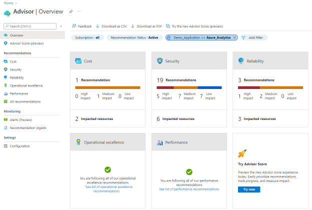
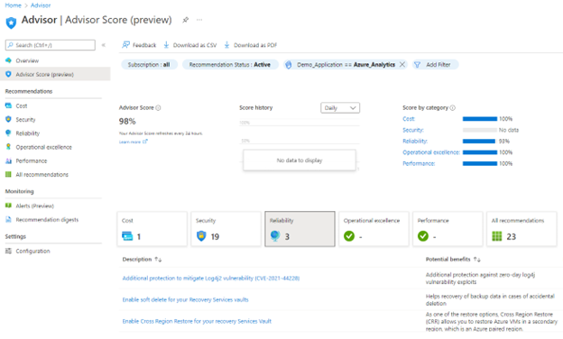

# Review optimization opportunities by a workload, environment or team

You can now get Advisor recommendations and scores scoped to a workload, environment, or team  using resource tag filters. Filter recommendations and calculate scores using tags you have already assigned to Azure resources, resource groups and subscriptions. Use tag filters to:
1.	Identify cost saving opportunities by team
1.	Compare scores for workloads to optimize the critical ones first

> [!NOTE]
> For more information on how to use resource tags to organize and govern your Azure resources, please see the [Cloud Adoption Framework’s guidance](/azure/cloud-adoption-framework/ready/azure-best-practices/resource-tagging) and [Build a cloud governance strategy on Azure](/learn/modules/build-cloud-governance-strategy-azure/).

## How to filter recommendations using tags

1.	Sign in to the Azure portal.
1.	Search for and select Advisor from any page.
1.	On the Advisor dashboard, click on the Add Filter button.
1.	Select the tag in the Filter field and value(s).
1.	Click Apply. Summary tiles will be updated to reflect the filter.
1.	Click on any of the categories to review recommendations.
 
    
 
## How to calculate scores using resource tags

1.	Sign in to the Azure portal.
1.	Search for and select Advisor from any page.
1.	Select Advisor score (preview) from the navigation menu on the left.
1.	On the Advisor dashboard, click on the Add Filter button.
1.	Select the tag in the Filter field and value(s).
1.	Click Apply. Advisor score will be updated to only include resources impacted by the filter. 
1.	Click on any of the categories to review recommendations.
 
    

> [!NOTE]
> Not all capabilities are available when tag filters are used. For example, tag filters are not supported for security score and score history. 

## Next steps

> [!div class="nextstepaction"]
> [Define your tagging strategy - Cloud Adoption Framework](/azure/cloud-adoption-framework/ready/azure-best-practices/resource-tagging)
> [Tag resources, resource groups, and subscriptions for logical organization - Azure Resource Manager](/azure/azure-resource-manager/management/tag-resources?tabs=json)
