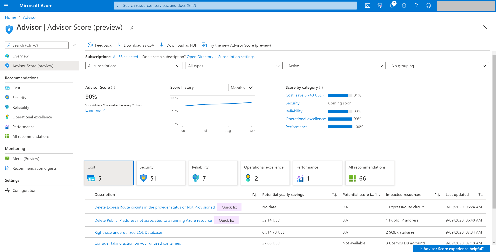
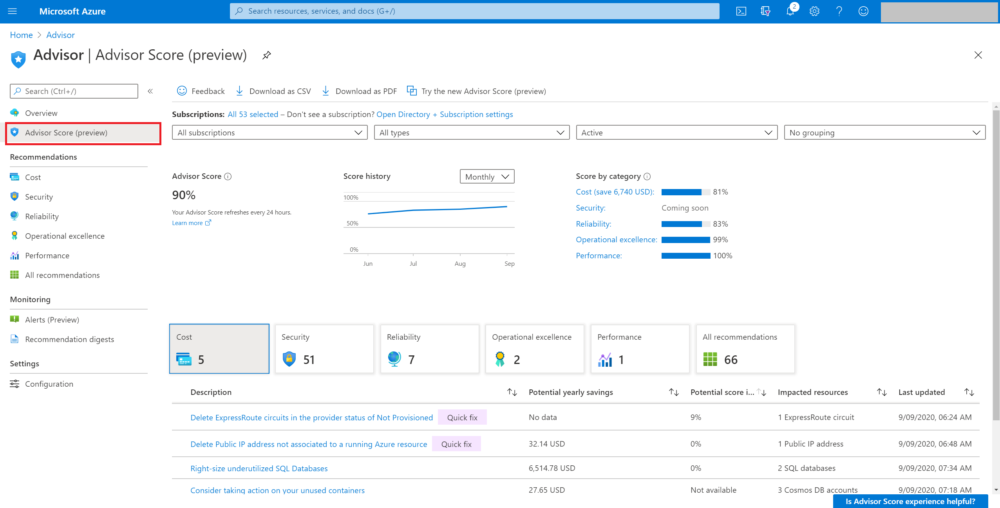

# Optimize Azure workloads using Advisor score

## Introduction to Advisor score

Azure Advisor provides best practice recommendations for your workloads. These recommendations are personalized and actionable to help you:
* Improve the posture of your workloads and optimize your Azure deployments
* Proactively prevent top issues by following best practices
* Assess your Azure workloads against the five pillars of the [Microsoft Azure Well-Architected Framework](https://docs.microsoft.com/azure/architecture/framework/)

As a core feature of Advisor, the **Advisor score** is devised to help you achieve these goals effectively and efficiently. 

To get the most out of Azure, it's crucial to understand where you are in your workload optimization journey, which services/resources are consumed well and which are not. Further, you'll want to know how to prioritize your actions, based on recommendations, to maximize the outcome. It's also important to track and report the progress you're making in this optimization journey. With **Advisor score**, you can easily do all these things with our new gamification experience. As your personalized cloud consultant, Azure Advisor continually assesses your usage telemetry and resource configuration to check for industry best practices. Advisor then aggregates its findings into a single score so you can tell, at a glance, if you’re taking the necessary steps to build reliable, secure, and cost-efficient solutions. 
The Advisor score consists of an overall score, which can be further broken down into five category scores, one for each category of Azure Advisor which represents the five pillars of the Well-Architected Framework. 
You can track the progress you make over time by viewing your overall score and category score with daily, weekly, and monthly trend, and you can set benchmarks to help you achieve your goals. 

 

## How to consume Advisor score
Advisor displays your overall Advisor score and breakdown for Advisor categories, in percentages. A score of 100% in any category means all your resources assessed by Advisor follow the best practices that Advisor recommends. On the other end of the spectrum, a score of 0% means that none of your resources assessed by Advisor follow Advisor’s recommendations. Using these score grains you can easily achieve below flow:
* **Advisor score** to help you baseline how your workload/subscriptions are doing based on Advisor score. You can also see the historical trends to understand what your trend is.
* **Advisor Category scores** of each recommendation will tell you which outstanding recommendations will improve your score the most. These values reflect both the weight of the recommendation and our predicted ease of implementation to make sure you can get most value with your time and helps you with prioritization
* **Category Score impact** of each recommendation to help you prioritize your remediation actions for each category

The contribution of each recommendation to your category score is shown clearly on the Advisor score page in the Azure portal. You can increase each category score by the percentage point listed in the category score impact column. This value reflects both the weight of the recommendation within the category and the predicted ease of implementation to address the potentially low-hanging fruit. Focusing on the recommendations with the greatest score impact will help you make the most progress with time.  

In case any of Advisor recommendations are not relevant for an individual resource, you can postpone or dismiss those recommendations and they will be excluded from the score calculation from the next refresh. Advisor will also use this input as additional feedback to improve the model.

## How is Advisor score calculated?
Advisor displays your category scores and your overall Advisor score as percentages. A score of 100% in any category means all your resources, *assessed by Advisor*, follow the best practices that Advisor recommends. On the other end of the spectrum, a score of 0% means that none of your resources, assessed by Advisor, follow Advisor’s recommendations. 
**Each of the five categories has a highest potential score of 100.** Your overall Advisor score is calculated as a sum of each applicable category score, divided by the sum of the highest potential score from all applicable categories. For most subscriptions, that means Advisor adds up the score from each category and divide by 500. However, **each category score is calculated only if you use resources that are assessed by Advisor.**

**Advisor score calculation example**
* Single subscription score: This is the simple mean of all Advisor category scores for your subscription. If the Advisor category scores are as - Cost = 73, Reliabilit = 85, Operational excellence = 77, Performance = 100; the **Advisor score** would be (73 + 85 + 77 + 100)/(4x100) = 0.84 or 84%.
* Multiple subscriptions score: When multiple subscriptions are selected, the overall advisor score we generate are weighted aggregate category scores. Here, each Advisor category score is aggregated based on resources consumed by subscriptions. Once we have the weighted aggregated category scores then we do a simple mean to give you overall score for subscriptions. 

### Scoring methodology: 
The calculation of the Advisor score can be summarized in four steps:
1. Advisor calculates the **retail cost of impacted resources**, which are the resources on your subscriptions that have at least one recommendation in Advisor.
2. Advisor calculates the **retail cost of assessed resources**, which are the resources that are monitored by Advisor, whether they have any recommendations or not. 
3. For each recommendation type, Advisor calculates the **healthy resource ratio**, which is the retail cost of impacted resources divided by the retail cost of assessed resources.
4. Advisor applies three additional weights to the healthy resource ratio in each category:
  * Recommendations with greater impact are weighted heavier than those with lower impact.
  * Resources with long-standing recommendations will count more against your score.
  * Resources that you postpone or dismiss in Advisor are removed from your score calculation entirely. 
    
Advisor applies this model at an Advisor category level (Security uses [Secure Score](https://docs.microsoft.com/azure/security-center/secure-score-security-controls#introduction-to-secure-score) model), giving us Advisor score for each category and further a simple average produces the final Advisor score.

## Advisor score FAQ
* **How often is my score refreshed?**
Your score is refreshed at least once per day. 
* **Why do some recommendations have empty "-" value in the category score impact column?** 
Advisor does not immediately include new recommendations or those with recent changes in the scoring model. After a short evaluation period, typically a few weeks, they will be included in the score. 
* **Why is the Cost score impact greater for some recommendations even if they have lower potential savings?**
Your cost score reflects both your potential savings from underutilized resources and the predicted ease of implementing those recommendations. For example, extra weight is applied to impacted resources that have been idle for a longer time, even if the potential savings is lower. 
* **Why don’t I have a score for one or more categories or subscriptions?**
Advisor will generate a score only for the categories and subscriptions that have resources that are assessed by Advisor.
* **What if a recommendation is not relevant?**
If you dismiss a recommendation from Advisor, it will be omitted from the calculation of your score. Dismissing recommendations also help Advisor improve the quality of recommendations.
* **Why did my score change?** 
You score can change if you remediate impacted resources by adopting the best practices that Advisor recommends. If you or anyone with permissions on your subscription has modified or created new resources, you might also see fluctuations in your score because your score is based on a ratio of the cost impacted resources relative to the total cost of all resources.
* **How does Advisor calculate the retail cost of resources on a subscription?**
Advisor uses the pay as you go rates published on the Azure.com pricing page, which does not reflect any applicable discounts, multiplied by the quantity of usage on the last day the resource was allocated. Omitting discounts from the calculation of the resource cost makes Advisor score comparable across subscriptions, tenants, and enrollments where discounts may vary. 
* **Do I need to view the recommendations in Advisor to get points for my score?** 
No. Your score reflects whether you adopt best practices that Advisor recommends, even if you adopt those best practices proactively and never view your recommendations in Advisor.
* **Does the scoring methodology differentiate between production and dev-test workloads?**
No, not for now, but you can dismiss recommendations on individual resources if those resources are used for development and test and the recommendation does not apply.
* **Can I compare scores between a subscription with 100 resources and a subscription with 100,000 resources?**
The scoring methodology is designed to control for number of resources on a subscription and service mix, so subscriptions with fewer resources can have higher or lower scores than subscriptions with more resources. 
* **What does it mean when I see "Coming soon" in the Score impact column?**
This means that this is a new recommendation and we are still working on bringing it in our Advisor score model. Once this new recommendation is considered in score calculation, you will see the score impact value for your recommendation.  
* **Does my score depend on how much I spend on Azure?**
No, your score is not necessarily a reflection of how much you spend, and unnecessary spending will result in a lower cost score.

## How to access Advisor
Advisor score is in public preview in Azure portal. You have to go to Advisor section and you will find Advisor score as the 2nd menu item in the left nav. 

## Next steps

For more information about Advisor recommendations, see:
* [Introduction to Advisor](advisor-overview.md)
* [Get started with Advisor](advisor-get-started.md)
* [Advisor cost recommendations](advisor-cost-recommendations.md)
* [Advisor performance recommendations](advisor-performance-recommendations.md)
* [Advisor security recommendations](advisor-security-recommendations.md)
* [Advisor operational excellence recommendations](advisor-operational-excellence-recommendations.md)
