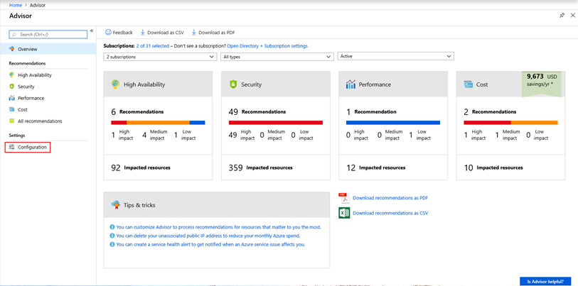
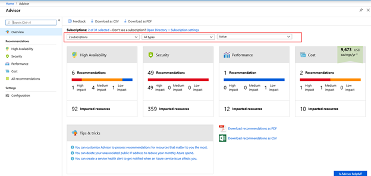
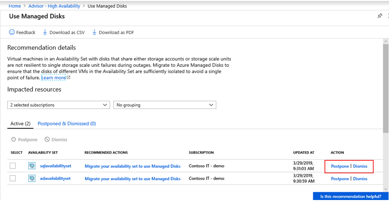
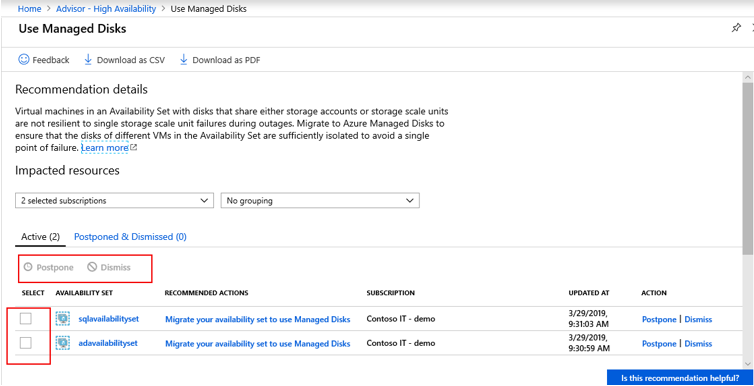
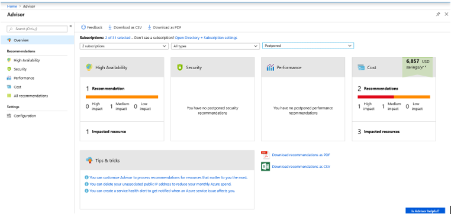

# View Azure Advisor recommendations that matter to you

Azure Advisor provides recommendations to help you optimize your Azure deployments. Within Advisor, you have access to a few features that help you to narrow down your recommendations to only those that matter to you.

## Configure subscriptions and resource groups

Advisor gives you the ability to select Subscriptions and Resource Groups that matter to you and your organization. You only see recommendations for the subscriptions and resource groups that you select. By default, all are selected. Configuration settings apply to the subscription or resource group, so the same settings apply to everyone that has access to that subscription or resource group. Configuration settings can be changed in the Azure portal or programmatically.

To make changes in the Azure portal:

1. Open [Azure Advisor](https://aka.ms/azureadvisordashboard) in the Azure portal.

1. Select **Configuration** from the menu.

   

1. Check the box in the **Include** column for any subscriptions or resource groups to receive Advisor recommendations. If the box is disabled, you may not have permission to make a configuration change on that subscription or resource group. Learn more about [permissions in Azure Advisor](permissions.md).

1. Click **Apply** at the bottom after you make a change.

## Filtering your view in the Azure portal

Configuration settings remain active until changed. If you want to limit the view of recommendations for a single viewing, you can use the drop downs provided at the top of the Advisor panel. From the Overview, High Availability, Security, Performance, Cost, and All Recommendation panels, you can select the Subscriptions, Resource Types, and recommendation status that you want to see.

   

## Dismissing and postponing recommendations

Azure Advisor allows you to dismiss or postpone recommendations on a single resource. If you dismiss a recommendation, you do not see it again unless you manually activate it. However, postponing a recommendation allows you to specify a duration after which the recommendation is automatically activated again. Postponing can be done in the Azure portal or programmatically.

### Postpone a single recommendation in the Azure portal 

1. Open [Azure Advisor](https://aka.ms/azureadvisordashboard) in the Azure portal.
1. Select a recommendation category to view your recommendations
1. Select a recommendation from the list of recommendations
1. Select Postpone or Dismiss for the recommendation you want to postpone or dismiss

     

### Postpone or dismiss a multiple recommendations in the Azure portal

1. Open [Azure Advisor](https://aka.ms/azureadvisordashboard) in the Azure portal.
1. Select a recommendation category to view your recommendations.
1. Select a recommendation from the list of recommendations.
1. Select the checkbox at the left of the row for all resources you want to postpone or dismiss the recommendation.
1. Select **Postpone** or **Dismiss** at the top left of the table.

     

> [!NOTE]
> You need contributor or owner permission to dismiss or postpone a recommendation. Learn more about permissions in Azure Advisor.

> [!NOTE]
> If the selection boxes are disabled, recommendations may still be loading. Please wait for all recommendations to load before trying to postpone or dismiss.

### Reactivate a postponed or dismissed recommendation

You can activate a recommendation that has been postponed or dismissed. This action can be done in the Azure portal or programmatically. In the Azure portal:

1. Open [Azure Advisor](https://aka.ms/azureadvisordashboard) in the Azure portal.

1. Change the filter on the Overview panel to **Postponed**. Advisor then displays postponed or dismissed recommendations.

    

1. Select a category to see **Postponed** and **Dismissed** recommendations.

1. Select a recommendation from the list of recommendations. This opens recommendations with the **Postponed & Dismissed** tab already selected to show the resources for which this recommendation has been postponed or dismissed.

1. Click on **Activate** at the end of the row. Once clicked, the recommendation is active for that resource and so removed from this table. The recommendation is now  visible in the **Active** tab.
 
     

## Next steps

This article explains how you can view recommendations that matter to you in Azure Advisor. To learn more about Advisor, see: 

- [What is Azure Advisor?](advisor-overview.md)
- [Getting Started with Advisor](advisor-get-started.md)
- [Permissions in Azure Advisor](permissions.md)

