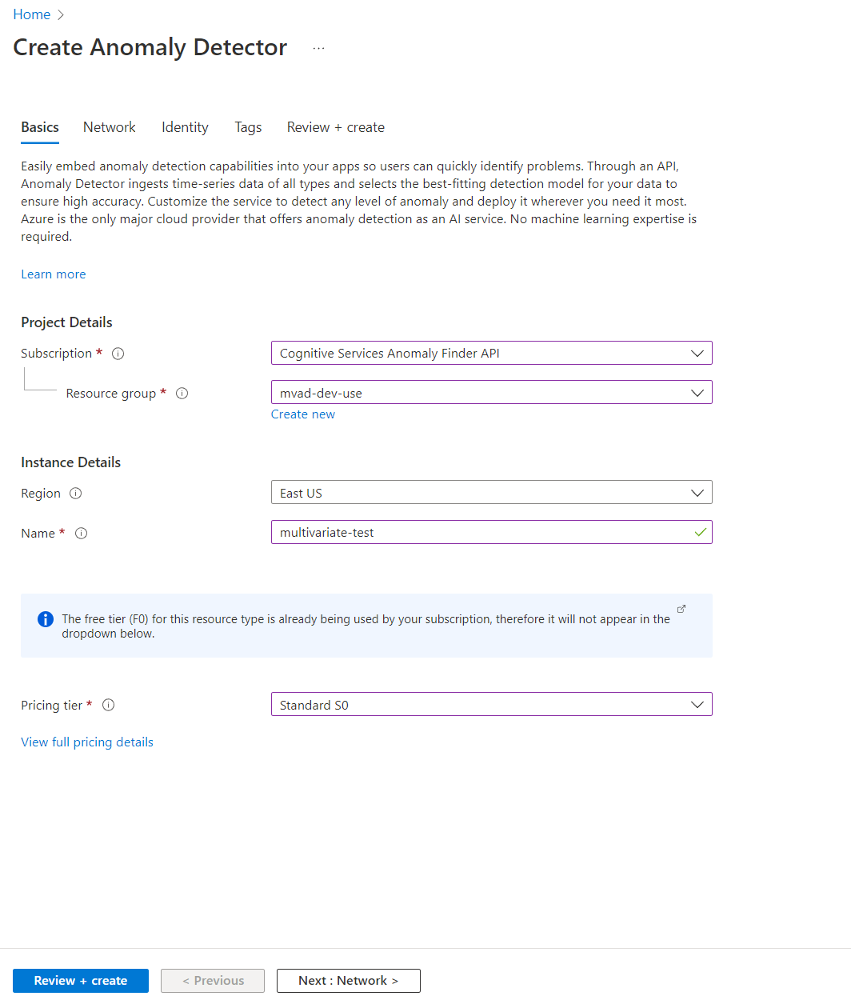
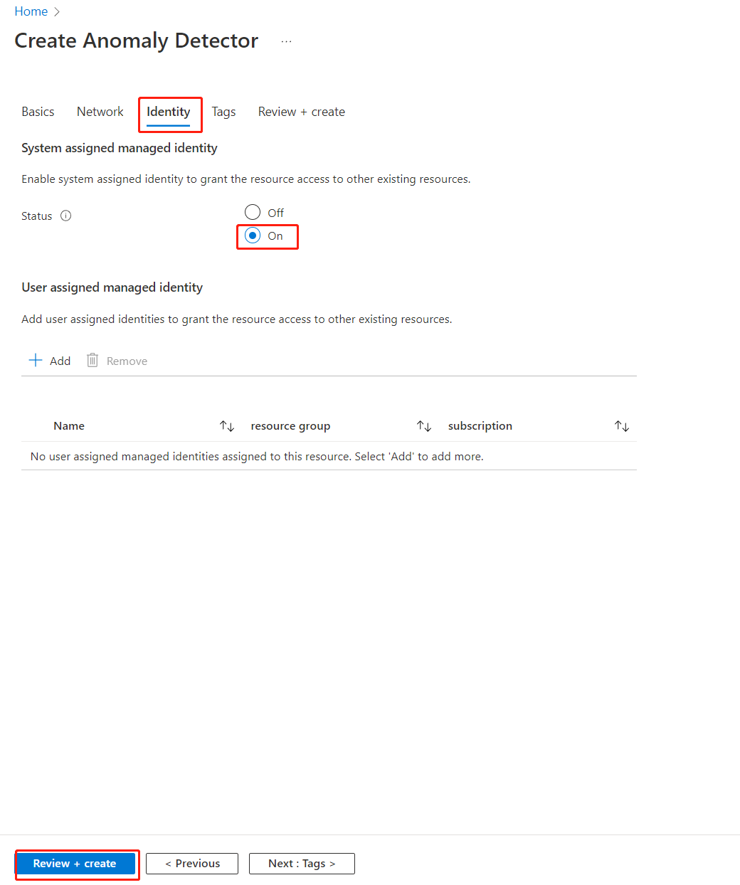
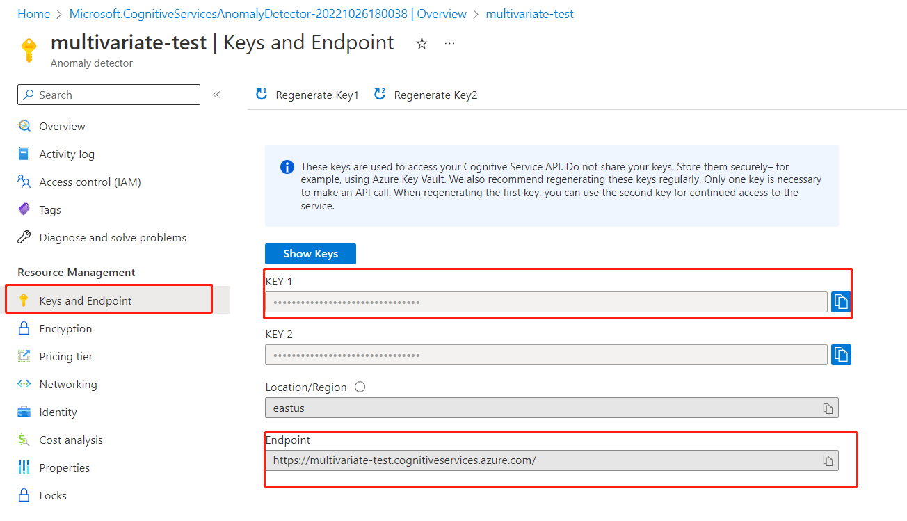

# Create and Anomaly Detector resource

[!INCLUDE [Deprecation announcement](../includes/deprecation.md)]

Anomaly Detector service is a cloud-based Azure AI service that uses machine-learning models to detect anomalies in your time series data. Here, you'll learn how to create an Anomaly Detector resource in the Azure portal.

## Create an Anomaly Detector resource in Azure portal

1. Create an Azure subscription if you don't have one - [Create one for free](https://azure.microsoft.com/free/cognitive-services)
1. Once you have your Azure subscription, [create an Anomaly Detector resource](https://portal.azure.com/#create/Microsoft.CognitiveServicesAnomalyDetector) in the Azure portal, and fill out the following fields:

    - **Subscription**: Select your current subscription.
    - **Resource group**: The [Azure resource group](/azure/cloud-adoption-framework/govern/resource-consistency/resource-access-management#what-is-an-azure-resource-group) that will contain your resource. You can create a new group or add it to a pre-existing group.
    - **Region**: Select your local region, see supported [Regions](../regions.md).
    - **Name**: Enter a name for your resource. We recommend using a descriptive name, for example *multivariate-msft-test*.
    - **Pricing tier**: The cost of your resource depends on the pricing tier you choose and your usage. For more information, see [pricing details](https://azure.microsoft.com/pricing/details/cognitive-services/anomaly-detector/). You can use the free pricing tier (F0) to try the service, and upgrade later to a paid tier for production.

> [!div class="mx-imgBorder"]
> 

1. Select **Identity** in the banner above and make sure you set the status as **On** which enables Anomaly Detector to visit your data in Azure in a secure way, then select **Review + create.**

> [!div class="mx-imgBorder"]
> 

1. Wait a few seconds until validation passed, and select **Create** button from the bottom-left corner.
1. After you select create, you'll be redirected to a new page that says Deployment in progress. After a few seconds, you'll see a message that says, Your deployment is complete, then select **Go to resource**.

## Get Endpoint URL and keys

In your resource, select **Keys and Endpoint** on the left navigation bar, copy the **key** (both key1 and key2 will work) and **endpoint** values from your Anomaly Detector resource.. You'll need the key and endpoint values to connect your application to the Anomaly Detector API.

> [!div class="mx-imgBorder"]
> 

That's it! You could start preparing your data for further steps!

## Next steps

* [Join us to get more supports!](https://aka.ms/adadvisorsjoin)
