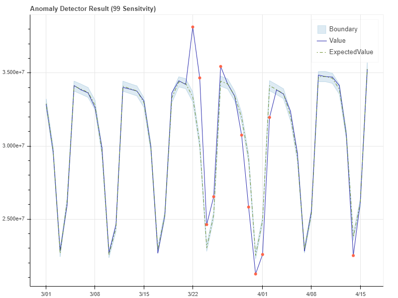

# How to: Use the Anomaly Detector univariate API on your time series data  

[!INCLUDE [Deprecation announcement](../includes/deprecation.md)]

The [Anomaly Detector API](https://westus2.dev.cognitive.microsoft.com/docs/services/AnomalyDetector/operations/post-timeseries-entire-detect) provides two methods of anomaly detection. You can either detect anomalies as a batch throughout your times series, or as your data is generated by detecting the anomaly status of the latest data point. The detection model returns anomaly results along with each data point's expected value, and the upper and lower anomaly detection boundaries. you can use these values to visualize the range of normal values, and anomalies in the data.

## Anomaly detection modes

The Anomaly Detector API provides detection modes: batch and streaming.

> [!NOTE]
> The following request URLs must be combined with the appropriate endpoint for your subscription. For example:
> `https://<your-custom-subdomain>.api.cognitive.microsoft.com/anomalydetector/v1.0/timeseries/entire/detect`

### Batch detection

To detect anomalies throughout a batch of data points over a given time range, use the following request URI with your time series data: 

`/timeseries/entire/detect`. 

By sending your time series data at once, the API will generate a model using the entire series, and analyze each data point with it.  

### Streaming detection

To continuously detect anomalies on streaming data, use the following request URI with your latest data point: 

`/timeseries/last/detect`. 

By sending new data points as you generate them, you can monitor your data in real time. A model will be generated with the data points you send, and the API will determine if the latest point in the time series is an anomaly.

## Adjusting lower and upper anomaly detection boundaries

By default, the upper and lower boundaries for anomaly detection are calculated using `expectedValue`, `upperMargin`, and `lowerMargin`. If you require different boundaries, we recommend applying a `marginScale` to `upperMargin` or `lowerMargin`. The boundaries would be calculated as follows:

|Boundary  |Calculation  |
|---------|---------|
|`upperBoundary` | `expectedValue + (100 - marginScale) * upperMargin`        |
|`lowerBoundary` | `expectedValue - (100 - marginScale) * lowerMargin`        |

The following examples show an Anomaly Detector API result at different sensitivities.

### Example with sensitivity at 99

### Example with sensitivity at 95

### Example with sensitivity at 85

## Next Steps

* [What is the Anomaly Detector API?](../overview.md)
* [Quickstart: Detect anomalies in your time series data using the Anomaly Detector](../quickstarts/client-libraries.md)
