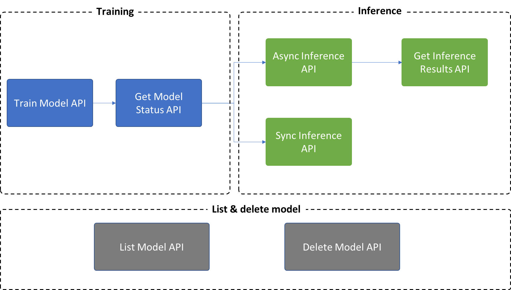

# Train a Multivariate Anomaly Detection model

To test out Multivariate Anomaly Detection quickly, try the [Code Sample](https://github.com/Azure-Samples/AnomalyDetector)! For more instructions on how to run a Jupyter notebook, please refer to [Install and Run a Jupyter Notebook](https://jupyter-notebook-beginner-guide.readthedocs.io/en/latest/install.html#).

## API Overview

There are 7 APIs provided in Multivariate Anomaly Detection:
* **Training**: Use `Train Model API` to create and train a model, then use `Get Model Status API` to get the status and model metadata.
* **Inference**: 
    * Use `Async Inference API` to trigger an asynchronous inference process and use `Get Inference results API` to get detection results on a batch of data.
    * You could also use `Sync Inference API` to trigger a detection on one timestamp every time.
* **Other operations**: `List Model API` and `Delete Model API` are supported in Multivariate Anomaly Detection model for model management.



|API Name| Method | Path  | Description |
| ------ | ---- | ----------- | ------ | 
|**Train Model**| POST       |  `{endpoint}`/anomalydetector/v1.1/multivariate/models    |   Create and train a model          |
|**Get Model Status**|     GET   |   `{endpoint}`anomalydetector/v1.1/multivariate/models/`{modelId}`   |     Get model status and model metadata with `modelId`   |
|**Batch Inference**|    POST    |  `{endpoint}`/anomalydetector/v1.1/multivariate/models/`{modelId}`: detect-batch    |          Trigger an asynchronous inference with `modelId`, which works in a batch scenario   |
|**Get Batch Inference Results**|     GET   |  `{endpoint}`/anomalydetector/v1.1/multivariate/detect-batch/`{resultId}`    |       Get batch inference results with `resultId`      |
|**Streaming Inference**|   POST     |   `{endpoint}`/anomalydetector/v1.1/multivariate/models/`{modelId}`: detect-last   |      Trigger a synchronous inference with `modelId`, which works in a streaming scenario       |
|**List Model**|     GET   |  `{endpoint}`/anomalydetector/v1.1/multivariate/models    |      List all models       |
|**Delete Model**|     DELET   |  `{endpoint}`/anomalydetector/v1.1/multivariate/models/`{modelId}`    |     Delete model with `modelId`       |

## Train a model

In this process, you'll use the following information that you created previously:

* **Key** of Anomaly Detector resource
* **Endpoint** of Anomaly Detector resource
* **Blob URL** of your data in Storage Account

For training data size, the maximum number of timestamps is **1000000**, and a recommended minimum number is **5000** timestamps.

### Request

Here's a sample request body to train a Multivariate Anomaly Detection model.

```json
{
    "slidingWindow": 200,
    "alignPolicy": {
        "alignMode": "Outer",
        "fillNAMethod": "Linear", 
        "paddingValue": 0
    },
    "dataSource": "{{dataSource}}", //Example: https://mvaddataset.blob.core.windows.net/sample-onetable/sample_data_5_3000.csv
    "dataSchema": "OneTable",
    "startTime": "2021-01-01T00:00:00Z", 
    "endTime": "2021-01-02T09:19:00Z", 
    "displayName": "SampleRequest"
}
```

#### Required parameters

These three parameters are required in training and inference API requests:

* **dataSource**: This is the Blob URL that linked to your folder or CSV file located in the Azure Blob Storage.
* **dataSchema**: This indicates the schema that you're using: `OneTable` or `MultiTable`.
* **startTime**: The start time of data used for training or inference. If it's earlier than the actual earliest timestamp in the data, the actual earliest timestamp will be used as the starting point.
* **endTime**: The end time of data used for training or inference, which must be later than or equal to `startTime`. If `endTime` is later than the actual latest timestamp in the data, the actual latest timestamp will be used as the ending point. If `endTime` equals to `startTime`, it means inference of one single data point, which is often used in streaming scenarios.

#### Optional parameters

Other parameters for training API are optional:

* **slidingWindow**: How many data points are used to determine anomalies. An integer between 28 and 2,880. The default value is 300. If `slidingWindow` is `k` for model training, then at least `k` points should be accessible from the source file during inference to get valid results.

    Multivariate Anomaly Detection takes a segment of data points to decide if the next data point is an anomaly. The length of the segment is the `slidingWindow`.
    Please keep two things in mind when choosing a `slidingWindow` value:
    1. The properties of your data: whether it's periodic and the sampling rate. When your data is periodic, you could set the length of 1 - 3 cycles as the `slidingWindow`. When your data is at a high frequency (small granularity) like minute-level or second-level, you could set a relatively higher value of `slidingWindow`.
    1. The trade-off between training/inference time and potential performance impact. A larger `slidingWindow` may cause longer training/inference time. There's **no guarantee** that larger `slidingWindow`s will lead to accuracy gains. A small `slidingWindow` may make it difficult for the model to converge on an optimal solution. For example, it's hard to detect anomalies when `slidingWindow` has only two points.

* **alignMode**: How to align multiple variables (time series) on timestamps. There are two options for this parameter, `Inner` and `Outer`, and the default value is `Outer`.

    This parameter is critical when there's misalignment between timestamp sequences of the variables. The model needs to align the variables onto the same timestamp sequence before further processing.

    `Inner` means the model will report detection results only on timestamps on which **every variable** has a value, that is, the intersection of all variables. `Outer` means the model will report detection results on timestamps on which **any variable** has a value, that is, the union of all variables.

    Here's an example to explain different `alignModel` values.

    *Variable-1*

    |timestamp | value|
    ----------| -----|
    |2020-11-01| 1  
    |2020-11-02| 2  
    |2020-11-04| 4  
    |2020-11-05| 5

    *Variable-2*

    timestamp | value  
    --------- | -
    2020-11-01| 1  
    2020-11-02| 2  
    2020-11-03| 3  
    2020-11-04| 4

    *`Inner` join two variables*

    timestamp | Variable-1 | Variable-2
    ----------| - | -
    2020-11-01| 1 | 1
    2020-11-02| 2 | 2
    2020-11-04| 4 | 4

    *`Outer` join two variables*

    timestamp | Variable-1 | Variable-2
    --------- | - | -
    2020-11-01| 1 | 1
    2020-11-02| 2 | 2
    2020-11-03| `nan` | 3
    2020-11-04| 4 | 4
    2020-11-05| 5 | `nan`

* **fillNAMethod**: How to fill `nan` in the merged table. There might be missing values in the merged table and they should be properly handled. We provide several methods to fill them up. The options are `Linear`, `Previous`, `Subsequent`,  `Zero`, and `Fixed` and the default value is `Linear`.

    | Option     | Method                                                                                           |
    | ---------- | -------------------------------------------------------------------------------------------------|
    | `Linear`     | Fill `nan` values by linear interpolation                                                           |
    | `Previous`   | Propagate last valid value to fill gaps. Example: `[1, 2, nan, 3, nan, 4]` -> `[1, 2, 2, 3, 3, 4]` |
    | `Subsequent` | Use next valid value to fill gaps. Example: `[1, 2, nan, 3, nan, 4]` -> `[1, 2, 3, 3, 4, 4]`       |
    | `Zero`       | Fill `nan` values with 0.                                                                           |
    | `Fixed`      | Fill `nan` values with a specified valid value that should be provided in `paddingValue`.          |

* **paddingValue**: Padding value is used to fill `nan` when `fillNAMethod` is `Fixed` and must be provided in that case. In other cases, it's optional.

* **displayName**: This is an optional parameter, which is used to identify models. For example, you can use it to mark parameters, data sources, and any other metadata about the model and its input data. The default value is an empty string.

### Response

Within the response, the most important thing is the `modelId`, which you'll use to trigger the Get Model Status API.

A response sample:

```json
{
    "modelId": "09c01f3e-5558-11ed-bd35-36f8cdfb3365",
    "createdTime": "2022-11-01T00:00:00Z",
    "lastUpdatedTime": "2022-11-01T00:00:00Z",
    "modelInfo": {
        "dataSource": "https://mvaddataset.blob.core.windows.net/sample-onetable/sample_data_5_3000.csv",
        "dataSchema": "OneTable",
        "startTime": "2021-01-01T00:00:00Z",
        "endTime": "2021-01-02T09:19:00Z",
        "displayName": "SampleRequest",
        "slidingWindow": 200,
        "alignPolicy": {
            "alignMode": "Outer",
            "fillNAMethod": "Linear",
            "paddingValue": 0.0
        },
        "status": "CREATED",
        "errors": [],
        "diagnosticsInfo": {
            "modelState": {
                "epochIds": [],
                "trainLosses": [],
                "validationLosses": [],
                "latenciesInSeconds": []
            },
            "variableStates": []
        }
    }
}
```

## Get model status

You could use the above API to trigger a training and use **Get model status API** to know whether the model is trained successfully or not.

### Request

There's no content in the request body, what's required only is to put the modelId in the API path, which will be in a format of:
**{{endpoint}}anomalydetector/v1.1/multivariate/models/{{modelId}}**

### Response

* **status**: The `status` in the response body indicates the model status with this category: *CREATED, RUNNING, READY, FAILED.*
* **trainLosses & validationLosses**: These are two machine learning concepts indicating the model performance. If the numbers are decreasing and finally to a relatively small number like 0.2, 0.3, then it means the model performance is good to some extent. However, the model performance still needs to be validated through inference and the comparison with labels if any.
* **epochIds**: indicates how many epochs the model has been trained out of a total of 100 epochs. For example, if the model is still in training status, `epochId` might be `[10, 20, 30, 40, 50]` , which means that it has completed its 50th training epoch, and therefore is halfway complete.
* **latenciesInSeconds**: contains the time cost for each epoch and is recorded every 10 epochs. In this example, the 10th epoch takes approximately 0.34 second. This would be helpful to estimate the completion time of training.
* **variableStates**: summarizes information about each variable. It's a list ranked by `filledNARatio` in descending order. It tells how many data points are used for each variable and `filledNARatio` tells how many points are missing. Usually we need to reduce `filledNARatio` as much as possible.
Too many missing data points will deteriorate model accuracy.
* **errors**: Errors during data processing will be included in the `errors` field.

A response sample:

```json
{
    "modelId": "09c01f3e-5558-11ed-bd35-36f8cdfb3365",
    "createdTime": "2022-11-01T00:00:12Z",
    "lastUpdatedTime": "2022-11-01T00:00:12Z",
    "modelInfo": {
        "dataSource": "https://mvaddataset.blob.core.windows.net/sample-onetable/sample_data_5_3000.csv",
        "dataSchema": "OneTable",
        "startTime": "2021-01-01T00:00:00Z",
        "endTime": "2021-01-02T09:19:00Z",
        "displayName": "SampleRequest",
        "slidingWindow": 200,
        "alignPolicy": {
            "alignMode": "Outer",
            "fillNAMethod": "Linear",
            "paddingValue": 0.0
        },
        "status": "READY",
        "errors": [],
        "diagnosticsInfo": {
            "modelState": {
                "epochIds": [
                    10,
                    20,
                    30,
                    40,
                    50,
                    60,
                    70,
                    80,
                    90,
                    100
                ],
                "trainLosses": [
                    0.30325182933699,
                    0.24335388161919333,
                    0.22876543213020673,
                    0.2439815090461211,
                    0.22489577260884372,
                    0.22305156764659015,
                    0.22466289590705524,
                    0.22133831883018668,
                    0.2214335961775346,
                    0.22268397090109912
                ],
                "validationLosses": [
                    0.29047123109451445,
                    0.263965221366497,
                    0.2510373182971068,
                    0.27116744686858824,
                    0.2518718700216274,
                    0.24802495975687047,
                    0.24790137705176768,
                    0.24640804830223623,
                    0.2463938973166726,
                    0.24831805566344597
                ],
                "latenciesInSeconds": [
                    2.1662967205047607,
                    2.0658926963806152,
                    2.112030029296875,
                    2.130472183227539,
                    2.183091640472412,
                    2.1442034244537354,
                    2.117824077606201,
                    2.1345198154449463,
                    2.0993552207946777,
                    2.1198465824127197
                ]
            },
            "variableStates": [
                {
                    "variable": "series_0",
                    "filledNARatio": 0.0004999999999999449,
                    "effectiveCount": 1999,
                    "firstTimestamp": "2021-01-01T00:01:00Z",
                    "lastTimestamp": "2021-01-02T09:19:00Z"
                },
                {
                    "variable": "series_1",
                    "filledNARatio": 0.0004999999999999449,
                    "effectiveCount": 1999,
                    "firstTimestamp": "2021-01-01T00:01:00Z",
                    "lastTimestamp": "2021-01-02T09:19:00Z"
                },
                {
                    "variable": "series_2",
                    "filledNARatio": 0.0004999999999999449,
                    "effectiveCount": 1999,
                    "firstTimestamp": "2021-01-01T00:01:00Z",
                    "lastTimestamp": "2021-01-02T09:19:00Z"
                },
                {
                    "variable": "series_3",
                    "filledNARatio": 0.0004999999999999449,
                    "effectiveCount": 1999,
                    "firstTimestamp": "2021-01-01T00:01:00Z",
                    "lastTimestamp": "2021-01-02T09:19:00Z"
                },
                {
                    "variable": "series_4",
                    "filledNARatio": 0.0004999999999999449,
                    "effectiveCount": 1999,
                    "firstTimestamp": "2021-01-01T00:01:00Z",
                    "lastTimestamp": "2021-01-02T09:19:00Z"
                }
            ]
        }
    }
}
```

## List models

You may refer to [this page](https://westus2.dev.cognitive.microsoft.com/docs/services/AnomalyDetector-v1-1/operations/ListMultivariateModel) for information about the request URL and request headers. Notice that we only return 10 models ordered by update time, but you can visit other models by setting the `$skip` and the `$top` parameters in the request URL. For example, if your request URL is `https://{endpoint}/anomalydetector/v1.1/multivariate/models?$skip=10&$top=20`, then we'll skip the latest 10 models and return the next 20 models.

A sample response is 

```json
{
    "models": [
        {
            "modelId": "09c01f3e-5558-11ed-bd35-36f8cdfb3365",
            "createdTime": "2022-10-26T18:00:12Z",
            "lastUpdatedTime": "2022-10-26T18:03:53Z",
            "modelInfo": {
                "dataSource": "https://mvaddataset.blob.core.windows.net/sample-onetable/sample_data_5_3000.csv",
                "dataSchema": "OneTable",
                "startTime": "2021-01-01T00:00:00Z",
                "endTime": "2021-01-02T09:19:00Z",
                "displayName": "SampleRequest",
                "slidingWindow": 200,
                "alignPolicy": {
                    "alignMode": "Outer",
                    "fillNAMethod": "Linear",
                    "paddingValue": 0.0
                },
                "status": "READY",
                "errors": [],
                "diagnosticsInfo": {
                    "modelState": {
                        "epochIds": [
                            10,
                            20,
                            30,
                            40,
                            50,
                            60,
                            70,
                            80,
                            90,
                            100
                        ],
                        "trainLosses": [
                            0.30325182933699,
                            0.24335388161919333,
                            0.22876543213020673,
                            0.2439815090461211,
                            0.22489577260884372,
                            0.22305156764659015,
                            0.22466289590705524,
                            0.22133831883018668,
                            0.2214335961775346,
                            0.22268397090109912
                        ],
                        "validationLosses": [
                            0.29047123109451445,
                            0.263965221366497,
                            0.2510373182971068,
                            0.27116744686858824,
                            0.2518718700216274,
                            0.24802495975687047,
                            0.24790137705176768,
                            0.24640804830223623,
                            0.2463938973166726,
                            0.24831805566344597
                        ],
                        "latenciesInSeconds": [
                            2.1662967205047607,
                            2.0658926963806152,
                            2.112030029296875,
                            2.130472183227539,
                            2.183091640472412,
                            2.1442034244537354,
                            2.117824077606201,
                            2.1345198154449463,
                            2.0993552207946777,
                            2.1198465824127197
                        ]
                    },
                    "variableStates": [
                        {
                            "variable": "series_0",
                            "filledNARatio": 0.0004999999999999449,
                            "effectiveCount": 1999,
                            "firstTimestamp": "2021-01-01T00:01:00Z",
                            "lastTimestamp": "2021-01-02T09:19:00Z"
                        },
                        {
                            "variable": "series_1",
                            "filledNARatio": 0.0004999999999999449,
                            "effectiveCount": 1999,
                            "firstTimestamp": "2021-01-01T00:01:00Z",
                            "lastTimestamp": "2021-01-02T09:19:00Z"
                        },
                        {
                            "variable": "series_2",
                            "filledNARatio": 0.0004999999999999449,
                            "effectiveCount": 1999,
                            "firstTimestamp": "2021-01-01T00:01:00Z",
                            "lastTimestamp": "2021-01-02T09:19:00Z"
                        },
                        {
                            "variable": "series_3",
                            "filledNARatio": 0.0004999999999999449,
                            "effectiveCount": 1999,
                            "firstTimestamp": "2021-01-01T00:01:00Z",
                            "lastTimestamp": "2021-01-02T09:19:00Z"
                        },
                        {
                            "variable": "series_4",
                            "filledNARatio": 0.0004999999999999449,
                            "effectiveCount": 1999,
                            "firstTimestamp": "2021-01-01T00:01:00Z",
                            "lastTimestamp": "2021-01-02T09:19:00Z"
                        }
                    ]
                }
            }
        }
    ],
    "currentCount": 42,
    "maxCount": 1000,
    "nextLink": ""
}
```

The response contains four fields, `models`, `currentCount`, `maxCount`, and `nextLink`.

* **models**: This contains the created time, last updated time, model ID, display name, variable counts, and the status of each model.
* **currentCount**: This contains the number of trained multivariate models in your Anomaly Detector resource.
* **maxCount**: The maximum number of models supported by your Anomaly Detector resource, which will be differentiated by the pricing tier that you choose.
* **nextLink**: This could be used to fetch more models since maximum models that will be listed in this API response is **10**.

## Next steps

* [Best practices of multivariate anomaly detection](../concepts/best-practices-multivariate.md)
