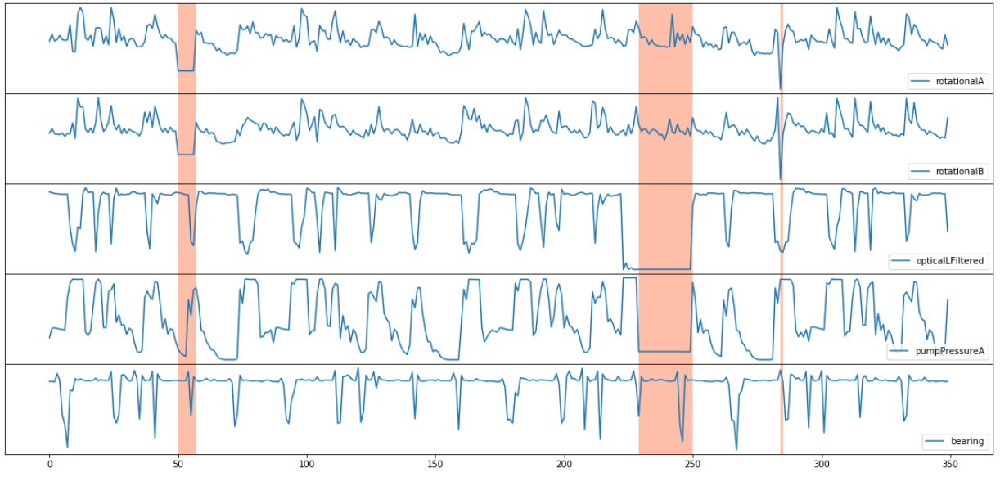

# What is Anomaly Detector?

[!INCLUDE [Deprecation announcement](includes/deprecation.md)]

[!INCLUDE [Azure AI services rebrand](../includes/rebrand-note.md)]

Anomaly Detector is an AI service with a set of APIs, which enables you to monitor and detect anomalies in your time series data with little machine learning (ML) knowledge, either batch validation or real-time inference.

This documentation contains the following types of articles:
* [**Quickstarts**](./Quickstarts/client-libraries.md) are step-by-step instructions that let you make calls to the service and get results in a short period of time. 
* [**Interactive demo**](https://aka.ms/adDemo) could you help understand how Anomaly Detector works with easy operations.
* [**How-to guides**](./how-to/identify-anomalies.md) contain instructions for using the service in more specific or customized ways.
* [**Tutorials**](./tutorials/batch-anomaly-detection-powerbi.md) are longer guides that show you how to use this service as a component in broader business solutions.
* [**Code samples**](https://github.com/Azure-Samples/AnomalyDetector/tree/master/ipython-notebook) demonstrate how to use Anomaly Detector.
* [**Conceptual articles**](./concepts/anomaly-detection-best-practices.md) provide in-depth explanations of the service's functionality and features.

## Anomaly Detector capabilities

With Anomaly Detector, you can either detect anomalies in one variable using Univariate Anomaly Detector, or detect anomalies in multiple variables with Multivariate Anomaly Detector.

|Feature  |Description  |
|---------|---------|
|Univariate Anomaly Detection | Detect anomalies in one variable, like revenue, cost, etc. The model was selected automatically based on your data pattern. |
|Multivariate Anomaly Detection| Detect anomalies in multiple variables with correlations, which are usually gathered from equipment or other complex system. The underlying model used is a Graph Attention Network.|

### Univariate Anomaly Detection

The Univariate Anomaly Detector API enables you to monitor and detect abnormalities in your time series data without having to know machine learning. The algorithms adapt by automatically identifying and applying the best-fitting models to your data, regardless of industry, scenario, or data volume. Using your time series data, the API determines boundaries for anomaly detection, expected values, and which data points are anomalies.

Using the Anomaly Detector doesn't require any prior experience in machine learning, and the REST API enables you to easily integrate the service into your applications and processes.

With the Univariate Anomaly Detector, you can automatically detect anomalies throughout your time series data, or as they occur in real-time.

|Feature  |Description  |
|---------|---------|
| Streaming detection| Detect anomalies in your streaming data by using previously seen data points to determine if your latest one is an anomaly. This operation generates a model using the data points you send, and determines if the target point is an anomaly. By calling the API with each new data point you generate, you can monitor your data as it's created. |
| Batch detection | Use your time series to detect any anomalies that might exist throughout your data. This operation generates a model using your entire time series data, with each point analyzed with the same model.         |
| Change points detection | Use your time series to detect any trend change points that exist in your data. This operation generates a model using your entire time series data, with each point analyzed with the same model.    |

### Multivariate Anomaly Detection

The **Multivariate Anomaly Detection** APIs further enable developers by easily integrating advanced AI for detecting anomalies from groups of metrics, without the need for machine learning knowledge or labeled data. Dependencies and inter-correlations between up to 300 different signals are now automatically counted as key factors. This new capability helps you to proactively protect your complex systems such as software applications, servers, factory machines, spacecraft, or even your business, from failures.

Imagine 20 sensors from an auto engine generating 20 different signals like rotation, fuel pressure, bearing, etc. The readings of those signals individually may not tell you much about system level issues, but together they can represent the health of the engine. When the interaction of those signals deviates outside the usual range, the multivariate anomaly detection feature can sense the anomaly like a seasoned expert. The underlying AI models are trained and customized using your data such that it understands the unique needs of your business. With the new APIs in Anomaly Detector, developers can now easily integrate the multivariate time series anomaly detection capabilities into predictive maintenance solutions, AIOps monitoring solutions for complex enterprise software, or business intelligence tools.

## Join the Anomaly Detector community

Join the [Anomaly Detector Advisors group on Microsoft Teams](https://aka.ms/AdAdvisorsJoin) for better support and any updates!

## Algorithms

* Blogs and papers:
    * [Introducing Azure AI Anomaly Detector API](https://techcommunity.microsoft.com/t5/AI-Customer-Engineering-Team/Introducing-Azure-Anomaly-Detector-API/ba-p/490162)
    * [Overview of SR-CNN algorithm in Azure AI Anomaly Detector](https://techcommunity.microsoft.com/t5/AI-Customer-Engineering-Team/Overview-of-SR-CNN-algorithm-in-Azure-Anomaly-Detector/ba-p/982798)
    * [Introducing Multivariate Anomaly Detection](https://techcommunity.microsoft.com/t5/azure-ai/introducing-multivariate-anomaly-detection/ba-p/2260679)
    * [Multivariate time series Anomaly Detection via Graph Attention Network](https://arxiv.org/abs/2009.02040)
    * [Time-Series Anomaly Detection Service at Microsoft](https://arxiv.org/abs/1906.03821) (accepted by KDD 2019)

* Videos:
    > [!VIDEO https://www.youtube.com/embed/ERTaAnwCarM]
    
    > [!VIDEO https://www.youtube.com/embed/FwuI02edclQ]
    
## Next steps

* [Quickstart: Detect anomalies in your time series data using the Univariate Anomaly Detection](quickstarts/client-libraries.md)
* [Quickstart: Detect anomalies in your time series data using the Multivariate Anomaly Detection](quickstarts/client-libraries-multivariate.md)
* The Anomaly Detector [REST API reference](https://aka.ms/ad-api)
