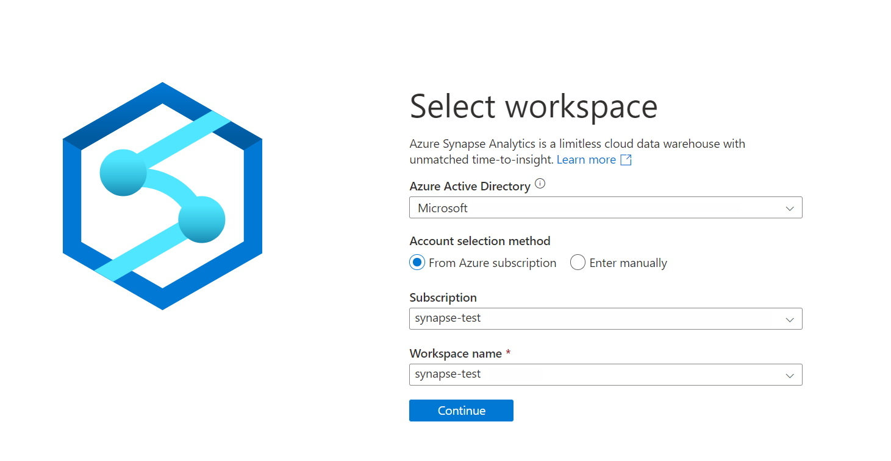
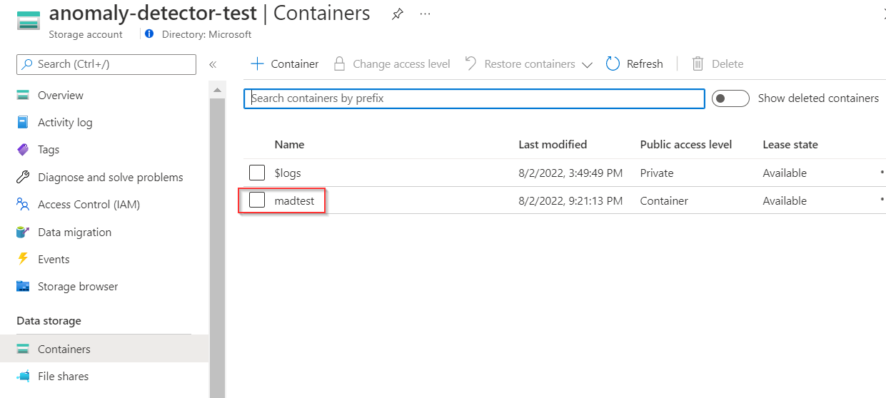
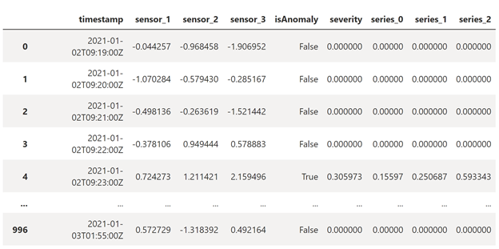

# Tutorial: Use Multivariate Anomaly Detector in Azure Synapse Analytics

[!INCLUDE [Deprecation announcement](../includes/deprecation.md)]

Use this tutorial to detect anomalies among multiple variables in Azure Synapse Analytics in very large datasets and databases. This solution is perfect for scenarios like equipment predictive maintenance. The underlying power comes from the integration with [SynapseML](https://microsoft.github.io/SynapseML/), an open-source library that aims to simplify the creation of massively scalable machine learning pipelines. It can be installed and used on any Spark 3 infrastructure including your **local machine**, **Databricks**, **Synapse Analytics**, and others.

In this tutorial, you'll learn how to:

> [!div class="checklist"]
> * Use Azure Synapse Analytics to detect anomalies among multiple variables in Synapse Analytics.
> * Train a multivariate anomaly detector model and inference in separate notebooks in Synapse Analytics.
> * Get anomaly detection result and root cause analysis for each anomaly.

## Prerequisites

In this section, you'll create the following resources in the Azure portal:

* An **Anomaly Detector** resource to get access to the capability of Multivariate Anomaly Detector.
* An **Azure Synapse Analytics** resource to use the Synapse Studio.
* A **Storage account** to upload your data for model training and anomaly detection.
* A **Key Vault** resource to hold the key of Anomaly Detector and the connection string of the Storage Account.

### Create Anomaly Detector and Azure Synapse Analytics resources

* [Create a resource for Azure Synapse Analytics](https://portal.azure.com/#create/Microsoft.Synapse) in the Azure portal, fill in all the required items.
* [Create an Anomaly Detector](https://portal.azure.com/#create/Microsoft.CognitiveServicesAnomalyDetector) resource in the Azure portal.
* Sign in to [Azure Synapse Analytics](https://web.azuresynapse.net/) using your subscription and Workspace name.

    

### Create a storage account resource

* [Create a storage account resource](https://portal.azure.com/#create/Microsoft.StorageAccount) in the Azure portal. After your storage account is built, **create a container** to store intermediate data, since SynapseML will transform your original data to a schema that Multivariate Anomaly Detector supports. (Refer to Multivariate Anomaly Detector [input schema](../how-to/prepare-data.md#input-data-schema))

    > [!NOTE]
    > For the purposes of this example only we are setting the security on the container to allow anonymous read access for containers and blobs since it will only contain our example .csv data. For anything other than demo purposes this is **not recommended**.

    

### Create a Key Vault to hold Anomaly Detector Key and storage account connection string

* Create a key vault and configure secrets and access
    1. Create a [key vault](https://portal.azure.com/#create/Microsoft.KeyVault) in the Azure portal.
    2. Go to Key Vault > Access policies, and grant the [Azure Synapse workspace](../../../data-factory/data-factory-service-identity.md?context=%2fazure%2fsynapse-analytics%2fcontext%2fcontext&tabs=synapse-analytics) permission to read secrets from Azure Key Vault.

        

* Create a secret in Key Vault to hold the Anomaly Detector key
    1. Go to your Anomaly Detector resource, **Anomaly Detector** > **Keys and Endpoint**. Then copy either of the two keys to the clipboard.
    2. Go to **Key Vault** > **Secret** to create a new secret. Specify the name of the secret, and then paste the key from the previous step into the **Value** field. Finally, select **Create**.

        

* Create a secret in Key Vault to hold Connection String of Storage account
    1. Go to your Storage account resource, select **Access keys** to copy one of your Connection strings.

        

    2. Then go to **Key Vault** > **Secret** to create a new secret. Specify the name of the secret (like *myconnectionstring*), and then paste the Connection string from the previous step into the **Value** field. Finally, select **Create**.

## Using a notebook to conduct Multivariate Anomaly Detection in Synapse Analytics

### Create a notebook and a Spark pool

1. Sign in [Azure Synapse Analytics](https://web.azuresynapse.net/) and create a new Notebook for coding.

    

2. Select **Manage pools** in the page of notebook to create a new Apache Spark pool if you don’t have one.

    

### Writing code in notebook

1. Install the latest version of SynapseML with the Anomaly Detection Spark models. You can also install SynapseML in Spark Packages, Databricks, Docker, etc. Please refer to [SynapseML homepage](https://microsoft.github.io/SynapseML/).

    If you're using **Spark 3.1**, please use the following code:

    ```python
    %%configure -f
    {
      "name": "synapseml",
      "conf": {
          "spark.jars.packages": "com.microsoft.azure:synapseml_2.12:0.9.5-13-d1b51517-SNAPSHOT",
          "spark.jars.repositories": "https://mmlspark.azureedge.net/maven",
          "spark.jars.excludes": "org.scala-lang:scala-reflect,org.apache.spark:spark-tags_2.12,org.scalactic:scalactic_2.12,org.scalatest:scalatest_2.12",
          "spark.yarn.user.classpath.first": "true"
      }
    }
    ```

    If you're using **Spark 3.2**, please use the following code:

    ```python
    %%configure -f
    {
      "name": "synapseml",
      "conf": {
          "spark.jars.packages": " com.microsoft.azure:synapseml_2.12:0.9.5 ",
          "spark.jars.repositories": "https://mmlspark.azureedge.net/maven",
          "spark.jars.excludes": "org.scala-lang:scala-reflect,org.apache.spark:spark-tags_2.12,org.scalactic:scalactic_2.12,org.scalatest:scalatest_2.12,io.netty:netty-tcnative-boringssl-static",
          "spark.yarn.user.classpath.first": "true"
      }
    }
    ```

2. Import the necessary modules and libraries.

    ```python
    from synapse.ml.cognitive import *
    from notebookutils import mssparkutils
    import numpy as np
    import pandas as pd
    import pyspark
    from pyspark.sql.functions import col
    from pyspark.sql.functions import lit
    from pyspark.sql.types import DoubleType
    import synapse.ml
    ```

3. Load your data. Compose your data in the following format, and upload it to a cloud storage that Spark supports like an Azure Storage Account. The timestamp column should be in `ISO8601` format, and the feature columns should be `string` type.

    ```python
        df = spark.read.format("csv").option("header", True).load("wasbs://[container_name]@[storage_account_name].blob.core.windows.net/[csv_file_name].csv")
        
        df = df.withColumn("sensor_1", col("sensor_1").cast(DoubleType())) \
            .withColumn("sensor_2", col("sensor_2").cast(DoubleType())) \
            .withColumn("sensor_3", col("sensor_3").cast(DoubleType()))
        
        df.show(10)
    ```

    

4. Train a multivariate anomaly detection model.

    

    ```python
        #Input your key vault name and anomaly key name in key vault.
        anomalyKey = mssparkutils.credentials.getSecret("[key_vault_name]","[anomaly_key_secret_name]")
        #Input your key vault name and connection string name in key vault.
        connectionString = mssparkutils.credentials.getSecret("[key_vault_name]", "[connection_string_secret_name]")
        
        #Specify information about your data.
        startTime = "2021-01-01T00:00:00Z"
        endTime = "2021-01-02T09:18:00Z"
        timestampColumn = "timestamp"
        inputColumns = ["sensor_1", "sensor_2", "sensor_3"]
        #Specify the container you created in Storage account, you could also initialize a new name here, and Synapse will help you create that container automatically.
        containerName = "[container_name]"
        #Set a folder name in Storage account to store the intermediate data.
        intermediateSaveDir = "intermediateData"
        
        simpleMultiAnomalyEstimator = (FitMultivariateAnomaly()
            .setSubscriptionKey(anomalyKey)
        #In .setLocation, specify the region of your Anomaly Detector resource, use lowercase letter like: eastus.
            .setLocation("[anomaly_detector_region]")
            .setStartTime(startTime)
            .setEndTime(endTime)
            .setContainerName(containerName)
            .setIntermediateSaveDir(intermediateSaveDir)
            .setTimestampCol(timestampColumn)
            .setInputCols(inputColumns)
            .setSlidingWindow(200)
            .setConnectionString(connectionString))
    ```

    Trigger training process through these codes.

    ```python
    model = simpleMultiAnomalyEstimator.fit(df)
    type(model)
    ```

5. Trigger inference process.

    ```python
    startInferenceTime = "2021-01-02T09:19:00Z"
    endInferenceTime = "2021-01-03T01:59:00Z"
    result = (model
          .setStartTime(startInferenceTime)
          .setEndTime(endInferenceTime)
          .setOutputCol("results")
          .setErrorCol("errors")
          .setTimestampCol(timestampColumn)
          .setInputCols(inputColumns)
          .transform(df))
    ```

6. Get inference results.

    ```python
    rdf = (result.select("timestamp",*inputColumns, "results.contributors", "results.isAnomaly", "results.severity").orderBy('timestamp', ascending=True).filter(col('timestamp') >= lit(startInferenceTime)).toPandas())
    
    def parse(x):
        if type(x) is list:
            return dict([item[::-1] for item in x])
        else:
            return {'series_0': 0, 'series_1': 0, 'series_2': 0}
    
    rdf['contributors'] = rdf['contributors'].apply(parse)
    rdf = pd.concat([rdf.drop(['contributors'], axis=1), pd.json_normalize(rdf['contributors'])], axis=1)
    rdf
    ```

    The inference results will look as followed. The `severity` is a number between 0 and 1, showing the severe degree of an anomaly. The last three columns indicate the    `contribution score` of each sensor, the higher the number is, the more anomalous the sensor is. 
        

## Clean up intermediate data (optional)

By default, the anomaly detector will automatically upload data to a storage account so that the service can process the data. To clean up the intermediate data, you could run the following codes.

```python
simpleMultiAnomalyEstimator.cleanUpIntermediateData()
model.cleanUpIntermediateData()
```

## Use trained model in another notebook with model ID (optional)

If you have the need to run training code and inference code in separate notebooks in Synapse, you could first get the model ID and use that ID to load the model in another notebook by creating a new object.

1. Get the model ID in the training notebook.

    ```python
    model.getModelId()
    ```

2. Load the model in inference notebook.
    
    ```python
    retrievedModel = (DetectMultivariateAnomaly()
        .setSubscriptionKey(anomalyKey)
        .setLocation("eastus")
        .setOutputCol("result")
        .setStartTime(startTime)
        .setEndTime(endTime)
        .setContainerName(containerName)
        .setIntermediateSaveDir(intermediateSaveDir)
        .setTimestampCol(timestampColumn)
        .setInputCols(inputColumns)
        .setConnectionString(connectionString)
        .setModelId('5bXXXXXX-XXXX-XXXX-XXXX-XXXXXXXXXXe9'))
    ```

## Learn more

### About Anomaly Detector

* Learn about [what is Multivariate Anomaly Detector](../overview.md).
* Need support? [Join the Anomaly Detector Community](https://forms.office.com/pages/responsepage.aspx?id=v4j5cvGGr0GRqy180BHbR2Ci-wb6-iNDoBoNxrnEk9VURjNXUU1VREpOT0U1UEdURkc0OVRLSkZBNC4u).

### About Synapse

* Quick start: [Configure prerequisites for using Azure AI services in Azure Synapse Analytics](../../../synapse-analytics/machine-learning/tutorial-configure-cognitive-services-synapse.md#create-a-key-vault-and-configure-secrets-and-access).
* Visit [SynpaseML new website](https://microsoft.github.io/SynapseML/) for the latest docs, demos, and examples.
* Learn more about [Synapse Analytics](../../../synapse-analytics/index.yml).
* Read about the [SynapseML v0.9.5 release](https://github.com/microsoft/SynapseML/releases/tag/v0.9.5) on GitHub.
