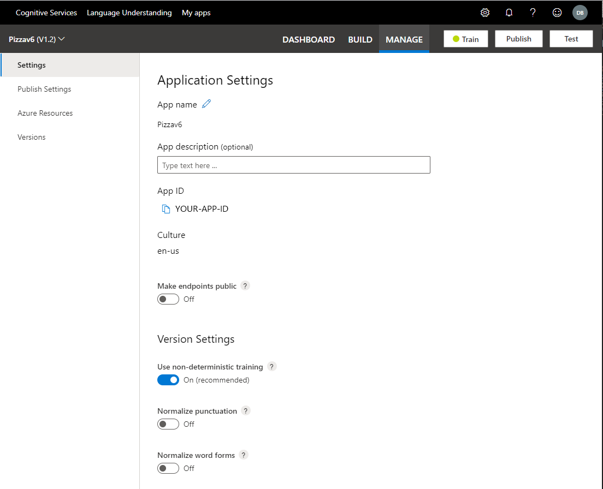

# Application and version settings

[!INCLUDE [deprecation notice](./includes/deprecation-notice.md)]

Configure your application settings in the LUIS portal such as utterance normalization and app privacy.

## View application name, description, and ID

You can edit your application name, and description. You can copy your App ID. The culture can't be changed.

1. Sign into the [LUIS portal](https://www.luis.ai).
1. Select an app from the **My apps** list.
.
1. Select **Manage** from the top navigation bar, then **Settings** from the left navigation bar.

> [!div class="mx-imgBorder"]
> 

## Change application settings

To change a setting, select the toggle on the page.

[!INCLUDE [App settings](includes/app-settings.md)]

## Change version settings

To change a setting, select the toggle on the page.

[!INCLUDE [Version settings](includes/app-version-settings.md)]

## Next steps

* How to [collaborate](luis-how-to-collaborate.md) with other authors
* [Publish settings](how-to/publish.md#configure-publish-settings)
