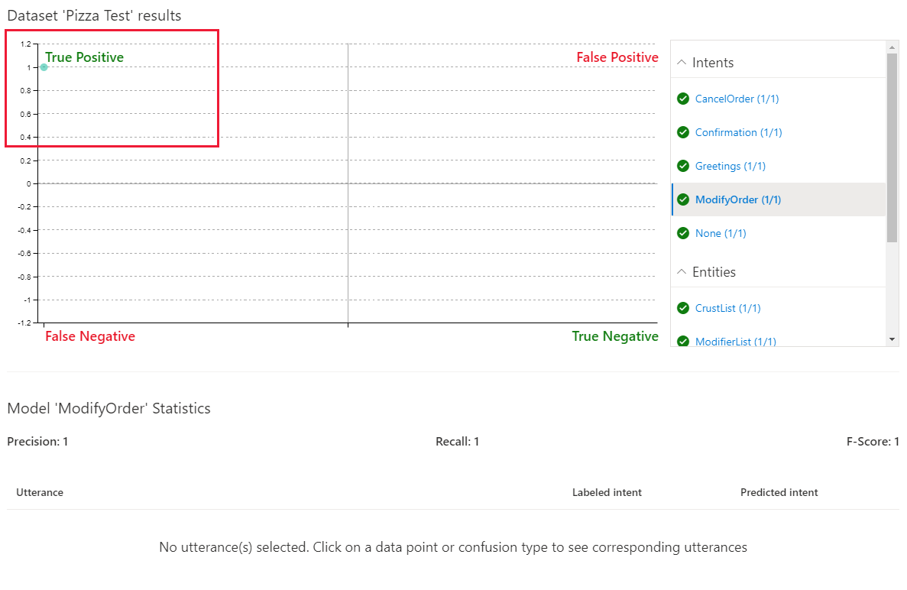
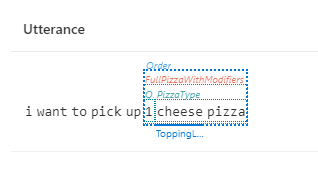
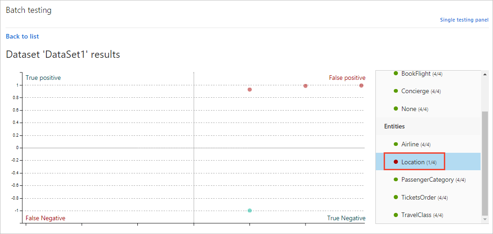
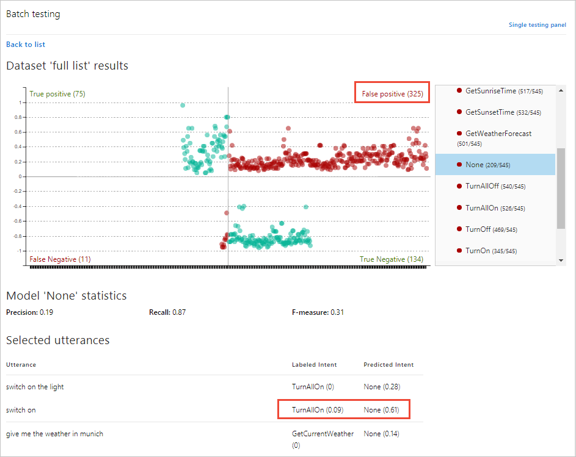

# Batch testing with a set of example utterances

[!INCLUDE [deprecation notice](./includes/deprecation-notice.md)]


Batch testing validates your active trained version to measure its prediction accuracy. A batch test helps you view the accuracy of each intent and entity in your active version. Review the batch test results to take appropriate action to improve accuracy, such as adding more example utterances to an intent if your app frequently fails to identify the correct intent or labeling entities within the utterance.

## Group data for batch test

It is important that utterances used for batch testing are new to LUIS. If you have a data set of utterances, divide the utterances into three sets: example utterances added to an intent, utterances received from the published endpoint, and utterances used to batch test LUIS after it is trained.

The batch JSON file you use should include utterances with top-level machine-learning entities labeled including start and end position. The utterances should not be part of the examples already in the app. They should be utterances you want to positively predict for intent and entities.

You can separate out tests by intent and/or entity or have all the tests (up to 1000 utterances) in the same file. 

### Common errors importing a batch

If you run into errors uploading your batch file to LUIS, check for the following common issues:

* More than 1,000 utterances in a batch file
* An utterance JSON object that doesn't have an entities property. The property can be an empty array.
* Word(s) labeled in multiple entities
* Entity labels starting or ending on a space.

## Fixing batch errors

If there are errors in the batch testing, you can either add more utterances to an intent, and/or label more utterances with the entity to help LUIS make the discrimination between intents. If you have added utterances, and labeled them, and still get prediction errors in batch testing, consider adding a [phrase list](concepts/patterns-features.md) feature with domain-specific vocabulary to help LUIS learn faster.


<a name="batch-testing"></a>

# [LUIS portal](#tab/portal)

## Batch testing using the LUIS portal 

### Import and train an example app

Import an app that takes a pizza order such as `1 pepperoni pizza on thin crust`.

1.  Download and save [app JSON file](https://github.com/Azure-Samples/cognitive-services-sample-data-files/blob/master/luis/apps/pizza-with-machine-learned-entity.json?raw=true).

1. Sign in to the [LUIS portal](https://www.luis.ai), and select your **Subscription** and **Authoring resource** to see the apps assigned to that authoring resource.
1. Select the arrow next to **New app** and click **Import as JSON** to import the JSON into a new app. Name the app `Pizza app`.


1. Select **Train** in the top-right corner of the navigation to train the app.


[!INCLUDE [Entity roles in batch testing - currently not supported](../../../includes/cognitive-services-luis-roles-not-supported-in-batch-testing.md)]

### Batch test file

The example JSON includes one utterance with a labeled entity to illustrate what a test file looks like. In your own tests, you should have many utterances with correct intent and machine-learning entity labeled.

1. Create `pizza-with-machine-learned-entity-test.json` in a text editor or [download](https://github.com/Azure-Samples/cognitive-services-sample-data-files/blob/master/luis/batch-tests/pizza-with-machine-learned-entity-test.json?raw=true) it.

2. In the JSON-formatted batch file, add an utterance with the **Intent** you want predicted in the test.

   [!code-json[Add the intents to the batch test file](~/samples-cognitive-services-data-files/luis/batch-tests/pizza-with-machine-learned-entity-test.json "Add the intent to the batch test file")]

## Run the batch

1. Select **Test** in the top navigation bar.

2. Select **Batch testing panel** in the right-side panel.

    

3. Select **Import**. In the dialog box that appears, select **Choose File** and locate a JSON file with the correct JSON format that contains *no more than 1,000* utterances to test.

    Import errors are reported in a red notification bar at the top of the browser. When an import has errors, no dataset is created. For more information, see [Common errors](#common-errors-importing-a-batch).

4. Choose the file location of the `pizza-with-machine-learned-entity-test.json` file.

5. Name the dataset `pizza test` and select **Done**.

6. Select the **Run** button. 

7. After the batch test completes, you can see the following columns:

    | Column | Description |
    | -------- | ------------- |
    | State | Status of the test. **See results** is only visible after the test is completed. |
    | Name | The name you have given to the test. |
    | Size | Number of tests in this batch test file. |
    | Last Run | Date of last run of this batch test file. |
    | Last result | Number of successful predictions in the test. |

8. To view detailed results of the test, select **See results**. 

    > [!TIP]
    > * Selecting **Download** will download the same file that you uploaded.
    > * If you see the batch test failed, at least one utterance intent did not match the prediction.

<a name="access-batch-test-result-details-in-a-visualized-view"></a>

### Review batch results for intents

To review the batch test results, select **See results**. The test results show graphically how the test utterances were predicted against the active version.

The batch chart displays four quadrants of results. To the right of the chart is a filter. The filter contains intents and entities. When you select a [section of the chart](#review-batch-results-for-intents) or a point within the chart, the associated utterance(s) display below the chart.

While hovering over the chart, a mouse wheel can enlarge or reduce the display in the chart. This is useful when there are many points on the chart clustered tightly together.

The chart is in four quadrants, with two of the sections displayed in red.

1. Select the **ModifyOrder** intent in the filter list. The utterance is predicted as a **True Positive** meaning the utterance successfully matched its positive prediction listed in the batch file.

    > [!div class="mx-imgBorder"]
    > 

    The green checkmarks in the filters list also indicate the success of the test for each intent. All the other intents are listed with a 1/1 positive score because the utterance was tested against each intent, as a negative test for any intents not listed in the batch test.

1. Select the **Confirmation** intent. This intent isn't listed in the batch test so this is a negative test of the utterance that is listed in the batch test.

    > [!div class="mx-imgBorder"]
    > 

    The negative test was successful, as noted with the green text in the filter, and the grid.

### Review batch test results for entities

The ModifyOrder entity, as a machine entity with subentities, displays if the top-level entity matched and how the subentities are predicted.

1. Select the **ModifyOrder** entity in the filter list then select the circle in the grid.

1. The entity prediction displays below the chart. The display includes solid lines for predictions that match the expectation and dotted lines for predictions that don't match the expectation.

    > [!div class="mx-imgBorder"]
    > 

<a name="filter-chart-results-by-intent-or-entity"></a>

#### Filter chart results

To filter the chart by a specific intent or entity, select the intent or entity in the right-side filtering panel. The data points and their distribution update in the graph according to your selection.



### Chart result examples

The chart in the LUIS portal, you can perform the following actions:
 
#### View single-point utterance data

In the chart, hover over a data point to see the certainty score of its prediction. Select a data point to retrieve its corresponding utterance in the utterances list at the bottom of the page.


<a name="relabel-utterances-and-retrain"></a>
<a name="false-test-results"></a>

#### View section data

In the four-section chart, select the section name, such as **False Positive** at the top-right of the chart. Below the chart, all utterances in that section display below the chart in a list.



In this preceding image, the utterance `switch on` is labeled with the TurnAllOn intent, but received the prediction of None intent. This is an indication that the TurnAllOn intent needs more example utterances in order to make the expected prediction.

The two sections of the chart in red indicate utterances that did not match the expected prediction. These indicate utterances which LUIS needs more training.

The two sections of the chart in green did match the expected prediction.

# [REST API](#tab/rest)

## Batch testing using the REST API 

LUIS lets you batch test using the LUIS portal and REST API. The endpoints for the REST API are listed below. For information on batch testing using the LUIS portal, see [Tutorial: batch test data sets](). Use the complete URLs below, replacing the placeholder values with your own LUIS Prediction key and endpoint. 

Remember to add your LUIS key to `Ocp-Apim-Subscription-Key` in the header, and set `Content-Type` to `application/json`.

### Start a batch test

Start a batch test using either an app version ID or a publishing slot. Send a **POST** request to one of the following endpoint formats. Include your batch file in the body of the request.

Publishing slot
* `<YOUR-PREDICTION-ENDPOINT>/luis/v3.0-preview/apps/<YOUR-APP-ID>/slots/<YOUR-SLOT-NAME>/evaluations`

App version ID
* `<YOUR-PREDICTION-ENDPOINT>/luis/v3.0-preview/apps/<YOUR-APP-ID>/versions/<YOUR-APP-VERSION-ID>/evaluations`

These endpoints will return an operation ID that you will use to check the status, and get results. 


### Get the status of an ongoing batch test

Use the operation ID from the batch test you started to get its status from the following endpoint formats: 

Publishing slot
* `<YOUR-PREDICTION-ENDPOINT>/luis/v3.0-preview/apps/<YOUR-APP-ID>/slots/<YOUR-SLOT-ID>/evaluations/<YOUR-OPERATION-ID>/status`

App version ID
* `<YOUR-PREDICTION-ENDPOINT>/luis/v3.0-preview/apps/<YOUR-APP-ID>/versions/<YOUR-APP-VERSION-ID>/evaluations/<YOUR-OPERATION-ID>/status`

### Get the results from a batch test

Use the operation ID from the batch test you started to get its results from the following endpoint formats: 

Publishing slot
* `<YOUR-PREDICTION-ENDPOINT>/luis/v3.0-preview/apps/<YOUR-APP-ID>/slots/<YOUR-SLOT-ID>/evaluations/<YOUR-OPERATION-ID>/result`

App version ID
* `<YOUR-PREDICTION-ENDPOINT>/luis/v3.0-preview/apps/<YOUR-APP-ID>/versions/<YOUR-APP-VERSION-ID>/evaluations/<YOUR-OPERATION-ID>/result`


### Batch file of utterances

Submit a batch file of utterances, known as a *data set*, for batch testing. The data set is a JSON-formatted file containing a maximum of 1,000 labeled utterances. You can test up to 10 data sets in an app. If you need to test more, delete a data set and then add a new one. All custom entities in the model appear in the batch test entities filter even if there are no corresponding entities in the batch file data.

The batch file consists of utterances. Each utterance must have an expected intent prediction along with any [machine-learning entities](concepts/entities.md#machine-learned-ml-entity) you expect to be detected.

### Batch syntax template for intents with entities

Use the following template to start your batch file:

```JSON
{
    "LabeledTestSetUtterances": [
        {
            "text": "play a song",
            "intent": "play_music",
            "entities": [
                {
                    "entity": "song_parent",
                    "startPos": 0,
                    "endPos": 15,
                    "children": [
                        {
                            "entity": "pre_song",
                            "startPos": 0,
                            "endPos": 3
                        },
                        {
                            "entity": "song_info",
                            "startPos": 5,
                            "endPos": 15
                        }
                    ]
                }
            ]
        }
    ]
}

```

The batch file uses the **startPos** and **endPos** properties to note the beginning and end of an entity. The values are zero-based and should not begin or end on a space. This is different from the query logs, which use startIndex and endIndex properties.

If you do not want to test entities, include the `entities` property and set the value as an empty array, `[]`.

### REST API batch test results

There are several objects returned by the API:

* Information about the intents and entities models, such as precision, recall and F-score.
* Information about the entities models, such as precision, recall and F-score) for each entity 
  * Using the `verbose` flag, you can get more information about the entity, such as `entityTextFScore` and `entityTypeFScore`.
* Provided utterances with the predicted and labeled intent names
* A list of false positive entities, and a list of false negative entities.

---

## Next steps

If testing indicates that your LUIS app doesn't recognize the correct intents and entities, you can work to improve your LUIS app's performance by labeling more utterances or adding features.

* [Label suggested utterances with LUIS](how-to/improve-application.md)
* [Use features to improve your LUIS app's performance](concepts/patterns-features.md)
