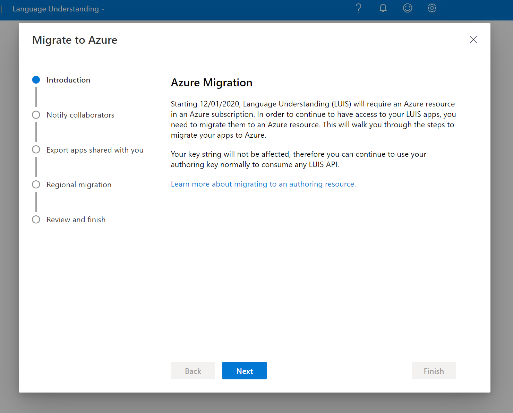
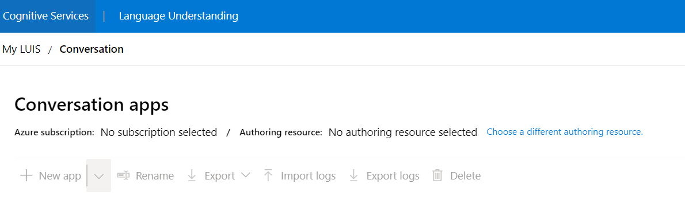

# Migrate to an Azure resource authoring key

[!INCLUDE [deprecation notice](./includes/deprecation-notice.md)]


> [!IMPORTANT]
>  As of December 3rd 2020, existing LUIS users must have completed the migration process to continue authoring LUIS applications.

Language Understanding (LUIS) authoring authentication has changed from an email account to an Azure resource. Use this article to learn how to migrate your account, if you haven't migrated yet.  


## What is migration?

Migration is the process of changing authoring authentication from an email account to an Azure resource. Your account will be linked to an Azure subscription and an Azure authoring resource after you migrate.

Migration has to be done from the [LUIS portal](https://www.luis.ai). If you create the authoring keys by using the LUIS CLI, for example, you'll need to complete the migration process in the LUIS portal. You can still have co-authors on your applications after migration, but these will be added on the Azure resource level instead of the application level. Migrating your account can't be reversed.

> [!Note]
> * If you need to create a prediction runtime resource, there's [a separate process](luis-how-to-azure-subscription.md#create-luis-resources) to create it.
> * See the [migration notes](#migration-notes) section below for information on how your applications and contributors will be affected. 
> * Authoring your LUIS app is free, as indicated by the F0 tier. Learn [more about pricing tiers](luis-limits.md#resource-usage-and-limits).

## Migration prerequisites

* A valid Azure subscription. Ask your tenant admin to add you on the subscription, or [sign up for a free one](https://azure.microsoft.com/free/cognitive-services).
* A LUIS Azure authoring resource from the LUIS portal or from the [Azure portal](https://portal.azure.com/#create/Microsoft.CognitiveServicesLUISAllInOne). 
    * Creating an authoring resource from the LUIS portal is part of the migration process described in the next section.
* If you're a collaborator on applications, applications won't automatically migrate. You will be prompted to export these apps while going through the migration flow. You can also use the [export API](https://westus.dev.cognitive.microsoft.com/docs/services/5890b47c39e2bb17b84a55ff/operations/5890b47c39e2bb052c5b9c40). You can import the app back into LUIS after migration. The import process creates a new app with a new app ID, for which you're the owner.	    
* If you're the owner of the application, you won't need to export your apps because they'll migrate automatically. An email template with a list of all collaborators for each application is provided, so they can be notified of the migration process.

## Migration steps

1. When you sign-in to the [LUIS portal](https://www.luis.ai), an Azure migration window will open with the steps for migration. If you dismiss it, you won't be able to proceed with authoring your LUIS applications, and the only action displayed will be to continue with the migration.

    > [!div class="mx-imgBorder"]
    > 

2. If you have collaborators on any of your apps, you will see a list of application names owned by you, along with the authoring region and collaborator emails on each application. We recommend sending your collaborators an email notifying them about the migration by clicking on the **send** symbol button on the left of the application name.
A `*` symbol will appear next to the application name if a collaborator has a prediction resource assigned to your application. After migration, these apps will still have these prediction resources assigned to them even though the collaborators will not have access to author your applications. However, this assignment will be broken if the owner of the prediction resource [regenerated the keys](./luis-how-to-azure-subscription.md#regenerate-an-azure-key) from the Azure portal.  

   > [!div class="mx-imgBorder"]
   > 


   For each collaborator and app, the default email application opens with a lightly formatted email. You can edit the email before sending it. The email template includes the exact app ID and app name.

   ```html
   Dear Sir/Madam,

   I will be migrating my LUIS account to Azure. Consequently, you will no longer have access to the following app:

   App Id: <app-ID-omitted>
   App name: Human Resources

   Thank you
   ```
   > [!Note]
   > After you migrate your account to Azure, your apps will no longer be available to collaborators.

3. If you're a collaborator on any apps, a list of application names shared with you is shown along with the authoring region and owner emails on each application. It is recommend to export a copy of the apps by clicking on the export button on the left of the application name. You can import these apps back after you migrate, because they won't be automatically migrated with you.
A `*` symbol will appear next to the application name if you have a prediction resource assigned to an application. After migration, your prediction resource will still be assigned to these applications even though you will no longer have access to author these apps. If you want to break the assignment between your prediction resource and the application, you will need to go to Azure portal and [regenerate the keys](./luis-how-to-azure-subscription.md#regenerate-an-azure-key).

   > [!div class="mx-imgBorder"]
   > 


4. In the window for migrating regions, you will be asked to migrate your applications to an Azure resource in the same region they were authored in. LUIS has three authoring regions [and portals](./luis-reference-regions.md#luis-authoring-regions). The window will show the regions where your owned applications were authored. The displayed migration regions may be different depending on the regional portal you use, and apps you've authored. 

   > [!div class="mx-imgBorder"]
   > 

5. For each region, choose to create a new LUIS authoring resource, or to migrate to an existing one using the buttons.

   > [!div class="mx-imgBorder"]
   > 

   Provide the following information:

   * **Tenant Name**: The tenant that your Azure subscription is associated with. By default this is set to the tenant you're currently using. You can switch tenants by closing this window and selecting the avatar in the top right of the screen, containing your initials. Select **Migrate to Azure** to re-open the window.
   * **Azure Subscription Name**: The subscription that will be associated with the resource. If you have more than one subscription that belongs to your tenant, select the one you want from the drop-down list.
   * **Authoring Resource Name**: A custom name that you choose. It's used as part of the URL for your authoring and prediction endpoint queries. If you are creating a new authoring resource, note that the resource name can only include alphanumeric characters, `-`, and can’t start or end with `-`. If any other symbols are included in the name,
 resource creation and migration will fail.
   * **Azure Resource Group Name**: A custom resource group name that you choose from the drop-down list. Resource groups allow you to group Azure resources for access and management. If you currently do not have a resource group in your subscription, you will not be allowed to create one in the LUIS portal. Go to [Azure portal](https://portal.azure.com/#create/Microsoft.ResourceGroup) to create one then go to LUIS to continue the sign-in process.

6. After you have successfully migrated in all regions, select finish. You will now have access to your applications. You can continue authoring and maintaining all your applications in all regions within the portal.

## Migration notes

* Before migration, coauthors are known as _collaborators_ on the LUIS app level. After migration, the Azure role of _contributor_ is used for the same functionality on the Azure resource level.
* If you have signed-in to more than one [LUIS regional portal](./luis-reference-regions.md#luis-authoring-regions), you will be asked to migrate in multiple regions at once.
* Applications will automatically migrate with you if you're the owner of the application. Applications will not migrate with you if you're a collaborator on the application. However, collaborators will be prompted to export the apps they need.
* Application owners can't choose a subset of apps to migrate and there is no way for an owner to know if collaborators have migrated.
* Migration does not automatically move or add collaborators to the Azure authoring resource. The app owner is the one who needs to complete this step after migration. This step requires [permissions to the Azure authoring resource](./luis-how-to-collaborate.md).
* After contributors are assigned to the Azure resource, they will need to migrate before they can access applications. Otherwise, they won't have access to author the applications.


## Using apps after migration

After the migration process, all your LUIS apps for which you're the owner will now be assigned to a single LUIS authoring resource.
The **My Apps** list shows the apps migrated to the new authoring resource. Before you access your apps, select **Choose a different authoring resource** to select the subscription and authoring resource to view the apps that can be authored.

> [!div class="mx-imgBorder"]
> 


If you plan to edit your apps programmatically, you'll need the authoring key values. These values are displayed by clicking **Manage** at the top of the screen in the LUIS portal, and then selecting **Azure Resources**. They're also available in the Azure portal on the resource's **Key and endpoints** page. You can also create more authoring resources and assign them from the same page.

## Adding contributors to authoring resources

[!INCLUDE [Manage contributors for the Azure authoring resource for language understanding](./includes/manage-contributors-authoring-resource.md)]

Learn [how to add contributors](luis-how-to-collaborate.md) on your authoring resource. Contributors will have access to all applications under that resource.

You can add contributors to the authoring resource from the Azure portal, on the **Access Control (IAM)** page for that resource. For more information, see [Add contributors to your app](luis-how-to-collaborate.md).

> [!Note]
> If the owner of the LUIS app migrated and added the collaborator as a contributor on the Azure resource, the collaborator will still have no access to the app unless they also migrate.

## Troubleshooting the migration process

If you cannot find your Azure subscription in the drop-down list:
* Ensure that you have a valid Azure subscription that's authorized to create Azure AI services resources. Go to the [Azure portal](https://portal.azure.com) and check the status of the subscription. If you don't have one, [create a free Azure account](https://azure.microsoft.com/free/cognitive-services/).
* Ensure that you're in the proper tenant associated with your valid subscription. You can switch tenants selecting the avatar in the top right of the screen, containing your initials.

  > [!div class="mx-imgBorder"]
  > 

If you have an existing authoring resource but can't find it when you select the **Use Existing Authoring Resource** option:
* Your resource was probably created in a different region than the one your are trying to migrate in.
* Create a new resource from the LUIS portal instead.

If you select the **Create New Authoring Resource** option and migration fails with the error message "Failed retrieving user's Azure information, retry again later":
* Your subscription might have 10 or more authoring resources per region, per subscription. If that's the case, you won't be able to create a new authoring resource.
* Migrate by selecting the **Use Existing Authoring Resource** option and selecting one of the existing resources under your subscription.

## Create new support request

If you are having any issues with the migration that are not addressed in the troubleshooting section, please [create a support topic](https://portal.azure.com/#blade/Microsoft_Azure_Support/HelpAndSupportBlade/newsupportrequest) and provide the information below with the following fields:

   * **Issue Type**: Technical
   * **Subscription**: Choose a subscription from the dropdown list
   * **Service**: Search and select "Azure AI services"
   * **Resource**: Choose a LUIS resource if there is an existing one. If not, select General question.

## Next steps

* Review [concepts about authoring and runtime keys](luis-how-to-azure-subscription.md)
* Review how to [assign keys](luis-how-to-azure-subscription.md) and [add contributors](luis-how-to-collaborate.md)
