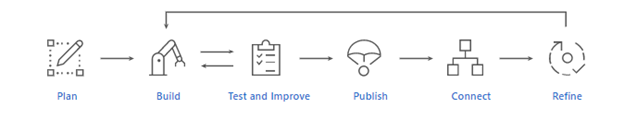

# What is Language Understanding (LUIS)?

[!INCLUDE [deprecation notice](./includes/deprecation-notice.md)]

[!INCLUDE [Azure AI services rebrand](../includes/rebrand-note.md)]

Language Understanding (LUIS) is a cloud-based conversational AI service that applies custom machine-learning intelligence to a user's conversational, natural language text to predict overall meaning, and pull out relevant, detailed information. LUIS provides access through its [custom portal](https://www.luis.ai), [APIs][endpoint-apis] and [SDK client libraries](client-libraries-rest-api.md).

For first time users, follow these steps to [sign in to LUIS portal](how-to/sign-in.md "sign in to LUIS portal")
To get started, you can try a LUIS [prebuilt domain app](luis-get-started-create-app.md).

This documentation contains the following article types:  

* [**Quickstarts**](luis-get-started-create-app.md) are getting-started instructions to guide you through making requests to the service.  
* [**How-to guides**](how-to/sign-in.md) contain instructions for using the service in more specific or customized ways.  
* [**Concepts**](concepts/application-design.md) provide in-depth explanations of the service functionality and features.  
* [**Tutorials**](tutorial/build-decomposable-application.md) are longer guides that show you how to use the service as a component in broader business solutions.  

## What does LUIS Offer 

* **Simplicity**: LUIS offloads you from the need of in-house AI expertise or any prior machine learning knowledge. With only a few clicks you can build your own conversational AI application. You can build your custom application by following one of our [quickstarts](luis-get-started-create-app.md), or you can use one of our [prebuilt domain](luis-get-started-create-app.md) apps.
* **Security, Privacy and Compliance**: LUIS is backed by Azure infrastructure, which offers enterprise-grade security, privacy, and compliance. Your data remains yours; you can delete your data at any time. Your data is encrypted while it’s in storage. Learn more about this [here](https://azure.microsoft.com/support/legal/cognitive-services-compliance-and-privacy).
* **Integration**: easily integrate your LUIS app with other Microsoft services like [Microsoft Bot framework](/composer/tutorial/tutorial-luis), [QnA Maker](../QnAMaker/choose-natural-language-processing-service.md), and [Speech service](../speech-service/get-started-intent-recognition.md).

## LUIS Scenarios
* [Build an enterprise-grade conversational bot](/azure/architecture/reference-architectures/ai/conversational-bot): This reference architecture describes how to build an enterprise-grade conversational bot (chatbot) using the Azure Bot Framework.
* [Commerce Chatbot](/azure/architecture/solution-ideas/articles/commerce-chatbot): Together, the Azure AI Bot Service and Language Understanding service enable developers to create conversational interfaces for various scenarios like banking, travel, and entertainment.
* [Controlling IoT devices using a Voice Assistant](/azure/architecture/solution-ideas/articles/iot-controlling-devices-with-voice-assistant): Create seamless conversational interfaces with all of your internet-accessible devices-from your connected television or fridge to devices in a connected power plant.

## Application Development life cycle

-	**Plan**: Identify the scenarios that users might use your application for. Define the actions and relevant information that needs to be recognized.
-	**Build**: Use your authoring resource to develop your app. Start by defining [intents](concepts/intents.md) and [entities](concepts/entities.md). Then, add training [utterances](concepts/utterances.md) for each intent. 
-	**Test and Improve**: Start testing your model with other utterances to get a sense of how the app behaves, and you can decide if any improvement is needed. You can improve your application by following these [best practices](faq.md). 
-	**Publish**: Deploy your app for prediction and query the endpoint using your prediction resource. Learn more about authoring and prediction resources [here](luis-how-to-azure-subscription.md). 
-	**Connect**: Connect to other services such as [Microsoft Bot framework](/composer/tutorial/tutorial-luis), [QnA Maker](../QnAMaker/choose-natural-language-processing-service.md), and [Speech service](../speech-service/get-started-intent-recognition.md). 
-	**Refine**: [Review endpoint utterances](how-to/improve-application.md) to improve your application with real life examples

Learn more about planning and building your application [here](concepts/application-design.md).

## Next steps

* [What's new](whats-new.md "What's new") with the service and documentation
* [Build a LUIS app](tutorial/build-decomposable-application.md)
* [API reference][endpoint-apis]
* [Best practices](faq.md)
* [Developer resources](developer-reference-resource.md "Developer resources") for LUIS.
* [Plan your app](concepts/application-design.md "Plan your app") with [intents](concepts/intents.md "intents") and [entities](concepts/entities.md "entities").

[bot-framework]: /bot-framework/
[flow]: /connectors/luis/
[authoring-apis]: https://go.microsoft.com/fwlink/?linkid=2092087
[endpoint-apis]: https://go.microsoft.com/fwlink/?linkid=2092356
[qnamaker]: https://qnamaker.ai/
