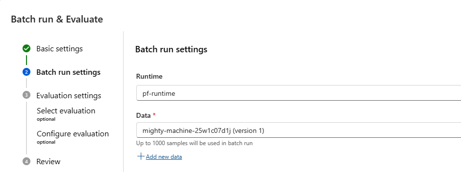

# How to generate question and answer pairs from your source dataset

You can generate question and answer pairs from your source dataset using synthetic data generation. This data can them be used for a variety of purposes like unit testing for your LLM look up, evaluation and iteration of retrieval augmented generation (RAG) flows, and prompt tuning. Let's look into details of how to get this done.

## Install the Synthetics Package

> TODO_PUBLIC_PREVIEW
> Update install instructions

```shell
python --version  # ensure you've >=3.8
pip install azure-ai-generative>=0.0.20231017 --extra-index-url https://azuremlsdktestpypi.azureedge.net/test-azure-ai-generative
pip install openai azureml-telemetry
```

## Connect to Azure Open AI

We need to connect to Azure Open AI so that we can access the LLM to generate data for us.

```python
from azure.ai.generative import AIClient
from azure.identity import DefaultAzureCredential

subscription = "<subscription-id>" # Subscription of your AI Studio project
resource_group = "<resource-group>" # Resource Group of your AI Studio project
project = "<project-name>" #Name of your Ai Studio Project

ai_client = AIClient(
    subscription_id=subscription, 
    resource_group_name=resource_group, 
    project_name=project, 
    credential=DefaultAzureCredential())

# lets get the default AOAI connection
aoai_connection = ai_client.get_default_aoai_connection()
aoai_connection.set_current_environment()
```

## Initialize the LLM to generate data

In this step we get the LLM ready to generate the data.

```python
import os
from azure.ai.generative.synthetic.qa import QADataGenerator, QAType

model_name = "gpt-35-turbo" #model name: gpt-4, gpt-35-turbo

model_config = dict(
    api_base=os.environ["OPENAI_API_BASE"],
    api_key=os.environ["OPENAI_API_KEY"],
    deployment=model_name, 
    model=model_name,  
    max_tokens=2000,
)

qa_generator = QADataGenerator(model_config=model_config)
```

## Generate the data

We will use the `QADataGenerator` which we initialized above to generate the data. Following types of Q&A data are supported.

|Type|Description|
|--|--|
|SHORT_ANSWER|Short answer QAs have answers that are only a few words long. These words are generally relevant details from text like dates, names, statistics, etc.|
|LONG_ANSWER|Long answer QAs have answers that are one or more sentences long. ex. Questions where answer is a definition: What is a {topic_from_text}?|
|BOOLEAN|Boolean QAs have answers that are either True or False.|
|SUMMARY|Summary QAs have questions that ask to write a summary for text's title in a limited number of words. It generates just one QA.|
|CONVERSATION|Conversation QAs have questions that might reference words or ideas from previous QAs. ex. If previous conversation was about some topicX from text, next question might reference it without using its name: How does **it** compare to topicY?|

### Generate data from text

Let us create some text. We will use the `generate` function in `QADataGenerator` to generate questions based on the text. In the sample below

* `text` is your source data.
* `qa_type` defines the type of question and answers to be generated.
* `num_questions` is the number of question-answer pairs to be generated for the text.

To start with we will get text from a wiki page on Leonardo di ser Piero da Vinci

```python
# uncomment below line to install wikipedia
#!pip install wikipedia 
import wikipedia

wiki_title = wikipedia.search("Leonardo da vinci")[0]
wiki_page = wikipedia.page(wiki_title)
text = wiki_page.summary[:700]
text
```

Let us use this text to generate some question and answers

```python
from azure.ai.tools.synthetic.qa import QAType

qa_type = QAType.CONVERSATION

result = qa_generator.generate(text=text, qa_type=qa_type, num_questions=5)

for question, answer in result["question_answers"]:
    print(f"Q: {question}")
    print(f"A: {answer}")
```

You can check token usage as follows:

```python
print(f"Tokens used: {result['token_usage']}")
```

## Using the generated data in Prompt flow

One of the features of Prompt flow is the ability to test and evaluate your flows on batch of inputs. This is useful for checking the quality and performance of your flows before deploying them. To use this feature, you need to provide the data in a specific (.jsonl) format that prompt flow can understand. We will prepare this data from the questions and answers that we have generated in [Generate data from text](#generate-data-from-text) step. We will then use this data to batch run and evaluation for the flow.

### Format and save the generated data

```python
import json
from collections import defaultdict
import pandas as pd

# transform generated Q&A to desired format
data_dict = defaultdict(list)
chat_history = []
for question, answer in result["question_answers"]:
    if qa_type == QAType.CONVERSATION:
        # Chat QnA columns:
        data_dict["chat_history"].append(json.dumps(chat_history))
        data_dict["chat_input"].append(question)
        chat_history.append({"inputs": {"chat_input": question}, "outputs": {"chat_output": answer}})
    else:
        # QnA columns:
        data_dict["question"].append(question)    

    data_dict["ground_truth"].append(answer)  # Consider generated answer as the ground truth

# export to jsonl file
output_file = "generated_qa.jsonl"
data_df = pd.DataFrame(data_dict, columns=list(data_dict.keys()))
data_df.to_json(output_file, lines=True, orient="records")
```

### Use the data for evaluation

To use the "generated_qa.jsonl" file for evaluation, you need to add this file as data to your evaluation flow. You can do this by going to your desired flow in the Studio UI and click on **Evaluate**.

1. Enter details in **Basic Settings**
2. In the **Batch run settings**" click on **Add new data**.


3. Provide a name for your data, select the file from you generated, click **Add**.


   You can use this name to reuse the uploaded file in other flows as well
4. Next, you need to map the input fields to the prompt flow parameters. You can see an example of how to do this below.


5. Complete the rest of the steps in the wizard and submit for evaluation.

## Generate data from files

Generating data from files might be more practical for large amounts of data. You can use the `generate_async()` method OF THE `QADataGenerator` to make concurrent requests to Azure Open AI for generating data from files.

Files might have large texts that go beyond model's context lengths. They need to be split to create smaller chunks. Moreover, they should not be split mid-sentence. Such partial sentences might lead to improper QA samples. You can use LangChain's `NLTKTextSplitter` to split the files before generating data.

Given below is an excerpt of the code to generate samples using `generate_async()`. You can refer to the full sample here TBD.
> TODO_PUBLIC_PREVIEW
> Add a link to the samples repo

```python
import asyncio
from collections import Counter

concurrency = 3  # number of concurrent calls
sem = asyncio.Semaphore(concurrency)

async def generate_async(text):
    async with sem:
        return await qa_generator.generate_async(
            text=text,
            qa_type=QAType.LONG_ANSWER,
            num_questions=3,  # Number of questions to generate per text
        )

results = await asyncio.gather(*[generate_async(text) for text in texts],
                               return_exceptions=True)

question_answer_list = []
token_usage = Counter()

# text is the array of split texts from the file which have the source data
for result in results:
    if isinstance(result, Exception):
        raise result  # exception raised inside generate_async()
    question_answer_list.append(result["question_answers"])
    token_usage += result["token_usage"]

print("Successfully generated QAs")
```

## Some Examples of data generation

SHORT_ANSWER:

```text
Q: When was Leonardo da Vinci born and when did he die?
A: 15 April 1452 – 2 May 1519
Q: What fields was Leonardo da Vinci active in during the High Renaissance?
A: painter, engineer, scientist, sculptor, and architect
Q: Who was Leonardo da Vinci's younger contemporary with a similar contribution to later generations of artists?
A: Michelangelo
```

LONG_ANSWER:

```text
Q: Who was Leonardo di ser Piero da Vinci?
A: Leonardo di ser Piero da Vinci (15 April 1452 – 2 May 1519) was an Italian polymath of the High Renaissance who was active as a painter, engineer, scientist, sculptor, and architect.
Q: What subjects did Leonardo da Vinci cover in his notebooks?
A: In his notebooks, Leonardo da Vinci made drawings and notes on a variety of subjects, including anatomy, astronomy, cartography, and paleontology.
```

BOOLEAN:

```text
Q: True or false - Leonardo da Vinci was an Italian polymath of the High Renaissance?
A: True
Q: True or false - Leonardo da Vinci was only known for his achievements as a painter?
A: False
```

SUMMARY:

```text
Q: Write a summary in 100 words for: Leonardo da Vinci
A: Leonardo da Vinci (1452-1519) was an Italian polymath of the High Renaissance, known for his work as a painter, engineer, scientist, sculptor, and architect. Initially famous for his painting, he gained recognition for his notebooks containing drawings and notes on subjects like anatomy, astronomy, cartography, and paleontology. Leonardo is considered a genius who embodied the Renaissance humanist ideal, and his collective works have significantly influenced later generations of artists, rivaling the contributions of his contemporary, Michelangelo.
```

CONVERSATION:

```text
Q: Who was Leonardo da Vinci?
A: Leonardo di ser Piero da Vinci was an Italian polymath of the High Renaissance who was active as a painter, engineer, scientist, sculptor, and architect.
Q: When was he born and when did he die?
A: Leonardo da Vinci was born on 15 April 1452 and died on 2 May 1519.
Q: What are some subjects covered in his notebooks?
A: In his notebooks, Leonardo da Vinci made drawings and notes on a variety of subjects, including anatomy, astronomy, cartography, and paleontology.
```

## Results Structure of generated data

The results of the `generate` will be a dictionary with the following structure:

```python
{
    "question_answers": [
        ("Who described the first rudimentary steam engine?", "Hero of Alexandria"),
        ...
    ],
    "token_usage": {
        "completion_tokens": 611,
        "prompt_tokens": 3630,
        "total_tokens": 4241,
    },
}
```

## Next steps

- [How to create vector index in Azure AI Studio prompt flow (preview)](./index-add.md)
- [Check out the Azure AI samples for RAG and more](https://github.com/Azure-Samples/azureai-samples)