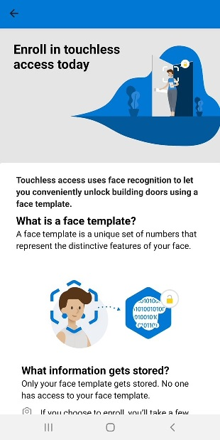

# Build a React app to add users to a Face service

This guide will show you how to get started with the sample Face enrollment application. The app demonstrates best practices for obtaining meaningful consent to add users into a face recognition service and acquire high-accuracy face data. An integrated system could use an app like this to provide touchless access control, identification, attendance tracking, or personalization kiosk, based on their face data.

When launched, the application shows users a detailed consent screen. If the user gives consent, the app prompts for a username and password and then captures a high-quality face image using the device's camera.

The sample app is written using JavaScript and the React Native framework. It can currently be deployed on Android and iOS devices; more deployment options are coming in the future.

## Prerequisites 

* An Azure subscription – [Create one for free](https://azure.microsoft.com/free/cognitive-services/).  
* Once you have your Azure subscription, [create a Face resource](https://portal.azure.com/#create/Microsoft.CognitiveServicesFace) in the Azure portal to get your key and endpoint. After it deploys, select **Go to resource**.  
  * You'll need the key and endpoint from the resource you created to connect your application to Face API.  

### Important Security Considerations
* For local development and initial limited testing, it is acceptable (although not best practice) to use environment variables to hold the API key and endpoint. For pilot and final deployments, the API key should be stored securely - which likely involves using an intermediate service to validate a user token generated during login. 
* Never store the API key or endpoint in code or commit them to a version control system (e.g. Git). If that happens by mistake, you should immediately generate a new API key/endpoint and revoke the previous ones.
* As a best practice, consider having separate API keys for development and production.

## Set up the development environment

#### [Android](#tab/android)
 
1. Clone the git repository for the [sample app](https://github.com/azure-samples/cognitive-services-FaceAPIEnrollmentSample).
1. To set up your development environment, follow the <a href="https://reactnative.dev/docs/environment-setup"  title="React Native documentation"  target="_blank">React Native documentation </a>. Select **React Native CLI Quickstart**. Select your development OS and **Android** as the target OS. Complete the sections **Installing dependencies** and **Android development environment**.
1. Download your preferred text editor such as [Visual Studio Code](https://code.visualstudio.com/).
1. Retrieve your FaceAPI endpoint and key in the Azure portal under the **Overview** tab of your resource. Don't check in your Face API key to your remote repository.

   > [!WARNING]
   > For local development and testing only, you can enter the API key and endpoint as environment variables. For final deployment, store the API key in a secure location and never in the code or environment variables. See the [Azure AI services authentication guide](../../authentication.md) for other ways to authenticate the service.

1. Run the app using either the Android Virtual Device emulator from Android Studio, or your own Android device. To test your app on a physical device, follow the relevant <a href="https://reactnative.dev/docs/running-on-device"  title="React Native documentation"  target="_blank">React Native documentation </a>.

#### [iOS](#tab/ios)

1. Clone the git repository for the [sample app](https://github.com/azure-samples/cognitive-services-FaceAPIEnrollmentSample).
1. To set up your development environment, follow the <a href="https://reactnative.dev/docs/environment-setup"  title="React Native documentation"  target="_blank">React Native documentation </a>. Select **React Native CLI Quickstart**. Select **macOS** as your development OS and **iOS** as the target OS. Complete the section **Installing dependencies**.
1. Download your preferred text editor such as [Visual Studio Code](https://code.visualstudio.com/). You will also need to download Xcode. 
1. Retrieve your FaceAPI endpoint and key in the Azure portal under the **Overview** tab of your resource.

   > [!WARNING]
   > For local development and testing only, you can enter the API key and endpoint as environment variables. For final deployment, store the API key in a secure location and never in the code or environment variables. See the [Azure AI services authentication guide](../../authentication.md) for other ways to authenticate the service.

1. Run the app using either a simulated device from Xcode, or your own iOS device. To test your app on a physical device, follow the relevant <a href="https://reactnative.dev/docs/running-on-device"  title="React Native documentation"  target="_blank">React Native documentation </a>.

---

## Customize the app for your business   

Now that you have set up the sample app, you can tailor it to your own needs.

For example, you may want to add situation-specific information on your consent page:

> [!div class="mx-imgBorder"]
> 

1. Add more instructions to improve verification accuracy.

    Many face recognition issues are caused by low-quality reference images. Some factors that can degrade model performance are:
    * Face size (faces that are distant from the camera)
    * Face orientation (faces turned or tilted away from camera)
    * Poor lighting conditions (either low light or backlighting) where the image may be poorly exposed or have too much noise
    * Occlusion (partially hidden or obstructed faces) including accessories like hats or thick-rimmed glasses)
    * Blur (such as by rapid face movement when the photograph was taken). 

    The service provides image quality checks to help you make the choice of whether the image is of sufficient quality based on the above factors to add the customer or attempt face recognition. This app demonstrates how to access frames from the device's camera, detect quality and show user interface messages to the user to help them capture a higher quality image, select the highest-quality frames, and add the detected face into the Face API service. 

> [!div class="mx-imgBorder"]
> 

1. The sample app offers functionality for deleting the user's information and the option to readd. You can enable or disable these operations based on your business requirement. 

> [!div class="mx-imgBorder"]
> 

To extend the app's functionality to cover the full experience, read the [overview](../enrollment-overview.md) for additional features to implement and best practices.

1. Configure your database to map each person with their ID

   You need to use a database to store the face image along with user metadata. The social security number or other unique person identifier can be used as a key to look up their face ID. 

1. For secure methods of passing your subscription key and endpoint to Face service, see the Azure AI services [Security](../../security-features.md?tabs=command-line%2Ccsharp) guide.

## Deploy the app

#### [Android](#tab/android)

First, make sure that your app is ready for production deployment: remove any keys or secrets from the app code and make sure you have followed the [security best practices](../../security-features.md?tabs=command-line%2ccsharp).

When you're ready to release your app for production, you'll generate a release-ready APK file, which is the package file format for Android apps. This APK file must be signed with a private key. With this release build, you can begin distributing the app to your devices directly. 

Follow the <a href="https://developer.android.com/studio/publish/preparing#publishing-build"  title="Prepare for release"  target="_blank">Prepare for release </a> documentation to learn how to generate a private key, sign your application, and generate a release APK.  

Once you've created a signed APK, see the <a href="https://developer.android.com/studio/publish"  title="Publish your app"  target="_blank">Publish your app </a> documentation to learn more about how to release your app.

#### [iOS](#tab/ios)

First, make sure that your app is ready for production deployment: remove any keys or secrets from the app code and make sure you have followed the [security best practices](../../security-features.md?tabs=command-line%2ccsharp). To prepare for distribution, you will need to create an app icon, a launch screen, and configure deployment info settings. Follow the [documentation from Xcode](https://developer.apple.com/documentation/Xcode/preparing_your_app_for_distribution) to prepare your app for distribution. 

When you're ready to release your app for production, you'll build an archive of your app. Follow the [Xcode documentation](https://developer.apple.com/documentation/Xcode/distributing_your_app_for_beta_testing_and_releases) on how to create an archive build and options for distributing your app.  

---

## Next steps  

In this guide, you learned how to set up your development environment and get started with the sample app. If you're new to React Native, you can read their [getting started docs](https://reactnative.dev/docs/getting-started) to learn more background information. It also may be helpful to familiarize yourself with [Face API](../overview-identity.md). Read the other sections on adding users before you begin development.
