# Tutorial: Use Azure AI Vision to generate image metadata in Azure Storage

In this tutorial, you'll learn how to integrate the Azure AI Vision service into a web app to generate metadata for uploaded images. This is useful for [digital asset management (DAM)](../overview.md#azure-ai-vision-for-digital-asset-management) scenarios, such as if a company wants to quickly generate descriptive captions or searchable keywords for all of its images.

You'll use Visual Studio to write an MVC Web app that accepts images uploaded by users and stores the images in Azure blob storage. You'll learn how to read and write blobs in C# and use blob metadata to attach additional information to the blobs you create. Then you'll submit each image uploaded by the user to the Azure AI Vision API to generate a caption and search metadata for the image. Finally, you can deploy the app to the cloud using Visual Studio.

This tutorial shows you how to:

> [!div class="checklist"]
> * Create a storage account and storage containers using the Azure portal
> * Create a Web app in Visual Studio and deploy it to Azure
> * Use the Azure AI Vision API to extract information from images
> * Attach metadata to Azure Storage images
> * Check image metadata using [Azure Storage Explorer](http://storageexplorer.com/)

> [!TIP]
> The section [Use Azure AI Vision to generate metadata](#Exercise5) is most relevant to Image Analysis. Skip to there if you just want to see how Image Analysis is integrated into an established application.

If you don't have an Azure subscription, create a [free account](https://azure.microsoft.com/free/cognitive-services) before you begin. 

## Prerequisites

- [Visual Studio 2017 Community edition](https://www.visualstudio.com/products/visual-studio-community-vs.aspx) or higher, with the "ASP.NET and web development" and "Azure development" workloads installed.
- The [Azure Storage Explorer](http://storageexplorer.com/) tool installed.

<a name="Exercise1"></a>
## Create a storage account

In this section, you'll use the [Azure portal](https://portal.azure.com?WT.mc_id=academiccontent-github-cxa) to create a storage account. Then you'll create a pair of containers: one to store images uploaded by the user, and another to store image thumbnails generated from the uploaded images.

1. Sign in to the [Azure portal](https://portal.azure.com?WT.mc_id=academiccontent-github-cxa) in your browser. If you're asked to sign in, do so using your Microsoft account.
1. To create a storage account, select **+ Create a resource** in the ribbon on the left. Then select **Storage**, followed by **Storage account**.

    
1. Enter a unique name for the storage account in **Name** field and make sure a green check mark appears next to it. The name is important, because it forms one part of the URL through which blobs created under this account are accessed. Place the storage account in a new resource group named "IntellipixResources," and select the region nearest you. Finish by selecting the **Review + create** button at the bottom of the screen to create the new storage account.
    > [!NOTE]
    > Storage account names can be 3 to 24 characters in length and can only contain numbers and lowercase letters. In addition, the name you enter must be unique within Azure. If someone else has chosen the same name, you'll be notified that the name isn't available with a red exclamation mark in the **Name** field.
   
    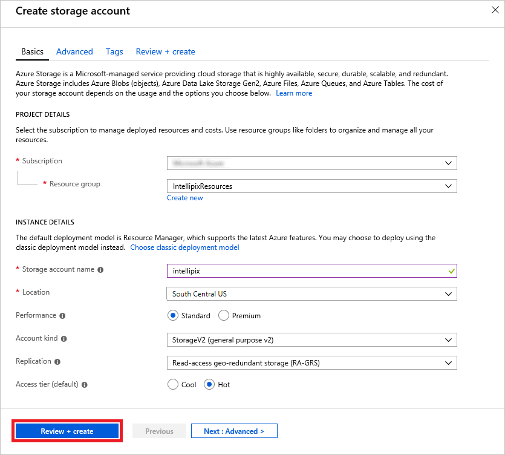
1. Select **Resource groups** in the ribbon on the left. Then select the "IntellipixResources" resource group.

    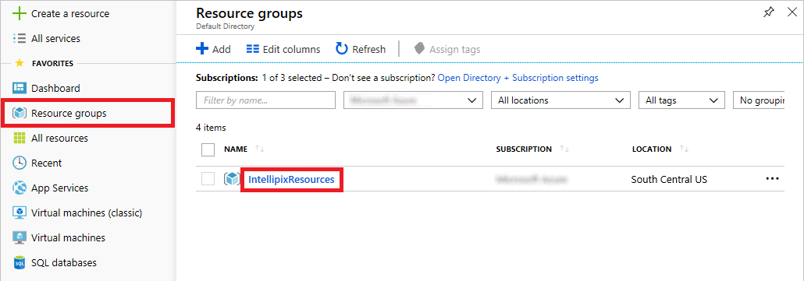
1. In the tab that opens for the resource group, select the storage account you created. If the storage account isn't there yet, you can select **Refresh** at the top of the tab until it appears.

    
1. In the tab for the storage account, select **Blobs** to view a list of containers associated with this account.

    

1. The storage account currently has no containers. Before you can create a blob, you must create a container to store it in. Select **+ Container** to create a new container. Type `photos` into the **Name** field and select **Blob** as the **Public access level**. Then select **OK** to create a container named "photos."

    > By default, containers and their contents are private. Selecting **Blob** as the access level makes the blobs in the "photos" container publicly accessible, but doesn't make the container itself public. This is what you want because the images stored in the "photos" container will be linked to from a Web app. 

    

1. Repeat the previous step to create a container named "thumbnails," once more ensuring that the container's **Public access level** is set to **Blob**.
1. Confirm that both containers appear in the list of containers for this storage account, and that the names are spelled correctly.

    

1. Close the "Blob service" screen. Select **Access keys** in the menu on the left side of the storage-account screen, and then select the **Copy** button next to **KEY** for **key1**. Paste this access key into your favorite text editor for later use.

    

You've now created a storage account to hold images uploaded to the app you're going to build, and containers to store the images in. 

<a name="Exercise2"></a>
## Run Azure Storage Explorer

[Azure Storage Explorer](http://storageexplorer.com/) is a free tool that provides a graphical interface for working with Azure Storage on PCs running Windows, macOS, and Linux. It provides most of the same functionality as the Azure portal and offers other features like the ability to view blob metadata. In this section, you'll use the Microsoft Azure Storage Explorer to view the containers you created in the previous section.

1. If you haven't installed Storage Explorer or would like to make sure you're running the latest version, go to http://storageexplorer.com/ and download and install it.
1. Start Storage Explorer. If you're asked to sign in, do so using your Microsoft account&mdash;the same one that you used to sign in to the Azure portal. If you don't see the storage account in Storage Explorer's left pane, select the **Manage Accounts** button highlighted below and make sure both your Microsoft account and the subscription used to create the storage account have been added to Storage Explorer.

    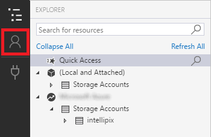

1. Select the small arrow next to the storage account to display its contents, and then select the arrow next to **Blob Containers**. Confirm that the containers you created appear in the list.

    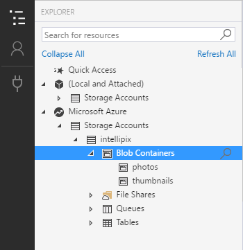

The containers are currently empty, but that will change once your app is deployed and you start uploading photos. Having Storage Explorer installed will make it easy for you to see what your app writes to blob storage.

<a name="Exercise3"></a>
## Create a new Web app in Visual Studio

In this section, you'll create a new Web app in Visual Studio and add code to implement the basic functionality required to upload images, write them to blob storage, and display them in a Web page.

1. Start Visual Studio and use the **File -> New -> Project** command to create a new Visual C# **ASP.NET Web Application** project named "Intellipix" (short for "Intelligent Pictures").

    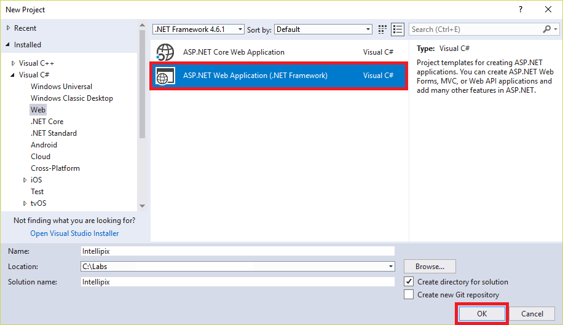

1. In the "New ASP.NET Web Application" dialog, make sure **MVC** is selected. Then select **OK**.

    

1. Take a moment to review the project structure in Solution Explorer. Among other things, there's a folder named **Controllers** that holds the project's MVC controllers, and a folder named **Views** that holds the project's views. You'll be working with assets in these folders and others as you implement the application.

    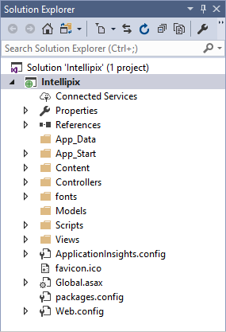

1. Use Visual Studio's **Debug -> Start Without Debugging** command (or press **Ctrl+F5**) to launch the application in your browser. Here's how the application looks in its present state:

    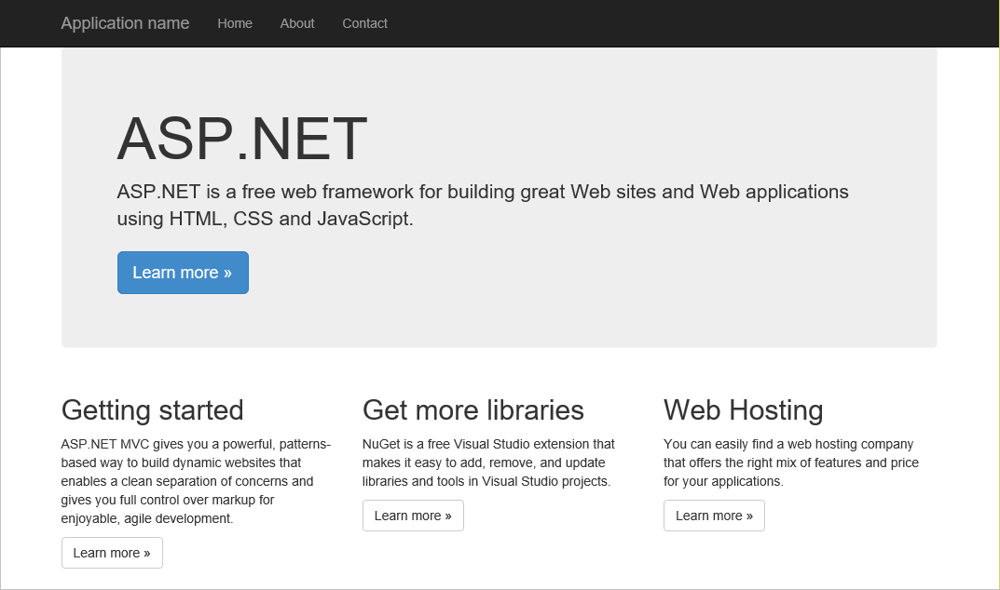

1. Close the browser and return to Visual Studio. In Solution Explorer, right-click the **Intellipix** project and select **Manage NuGet Packages...**. Select **Browse**. Then type `imageresizer` into the search box and select the NuGet package named **ImageResizer**. Finally, select **Install** to install the latest stable version of the package. ImageResizer contains APIs that you'll use to create image thumbnails from the images uploaded to the app. OK any changes and accept any licenses presented to you.

    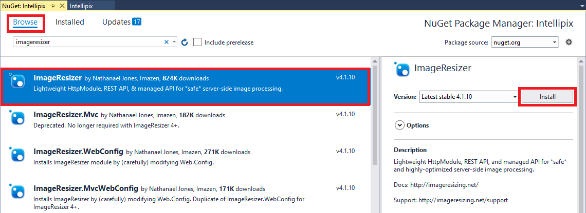

1. Repeat this process to add the NuGet package named **WindowsAzure.Storage** to the project. This package contains APIs for accessing Azure Storage from .NET applications. OK any changes and accept any licenses presented to you.

    

1. Open _Web.config_ and add the following statement to the ```<appSettings>``` section, replacing ACCOUNT_NAME with the name of the storage account you created in the first section, and ACCOUNT_KEY with the access key you saved.

    ```xml
    <add key="StorageConnectionString" value="DefaultEndpointsProtocol=https;AccountName=ACCOUNT_NAME;AccountKey=ACCOUNT_KEY" />
    ```
    
    > [!IMPORTANT]
    > The _Web.config_ file is meant to hold sensitive information like your subscription keys, and any HTTP request to a file with the _.config_ extension is handled by the ASP.NET engine, which returns a "This type of page is not served" message. However, if an attacker is able to find some other exploit that allows them to view your _Web.config_ contents, then they'll be able to expose that information. See [Protecting Connection Strings and Other Configuration Information](/aspnet/web-forms/overview/data-access/advanced-data-access-scenarios/protecting-connection-strings-and-other-configuration-information-cs) for extra steps you can take to further secure your _Web.config_ data.

1. Open the file named *_Layout.cshtml* in the project's **Views/Shared** folder. On line 19, change "Application name" to "Intellipix." The line should look like this:

    ```C#
    @Html.ActionLink("Intellipix", "Index", "Home", new { area = "" }, new { @class = "navbar-brand" })
    ```

    > [!NOTE]
    > In an ASP.NET MVC project, *_Layout.cshtml* is a special view that serves as a template for other views. You typically define header and footer content that is common to all views in this file.

1. Right-click the project's **Models** folder and use the **Add -> Class...** command to add a class file named *BlobInfo.cs* to the folder. Then replace the empty **BlobInfo** class with the following class definition:

    ```C#
    public class BlobInfo
    {
        public string ImageUri { get; set; }
        public string ThumbnailUri { get; set; }
        public string Caption { get; set; }
    }
    ```

1. Open *HomeController.cs* from the project's **Controllers** folder and add the following `using` statements to the top of the file:

    ```C#
    using ImageResizer;
    using Intellipix.Models;
    using Microsoft.WindowsAzure.Storage;
    using Microsoft.WindowsAzure.Storage.Blob;
    using System.Configuration;
    using System.Threading.Tasks;
    using System.IO;
    ```

1. Replace the **Index** method in *HomeController.cs* with the following implementation:

    ```C#
    public ActionResult Index()
    {
        // Pass a list of blob URIs in ViewBag
        CloudStorageAccount account = CloudStorageAccount.Parse(ConfigurationManager.AppSettings["StorageConnectionString"]);
        CloudBlobClient client = account.CreateCloudBlobClient();
        CloudBlobContainer container = client.GetContainerReference("photos");
        List<BlobInfo> blobs = new List<BlobInfo>();
    
        foreach (IListBlobItem item in container.ListBlobs())
        {
            var blob = item as CloudBlockBlob;
    
            if (blob != null)
            {
                blobs.Add(new BlobInfo()
                {
                    ImageUri = blob.Uri.ToString(),
                    ThumbnailUri = blob.Uri.ToString().Replace("/photos/", "/thumbnails/")
                });
            }
        }
    
        ViewBag.Blobs = blobs.ToArray();
        return View();
    }
    ```

    The new **Index** method enumerates the blobs in the `"photos"` container and passes an array of **BlobInfo** objects representing those blobs to the view through ASP.NET MVC's **ViewBag** property. Later, you'll modify the view to enumerate these objects and display a collection of photo thumbnails. The classes you'll use to access your storage account and enumerate the blobs&mdash;**[CloudStorageAccount](/dotnet/api/microsoft.azure.storage.cloudstorageaccount?view=azure-dotnet&preserve-view=true)**, **[CloudBlobClient](/dotnet/api/microsoft.azure.storage.blob.cloudblobclient?view=azure-dotnet-legacy&preserve-view=true)**, and **[CloudBlobContainer](/dotnet/api/microsoft.azure.storage.blob.cloudblobcontainer?view=azure-dotnet-legacy&preserve-view=true)**&mdash;come from the **WindowsAzure.Storage** package you installed through NuGet.

1. Add the following method to the **HomeController** class in *HomeController.cs*:

    ```C#
    [HttpPost]
    public async Task<ActionResult> Upload(HttpPostedFileBase file)
    {
        if (file != null && file.ContentLength > 0)
        {
            // Make sure the user selected an image file
            if (!file.ContentType.StartsWith("image"))
            {
                TempData["Message"] = "Only image files may be uploaded";
            }
            else
            {
                try
                {
                    // Save the original image in the "photos" container
                    CloudStorageAccount account = CloudStorageAccount.Parse(ConfigurationManager.AppSettings["StorageConnectionString"]);
                    CloudBlobClient client = account.CreateCloudBlobClient();
                    CloudBlobContainer container = client.GetContainerReference("photos");
                    CloudBlockBlob photo = container.GetBlockBlobReference(Path.GetFileName(file.FileName));
                    await photo.UploadFromStreamAsync(file.InputStream);
    
                    // Generate a thumbnail and save it in the "thumbnails" container
                    using (var outputStream = new MemoryStream())
                    {
                        file.InputStream.Seek(0L, SeekOrigin.Begin);
                        var settings = new ResizeSettings { MaxWidth = 192 };
                        ImageBuilder.Current.Build(file.InputStream, outputStream, settings);
                        outputStream.Seek(0L, SeekOrigin.Begin);
                        container = client.GetContainerReference("thumbnails");
                        CloudBlockBlob thumbnail = container.GetBlockBlobReference(Path.GetFileName(file.FileName));
                        await thumbnail.UploadFromStreamAsync(outputStream);
                    }
                }
                catch (Exception ex)
                {
                    // In case something goes wrong
                    TempData["Message"] = ex.Message;
                }
            }
        }
    
        return RedirectToAction("Index");
    }
    ```

    This is the method that's called when you upload a photo. It stores each uploaded image as a blob in the `"photos"` container, creates a thumbnail image from the original image using the `ImageResizer` package, and stores the thumbnail image as a blob in the `"thumbnails"` container.

1. Open *Index.cshmtl* in the project's **Views/Home** folder and replace its contents with the following code and markup:

    ```HTML
    @{
        ViewBag.Title = "Intellipix Home Page";
    }
    
    @using Intellipix.Models
    
    <div class="container" style="padding-top: 24px">
        <div class="row">
            <div class="col-sm-8">
                @using (Html.BeginForm("Upload", "Home", FormMethod.Post, new { enctype = "multipart/form-data" }))
                {
                    <input type="file" name="file" id="upload" style="display: none" onchange="$('#submit').click();" />
                    <input type="button" value="Upload a Photo" class="btn btn-primary btn-lg" onclick="$('#upload').click();" />
                    <input type="submit" id="submit" style="display: none" />
                }
            </div>
            <div class="col-sm-4 pull-right">
            </div>
        </div>
    
        <hr />
    
        <div class="row">
            <div class="col-sm-12">
                @foreach (BlobInfo blob in ViewBag.Blobs)
                {
                    
                }
            </div>
        </div>
    </div>
    
    @section scripts
    {
        <script type="text/javascript" language="javascript">
            if ("@TempData["Message"]" !== "") {
                alert("@TempData["Message"]");
            }
        </script>
    }
    ```

    The language used here is [Razor](https://www.asp.net/web-pages/overview/getting-started/introducing-razor-syntax-c), which lets you embed executable code in HTML markup. The ```@foreach``` statement in the middle of the file enumerates the **BlobInfo** objects passed from the controller in **ViewBag** and creates HTML `````` elements from them. The ```src``` property of each element is initialized with the URI of the blob containing the image thumbnail.

1. Download and unzip the _photos.zip_ file from the [GitHub sample data repository](https://github.com/Azure-Samples/cognitive-services-sample-data-files/tree/master/ComputerVision/storage-lab-tutorial). This is an assortment of different photos you can use to test the app.

1. Save your changes and press **Ctrl+F5** to launch the application in your browser. Then select **Upload a Photo** and upload one of the images you downloaded. Confirm that a thumbnail version of the photo appears on the page.

    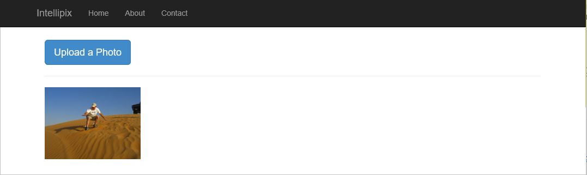

1. Upload a few more images from your **photos** folder. Confirm that they appear on the page, too:

    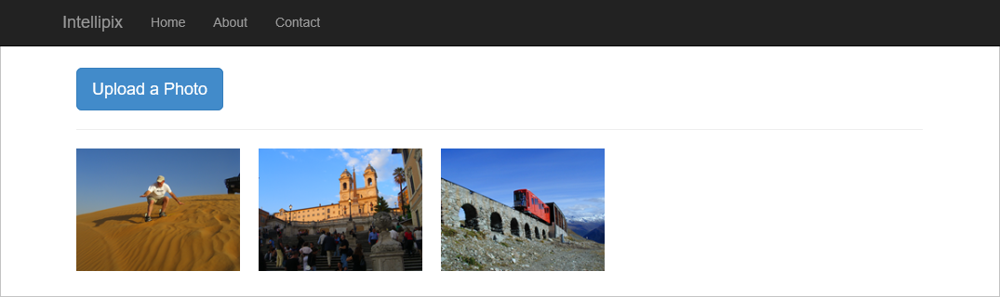

1. Right-click in your browser and select **View page source** to view the source code for the page. Find the `````` elements representing the image thumbnails. Observe that the URLs assigned to the images refer directly to blobs in blob storage. This is because you set the containers' **Public access level** to **Blob**, which makes the blobs inside publicly accessible.

1. Return to Azure Storage Explorer (or restart it if you didn't leave it running) and select the `"photos"` container under your storage account. The number of blobs in the container should equal the number of photos you uploaded. Double-click one of the blobs to download it and see the image stored in the blob.

    

1. Open the `"thumbnails"` container in Storage Explorer. Open one of the blobs to view the thumbnail images generated from the image uploads.

The app doesn't yet offer a way to view the original images that you uploaded. Ideally, selecting an image thumbnail should display the original image. You'll add that feature next.

<a name="Exercise4"></a>
## Add a lightbox for viewing photos

In this section, you'll use a free, open-source JavaScript library to add a lightbox viewer that enables users to see the original images they've uploaded (rather than just the image thumbnails). The files are provided for you. All you have to do is integrate them into the project and make a minor modification to *Index.cshtml*.

1. Download the _lightbox.css_ and _lightbox.js_ files from the [GitHub code repository](https://github.com/Azure-Samples/cognitive-services-quickstart-code/tree/master/dotnet/ComputerVision/storage-lab-tutorial).
1. In Solution Explorer, right-click your project's **Scripts** folder and use the **Add -> New Item...** command to create a *lightbox.js* file. Paste in the contents from the example file in the [GitHub code repository](https://github.com/Azure-Samples/cognitive-services-quickstart-code/blob/master/dotnet/ComputerVision/storage-lab-tutorial/scripts/lightbox.js).

1. Right-click the project's "Content" folder and use the **Add -> New Item...** command create a *lightbox.css* file. Paste in the contents from the example file in the [GitHub code repository](https://github.com/Azure-Samples/cognitive-services-quickstart-code/blob/master/dotnet/ComputerVision/storage-lab-tutorial/css/lightbox.css).
1. Download and unzip the _buttons.zip_ file from the GitHub data files repository: https://github.com/Azure-Samples/cognitive-services-sample-data-files/tree/master/ComputerVision/storage-lab-tutorial. You should have four button images.

1. Right-click the Intellipix project in Solution Explorer and use the **Add -> New Folder** command to add a folder named "Images" to the project.

1. Right-click the **Images** folder and use the **Add -> Existing Item...** command to import the four images you downloaded.

1. Open *BundleConfig.cs* in the project's "App_Start" folder. Add the following statement to the ```RegisterBundles``` method in **BundleConfig.cs**:

    ```C#
    bundles.Add(new ScriptBundle("~/bundles/lightbox").Include(
              "~/Scripts/lightbox.js"));
    ```

1. In the same method, find the statement that creates a ```StyleBundle``` from "~/Content/css" and add *lightbox.css* to the list of style sheets in the bundle. Here is the modified statement:

    ```C#
    bundles.Add(new StyleBundle("~/Content/css").Include(
              "~/Content/bootstrap.css",
              "~/Content/site.css",
              "~/Content/lightbox.css"));
    ```

1. Open *_Layout.cshtml* in the project's **Views/Shared** folder and add the following statement just before the ```@RenderSection``` statement near the bottom:

    ```C#
    @Scripts.Render("~/bundles/lightbox")
    ```

1. The final task is to incorporate the lightbox viewer into the home page. To do that, open *Index.cshtml* (it's in the project's **Views/Home** folder) and replace the ```@foreach``` loop with this one:

    ```HTML
    @foreach (BlobInfo blob in ViewBag.Blobs)
    {
        <a href="@blob.ImageUri" rel="lightbox" title="@blob.Caption">
            
        </a>
    }
    ```

1. Save your changes and press **Ctrl+F5** to launch the application in your browser. Then select one of the images you uploaded earlier. Confirm that a lightbox appears and shows an enlarged view of the image.

    

1. Select the **X** in the lower-right corner of the lightbox to dismiss it.

Now you have a way to view the images you uploaded. The next step is to do more with those images.

<a name="Exercise5"></a>
## Use Azure AI Vision to generate metadata

### Create a Vision resource

You'll need to create a Vision resource for your Azure account; this resource manages your access to Azure's Azure AI Vision service. 

1. Follow the instructions in [Create an Azure AI services resource](../../multi-service-resource.md?pivots=azportal) to create a multi-service resource or a Vision resource.

1. Then go to the menu for your resource group and select the Vision resource that you created. Copy the URL under **Endpoint** to somewhere you can easily retrieve it in a moment. Then select **Show access keys**.

    
    
    [!INCLUDE [Custom subdomains notice](../../../../includes/cognitive-services-custom-subdomains-note.md)]


1. In the next window, copy the value of **KEY 1** to the clipboard.

    

### Add Azure AI Vision credentials

Next, you'll add the required credentials to your app so that it can access Vision resources.

Navigate to the *Web.config* file at the root of the project. Add the following statements to the `<appSettings>` section of the file, replacing `VISION_KEY` with the key you copied in the previous step, and `VISION_ENDPOINT` with the URL you saved in the step before.

```xml
<add key="SubscriptionKey" value="VISION_KEY" />
<add key="VisionEndpoint" value="VISION_ENDPOINT" />
```

In the Solution Explorer. right-click on the project solution and select **Manage NuGet Packages**. In the package manager that opens select **Browse**, check **Include prerelease**, and search for **Azure.AI.Vision.ImageAnalysis**. Select **Install**.

### Add metadata generation code

Next, you'll add the code that actually uses the Azure AI Vision service to create metadata for images.

1. Open the *HomeController.cs* file in the project's **Controllers** folder and add the following `using` statements at the top of the file:

    ```csharp
    using Azure.AI.Vision.Common;
    using Azure.AI.Vision.ImageAnalysis;
    ```

1. Then, go to the **Upload** method; this method converts and uploads images to blob storage. Add the following code immediately after the block that begins with `// Generate a thumbnail` (or at the end of your image-blob-creation process). This code takes the blob containing the image (`photo`), and uses Azure AI Vision to generate a description for that image. The Azure AI Vision API also generates a list of keywords that apply to the image. The generated description and keywords are stored in the blob's metadata so that they can be retrieved later on.

    ```csharp
    // Submit the image to the Azure AI Vision API
    var serviceOptions = new VisionServiceOptions(
        Environment.GetEnvironmentVariable(ConfigurationManager.AppSettings["VisionEndpoint"]),
            new AzureKeyCredential(ConfigurationManager.AppSettings["SubscriptionKey"]));

    var analysisOptions = new ImageAnalysisOptions()
        {
            Features = ImageAnalysisFeature.Caption | ImageAnalysisFeature.Tags,
            Language = "en",
            GenderNeutralCaption = true
        };

    using var imageSource = VisionSource.FromUrl(
        new Uri(photo.Uri.ToString()));

    using var analyzer = new ImageAnalyzer(serviceOptions, imageSource, analysisOptions);
    var result = analyzer.Analyze();

    // Record the image description and tags in blob metadata
    photo.Metadata.Add("Caption", result.Caption.ContentCaption.Content);

    for (int i = 0; i < result.Tags.ContentTags.Count; i++)
    {
        string key = String.Format("Tag{0}", i);
        photo.Metadata.Add(key, result.Tags.ContentTags[i]);
    }

    await photo.SetMetadataAsync();
    ```

1. Next, go to the **Index** method in the same file. This method enumerates the stored image blobs in the targeted blob container (as **IListBlobItem** instances) and passes them to the application view. Replace the `foreach` block in this method with the following code. This code calls **CloudBlockBlob.FetchAttributes** to get each blob's attached metadata. It extracts the computer-generated description (`caption`) from the metadata and adds it to the **BlobInfo** object, which gets passed to the view.
    
    ```csharp
    foreach (IListBlobItem item in container.ListBlobs())
    {
        var blob = item as CloudBlockBlob;
    
        if (blob != null)
        {
            blob.FetchAttributes(); // Get blob metadata
            var caption = blob.Metadata.ContainsKey("Caption") ? blob.Metadata["Caption"] : blob.Name;
    
            blobs.Add(new BlobInfo()
            {
                ImageUri = blob.Uri.ToString(),
                ThumbnailUri = blob.Uri.ToString().Replace("/photos/", "/thumbnails/"),
                Caption = caption
            });
        }
    }
    ```

### Test the app

Save your changes in Visual Studio and press **Ctrl+F5** to launch the application in your browser. Use the app to upload a few more images, either from the photo set you downloaded or from your own folder. When you hover the cursor over one of the new images in the view, a tooltip window should appear and display the computer-generated caption for the image.


To view all of the attached metadata, use Azure Storage Explorer to view the storage container you're using for images. Right-click any of the blobs in the container and select **Properties**. In the dialog, you'll see a list of key-value pairs. The computer-generated image description is stored in the item `Caption`, and the search keywords are stored in `Tag0`, `Tag1`, and so on. When you're finished, select **Cancel** to close the dialog.

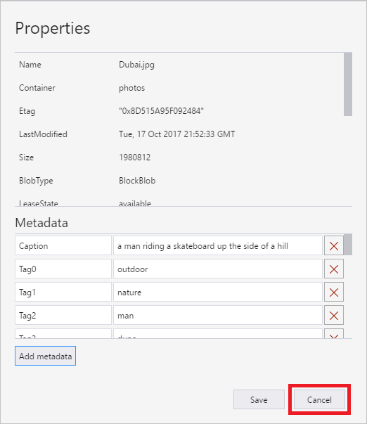

<a name="Exercise6"></a>
## Add search to the app

In this section, you will add a search box to the home page, enabling users to do keyword searches on the images that they've uploaded. The keywords are the ones generated by the Azure AI Vision API and stored in blob metadata.

1. Open *Index.cshtml* in the project's **Views/Home** folder and add the following statements to the empty ```<div>``` element with the ```class="col-sm-4 pull-right"``` attribute:

    ```HTML
    @using (Html.BeginForm("Search", "Home", FormMethod.Post, new { enctype = "multipart/form-data", @class = "navbar-form" }))
    {
        <div class="input-group">
            <input type="text" class="form-control" placeholder="Search photos" name="term" value="@ViewBag.Search" style="max-width: 800px">
            <span class="input-group-btn">
                <button class="btn btn-primary" type="submit">
                    <i class="glyphicon glyphicon-search"></i>
                </button>
            </span>
        </div>
    }
    ```

    This code and markup adds a search box and a **Search** button to the home page.

1. Open *HomeController.cs* in the project's **Controllers** folder and add the following method to the **HomeController** class:

    ```C#
    [HttpPost]
    public ActionResult Search(string term)
    {
        return RedirectToAction("Index", new { id = term });
    }
    ```

    This is the method that's called when the user selects the **Search** button added in the previous step. It refreshes the page and includes a search parameter in the URL.

1. Replace the **Index** method with the following implementation:

    ```C#
    public ActionResult Index(string id)
    {
        // Pass a list of blob URIs and captions in ViewBag
        CloudStorageAccount account = CloudStorageAccount.Parse(ConfigurationManager.AppSettings["StorageConnectionString"]);
        CloudBlobClient client = account.CreateCloudBlobClient();
        CloudBlobContainer container = client.GetContainerReference("photos");
        List<BlobInfo> blobs = new List<BlobInfo>();

        foreach (IListBlobItem item in container.ListBlobs())
        {
            var blob = item as CloudBlockBlob;

            if (blob != null)
            {
                blob.FetchAttributes(); // Get blob metadata

                if (String.IsNullOrEmpty(id) || HasMatchingMetadata(blob, id))
                {
                    var caption = blob.Metadata.ContainsKey("Caption") ? blob.Metadata["Caption"] : blob.Name;

                    blobs.Add(new BlobInfo()
                    {
                        ImageUri = blob.Uri.ToString(),
                        ThumbnailUri = blob.Uri.ToString().Replace("/photos/", "/thumbnails/"),
                        Caption = caption
                    });
                }
            }
        }

        ViewBag.Blobs = blobs.ToArray();
        ViewBag.Search = id; // Prevent search box from losing its content
        return View();
    }
    ```

    Observe that the **Index** method now accepts a parameter _id_ that contains the value the user typed into the search box. An empty or missing _id_ parameter indicates that all the photos should be displayed.

1. Add the following helper method to the **HomeController** class:

    ```C#
    private bool HasMatchingMetadata(CloudBlockBlob blob, string term)
    {
        foreach (var item in blob.Metadata)
        {
            if (item.Key.StartsWith("Tag") && item.Value.Equals(term, StringComparison.InvariantCultureIgnoreCase))
                return true;
        }

        return false;
    }
    ```

    This method is called by the **Index** method to determine whether the metadata keywords attached to a given image blob contain the search term that the user entered.

1. Launch the application again and upload several photos. Feel free to use your own photos, not just the ones provided with the tutorial.

1. Type a keyword such as "river" into the search box. Then select the **Search** button.

    

1. Search results will vary depending on what you typed and what images you uploaded. But the result should be a filtered list of images whose metadata keywords include all or part of the keyword that you typed.

    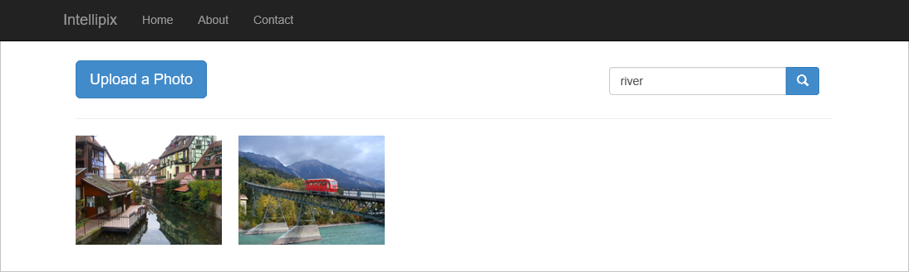

1. Select the browser's back button to display all of the images again.

You're almost finished. It's time to deploy the app to the cloud.

<a name="Exercise7"></a>
## Deploy the app to Azure

In this section, you'll deploy the app to Azure from Visual Studio. You will allow Visual Studio to create an Azure Web App for you, preventing you from having to go into the Azure portal and create it separately.

1. Right-click the project in Solution Explorer and select **Publish...** from the context menu. Make sure **Microsoft Azure App Service** and **Create New** are selected, and then select the **Publish** button.

    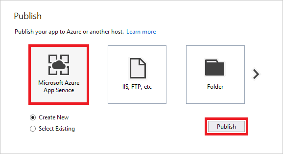

1. In the next dialog, select the "IntellipixResources" resource group under **Resource Group**. Select the **New...** button next to "App Service Plan" and create a new App Service Plan in the same location you selected for the storage account in [Create a storage account](#Exercise1), accepting the defaults everywhere else. Finish by selecting the **Create** button.

    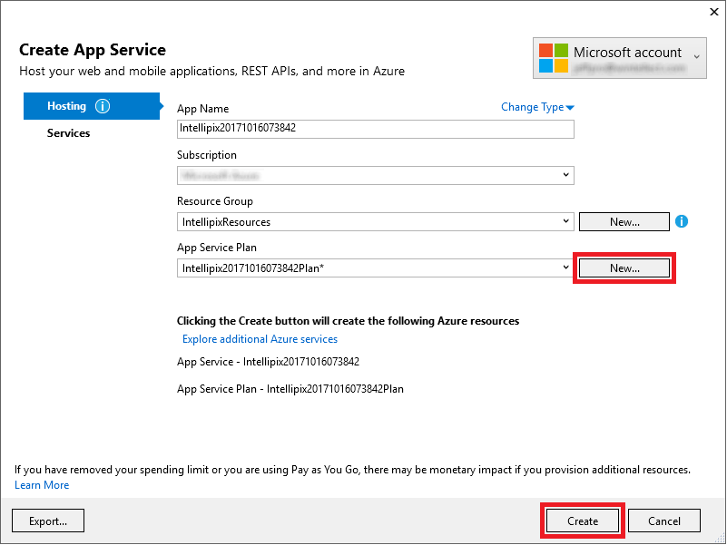

1. After a few moments, the app will appear in a browser window. Note the URL in the address bar. The app is no longer running locally; it's on the Web, where it's publicly reachable.

    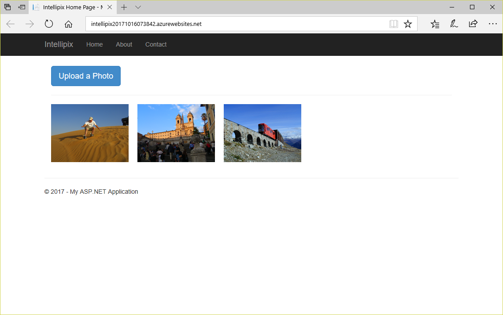

If you make changes to the app and want to push the changes out to the Web, go through the publish process again. You can still test your changes locally before publishing to the Web.

## Clean up resources

If you'd like to keep working on your web app, see the [Next steps](#next-steps) section. If you don't plan to continue using this application, you should delete all app-specific resources. To do delete resources, you can delete the resource group that contains your Azure Storage subscription and Vision resource. This will remove the storage account, the blobs uploaded to it, and the App Service resource needed to connect with the ASP.NET web app.

To delete the resource group, open the **Resource groups** tab in the portal, navigate to the resource group you used for this project, and select **Delete resource group** at the top of the view. You'll be asked to type the resource group's name to confirm you want to delete it. Once deleted, a resource group can't be recovered.

## Next steps

There's much more that you could do to use Azure and develop your Intellipix app even further. For example, you could add support for authenticating users and deleting photos, and rather than force the user to wait for Azure AI services to process a photo following an upload, you could use [Azure Functions](https://azure.microsoft.com/services/functions/?WT.mc_id=academiccontent-github-cxa) to call the Azure AI Vision API asynchronously each time an image is added to blob storage. You could also do any number of other Image Analysis operations on the image, outlined in the overview.

> [!div class="nextstepaction"]
> [Image Analysis overview](../overview-image-analysis.md)
