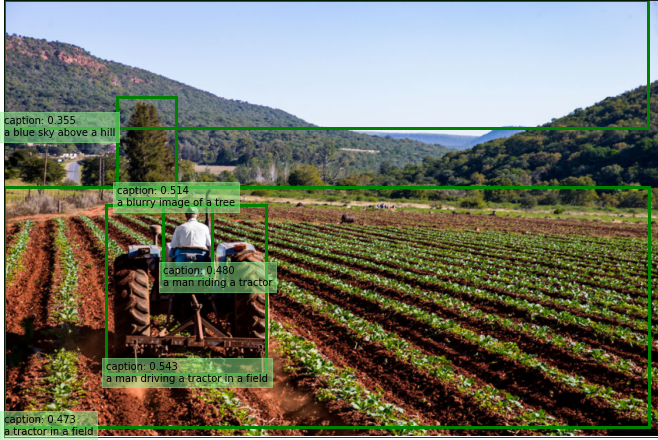

# Image captions (version 4.0 preview)
Image captions in Image Analysis 4.0 (preview) are available through the **Caption** and **Dense Captions** features. 

Caption generates a one sentence description for all image contents. Dense Captions provides more detail by generating one sentence descriptions of up to 10 regions of the image in addition to describing the whole image. Dense Captions also returns bounding box coordinates of the described image regions. Both these features use the latest groundbreaking Florence based AI models. 

At this time, image captioning is available in English language only.

### Gender-neutral captions
All captions contain gender terms: "man", "woman", "boy" and "girl" by default. You have the option to replace these terms with "person" in your results and receive gender-neutral captions. You can do so by setting the optional API request parameter, **gender-neutral-caption** to `true` in the request URL.

> [!IMPORTANT]
> Image captioning in Image Analysis 4.0 is only available in the following Azure data center regions at this time: East US, France Central, Korea Central, North Europe, Southeast Asia, West Europe, West US, East Asia. You must use a Vision resource located in one of these regions to get results from Caption and Dense Captions features.
>
> If you have to use a Vision resource outside these regions to generate image captions, please use [Image Analysis 3.2](concept-describing-images.md) which is available in all Azure AI Vision regions.  

Try out the image captioning features quickly and easily in your browser using Vision Studio.

> [!div class="nextstepaction"]
> [Try Vision Studio](https://portal.vision.cognitive.azure.com/)

## Caption and Dense Captions examples

#### [Caption](#tab/image)

The following JSON response illustrates what the Analysis 4.0 API returns when describing the example image based on its visual features.


```json
"captions": [
    {
        "text": "a man pointing at a screen",
        "confidence": 0.4891590476036072
    }
]
```

#### [Dense Captions](#tab/dense)

The following JSON response illustrates what the Analysis 4.0 API returns when generating dense captions for the example image.



```json
{
  "denseCaptionsResult": {
    "values": [
      {
        "text": "a man driving a tractor in a farm",
        "confidence": 0.535620927810669,
        "boundingBox": {
          "x": 0,
          "y": 0,
          "w": 850,
          "h": 567
        }
      },
      {
        "text": "a man driving a tractor in a field",
        "confidence": 0.5428450107574463,
        "boundingBox": {
          "x": 132,
          "y": 266,
          "w": 209,
          "h": 219
        }
      },
      {
        "text": "a blurry image of a tree",
        "confidence": 0.5139822363853455,
        "boundingBox": {
          "x": 147,
          "y": 126,
          "w": 76,
          "h": 131
        }
      },
      {
        "text": "a man riding a tractor",
        "confidence": 0.4799223840236664,
        "boundingBox": {
          "x": 206,
          "y": 264,
          "w": 64,
          "h": 97
        }
      },
      {
        "text": "a blue sky above a hill",
        "confidence": 0.35495415329933167,
        "boundingBox": {
          "x": 0,
          "y": 0,
          "w": 837,
          "h": 166
        }
      },
      {
        "text": "a tractor in a field",
        "confidence": 0.47338250279426575,
        "boundingBox": {
          "x": 0,
          "y": 243,
          "w": 838,
          "h": 311
        }
      }
    ]
  },
  "modelVersion": "2023-02-01-preview",
  "metadata": {
    "width": 850,
    "height": 567
  }
}
```

---

## Use the API

#### [Image captions](#tab/image)

The image captioning feature is part of the [Analyze Image](https://aka.ms/vision-4-0-ref) API. Include `Caption` in the **features** query parameter. Then, when you get the full JSON response, parse the string for the contents of the `"captionResult"` section.

#### [Dense captions](#tab/dense)

The dense captioning feature is part of the [Analyze Image](https://aka.ms/vision-4-0-ref) API. You can call this API using REST. Include `denseCaptions` in the **features** query parameter. Then, when you get the full JSON response, parse the string for the contents of the `"denseCaptionsResult"` section.

---

## Next steps

* Learn the related concept of [object detection](concept-object-detection-40.md).
* [Quickstart: Image Analysis REST API or client libraries](./quickstarts-sdk/image-analysis-client-library-40.md?pivots=programming-language-csharp)
* [Call the Analyze Image API](./how-to/call-analyze-image-40.md)
