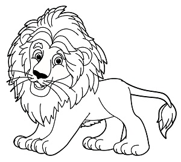

# Image type detection

With the [Analyze Image](https://westcentralus.dev.cognitive.microsoft.com/docs/services/computer-vision-v3-2/operations/56f91f2e778daf14a499f21b) API, Azure AI Vision can analyze the content type of images, indicating whether an image is clip art or a line drawing.

## Detecting clip art

Azure AI Vision analyzes an image and rates the likelihood of the image being clip art on a scale of 0 to 3, as described in the following table.

| Value | Meaning |
|-------|---------|
| 0 | Non-clip-art |
| 1 | Ambiguous |
| 2 | Normal-clip-art |
| 3 | Good-clip-art |

### Clip art detection examples

The following JSON responses illustrates what Azure AI Vision returns when rating the likelihood of the example images being clip art.


```json
{
    "imageType": {
        "clipArtType": 3,
        "lineDrawingType": 0
    },
    "requestId": "88c48d8c-80f3-449f-878f-6947f3b35a27",
    "metadata": {
        "height": 225,
        "width": 300,
        "format": "Jpeg"
    }
}
```


```json
{
    "imageType": {
        "clipArtType": 0,
        "lineDrawingType": 0
    },
    "requestId": "a9c8490a-2740-4e04-923b-e8f4830d0e47",
    "metadata": {
        "height": 200,
        "width": 300,
        "format": "Jpeg"
    }
}
```

## Detecting line drawings

Azure AI Vision analyzes an image and returns a boolean value indicating whether the image is a line drawing.

### Line drawing detection examples

The following JSON responses illustrates what Azure AI Vision returns when indicating whether the example images are line drawings.



```json
{
    "imageType": {
        "clipArtType": 2,
        "lineDrawingType": 1
    },
    "requestId": "6442dc22-476a-41c4-aa3d-9ceb15172f01",
    "metadata": {
        "height": 268,
        "width": 300,
        "format": "Jpeg"
    }
}
```


```json
{
    "imageType": {
        "clipArtType": 0,
        "lineDrawingType": 0
    },
    "requestId": "98437d65-1b05-4ab7-b439-7098b5dfdcbf",
    "metadata": {
        "height": 200,
        "width": 300,
        "format": "Jpeg"
    }
}
```

## Use the API

The image type detection feature is part of the [Analyze Image](https://westcentralus.dev.cognitive.microsoft.com/docs/services/computer-vision-v3-2/operations/56f91f2e778daf14a499f21b) API. You can call this API through a native SDK or through REST calls. Include `ImageType` in the **visualFeatures** query parameter. Then, when you get the full JSON response, simply parse the string for the contents of the `"imageType"` section.

* [Quickstart: Vision REST API or client libraries](./quickstarts-sdk/image-analysis-client-library.md?pivots=programming-language-csharp)
