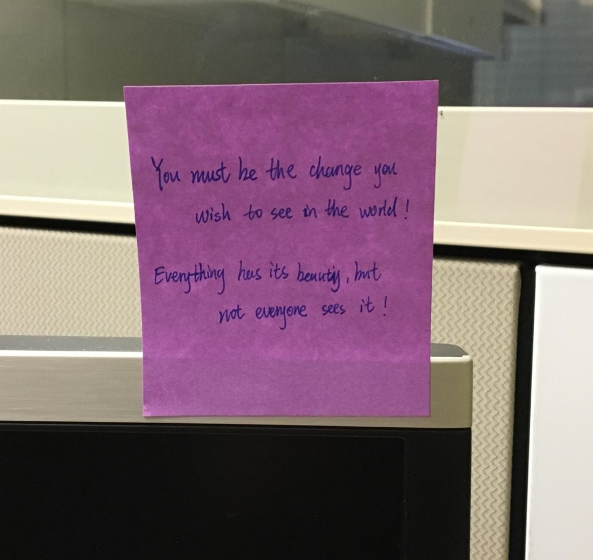

# OCR for images (version 4.0)

> [!NOTE]
>
> For extracting text from PDF, Office, and HTML documents and document images, use the [Document Intelligence Read OCR model](../../ai-services/document-intelligence/concept-read.md) optimized for text-heavy digital and scanned documents with an asynchronous API that makes it easy to power your intelligent document processing scenarios.

OCR traditionally started as a machine-learning-based technique for extracting text from in-the-wild and non-document images like product labels, user-generated images, screenshots, street signs, and posters. For several scenarios, such as single images that aren't text-heavy, you need a fast, synchronous API or service. This allows OCR to be embedded in near real-time user experiences to enrich content understanding and follow-up user actions with fast turn-around times.

## What is Computer Vision v4.0 Read OCR?

The new Computer Vision Image Analysis 4.0 REST API offers the ability to extract printed or handwritten text from images in a unified performance-enhanced synchronous API that makes it easy to get all image insights including OCR results in a single API operation. The Read OCR engine is built on top of multiple deep learning models supported by universal script-based models for [global language support](./language-support.md).

> [!TIP]
> You can use the OCR feature through the [Azure OpenAI](/azure/ai-services/openai/overview) service. The **GPT-4 Turbo with Vision** model lets you chat with an AI assistant that can analyze the images you share, and the Vision Enhancement option uses Image Analysis to give the AI assistance more details (readable text and object locations) about the image. For more information, see the [GPT-4 Turbo with Vision quickstart](/azure/ai-services/openai/gpt-v-quickstart).

## Text extraction example

The following JSON response illustrates what the Image Analysis 4.0 API returns when extracting text from the given image.



```json
{
    "modelVersion": "2023-10-01",
    "metadata":
    {
        "width": 1000,
        "height": 945
    },
    "readResult":
    {
        "blocks":
        [
            {
                "lines":
                [
                    {
                        "text": "You must be the change you",
                        "boundingPolygon":
                        [
                            {"x":251,"y":265},
                            {"x":673,"y":260},
                            {"x":674,"y":308},
                            {"x":252,"y":318}
                        ],
                        "words":
                        [
                            {"text":"You","boundingPolygon":[{"x":252,"y":267},{"x":307,"y":265},{"x":307,"y":318},{"x":253,"y":318}],"confidence":0.996},
                            {"text":"must","boundingPolygon":[{"x":318,"y":264},{"x":386,"y":263},{"x":387,"y":316},{"x":319,"y":318}],"confidence":0.99},
                            {"text":"be","boundingPolygon":[{"x":396,"y":262},{"x":432,"y":262},{"x":432,"y":315},{"x":396,"y":316}],"confidence":0.891},
                            {"text":"the","boundingPolygon":[{"x":441,"y":262},{"x":503,"y":261},{"x":503,"y":312},{"x":442,"y":314}],"confidence":0.994},
                            {"text":"change","boundingPolygon":[{"x":513,"y":261},{"x":613,"y":262},{"x":613,"y":306},{"x":513,"y":311}],"confidence":0.99},
                            {"text":"you","boundingPolygon":[{"x":623,"y":262},{"x":673,"y":263},{"x":673,"y":302},{"x":622,"y":305}],"confidence":0.994}
                        ]
                    },
                    {
                        "text": "wish to see in the world !",
                        "boundingPolygon":
                        [
                            {"x":325,"y":338},
                            {"x":695,"y":328},
                            {"x":696,"y":370},
                            {"x":325,"y":381}
                        ],
                        "words":
                        [
                            {"text":"wish","boundingPolygon":[{"x":325,"y":339},{"x":390,"y":337},{"x":391,"y":380},{"x":326,"y":381}],"confidence":0.992},
                            {"text":"to","boundingPolygon":[{"x":406,"y":337},{"x":443,"y":335},{"x":443,"y":379},{"x":407,"y":380}],"confidence":0.995},
                            {"text":"see","boundingPolygon":[{"x":451,"y":335},{"x":494,"y":334},{"x":494,"y":377},{"x":452,"y":379}],"confidence":0.996},
                            {"text":"in","boundingPolygon":[{"x":502,"y":333},{"x":533,"y":332},{"x":534,"y":376},{"x":503,"y":377}],"confidence":0.996},
                            {"text":"the","boundingPolygon":[{"x":542,"y":332},{"x":590,"y":331},{"x":590,"y":375},{"x":542,"y":376}],"confidence":0.995},
                            {"text":"world","boundingPolygon":[{"x":599,"y":331},{"x":664,"y":329},{"x":664,"y":372},{"x":599,"y":374}],"confidence":0.995},
                            {"text":"!","boundingPolygon":[{"x":672,"y":329},{"x":694,"y":328},{"x":694,"y":371},{"x":672,"y":372}],"confidence":0.957}
                        ]
                    },
                    {
                        "text": "Everything has its beauty , but",
                        "boundingPolygon":
                        [
                            {"x":254,"y":439},
                            {"x":644,"y":433},
                            {"x":645,"y":484},
                            {"x":255,"y":488}
                        ],
                        "words":
                        [
                            {"text":"Everything","boundingPolygon":[{"x":254,"y":442},{"x":379,"y":440},{"x":380,"y":486},{"x":257,"y":488}],"confidence":0.97},
                            {"text":"has","boundingPolygon":[{"x":388,"y":440},{"x":435,"y":438},{"x":436,"y":485},{"x":389,"y":486}],"confidence":0.965},
                            {"text":"its","boundingPolygon":[{"x":445,"y":438},{"x":485,"y":437},{"x":486,"y":485},{"x":446,"y":485}],"confidence":0.99},
                            {"text":"beauty","boundingPolygon":[{"x":495,"y":437},{"x":567,"y":435},{"x":568,"y":485},{"x":496,"y":485}],"confidence":0.685},
                            {"text":",","boundingPolygon":[{"x":577,"y":435},{"x":583,"y":435},{"x":583,"y":485},{"x":577,"y":485}],"confidence":0.939},
                            {"text":"but","boundingPolygon":[{"x":589,"y":435},{"x":644,"y":434},{"x":644,"y":485},{"x":589,"y":485}],"confidence":0.628}
                        ]
                    },
                    {
                        "text": "not everyone sees it !",
                        "boundingPolygon":
                        [
                            {"x":363,"y":508},
                            {"x":658,"y":493},
                            {"x":659,"y":539},
                            {"x":364,"y":552}
                        ],
                        "words":
                        [
                            {"text":"not","boundingPolygon":[{"x":363,"y":510},{"x":412,"y":508},{"x":413,"y":548},{"x":365,"y":552}],"confidence":0.989},
                            {"text":"everyone","boundingPolygon":[{"x":420,"y":507},{"x":521,"y":501},{"x":522,"y":542},{"x":421,"y":548}],"confidence":0.924},
                            {"text":"sees","boundingPolygon":[{"x":536,"y":501},{"x":588,"y":498},{"x":589,"y":540},{"x":537,"y":542}],"confidence":0.987},
                            {"text":"it","boundingPolygon":[{"x":597,"y":497},{"x":627,"y":495},{"x":628,"y":540},{"x":598,"y":540}],"confidence":0.995},
                            {"text":"!","boundingPolygon":[{"x":635,"y":495},{"x":656,"y":494},{"x":657,"y":540},{"x":636,"y":540}],"confidence":0.952}
                        ]
                    }
                ]
            }
        ]
    }
}
```

## Use the API

The text extraction feature is part of the [Analyze Image API](https://aka.ms/vision-4-0-ref). Include `Read` in the **features** query parameter. Then, when you get the full JSON response, parse the string for the contents of the `"readResult"` section.


## Next steps

Follow the [Image Analysis quickstart](./quickstarts-sdk/image-analysis-client-library-40.md) to extract text from an image using the Image Analysis 4.0 API.
