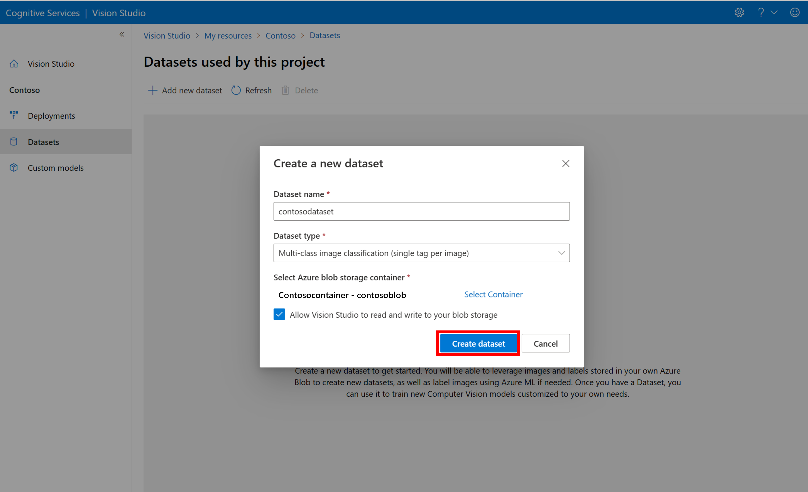
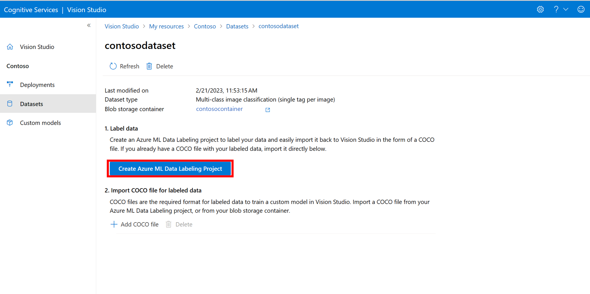
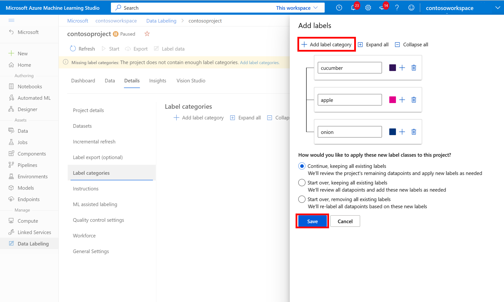
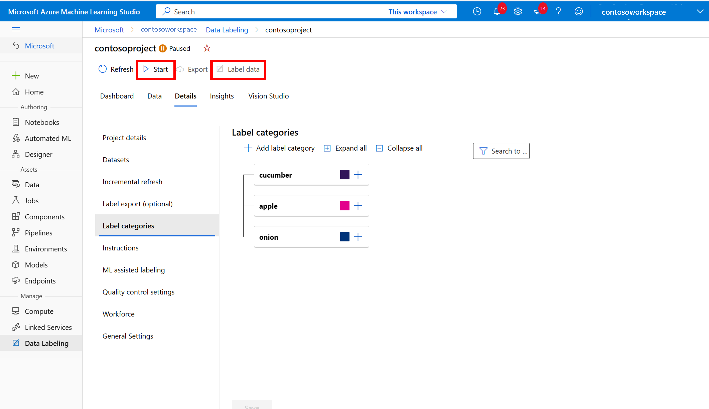
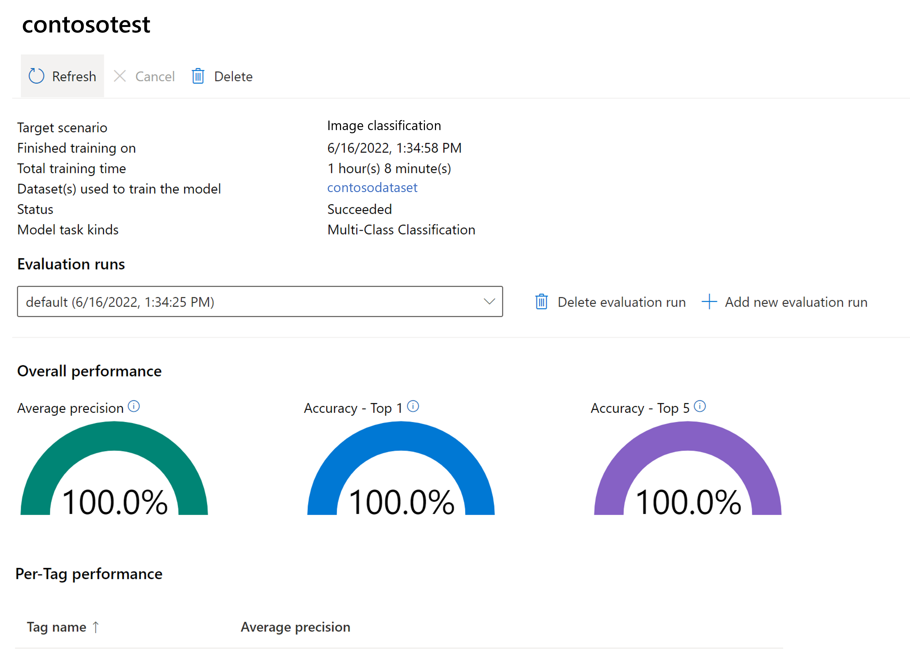
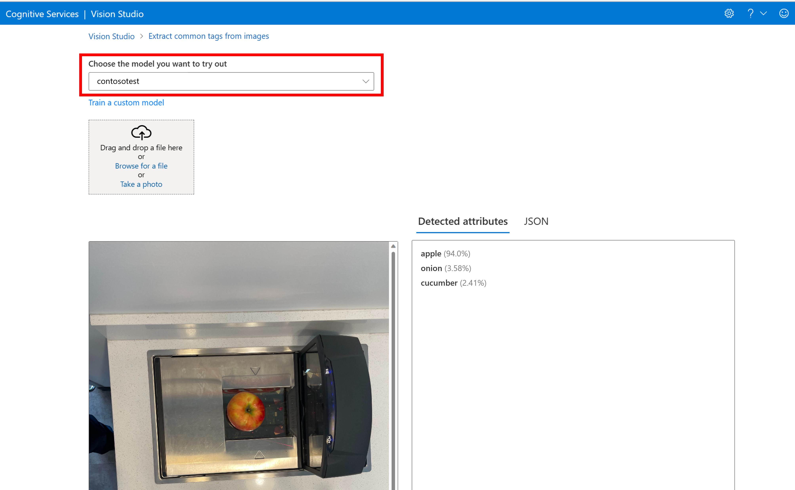

# Create a custom Image Analysis model (preview)

Image Analysis 4.0 allows you to train a custom model using your own training images. By manually labeling your images, you can train a model to apply custom tags to the images (image classification) or detect custom objects (object detection). Image Analysis 4.0 models are especially effective at few-shot learning, so you can get accurate models with less training data.

This guide shows you how to create and train a custom image classification model. The few differences between training an image classification model and object detection model are noted.

## Prerequisites

* Azure subscription - [Create one for free](https://azure.microsoft.com/free/cognitive-services)
* Once you have your Azure subscription, <a href="https://portal.azure.com/#create/Microsoft.CognitiveServicesComputerVision"  title="Create a Vision resource"  target="_blank">create a Vision resource </a> in the Azure portal to get your key and endpoint. If you're following this guide using Vision Studio, you must create your resource in the East US region. After it deploys, select **Go to resource**. Copy the key and endpoint to a temporary location to use later on.
* An Azure Storage resource - [Create one](/azure/storage/common/storage-account-create?tabs=azure-portal)
* A set of images with which to train your classification model. You can use the set of [sample images on GitHub](https://github.com/Azure-Samples/cognitive-services-sample-data-files/tree/master/CustomVision/ImageClassification/Images). Or, you can use your own images. You only need about 3-5 images per class.

> [!NOTE]
> We do not recommend you use custom models for business critical environments due to potential high latency. When customers train custom models in Vision Studio, those custom models belong to the Vision resource that they were trained under and the customer is able to make calls to those models using the **Analyze Image** API. When they make these calls, the custom model is loaded in memory and the prediction infrastructure is initialized. While this happens, customers might experience longer than expected latency to receive prediction results.

<!-- 
#### [Python](#tab/python)

Train your own image classifier (IC) or object detector (OD) with your own data using Image Analysis model customization and Python.

You can run through all of the model customization steps using a Python sample package. You can run the code in this section using a Python script, or you can download and run the Notebook on a compatible platform.

> [!TIP]
> Contents of _cognitive_service_vision_model_customization.ipynb_. **[Open in GitHub](https://github.com/Azure-Samples/cognitive-service-vision-model-customization-python-samples/blob/main/docs/cognitive_service_vision_model_customization.ipynb)**.

## Install the python samples package

Install the [sample code](https://pypi.org/project/cognitive-service-vision-model-customization-python-samples/) to train/predict custom models with Python:

```bash
pip install cognitive-service-vision-model-customization-python-samples
```

## Authentication

Enter your Azure AI Vision endpoint URL, key, and the name of the resource, into the code below.

```python
# Resource and key
import logging
logging.getLogger().setLevel(logging.INFO)
from cognitive_service_vision_model_customization_python_samples import ResourceType

resource_type = ResourceType.SINGLE_SERVICE_RESOURCE # or ResourceType.MULTI_SERVICE_RESOURCE

resource_name = None
multi_service_endpoint = None

if resource_type == ResourceType.SINGLE_SERVICE_RESOURCE:
    resource_name = '{specify_your_resource_name}'
    assert resource_name
else:
    multi_service_endpoint = '{specify_your_service_endpoint}'
    assert multi_service_endpoint

resource_key = '{specify_your_resource_key}'
```

## Prepare a dataset from Azure blob storage

To train a model with your own dataset, the dataset should be arranged in the COCO format described below, hosted on Azure blob storage, and accessible from your Vision resource.

### Dataset annotation format

Image Analysis uses the COCO file format for indexing/organizing the training images and their annotations. Below are examples and explanations of what specific format is needed for classification and object detection.

Image Analysis model customization for classification is different from other kinds of vision training, as we utilize your class names, as well as image data, in training. So, be sure provide meaningful category names in the annotations.

> [!NOTE]
> In the example dataset, there are few images for the sake of simplicity. Although [Florence models](https://www.microsoft.com/research/publication/florence-a-new-foundation-model-for-computer-vision/) achieve great few-shot performance (high model quality even with little data available), it's good to have more data for the model to learn. Our recommendation is to have at least five images per class, and the more the better.

Once your COCO annotation file is prepared, you can use the [COCO file verification script](coco-verification.md) to check the format.

#### Multiclass classification example

```json
{
  "images": [{"id": 1, "width": 224.0, "height": 224.0, "file_name": "images/siberian-kitten.jpg", "absolute_url": "https://{your_blob}.blob.core.windows.net/datasets/cat_dog/images/siberian-kitten.jpg"},
              {"id": 2, "width": 224.0, "height": 224.0, "file_name": "images/kitten-3.jpg", "absolute_url": "https://{your_blob}.blob.core.windows.net/datasets/cat_dog/images/kitten-3.jpg"}],
  "annotations": [
      {"id": 1, "category_id": 1, "image_id": 1},
      {"id": 2, "category_id": 1, "image_id": 2},
  ],
  "categories": [{"id": 1, "name": "cat"}, {"id": 2, "name": "dog"}]
}
```

Besides `absolute_url`, you can also use `coco_url` (the system accepts either field name).

#### Object detection example

```json
{
  "images": [{"id": 1, "width": 224.0, "height": 224.0, "file_name": "images/siberian-kitten.jpg", "absolute_url": "https://{your_blob}.blob.core.windows.net/datasets/cat_dog/images/siberian-kitten.jpg"},
              {"id": 2, "width": 224.0, "height": 224.0, "file_name": "images/kitten-3.jpg", "absolute_url": "https://{your_blob}.blob.core.windows.net/datasets/cat_dog/images/kitten-3.jpg"}],
  "annotations": [
      {"id": 1, "category_id": 1, "image_id": 1, "bbox": [0.1, 0.1, 0.3, 0.3]},
      {"id": 2, "category_id": 1, "image_id": 2, "bbox": [0.3, 0.3, 0.6, 0.6]},
      {"id": 3, "category_id": 2, "image_id": 2, "bbox": [0.2, 0.2, 0.7, 0.7]}
  ],
  "categories": [{"id": 1, "name": "cat"}, {"id": 2, "name": "dog"}]
}
```

The values in `bbox: [left, top, width, height]` are relative to the image width and height.

### Blob storage directory structure

Following the examples above, the data directory in your Azure Blob Container `https://{your_blob}.blob.core.windows.net/datasets/` should be arranged like below, where `train_coco.json` is the annotation file.

```
cat_dog/
    images/
        1.jpg
        2.jpg
    train_coco.json
```

> [!TIP]
> Quota limit information, including the maximum number of images and categories supported, maximum image size, and so on, can be found on the [concept page](../concept-model-customization.md).

### Grant Azure AI Vision access to your Azure data blob

You need to take an extra step to give your Vision resource access to read the contents of your Azure blog storage container. There are two ways to do this.

#### Option 1: Shared access signature (SAS)

You can generate a SAS token with at least `read` permission on your Azure Blob Container. This is the option used in the code below. For instructions on acquiring a SAS token, see [Create SAS tokens](../../translator/document-translation/how-to-guides/create-sas-tokens.md?tabs=Containers).

#### Option 2: Managed Identity or public accessible

You can also use [Managed Identity](/azure/active-directory/managed-identities-azure-resources/overview) to grant access.

Below is a series of steps for allowing the system-assigned Managed Identity of your Vision resource to access your blob storage. In the Azure portal:

1. Go to the **Identity / System assigned** tab of your Vision resource, and change the **Status** to **On**.
1. Go to the **Access Control (IAM) / Role assignment** tab of your blob storage resource, select **Add / Add role assignment**, and choose either **Storage Blob Data Contributor** or **Storage Blob Data Reader**.
1. Select **Next**, and choose **Managed Identity** under **Assign access to**, and then select **Select members**.
1. Choose your subscription, with the Managed Identity being Azure AI Vision, and look up the one that matches your Vision resource name.

### Register the dataset

Once your dataset has been prepared and hosted on your Azure blob storage container, with access granted to your Vision resource, you can register it with the service.

> [!NOTE]
> The service only accesses your storage data during training. It doesn't keep copies of your data beyond the training cycle.

```python
from cognitive_service_vision_model_customization_python_samples import DatasetClient, Dataset, AnnotationKind, AuthenticationKind, Authentication

dataset_name = '{specify_your_dataset_name}'
auth_kind = AuthenticationKind.SAS # or AuthenticationKind.MI

dataset_client = DatasetClient(resource_type, resource_name, multi_service_endpoint, resource_key)
annotation_file_uris = ['{specify_your_annotation_uri}'] # example: https://example_data.blob.core.windows.net/datasets/cat_dog/train_coco.json
# register dataset
if auth_kind == AuthenticationKind.SAS:
   # option 1: sas
   sas_auth = Authentication(AuthenticationKind.SAS, '{your_sas_token}') # note the token/query string is needed, not the full url
   dataset = Dataset(name=dataset_name,
                     annotation_kind=AnnotationKind.MULTICLASS_CLASSIFICATION,  # checkout AnnotationKind for all annotation kinds
                     annotation_file_uris=annotation_file_uris,
                     authentication=sas_auth)
else:
   # option 2: managed identity or public accessible. make sure your storage is accessible via the managed identiy, if it is not public accessible
   dataset = Dataset(name=dataset_name,
                     annotation_kind=AnnotationKind.MULTICLASS_CLASSIFICATION,  # checkout AnnotationKind for all annotation kinds
                     annotation_file_uris=annotation_file_uris)

reg_dataset = dataset_client.register_dataset(dataset)
logging.info(f'Register dataset: {reg_dataset.__dict__}')

# specify your evaluation dataset here, you can follow the same registeration process as the training dataset
eval_dataset = None
if eval_dataset:
   reg_eval_dataset = dataset_client.register_dataset(eval_dataset)
   logging.info(f'Register eval dataset: {reg_eval_dataset.__dict__}')
```

## Train a model

After you register the dataset, use it to train a custom model:

```python
from cognitive_service_vision_model_customization_python_samples import TrainingClient, Model, ModelKind, TrainingParameters, EvaluationParameters

model_name = '{specify_your_model_name}'

training_client = TrainingClient(resource_type, resource_name, multi_service_endpoint, resource_key)
train_params = TrainingParameters(training_dataset_name=dataset_name, time_budget_in_hours=1, model_kind=ModelKind.GENERIC_IC)  # checkout ModelKind for all valid model kinds
eval_params = EvaluationParameters(test_dataset_name=eval_dataset.name) if eval_dataset else None
model = Model(model_name, train_params, eval_params)
model = training_client.train_model(model)
logging.info(f'Start training: {model.__dict__}')
```

## Check the training status

Use the following code to check the status of the asynchronous training operation.

```python
from cognitive_service_vision_model_customization_python_samples import TrainingClient

training_client = TrainingClient(resource_type, resource_name, multi_service_endpoint, resource_key)
model = training_client.wait_for_completion(model_name, 30)
```

## Predict with a sample image

Use the following code to get a prediction with a new sample image.

```python
from cognitive_service_vision_model_customization_python_samples import PredictionClient
prediction_client = PredictionClient(resource_type, resource_name, multi_service_endpoint, resource_key)

with open('path_to_your_test_image.png', 'rb') as f:
    img = f.read()

prediction = prediction_client.predict(model_name, img, content_type='image/png')
logging.info(f'Prediction: {prediction}')
```

<!-- nbend -->
-->

#### [Vision Studio](#tab/studio)

## Create a new custom model

Begin by going to [Vision Studio](https://portal.vision.cognitive.azure.com/) and selecting the **Image analysis** tab. Then select the **Customize models** tile.

:::image type="content" source="../media/customization/customization-tile.png" alt-text="Screenshot of the Customize models tile.":::

Then, sign in with your Azure account and select your Vision resource. If you don't have one, you can create one from this screen.

> [!IMPORTANT]
> To train a custom model in Vision Studio, your Azure subscription needs to be approved for access. Please request access using [this form](https://aka.ms/visionaipublicpreview).

:::image type="content" source="../media/customization/select-resource.png" alt-text="Screenshot of the select resource screen.":::

## Prepare training images

You need to upload your training images to an Azure Blob Storage container. Go to your storage resource in the Azure portal and navigate to the **Storage browser** tab. Here you can create a blob container and upload your images. Put them all at the root of the container.

## Add a dataset

To train a custom model, you need to associate it with a **Dataset** where you provide images and their label information as training data. In Vision Studio, select the **Datasets** tab to view your datasets.

To create a new dataset, select **add new dataset**. In the popup window, enter a name and select a dataset type for your use case. **Image classification** models apply content labels to the entire image, while **Object detection** models apply object labels to specific locations in the image. **Product recognition** models are a subcategory of object detection models that are optimized for detecting retail products.



Then, select the container from the Azure Blob Storage account where you stored the training images. Check the box to allow Vision Studio to read and write to the blob storage container. This is a necessary step to import labeled data. Create the dataset.

## Create an Azure Machine Learning labeling project

You need a COCO file to convey the labeling information. An easy way to generate a COCO file is to create an Azure Machine Learning project, which comes with a data-labeling workflow.

In the dataset details page, select **Add a new Data Labeling project**. Name it and select **Create a new workspace**. That opens a new Azure portal tab where you can create the Azure Machine Learning project.



Once the Azure Machine Learning project is created, return to the Vision Studio tab and select it under **Workspace**. The Azure Machine Learning portal will then open in a new browser tab.

## Azure Machine Learning: Create labels

To start labeling, follow the **Please add label classes** prompt to add label classes.




Once you've added all the class labels, save them, select **start** on the project, and then select **Label data** at the top.




### Azure Machine Learning: Manually label training data

Choose **Start labeling** and follow the prompts to label all of your images. When you're finished, return to the Vision Studio tab in your browser.

Now select **Add COCO file**, then select **Import COCO file from an Azure ML Data Labeling project**. This imports the labeled data from Azure Machine Learning.

The COCO file you just created is now stored in the Azure Storage container that you linked to this project. You can now import it into the model customization workflow. Select it from the drop-down list. Once the COCO file is imported into the dataset, the dataset can be used for training a model.

> [!NOTE]
> ## Import COCO files from elsewhere
>
> If you have a ready-made COCO file you want to import, go to the **Datasets** tab and select `Add COCO files to this dataset`. You can choose to add a specific COCO file from a Blob storage account or import from the Azure Machine Learning labeling project. 
>
> Currently, Microsoft is addressing an issue which causes COCO file import to fail with large datasets when initiated in Vision Studio. To train using a large dataset, it's recommended to use the REST API instead.
>
> 
>
> [!INCLUDE [coco-files](../includes/coco-files.md)]

## Train the custom model

To start training a model with your COCO file, go to the **Custom models** tab and select **Add a new model**. Enter a name for the model and select `Image classification` or `Object detection` as the model type.


Select your dataset, which is now associated with the COCO file containing the labeling information.

Then select a time budget and train the model. For small examples, you can use a `1 hour` budget.


It may take some time for the training to complete. Image Analysis 4.0 models can be accurate with only a small set of training data, but they take longer to train than previous models.

## Evaluate the trained model

After training has completed, you can view the model's performance evaluation. The following metrics are used:

- Image classification: Average Precision, Accuracy Top 1, Accuracy Top 5
- Object detection: Mean Average Precision @ 30, Mean Average Precision @ 50, Mean Average Precision @ 75

If an evaluation set isn't provided when training the model, the reported performance is estimated based on part of the training set. We strongly recommend you use an evaluation dataset (using the same process as above) to have a reliable estimation of your model performance.



## Test custom model in Vision Studio

Once you've built a custom model, you can test by selecting the **Try it out** button on the model evaluation screen.

:::image type="content" source="../media/customization/custom-try-it-out.png" alt-text="Screenshot of the model evaluation screen with Try it out button outlined.":::

This takes you to the **Extract common tags from images** page. Choose your custom model from the drop-down menu and upload a test image.



The prediction results appear in the right column.

#### [REST API](#tab/rest)

## Prepare training data

The first thing you need to do is create a COCO file from your training data. You can create a COCO file by converting an old Custom Vision project using the [migration script](migrate-from-custom-vision.md). Or, you can create a COCO file from scratch using some other labeling tool. See the following specification:

[!INCLUDE [coco-files](../includes/coco-files.md)]

## Upload to storage

Upload your COCO file to a blob storage container, ideally the same blob container that holds the training images themselves.

## Create your training dataset

The `datasets/<dataset-name>` API lets you create a new dataset object that references the training data. Make the following changes to the cURL command below:

1. Replace `<endpoint>` with your Azure AI Vision endpoint.
1. Replace `<dataset-name>` with a name for your dataset.
1. Replace `<subscription-key>` with your Azure AI Vision key.
1. In the request body, set `"annotationKind"` to either `"imageClassification"` or `"imageObjectDetection"`, depending on your project.
1. In the request body, set the `"annotationFileUris"` array to an array of string(s) that show the URI location(s) of your COCO file(s) in blob storage.

```bash
curl.exe -v -X PUT "https://<endpoint>/computervision/datasets/<dataset-name>?api-version=2023-02-01-preview" -H "Content-Type: application/json" -H "Ocp-Apim-Subscription-Key: <subscription-key>" --data-ascii "
{
'annotationKind':'imageClassification',
'annotationFileUris':['<URI>']
}"
```

## Create and train a model

The `models/<model-name>` API lets you create a new custom model and associate it with an existing dataset. It also starts the training process. Make the following changes to the cURL command below:

1. Replace `<endpoint>` with your Azure AI Vision endpoint.
1. Replace `<model-name>` with a name for your model.
1. Replace `<subscription-key>` with your Azure AI Vision key.
1. In the request body, set `"trainingDatasetName"` to the name of the dataset from the previous step.
1. In the request body, set `"modelKind"` to either `"Generic-Classifier"` or `"Generic-Detector"`, depending on your project.

```bash
curl.exe -v -X PUT "https://<endpoint>/computervision/models/<model-name>?api-version=2023-02-01-preview" -H "Content-Type: application/json" -H "Ocp-Apim-Subscription-Key: <subscription-key>" --data-ascii "
{
'trainingParameters': {
    'trainingDatasetName':'<dataset-name>',
    'timeBudgetInHours':1,
    'modelKind':'Generic-Classifier',
    }
}"
```

## Evaluate the model's performance on a dataset

The `models/<model-name>/evaluations/<eval-name>` API evaluates the performance of an existing model. Make the following changes to the cURL command below:

1. Replace `<endpoint>` with your Azure AI Vision endpoint.
1. Replace `<model-name>` with the name of your model.
1. Replace `<eval-name>` with a name that can be used to uniquely identify the evaluation.
1. Replace `<subscription-key>` with your Azure AI Vision key.
1. In the request body, set `"testDatasetName"` to the name of the dataset you want to use for evaluation. If you don't have a dedicated dataset, you can use the same dataset you used for training.

```bash
curl.exe -v -X PUT "https://<endpoint>/computervision/models/<model-name>/evaluations/<eval-name>?api-version=2023-02-01-preview" -H "Content-Type: application/json" -H "Ocp-Apim-Subscription-Key: <subscription-key>" --data-ascii "
{
'evaluationParameters':{
    'testDatasetName':'<dataset-name>'
    },
}"
```

The API call returns a **ModelPerformance** JSON object, which lists the model's scores in several categories. The following metrics are used:

- Image classification: Average Precision, Accuracy Top 1, Accuracy Top 5
- Object detection: Mean Average Precision @ 30, Mean Average Precision @ 50, Mean Average Precision @ 75

## Test the custom model on an image

The `imageanalysis:analyze` API does ordinary Image Analysis operations. By specifying some parameters, you can use this API to query your own custom model instead of the prebuilt Image Analysis models. Make the following changes to the cURL command below:

1. Replace `<endpoint>` with your Azure AI Vision endpoint.
1. Replace `<model-name>` with the name of your model.
1. Replace `<subscription-key>` with your Azure AI Vision key.
1. In the request body, set `"url"` to the URL of a remote image you want to test your model on.

```bash
curl.exe -v -X POST "https://<endpoint>/computervision/imageanalysis:analyze?model-name=<model-name>&api-version=2023-02-01-preview" -H "Content-Type: application/json" -H "Ocp-Apim-Subscription-Key: <subscription-key>" --data-ascii "
{'url':'https://learn.microsoft.com/azure/ai-services/computer-vision/media/quickstarts/presentation.png'
}"
```

The API call returns an **ImageAnalysisResult** JSON object, which contains all the detected tags for an image classifier, or objects for an object detector, with their confidence scores.

```json
{
  "kind": "imageAnalysisResult",
  "metadata": {
    "height": 900,
    "width": 1260
  },
  "customModelResult": {
    "classifications": [
      {
        "confidence": 0.97970027,
        "label": "hemlock"
      },
      {
        "confidence": 0.020299695,
        "label": "japanese-cherry"
      }
    ],
    "objects": [],
    "imageMetadata": {
      "width": 1260,
      "height": 900
    }
  }
}
```
---


## Next steps

In this guide, you created and trained a custom image classification model using Image Analysis. Next, learn more about the Analyze Image 4.0 API, so you can call your custom model from an application using REST or library SDKs.

* See the [Model customization concepts](../concept-model-customization.md) guide for a broad overview of this feature and a list of frequently asked questions.
* [Call the Analyze Image API](./call-analyze-image-40.md). <!--Note the sections [Set model name when using a custom model](./call-analyze-image-40.md#set-model-name-when-using-a-custom-model) and [Get results using custom model](./call-analyze-image-40.md#get-results-using-custom-model).-->
