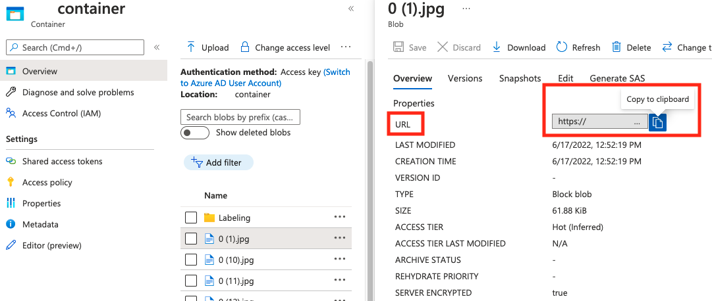

### About COCO files

COCO files are JSON files with specific required fields: `"images"`, `"annotations"`, and `"categories"`. A sample COCO file will look like this:

```json
{
 "images": [
   {
     "id": 1,
     "width": 500,
     "height": 828,
     "file_name": "0.jpg",
     "absolute_url": "https://blobstorage1.blob.core.windows.net/cpgcontainer/0.jpg"
   },
    {
      "id": 2,
      "width": 754,
      "height": 832,
      "file_name": "1.jpg",
      "absolute_url": "https://blobstorage1.blob.core.windows.net/cpgcontainer/1.jpg"
    },

   ...

  ],
  "annotations": [
    {
      "id": 1,
      "category_id": 7,
      "image_id": 1,
      "area": 0.407,
      "bbox": [
        0.02663142641129032,
        0.40691584277841153,
        0.9524163571731749,
        0.42766634515266866
      ]
    },
    {
      "id": 2,
      "category_id": 9,
      "image_id": 2,
      "area": 0.27,
      "bbox": [
        0.11803319477782331,
        0.41586723392402375,
        0.7765206955096307,
        0.3483334397217212
      ]
    },
    ...

  ],
  "categories": [
    {
      "id": 1,
      "name": "vegall original mixed vegetables"
    },
    {
      "id": 2,
      "name": "Amy's organic soups lentil vegetable"
    },
    {
      "id": 3,
      "name": "Arrowhead 8oz"
    },

    ...

  ]
}
```

### COCO file field reference

If you're generating your own COCO file from scratch, make sure all the required fields are filled with the correct details. The following tables describe each field in a COCO file:

**"images"**

| Key | Type | Description | Required? |
|-|-|-|-|
| `id` | integer | Unique image ID, starting from 1 | Yes |
| `width` | integer | Width of the image in pixels  | Yes |
| `height` | integer | Height of the image in pixels | Yes |
| `file_name`| string | A unique name for the image  | Yes |
| `absolute_url` or `coco_url`| string | Image path as an absolute URI to a blob in a blob container. The Vision resource must have permission to read the annotation files and all referenced image files. | Yes |

The value for `absolute_url` can be found in your blob container's properties: 



**"annotations"**

| Key | Type | Description | Required? |
|-|-|-|-|
| `id` | integer | ID of the annotation | Yes |
| `category_id` | integer | ID of the category defined in the `categories` section | Yes |
| `image_id`  | integer | ID of the image | Yes |
| `area` | integer | Value of 'Width' x 'Height' (third and fourth values of `bbox`) | No |
| `bbox` | list[float] | Relative coordinates of the bounding box (0 to 1), in the order of 'Left', 'Top', 'Width', 'Height'  | Yes |

**"categories"**

| Key | Type | Description | Required? |
|-|-|-|-|
| `id` | integer | Unique ID for each category (label class). These should be present in the `annotations` section. | Yes |
| `name`| string | Name of the category (label class) | Yes |

### COCO file verification

You can use our [Python sample code](../how-to/coco-verification.md) to check the format of a COCO file.
