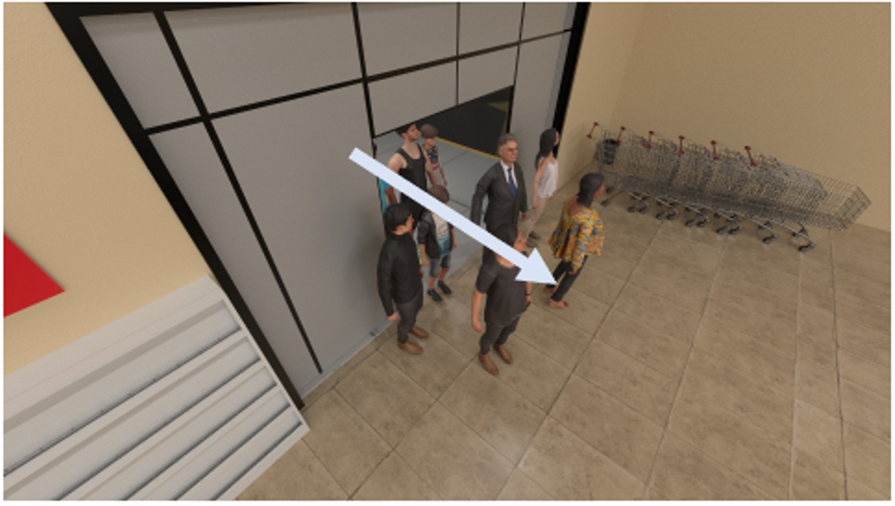
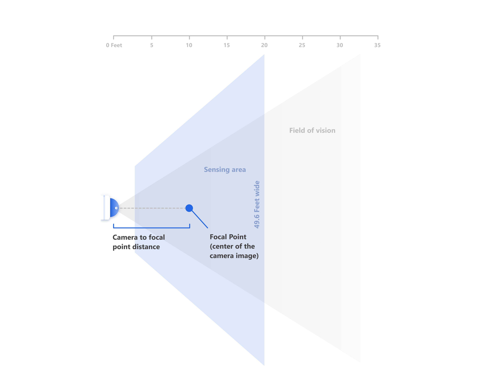
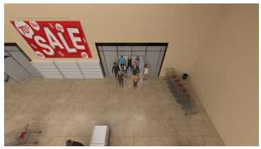
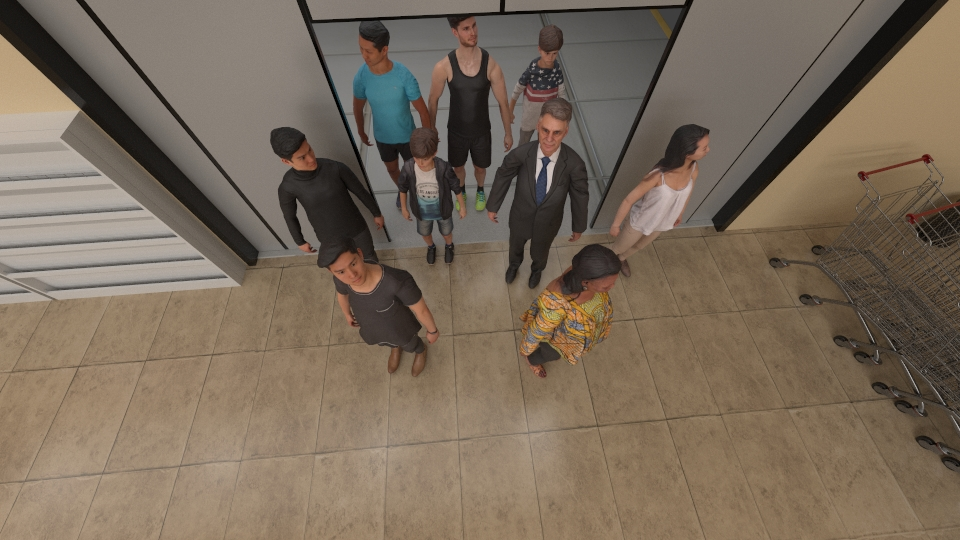
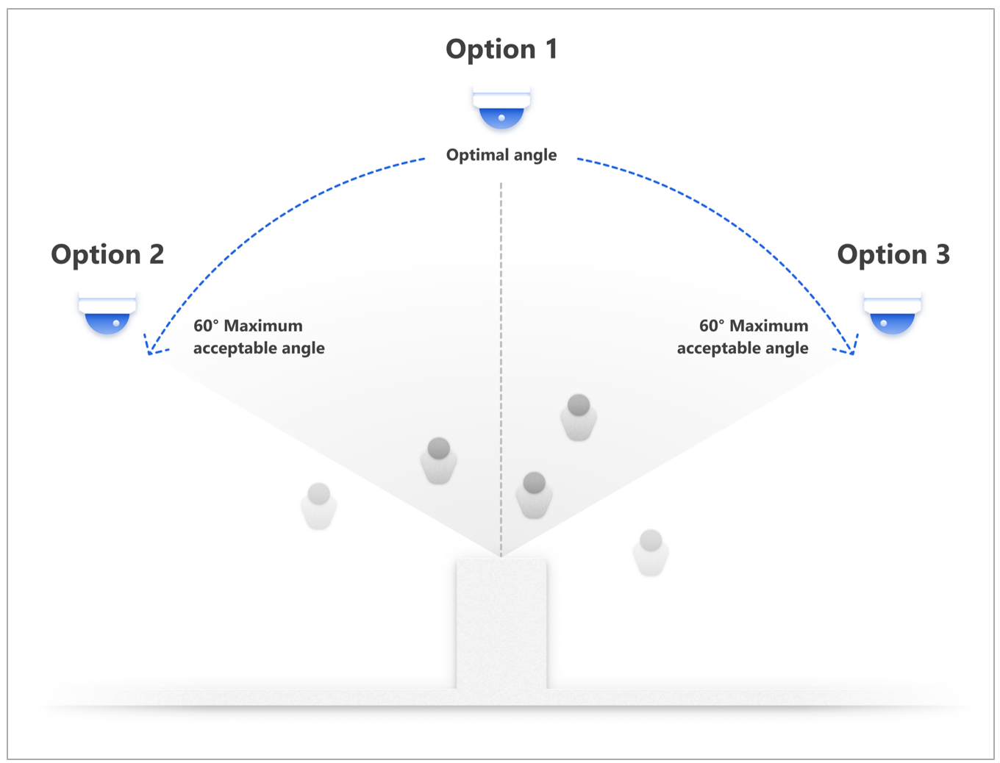
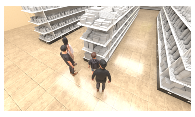
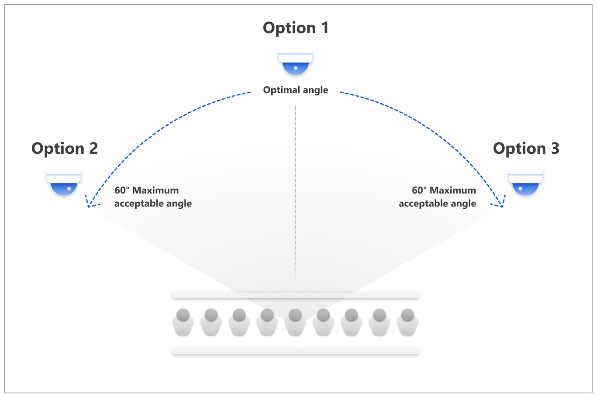
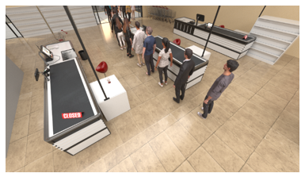
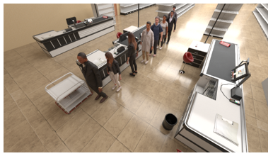
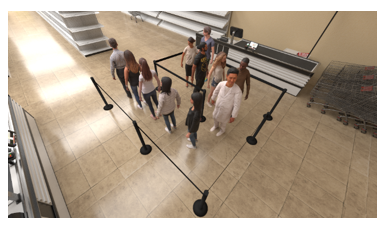

# Where to place the camera?

This article provides camera placement recommendations for Spatial Analysis (public preview). It includes general guidelines as well as specific recommendations for height, angle, and camera-to-focal-point-distance for all the included operations. 

> [!NOTE]
> This guide is designed for the Axis M3045-V camera. This camera will use resolution 1920x1080, 106 degree horizontal field of view, 59 degree vertical field of view and a fixed 2.8mm focal length. The principles below will apply to all cameras, but specific guidelines around camera height and camera-to-focal-point distance will need to be adjusted for use with other cameras. 

## General guidelines

Consider the following general guidelines when positioning cameras for Spatial Analysis:

* **Lighting height.** Place cameras below lighting fixtures so the fixtures don't block the cameras.
* **Obstructions.** To avoid obstructing camera views, take note of obstructions such as poles, signage, shelving, walls, and existing LP cameras.
* **Environmental backlighting.** Outdoor backlighting affects camera image quality. To avoid severe backlighting conditions, avoid directing cameras at external-facing windows and glass doors.
* **Local privacy rules and regulations.** Local regulations may restrict what cameras can capture. Make sure that you understand local rules and regulations before placing cameras.
* **Building structure.** HVAC, sprinklers, and existing wiring may limit hard mounting of cameras.
* **Cable management.** Make sure you can route an ethernet cable from planned camera mounting locations to the Power Over Internet (PoE) switch.

## Height, focal-point distance, and angle

You need to consider three things when deciding how to install a camera for Spatial Analysis:
- Camera height
- Camera-to-focal-point distance
- The angle of the camera relative to the floor plane

It's also important to know the direction that the majority of people walk (person walking direction) in relation to the camera field of view if possible. This direction is important for system performance.

The following illustration shows the elevation view for person walking direction.

## Camera height

Generally, cameras should be mounted 12-14 feet from the ground. For Face mask detection, we recommend cameras to be mounted 8-12 feet from the ground. When planning your camera mounting in this range, consider obstructions (for example: shelving, hanging lights, hanging signage, and displays) that might affect the camera view, and then adjust the height as necessary.

## Camera-to-focal-point distance

_Camera-to-focal-point distance_ is the linear distance from the focal point (or center of the camera image) to the camera measured on the ground.

This distance is measured on the floor plane.

From above, it looks like this:

Use the table below to determine the camera's distance from the focal point based on specific mounting heights. These distances are for optimal placement. Note that the table provides guidance below the 12'-14' recommendation since some ceilings can limit height. For Face mask detection, recommended camera-to-focal-point distance (min/max) is 4’-10’ for camera height between 8’ to 12’.

| Camera height | Camera-to-focal-point distance (min/max) |  
| ------------- | ---------------------------------------- |  
| 8'            | 4.6'-8'                                  |  
| 10'           | 5.8'-10'                                 |  
| 12'           | 7'-12'                                   |  
| 14'           | 8'-14''                                  |  
| 16'           | 9.2'-16'                                 |  
| 20'           | 11.5'-20'                                |  

The following illustration simulates camera views from the closest and farthest camera-to-focal-point distances.

| Closest                                      | Farthest                                      |  
| -------------------------------------------- | --------------------------------------------- |  
|  |  |  

## Camera angle mounting ranges

This section describes acceptable camera angle mounting ranges. These mounting ranges show the acceptable range for optimal placement.

### Line configuration

For the **cognitiveservices.vision.spatialanalysis-personcrossingline** operation, +/-5° is the optimal camera mounting angle to maximize accuracy.

For Face mask detection, +/-30 degrees is the optimal camera mounting angle for camera height between 8’ to 12’.

The following illustration simulates camera views using the leftmost (-) and rightmost (+) mounting angle recommendations for using **cognitiveservices.vision.spatialanalysis-personcrossingline** to do entrance counting in a door way.

| Leftmost view                | Rightmost view                |  
| ---------------------------- | ----------------------------- |  
|  |  |  

The following illustration shows camera placement and mounting angles from a birds-eye view.

### Zone configuration

We recommend that you place cameras at 10 feet or more above ground to guarantee the covered area is big enough. 

When the zone is next to an obstacle like a wall or shelf, mount cameras in the specified distance from the target within the acceptable 120-degree angle range as shown in the following illustration.

The following illustration provides simulations for the left and right camera views of an area next to a shelf.

| Left view        | Right view        |  
| ---------------- | ----------------- |  
|  |  |  

#### Queues

The **cognitiveservices.vision.spatialanalysis-personcount**, **cognitiveservices.vision.spatialanalysis-persondistance**, and **cognitiveservices.vision.spatialanalysis-personcrossingpolygon** skills may be used to monitor queues. For optimal queue data quality, retractable belt barriers are preferred to minimize occlusion of the people in the queue and ensure the queues location is consistent over time.

This type of barrier is preferred over opaque barriers for queue formation to maximize the accuracy of the insights from the system.

There are two types of queues: linear and zig-zag.

The following illustration shows recommendations for linear queues:

The following illustration provides simulations for the left and right camera views of linear queues. Note that you can mount the camera on the opposite side of the queue.

| Left view                          | Right view                          |  
| ---------------------------------- | ----------------------------------- |  
|  |  |  

For zig-zag queues, it's best to avoid placing the camera directly facing the queue line direction, as shown in the following illustration. Note that each of the four example camera positions in the illustration provide the ideal view with an acceptable deviation of +/- 15 degrees in each direction.

The following illustrations simulate the view from a camera placed in the ideal locations for a zig-zag queue.

| View 1        | View 2        |  
| ------------- | ------------- |  
|  |  |  

| View 3 |  View 4 |  
| ---- | ----  |
|  |   | 

##### Organic queues

Organic queue lines form organically. This style of queue is acceptable if queues don't form beyond 2-3 people and the line forms within the zone definition. If the queue length is typically more than 2-3 people, we recommend using a retractable belt barrier to help guide the queue direction and ensure the line forms within the zone definition.

## Next steps

* [Deploy a People Counting web application](spatial-analysis-web-app.md)
* [Configure Spatial Analysis operations](./spatial-analysis-operations.md)
* [Logging and troubleshooting](spatial-analysis-logging.md)
* [Zone and line placement guide](spatial-analysis-zone-line-placement.md)
