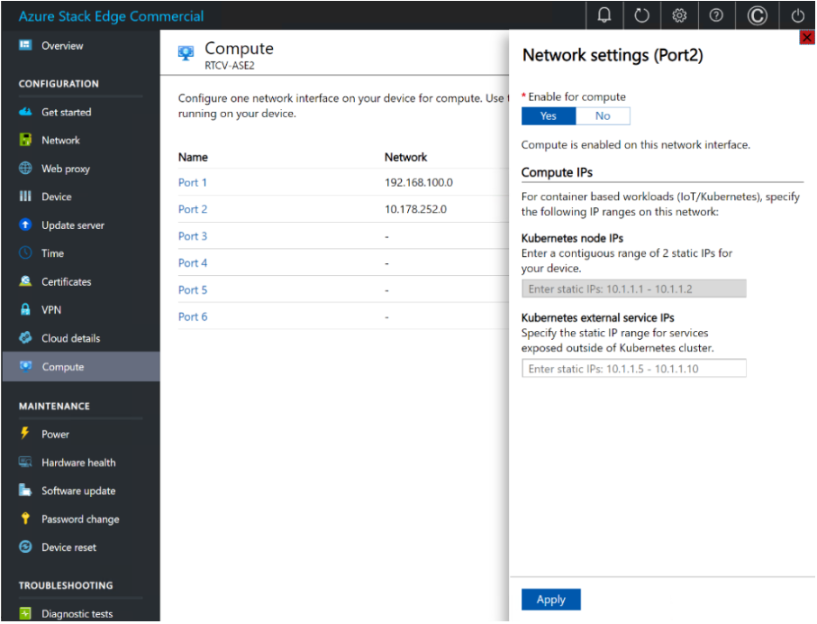
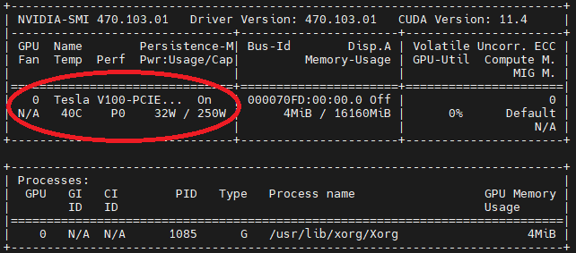

# Install and run the Spatial Analysis container (Preview)

The Spatial Analysis container enables you to analyze real-time streaming video to understand spatial relationships between people, their movement, and interactions with objects in physical environments. Containers are great for specific security and data governance requirements.

## Prerequisites

* Azure subscription - [Create one for free](https://azure.microsoft.com/free/cognitive-services)
* [!INCLUDE [contributor-requirement](../includes/quickstarts/contributor-requirement.md)]
* Once you have your Azure subscription, <a href="https://portal.azure.com/#create/Microsoft.CognitiveServicesComputerVision"  title="Create a Computer Vision resource"  target="_blank">create a Computer Vision resource </a> for the Standard S1 tier in the Azure portal to get your key and endpoint. After it deploys, select **Go to resource**.
    * You'll need the key and endpoint from the resource you create to run the Spatial Analysis container. You'll use your key and endpoint later.

### Spatial Analysis container requirements

To run the Spatial Analysis container, you need a compute device with an NVIDIA CUDA Compute Capable GPU 6.0 or higher (for example, [NVIDIA Tesla T4](https://www.nvidia.com/en-us/data-center/tesla-t4/), A2, 1080Ti, or 2080Ti). We recommend that you use [Azure Stack Edge](https://azure.microsoft.com/products/azure-stack/edge/) with GPU acceleration, however the container runs on any other desktop machine that meets the minimum requirements. We'll refer to this device as the host computer.

#### [Azure Stack Edge device](#tab/azure-stack-edge)

Azure Stack Edge is a Hardware-as-a-Service solution and an AI-enabled edge computing device with network data transfer capabilities. For detailed preparation and setup instructions, see the [Azure Stack Edge documentation](../../databox-online/azure-stack-edge-deploy-prep.md).

#### [Desktop machine](#tab/desktop-machine)

#### Minimum hardware requirements

* 4 GB of system RAM
* 4 GB of GPU RAM
* 8 core CPU
* One NVIDIA CUDA Compute Capable GPU 6.0 or higher (for example, [NVIDIA Tesla T4](https://www.nvidia.com/en-us/data-center/tesla-t4/), A2, 1080Ti, or 2080Ti)
* 20 GB of HDD space

#### Recommended hardware

* 32 GB of system RAM
* 16 GB of GPU RAM
* 8 core CPU
* Two NVIDIA CUDA Compute Capable GPUs 6.0 or higher (for example, [NVIDIA Tesla T4](https://www.nvidia.com/en-us/data-center/tesla-t4/), A2, 1080Ti, or 2080Ti)
* 50 GB of SSD space

In this article, you'll download and install the following software packages. The host computer must be able to run the following (see below for instructions):

* [NVIDIA graphics drivers](https://docs.nvidia.com/datacenter/tesla/tesla-installation-notes/index.html) and [NVIDIA CUDA Toolkit](https://docs.nvidia.com/cuda/cuda-installation-guide-linux/index.html). The minimum GPU driver version is 460 with CUDA 11.1.
* Configurations for [NVIDIA MPS](https://docs.nvidia.com/deploy/pdf/CUDA_Multi_Process_Service_Overview.pdf) (Multi-Process Service).
* [Docker CE](https://docs.docker.com/install/linux/docker-ce/ubuntu/#install-docker-engine---community-1) and [NVIDIA-Docker2](https://github.com/NVIDIA/nvidia-docker) 
* [Azure IoT Edge](../../iot-edge/how-to-provision-single-device-linux-symmetric.md) runtime.

#### [Azure VM with GPU](#tab/virtual-machine)
In our example, we'll utilize an [NCv3 series VM](../../virtual-machines/ncv3-series.md) that has one v100 GPU.

---

| Requirement | Description |
|--|--|
| Camera | The Spatial Analysis container isn't tied to a specific camera brand. The camera device needs to: support Real-Time Streaming Protocol(RTSP) and H.264 encoding, be accessible to the host computer, and be capable of streaming at 15FPS and 1080p resolution. |
| Linux OS | [Ubuntu Desktop 18.04 LTS](http://releases.ubuntu.com/18.04/) must be installed on the host computer.  |

## Set up the host computer

We recommend that you use an Azure Stack Edge device for your host computer. Select **Desktop Machine** if you're configuring a different device, or **Virtual Machine** if you're utilizing a VM.

#### [Azure Stack Edge device](#tab/azure-stack-edge)

### Configure compute on the Azure Stack Edge portal 
 
Spatial Analysis uses the compute features of the Azure Stack Edge to run an AI solution. To enable the compute features, make sure that: 

* You've [connected and activated](../../databox-online/azure-stack-edge-deploy-connect-setup-activate.md) your Azure Stack Edge device. 
* You have a Windows client system running PowerShell 5.0 or later, to access the device.  
* To deploy a Kubernetes cluster, you need to configure your Azure Stack Edge device via the **Local UI** on the [Azure portal](https://portal.azure.com/): 
  1. Enable the compute feature on your Azure Stack Edge device. To enable compute, go to the **Compute** page in the web interface for your device. 
  2. Select a network interface that you want to enable for compute, then select **Enable**. This will create a virtual switch on your device, on that network interface.
  3. Leave the Kubernetes test node IP addresses and the Kubernetes external services IP addresses blank.
  4. Select **Apply**. This operation may take about two minutes. 



### Set up Azure Stack Edge role and create an IoT Hub resource

In the [Azure portal](https://portal.azure.com/), navigate to your Azure Stack Edge resource. On the **Overview** page or navigation list, select the Edge compute **Get started** button. In the **Configure Edge compute** tile, select **Configure**. 


In the **Configure Edge compute** page, choose an existing IoT Hub, or choose to create a new one. By default, a Standard (S1) pricing tier is used to create an IoT Hub resource. To use a free tier IoT Hub resource, create one and then select it. The IoT Hub resource uses the same subscription and resource group that is used by the Azure Stack Edge resource 

Select **Create**. The IoT Hub resource creation may take a couple of minutes. After the IoT Hub resource is created, the **Configure Edge compute** tile will update to show the new configuration. To confirm that the Edge compute role has been configured, select **View config** on the **Configure compute** tile.

When the Edge compute role is set up on the Edge device, it creates two devices: an IoT device and an IoT Edge device. Both devices can be viewed in the IoT Hub resource. The Azure IoT Edge Runtime will already be running on the IoT Edge device.

> [!NOTE]
> * Currently only the Linux platform is supported for IoT Edge devices. For help troubleshooting the Azure Stack Edge device, see the [logging and troubleshooting](spatial-analysis-logging.md) article.
> * To learn more about how to configure an IoT Edge device to communicate through a proxy server, see [Configure an IoT Edge device to communicate through a proxy server](../../iot-edge/how-to-configure-proxy-support.md#azure-portal)

###  Enable MPS on Azure Stack Edge 

Follow these steps to remotely connect from a Windows client.

1. Run a Windows PowerShell session as an administrator.
2. Make sure that the Windows Remote Management service is running on your client. At the command prompt, type:

    ```powershell
    winrm quickconfig
    ```

    For more information, see [Installation and configuration for Windows Remote Management](/windows/win32/winrm/installation-and-configuration-for-windows-remote-management#quick-default-configuration).

3. Assign a variable to the connection string used in the `hosts` file.

    ```powershell
    $Name = "<Node serial number>.<DNS domain of the device>"
    ``` 

    Replace `<Node serial number>` and `<DNS domain of the device>` with the node serial number and DNS domain of your device. You can get the values for node serial number from the **Certificates** page and DNS domain from the **Device** page in the local web UI of your device.

4. To add this connection string for your device to the client’s trusted hosts list, type the following command:

    ```powershell
    Set-Item WSMan:\localhost\Client\TrustedHosts $Name -Concatenate -Force
    ```

5. Start a Windows PowerShell session on the device:

    ```powershell
    Enter-PSSession -ComputerName $Name -Credential ~\EdgeUser -ConfigurationName Minishell -UseSSL
    ```

    If you see an error related to trust relationship, then check if the signing chain of the node certificate uploaded to your device is also installed on the client accessing your device.

6. Provide the password when prompted. Use the same password that is used to sign into the local web UI. The default local web UI password is *Password1*. When you successfully connect to the device using remote PowerShell, you see the following sample output:  

    ```
    Windows PowerShell
    Copyright (C) Microsoft Corporation. All rights reserved.
    
    PS C:\WINDOWS\system32> winrm quickconfig
    WinRM service is already running on this machine.
    PS C:\WINDOWS\system32> $Name = "1HXQG13.wdshcsso.com"
    PS C:\WINDOWS\system32> Set-Item WSMan:\localhost\Client\TrustedHosts $Name -Concatenate -Force
    PS C:\WINDOWS\system32> Enter-PSSession -ComputerName $Name -Credential ~\EdgeUser -ConfigurationName Minishell -UseSSL

    WARNING: The Windows PowerShell interface of your device is intended to be used only for the initial network configuration. Please engage Microsoft Support if you need to access this interface to troubleshoot any potential issues you may be experiencing. Changes made through this interface without involving Microsoft Support could result in an unsupported configuration.
    [1HXQG13.wdshcsso.com]: PS>
    ```

#### [Desktop machine](#tab/desktop-machine)

Follow these instructions if your host computer isn't an Azure Stack Edge device.

#### Install NVIDIA CUDA Toolkit and Nvidia graphics drivers on the host computer

Use the following bash script to install the required Nvidia graphics drivers, and CUDA Toolkit.

```bash
wget https://developer.download.nvidia.com/compute/cuda/repos/ubuntu1804/x86_64/cuda-ubuntu1804.pin
sudo mv cuda-ubuntu1804.pin /etc/apt/preferences.d/cuda-repository-pin-600
sudo apt-key adv --fetch-keys https://developer.download.nvidia.com/compute/cuda/repos/ubuntu1804/x86_64/3bf863cc.pub
sudo add-apt-repository "deb http://developer.download.nvidia.com/compute/cuda/repos/ubuntu1804/x86_64/ /"
sudo apt-get update
sudo apt-get -y install cuda
```

Reboot the machine, and run the following command.

```bash
nvidia-smi
```

You should see the following output.



### Install Docker CE and nvidia-docker2 on the host computer

Install Docker CE on the host computer.

```bash
sudo apt-get update
sudo apt-get install -y apt-transport-https ca-certificates curl gnupg-agent software-properties-common
curl -fsSL https://download.docker.com/linux/ubuntu/gpg | sudo apt-key add -
sudo add-apt-repository "deb [arch=amd64] https://download.docker.com/linux/ubuntu $(lsb_release -cs) stable"
sudo apt-get update
sudo apt-get install -y docker-ce docker-ce-cli containerd.io
```

Install the *nvidia-docker-2* software package.

```bash
distribution=$(. /etc/os-release;echo $ID$VERSION_ID)
curl -s -L https://nvidia.github.io/nvidia-docker/gpgkey | sudo apt-key add -
curl -s -L https://nvidia.github.io/nvidia-docker/$distribution/nvidia-docker.list | sudo tee /etc/apt/sources.list.d/nvidia-docker.list
sudo apt-get update
sudo apt-get install -y docker-ce nvidia-docker2
sudo systemctl restart docker
```

## Enable NVIDIA MPS on the host computer

> [!TIP]
> * Don't install MPS if your GPU compute capability is less than 7.x (pre Volta). See [CUDA Compatability](https://docs.nvidia.com/deploy/cuda-compatibility/index.html#support-title) for reference. 
> * Run the MPS instructions from a terminal window on the host computer. Not inside your Docker container instance.

For best performance and utilization, configure the host computer's GPU(s) for [NVIDIA Multiprocess Service (MPS)](https://docs.nvidia.com/deploy/pdf/CUDA_Multi_Process_Service_Overview.pdf). Run the MPS instructions from a terminal window on the host computer.

```bash
# Set GPU(s) compute mode to EXCLUSIVE_PROCESS
sudo nvidia-smi --compute-mode=EXCLUSIVE_PROCESS

# Cronjob for setting GPU(s) compute mode to EXCLUSIVE_PROCESS on boot
echo "SHELL=/bin/bash" > /tmp/nvidia-mps-cronjob
echo "PATH=/usr/local/sbin:/usr/local/bin:/sbin:/bin:/usr/sbin:/usr/bin" >> /tmp/nvidia-mps-cronjob
echo "@reboot   root    nvidia-smi --compute-mode=EXCLUSIVE_PROCESS" >> /tmp/nvidia-mps-cronjob

sudo chown root:root /tmp/nvidia-mps-cronjob
sudo mv /tmp/nvidia-mps-cronjob /etc/cron.d/

# Service entry for automatically starting MPS control daemon
echo "[Unit]" > /tmp/nvidia-mps.service
echo "Description=NVIDIA MPS control service" >> /tmp/nvidia-mps.service
echo "After=cron.service" >> /tmp/nvidia-mps.service
echo "" >> /tmp/nvidia-mps.service
echo "[Service]" >> /tmp/nvidia-mps.service
echo "Restart=on-failure" >> /tmp/nvidia-mps.service
echo "ExecStart=/usr/bin/nvidia-cuda-mps-control -f" >> /tmp/nvidia-mps.service
echo "" >> /tmp/nvidia-mps.service
echo "[Install]" >> /tmp/nvidia-mps.service
echo "WantedBy=multi-user.target" >> /tmp/nvidia-mps.service

sudo chown root:root /tmp/nvidia-mps.service
sudo mv /tmp/nvidia-mps.service /etc/systemd/system/

sudo systemctl --now enable nvidia-mps.service
```

## Configure Azure IoT Edge on the host computer

To deploy the Spatial Analysis container on the host computer, create an instance of an [Azure IoT Hub](../../iot-hub/iot-hub-create-through-portal.md) service using the Standard (S1) or Free (F0) pricing tier. 

Use the Azure CLI to create an instance of Azure IoT Hub. Replace the parameters where appropriate. Alternatively, you can create the Azure IoT Hub on the [Azure portal](https://portal.azure.com/).

```bash
curl -sL https://aka.ms/InstallAzureCLIDeb | sudo bash
```
```azurecli
sudo az login
```
```azurecli
sudo az account set --subscription "<name or ID of Azure Subscription>"
```
```azurecli
sudo az group create --name "<resource-group-name>" --location "<your-region>"
```
See [Region Support](https://azure.microsoft.com/global-infrastructure/services/?products=cognitive-services) for available regions.
```azurecli
sudo az iot hub create --name "<iothub-group-name>" --sku S1 --resource-group "<resource-group-name>"
```
```azurecli
sudo az iot hub device-identity create --hub-name "<iothub-name>" --device-id "<device-name>" --edge-enabled
```

You'll need to install [Azure IoT Edge](../../iot-edge/how-to-provision-single-device-linux-symmetric.md) version 1.0.9. Follow these steps to download the correct version:

Ubuntu Server 18.04:
```bash
curl https://packages.microsoft.com/config/ubuntu/18.04/multiarch/prod.list > ./microsoft-prod.list
```

Copy the generated list.
```bash
sudo cp ./microsoft-prod.list /etc/apt/sources.list.d/
```

Install the Microsoft GPG public key.

```bash
curl https://packages.microsoft.com/keys/microsoft.asc | gpg --dearmor > microsoft.gpg
```
```bash
sudo cp ./microsoft.gpg /etc/apt/trusted.gpg.d/
```

Update the package lists on your device.

```bash
sudo apt-get update
```

Install the 1.0.9 release:

```bash
sudo apt-get install iotedge=1.1* libiothsm-std=1.1*
```

Next, register the host computer as an IoT Edge device in your IoT Hub instance, using a [connection string](../../iot-edge/how-to-provision-single-device-linux-symmetric.md#register-your-device).

You need to connect the IoT Edge device to your Azure IoT Hub. You need to copy the connection string from the IoT Edge device you created earlier. Alternatively, you can run the below command in the Azure CLI.

```azurecli
sudo az iot hub device-identity connection-string show --device-id my-edge-device --hub-name test-iot-hub-123
```

On the host computer open  `/etc/iotedge/config.yaml` for editing. Replace `ADD DEVICE CONNECTION STRING HERE` with the connection string. Save and close the file. 
Run this command to restart the IoT Edge service on the host computer.

```bash
sudo systemctl restart iotedge
```

Deploy the Spatial Analysis container as an IoT Module on the host computer, either from the [Azure portal](../../iot-edge/how-to-deploy-modules-portal.md) or [Azure CLI](../multi-service-resource.md?pivots=azcli). If you're using the portal, set the image URI to the location of your Azure Container Registry. 

Use the below steps to deploy the container using the Azure CLI.

#### [Azure VM with GPU](#tab/virtual-machine)

An Azure Virtual Machine with a GPU can also be used to run Spatial Analysis. The example below will use a [NCv3 series VM](../../virtual-machines/ncv3-series.md) that has one v100 GPU.

#### Create the VM

Open the [Create a Virtual Machine](https://portal.azure.com/#create/Microsoft.VirtualMachine) wizard in the Azure portal.

Give your VM a name and select the region to be (US) West US 2. 

> [!IMPORTANT]
> Be sure to set `Availability Options` to "No infrastructure redundancy required". Refer to the below figure for the complete configuration and the next step for help locating the correct VM size. 

:::image type="content" source="media/spatial-analysis/virtual-machine-instance-details.jpg" alt-text="Virtual machine configuration details." lightbox="media/spatial-analysis/virtual-machine-instance-details.jpg":::

To locate the VM size, select "See all sizes" and then view the list for "N-Series" and select **NC6s_v3**, shown below.

:::image type="content" source="media/spatial-analysis/virtual-machine-sizes.png" alt-text="Virtual machine sizes." lightbox="media/spatial-analysis/virtual-machine-sizes.png":::

Next, Create the VM. Once created, navigate to the VM resource in the Azure portal and select `Extensions` from the left pane. Select on "Add" to bring up the extensions window with all available extensions. Search for and select `NVIDIA GPU Driver Extension`, select create, and complete the wizard.

Once the extension is successfully applied, navigate to the VM main page in the Azure portal and select `Connect`. The VM can be accessed either through SSH or RDP. RDP will be helpful as it will enable viewing of the visualizer window (explained later). Configure the RDP access by following [these steps](../../virtual-machines/linux/use-remote-desktop.md) and opening a remote desktop connection to the VM.

### Verify Graphics Drivers are Installed

Run the following command to verify that the graphics drivers have been successfully installed. 

```bash
nvidia-smi
```

You should see the following output.


### Install Docker CE and nvidia-docker2 on the VM

Run the following commands one at a time in order to install Docker CE and nvidia-docker2 on the VM.

Install Docker CE on the host computer.

```bash
sudo apt-get update
```
```bash
sudo apt-get install -y apt-transport-https ca-certificates curl gnupg-agent software-properties-common
```
```bash
curl -fsSL https://download.docker.com/linux/ubuntu/gpg | sudo apt-key add -
```
```bash
sudo add-apt-repository "deb [arch=amd64] https://download.docker.com/linux/ubuntu $(lsb_release -cs) stable"
```
```bash
sudo apt-get update
```
```bash
sudo apt-get install -y docker-ce docker-ce-cli containerd.io
```


Install the *nvidia-docker-2* software package.

```bash
DISTRIBUTION=$(. /etc/os-release;echo $ID$VERSION_ID)
```
```bash
curl -s -L https://nvidia.github.io/nvidia-docker/gpgkey | sudo apt-key add -
```
```bash
curl -s -L https://nvidia.github.io/nvidia-docker/$DISTRIBUTION/nvidia-docker.list | sudo tee /etc/apt/sources.list.d/nvidia-docker.list
```
```bash
sudo apt-get update
```
```bash
sudo apt-get install -y docker-ce nvidia-docker2
```
```bash
sudo systemctl restart docker
```

Now that you have set up and configured your VM, follow the steps below to configure Azure IoT Edge. 

## Configure Azure IoT Edge on the VM

To deploy the Spatial Analysis container on the VM, create an instance of an [Azure IoT Hub](../../iot-hub/iot-hub-create-through-portal.md) service using the Standard (S1) or Free (F0) pricing tier.

Use the Azure CLI to create an instance of Azure IoT Hub. Replace the parameters where appropriate. Alternatively, you can create the Azure IoT Hub on the [Azure portal](https://portal.azure.com/).

```bash
curl -sL https://aka.ms/InstallAzureCLIDeb | sudo bash
```
```azurecli
sudo az login
```
```azurecli
sudo az account set --subscription "<name or ID of Azure Subscription>"
```
```azurecli
sudo az group create --name "<resource-group-name>" --location "<your-region>"
```
See [Region Support](https://azure.microsoft.com/global-infrastructure/services/?products=cognitive-services) for available regions.
```azurecli
sudo az iot hub create --name "<iothub-name>" --sku S1 --resource-group "<resource-group-name>"
```
```azurecli
sudo az iot hub device-identity create --hub-name "<iothub-name>" --device-id "<device-name>" --edge-enabled
```

You'll need to install [Azure IoT Edge](../../iot-edge/how-to-provision-single-device-linux-symmetric.md) version 1.0.9. Follow these steps to download the correct version:

Ubuntu Server 18.04:
```bash
curl https://packages.microsoft.com/config/ubuntu/18.04/multiarch/prod.list > ./microsoft-prod.list
```

Copy the generated list.
```bash
sudo cp ./microsoft-prod.list /etc/apt/sources.list.d/
```

Install the Microsoft GPG public key.

```bash
curl https://packages.microsoft.com/keys/microsoft.asc | gpg --dearmor > microsoft.gpg
```
```bash
sudo cp ./microsoft.gpg /etc/apt/trusted.gpg.d/
```

Update the package lists on your device.

```bash
sudo apt-get update
```

Install the 1.0.9 release:

```bash
sudo apt-get install iotedge=1.1* libiothsm-std=1.1*
```

Next, register the VM as an IoT Edge device in your IoT Hub instance, using a [connection string](../../iot-edge/how-to-provision-single-device-linux-symmetric.md#register-your-device).

You need to connect the IoT Edge device to your Azure IoT Hub. You need to copy the connection string from the IoT Edge device you created earlier. Alternatively, you can run the below command in the Azure CLI.

```azurecli
sudo az iot hub device-identity connection-string show --device-id my-edge-device --hub-name test-iot-hub-123
```

On the VM open  `/etc/iotedge/config.yaml` for editing. Replace `ADD DEVICE CONNECTION STRING HERE` with the connection string. Save and close the file. 
Run this command to restart the IoT Edge service on the VM.

```bash
sudo systemctl restart iotedge
```

Deploy the Spatial Analysis container as an IoT Module on the VM, either from the [Azure portal](../../iot-edge/how-to-deploy-modules-portal.md) or [Azure CLI](../multi-service-resource.md?pivots=azcli). If you're using the portal, set the image URI to the location of your Azure Container Registry. 

Use the below steps to deploy the container using the Azure CLI.

---

### IoT Deployment manifest

To streamline container deployment on multiple host computers, you can create a deployment manifest file to specify the container creation options, and environment variables. You can find an example of a deployment manifest [for Azure Stack Edge](https://go.microsoft.com/fwlink/?linkid=2142179), [other desktop machines](https://go.microsoft.com/fwlink/?linkid=2152270), and [Azure VM with GPU](https://go.microsoft.com/fwlink/?linkid=2152189) on GitHub.

The following table shows the various Environment Variables used by the IoT Edge Module. You can also set them in the deployment manifest linked above, using the `env` attribute in `spatialanalysis`:

| Setting Name | Value | Description|
|---------|---------|---------|
| ARCHON_LOG_LEVEL | Info; Verbose | Logging level, select one of the two values|
| ARCHON_SHARED_BUFFER_LIMIT | 377487360 | Do not modify|
| ARCHON_PERF_MARKER| false| Set this to true for performance logging, otherwise this should be false| 
| ARCHON_NODES_LOG_LEVEL | Info; Verbose | Logging level, select one of the two values|
| OMP_WAIT_POLICY | PASSIVE | Do not modify|
| QT_X11_NO_MITSHM | 1 | Do not modify|
| APIKEY | your API Key| Collect this value from Azure portal from your Vision resource. You can find it in the **Key and endpoint** section for your resource. |
| BILLING | your Endpoint URI| Collect this value from Azure portal from your Vision resource. You can find it in the **Key and endpoint** section for your resource.|
| EULA | accept | This value needs to be set to *accept* for the container to run |
| DISPLAY | :1 | This value needs to be same as the output of `echo $DISPLAY` on the host computer. Azure Stack Edge devices do not have a display. This setting is not applicable|
| KEY_ENV | ASE Encryption key | Add this environment variable if Video_URL is an obfuscated string |
| IV_ENV | Initialization vector | Add this environment variable if Video_URL is an obfuscated string|

> [!IMPORTANT]
> The `Eula`, `Billing`, and `ApiKey` options must be specified to run the container; otherwise, the container won't start.  For more information, see [Billing](#billing).

Once you update the Deployment manifest for [Azure Stack Edge devices](https://go.microsoft.com/fwlink/?linkid=2142179), [a desktop machine](https://go.microsoft.com/fwlink/?linkid=2152270) or [Azure VM with GPU](https://go.microsoft.com/fwlink/?linkid=2152189) with your own settings and selection of operations, you can use the below [Azure CLI](../multi-service-resource.md?pivots=azcli) command to deploy the container on the host computer, as an IoT Edge Module.

```azurecli
sudo az login
sudo az extension add --name azure-iot
sudo az iot edge set-modules --hub-name "<iothub-name>" --device-id "<device-name>" --content DeploymentManifest.json --subscription "<name or ID of Azure Subscription>"
```

|Parameter  |Description  |
|---------|---------|
| `--hub-name` | Your Azure IoT Hub name. |
| `--content` | The name of the deployment file. |
| `--target-condition` | Your IoT Edge device name for the host computer. |
| `-–subscription` | Subscription ID or name. |

This command will start the deployment. Navigate to the page of your Azure IoT Hub instance in the Azure portal to see the deployment status. The status may show as *417 – The device's deployment configuration is not set* until the device finishes downloading the container images and starts running.

## Validate that the deployment is successful

There are several ways to validate that the container is running. Locate the *Runtime Status* in the **IoT Edge Module Settings** for the Spatial Analysis module in your Azure IoT Hub instance on the Azure portal. Validate that the **Desired Value** and **Reported Value** for the *Runtime Status* is *Running*.


Once the deployment is complete and the container is running, the **host computer** will start sending events to the Azure IoT Hub. If you used the `.debug` version of the operations, you'll see a visualizer window for each camera you configured in the deployment manifest. You can now define the lines and zones you want to monitor in the deployment manifest and follow the instructions to deploy again. 

## Configure the operations performed by Spatial Analysis

You'll need to use [Spatial Analysis operations](spatial-analysis-operations.md) to configure the container to use connected cameras, configure the operations, and more. For each camera device you configure, the operations for Spatial Analysis will generate an output stream of JSON messages, sent to your instance of Azure IoT Hub.

## Use the output generated by the container

If you want to start consuming the output generated by the container, see the following articles:

*    Use the Azure Event Hubs SDK for your chosen programming language to connect to the Azure IoT Hub endpoint and receive the events. For more information, see [Read device-to-cloud messages from the built-in endpoint](../../iot-hub/iot-hub-devguide-messages-read-builtin.md). 
*    Set up Message Routing on your Azure IoT Hub to send the events to other endpoints or save the events to Azure Blob Storage, etc. See [IoT Hub Message Routing](../../iot-hub/iot-hub-devguide-messages-d2c.md) for more information. 

## Troubleshooting

If you encounter issues when starting or running the container, see [Telemetry and troubleshooting](spatial-analysis-logging.md) for steps for common issues. This article also contains information on generating and collecting logs and collecting system health.

[!INCLUDE [Diagnostic container](../containers/includes/diagnostics-container.md)]

## Billing

The Spatial Analysis container sends billing information to Azure, using a Vision resource on your Azure account. The use of Spatial Analysis in public preview is currently free. 

Azure AI containers aren't licensed to run without being connected to the metering / billing endpoint. You must always enable the containers to communicate billing information with the billing endpoint. Azure AI containers don't send customer data, such as the video or image that's being analyzed, to Microsoft.


## Summary

In this article, you learned concepts and workflow for downloading, installing, and running the Spatial Analysis container. In summary:

* Spatial Analysis is a Linux container for Docker.
* Container images are downloaded from the Microsoft Container Registry.
* Container images run as IoT Modules in Azure IoT Edge.
* Configure the container and deploy it on a host machine.

## Next steps

* [Deploy a People Counting web application](spatial-analysis-web-app.md)
* [Configure Spatial Analysis operations](spatial-analysis-operations.md)
* [Logging and troubleshooting](spatial-analysis-logging.md)
* [Camera placement guide](spatial-analysis-camera-placement.md)
* [Zone and line placement guide](spatial-analysis-zone-line-placement.md)
