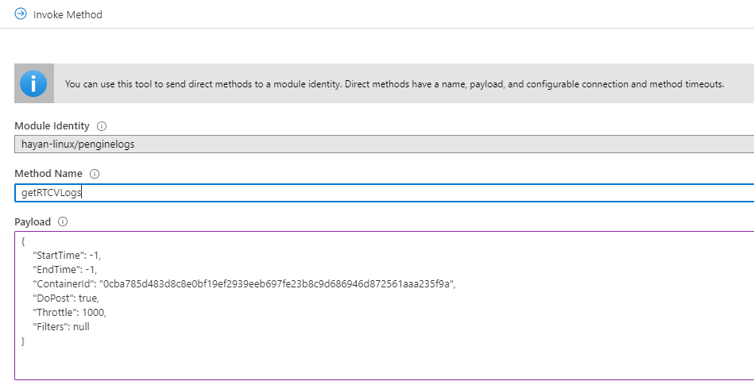
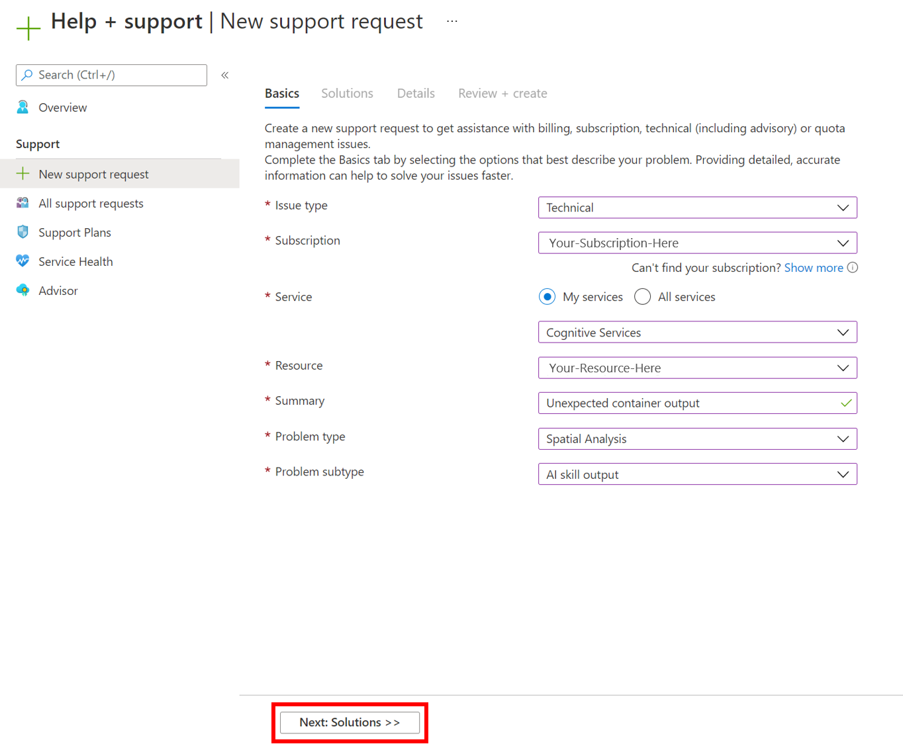

# Telemetry and troubleshooting

Spatial Analysis includes a set of features to monitor the health of the system and help with diagnosing issues.

## Enable visualizations

To enable a visualization of AI Insight events in a video frame, you need to use the `.debug` version of a [Spatial Analysis operation](spatial-analysis-operations.md) on a desktop machine or Azure VM. The visualization is not possible on Azure Stack Edge devices. There are four debug operations available.

If your device is a local desktop machine or Azure GPU VM (with remote desktop enabled), then you can switch to `.debug` version of any operation and visualize the output.

1.  Open the desktop either locally or by using a remote desktop client on the host computer running Spatial Analysis. 
2.  In the terminal run `xhost +`
3.  Update the [deployment manifest](https://github.com/Azure-Samples/cognitive-services-sample-data-files/blob/master/ComputerVision/spatial-analysis/DeploymentManifest_for_non_ASE_devices.json) under the `spaceanalytics` module with the value of the `DISPLAY` environment variable. You can find its value by running `echo $DISPLAY` in the terminal on the host computer.
    ```
    "env": {        
        "DISPLAY": {
            "value": ":11"
            }
    }
    ```
4. Update the graph in the deployment manifest you want to run in debug mode. In the example below, we update the operationId  to cognitiveservices.vision.spatialanalysis-personcrossingpolygon.debug. A new parameter `VISUALIZER_NODE_CONFIG` is required to enable the visualizer window. All operations are available in debug flavor. When using shared nodes, use the cognitiveservices.vision.spatialanalysis.debug operation and add `VISUALIZER_NODE_CONFIG` to the instance parameters. 

    ```
    "zonecrossing": {
	    "operationId" : "cognitiveservices.vision.spatialanalysis-personcrossingpolygon.debug",
	    "version": 1,
	    "enabled": true,
	    "parameters": {
	        "VIDEO_URL": "Replace http url here",
	        "VIDEO_SOURCE_ID": "zonecrossingcamera",
	        "VIDEO_IS_LIVE": false,
            "VIDEO_DECODE_GPU_INDEX": 0,
	        "DETECTOR_NODE_CONFIG": "{ \"gpu_index\": 0 }",
            "CAMERACALIBRATOR_NODE_CONFIG": "{ \"gpu_index\": 0}",
            "VISUALIZER_NODE_CONFIG": "{ \"show_debug_video\": true }",
	        "SPACEANALYTICS_CONFIG": "{\"zones\":[{\"name\":\"queue\",\"polygon\":[[0.3,0.3],[0.3,0.9],[0.6,0.9],[0.6,0.3],[0.3,0.3]], \"threshold\":35.0}]}"
	    }
    }
    ```
    
5. Redeploy and you will see the visualizer window on the host computer
6. After the deployment has completed, you might have to copy the `.Xauthority` file from the host computer to the container and restart it. In the sample below, `peopleanalytics` is the name of the container on the host computer.

    ```bash
    sudo docker cp $XAUTHORITY peopleanalytics:/root/.Xauthority
    sudo docker stop peopleanalytics
    sudo docker start peopleanalytics
    xhost +
    ```

## Collect system health telemetry

Telegraf is an open source image that works with Spatial Analysis, and is available in the Microsoft Container Registry. It takes the following inputs and sends them to Azure Monitor. The telegraf module can be built with desired custom inputs and outputs. The telegraf module configuration in Spatial Analysis is part of the deployment manifest (linked above). This module is optional and can be removed from the manifest if you don't need it. 

Inputs: 
1. Spatial Analysis Metrics
2. Disk Metrics
3. CPU Metrics
4. Docker Metrics
5. GPU Metrics

Outputs:
1. Azure Monitor

The supplied Spatial Analysis telegraf module will publish all the telemetry data emitted by the Spatial Analysis container to Azure Monitor. See the [Azure Monitor](../../azure-monitor/overview.md) for information on adding Azure Monitor to your subscription.

After setting up Azure Monitor, you will need to create credentials that enable the module to send telemetry. You can use the Azure portal to create a new Service Principal, or use the Azure CLI command below to create one.

> [!NOTE] 
> This command requires you to have Owner privileges on the subscription. 

```azurecli
# Find your Azure IoT Hub resource ID by running this command. The resource ID  should start with something like 
# "/subscriptions/b60d6458-1234-4be4-9885-c7e73af9ced8/resourceGroups/..."
az iot hub list

# Create a Service Principal with `Monitoring Metrics Publisher` role in the IoTHub resource:
# Save the output from this command. The values will be used in the deployment manifest. The password won't be shown again so make sure to write it down
az ad sp create-for-rbac --role="Monitoring Metrics Publisher" --name "<principal name>" --scopes="<resource ID of IoT Hub>"
```

In the deployment manifest for your [Azure Stack Edge device](https://go.microsoft.com/fwlink/?linkid=2142179), [desktop machine](https://go.microsoft.com/fwlink/?linkid=2152270), or [Azure VM with GPU](https://go.microsoft.com/fwlink/?linkid=2152189), look for the *telegraf* module, and replace the following values with the Service Principal information from the previous step and redeploy.

```json

"telegraf": { 
  "settings": {
  "image":   "mcr.microsoft.com/azure-cognitive-services/vision/spatial-analysis/telegraf:1.0",
  "createOptions":   "{\"HostConfig\":{\"Runtime\":\"nvidia\",\"NetworkMode\":\"azure-iot-edge\",\"Memory\":33554432,\"Binds\":[\"/var/run/docker.sock:/var/run/docker.sock\"]}}"
},
"type": "docker",
"env": {
    "AZURE_TENANT_ID": {
        "value": "<Tenant Id>"
    },
    "AZURE_CLIENT_ID": {
        "value": "Application Id"
    },
    "AZURE_CLIENT_SECRET": {
        "value": "<Password>"
    },
    "region": {
        "value": "<Region>"
    },
    "resource_id": {
        "value": "/subscriptions/{subscriptionId}/resourceGroups/{resoureGroupName}/providers/Microsoft.Devices/IotHubs/{IotHub}"
    },
...
```

Once the telegraf module is deployed, the reported metrics can be accessed either through the Azure Monitor service, or by selecting **Monitoring** in the IoT Hub on the Azure portal.

:::image type="content" source="./media/spatial-analysis/iot-hub-telemetry.png" alt-text="Azure Monitor telemetry report":::

### System health events

| Event Name                  | Description    |
|-----------------------------|-------------------------------------------------------------------------------------------|
| archon_exit                 | Sent when a user changes the Spatial Analysis module status from *running* to *stopped*.  |
| archon_error                | Sent when any of the processes inside the container crash. This is a critical error.      |
| InputRate                   | The rate at which the graph processes video input. Reported every 5 minutes.              |
| OutputRate                  | The rate at which the graph outputs AI insights. Reported every 5 minutes.                |
| archon_allGraphsStarted     | Sent when all graphs have finished starting up.                                           |
| archon_configchange         | Sent when a graph configuration has changed.                                              |
| archon_graphCreationFailed  | Sent when the graph with the reported `graphId` fails to start.                           |
| archon_graphCreationSuccess | Sent when the graph with the reported `graphId` starts successfully.                      |
| archon_graphCleanup         | Sent when the graph with the reported `graphId` cleans up and exits.                      |
| archon_graphHeartbeat       | Heartbeat sent every minute for every graph of a skill.                                   |
| archon_apiKeyAuthFail       | Sent when the Vision resource key fails to authenticate the container for more than 24 hours, due to the following reasons: Out of Quota, Invalid, Offline. |
| VideoIngesterHeartbeat      | Sent every hour to indicate that video is streamed from the Video source, with the number of errors in that hour. Reported for each graph. |
| VideoIngesterState          | Reports *Stopped* or *Started* for video streaming. Reported for each graph.              |

##  Troubleshooting an IoT Edge Device

You can use `iotedge` command line tool to check the status and logs of the running modules. For example:
* `iotedge list`: Reports a list of running modules. 
  You can further check for errors with `iotedge logs edgeAgent`. If `iotedge` gets stuck, you can try restarting it with `iotedge restart edgeAgent`
* `iotedge logs <module-name>`
* `iotedge restart <module-name>` to restart a specific module 

## Collect log files with the diagnostics container

Spatial Analysis generates Docker debugging logs that you can use to diagnose runtime issues, or include in support tickets. The Spatial Analysis diagnostics module is available in the Microsoft Container Registry for you to download. In the manifest deployment file for your [Azure Stack Edge Device](https://go.microsoft.com/fwlink/?linkid=2142179), [desktop machine](https://go.microsoft.com/fwlink/?linkid=2152270), or [Azure VM with GPU](https://go.microsoft.com/fwlink/?linkid=2152189) look for the *diagnostics* module.

In the "env" section add the following configuration:

```json
"diagnostics": {  
  "settings": {
  "image":   "mcr.microsoft.com/azure-cognitive-services/vision/spatial-analysis/diagnostics:1.0",
  "createOptions":   "{\"HostConfig\":{\"Mounts\":[{\"Target\":\"/usr/bin/docker\",\"Source\":\"/home/data/docker\",\"Type\":\"bind\"},{\"Target\":\"/var/run\",\"Source\":\"/run\",\"Type\":\"bind\"}],\"LogConfig\":{\"Config\":{\"max-size\":\"500m\"}}}}"
  }
```    

To optimize logs uploaded to a remote endpoint, such as Azure Blob Storage, we recommend maintaining a small file size. See the example below for the recommended Docker logs configuration.

```json
{
    "HostConfig": {
        "LogConfig": {
            "Config": {
                "max-size": "500m",
                "max-file": "1000"
            }
        }
    }
}
```

### Configure the log level

Log level configuration allows you to control the verbosity of the generated logs. Supported log levels are: `none`, `verbose`, `info`, `warning`,  and `error`. The default log verbose level for both nodes and platform is `info`. 

Log levels can be modified globally by setting the `ARCHON_LOG_LEVEL` environment variable to one of the allowed values.
It can also be set through the IoT Edge Module Twin document either globally, for all deployed skills, or for every specific skill by setting the values for `platformLogLevel` and `nodesLogLevel` as shown below.

```json
{
    "version": 1,
    "properties": {
        "desired": {
            "globalSettings": {
                "platformLogLevel": "verbose"
            },
            "graphs": {
                "samplegraph": {
                    "nodesLogLevel": "verbose",
                    "platformLogLevel": "verbose"
                }
            }
        }
    }
}
```

### Collecting Logs

> [!NOTE]
> The `diagnostics` module does not affect the logging content, it is only assists in collecting, filtering, and uploading existing logs.
> You must have Docker API version 1.40 or higher to use this module.

The sample deployment manifest file for your [Azure Stack Edge device](https://go.microsoft.com/fwlink/?linkid=2142179), [desktop machine](https://go.microsoft.com/fwlink/?linkid=2152270), or [Azure VM with GPU](https://go.microsoft.com/fwlink/?linkid=2152189) includes a module named `diagnostics` that collects and uploads logs. This module is disabled by default and should be enabled through the IoT Edge module configuration when you need to access logs. 

The `diagnostics` collection is on-demand and controlled via an IoT Edge direct method, and can send logs to an Azure Blob Storage.

### Configure diagnostics upload targets

From the IoT Edge portal, select your device and then the **diagnostics** module. In the sample Deployment manifest file for your [Azure Stack Edge device](https://go.microsoft.com/fwlink/?linkid=2142179), [desktop machines](https://go.microsoft.com/fwlink/?linkid=2152270), or [Azure VM with GPU](https://go.microsoft.com/fwlink/?linkid=2152189) look for the **Environment Variables** section for diagnostics, named `env`, and add the following information:

**Configure Upload to Azure Blob Storage**

1. Create your own Azure Blob Storage account, if you haven't already.
2. Get the **Connection String** for your storage account from the Azure portal. It will be located in **Access Keys**.
3. Spatial Analysis logs will be automatically uploaded into a Blob Storage container named *rtcvlogs* with the following file name format: `{CONTAINER_NAME}/{START_TIME}-{END_TIME}-{QUERY_TIME}.log`.

```json
"env":{
    "IOTEDGE_WORKLOADURI":"fd://iotedge.socket",
    "AZURE_STORAGE_CONNECTION_STRING":"XXXXXX",   //from the Azure Blob Storage account
    "ARCHON_LOG_LEVEL":"info"
}
```

### Uploading Spatial Analysis logs

Logs are uploaded on-demand with the `getRTCVLogs` IoT Edge method, in the `diagnostics` module. 


1. Go to your IoT Hub portal page, select **Edge Devices**, then select your device and your diagnostics module. 
2. Go to the details page of the module and select the ***direct method*** tab.
3. Type `getRTCVLogs` on Method Name, and a json format string in payload. You can enter `{}`, which is an empty payload. 
4. Set the connection and method timeouts, and select **Invoke Method**.
5. Select your target container, and build a payload json string using the parameters described in the **Logging syntax** section. Select **Invoke Method** to perform the request.

>[!NOTE]
> Invoking the `getRTCVLogs` method with an empty payload will return a list of all containers deployed on the device. The method name is case sensitive. You will get a 501 error if an incorrect method name is given.

:::image type="content" source="./media/spatial-analysis/direct-log-collection.png" alt-text="Invoking the getRTCVLogs method ":::


 
### Logging syntax

The below table lists the parameters you can use when querying logs.

| Keyword | Description | Default Value |
|--|--|--|
| StartTime | Desired logs start time, in milliseconds UTC. | `-1`, the start of the container's runtime. When `[-1.-1]` is used as a time range, the API returns logs from the last one hour.|
| EndTime | Desired logs end time, in milliseconds UTC. | `-1`, the current time. When `[-1.-1]` time range is used, the api returns logs from the last one hour. |
| ContainerId | Target container for fetching logs.| `null`, when there is no container ID. The API returns all available containers information with IDs.|
| DoPost | Perform the upload operation. When this is set to `false`, it performs the requested operation and returns the upload size without performing the upload. When set to `true`, it will initiate the asynchronous upload of the selected logs | `false`, do not upload.|
| Throttle | Indicate how many lines of logs to upload per batch | `1000`, Use this parameter to adjust post speed. |
| Filters | Filters logs to be uploaded | `null`, filters can be specified as key value pairs based on the Spatial Analysis logs structure: `[UTC, LocalTime, LOGLEVEL,PID, CLASS, DATA]`. For example: `{"TimeFilter":[-1,1573255761112]}, {"TimeFilter":[-1,1573255761112]}, {"CLASS":["myNode"]`|

The following table lists the attributes in the query response.

| Keyword | Description|
|--|--|
|DoPost| Either *true* or *false*. Indicates if logs have been uploaded or not. When you choose not to upload logs, the api returns information ***synchronously***. When you choose to upload logs, the api returns 200, if the request is valid, and starts uploading logs ***asynchronously***.|
|TimeFilter| Time filter applied to the logs.|
|ValueFilters| Keywords filters applied to the logs. |
|TimeStamp| Method execution start time. |
|ContainerId| Target container ID. |
|FetchCounter| Total number of log lines. |
|FetchSizeInByte| Total amount of log data in bytes. |
|MatchCounter| Valid number of log lines. |
|MatchSizeInByte| Valid amount of log data in bytes. |
|FilterCount| Total number of log lines after applying filter. |
|FilterSizeInByte| Total amount of log data in bytes after applying filter. |
|FetchLogsDurationInMiliSec| Fetch operation duration. |
|PaseLogsDurationInMiliSec| Filter operation duration. |
|PostLogsDurationInMiliSec| Post operation duration. |

#### Example request 

```json
{
    "StartTime": -1,
    "EndTime": -1,
    "ContainerId": "5fa17e4d8056e8d16a5a998318716a77becc01b36fde25b3de9fde98a64bf29b",
    "DoPost": false,
    "Filters": null
}
```

#### Example response 

```json
{
    "status": 200,
    "payload": {
        "DoPost": false,
        "TimeFilter": [-1, 1581310339411],
        "ValueFilters": {},
        "Metas": {
            "TimeStamp": "2020-02-10T04:52:19.4365389+00:00",
            "ContainerId": "5fa17e4d8056e8d16a5a998318716a77becc01b36fde25b3de9fde98a64bf29b",
            "FetchCounter": 61,
            "FetchSizeInByte": 20470,
            "MatchCounter": 61,
            "MatchSizeInByte": 20470,
            "FilterCount": 61,
            "FilterSizeInByte": 20470,
            "FetchLogsDurationInMiliSec": 0,
            "PaseLogsDurationInMiliSec": 0,
            "PostLogsDurationInMiliSec": 0
        }
    }
}
```

Check fetch log's lines, times, and sizes, if those settings look good replace ***DoPost*** to `true` and that will push the logs with same filters to destinations. 

You can export logs from the Azure Blob Storage when troubleshooting issues. 

## Troubleshooting the Azure Stack Edge device

The following section is provided for help with debugging and verification of the status of your Azure Stack Edge device.

### Access the Kubernetes API Endpoint. 

1. In the local UI of your device, go to the **Devices** page. 
2. Under **Device endpoints**, copy the Kubernetes API service endpoint. This endpoint is a string in the following format: `https://compute..[device-IP-address]`.
3. Save the endpoint string. You will use this later when configuring `kubectl` to access the Kubernetes cluster.

### Connect to PowerShell interface

Remotely, connect from a Windows client. After the Kubernetes cluster is created, you can manage the applications via this cluster. You will need to connect to the PowerShell interface of the device. Depending on the operating system of client, the procedures to remotely connect to the device may be different. The following steps are for a Windows client running PowerShell.

> [!TIP]
> * Before you begin, make sure that your Windows client is running Windows PowerShell 5.0 or later.
> * PowerShell is also [available on Linux](/powershell/scripting/install/installing-powershell-core-on-linux).

1. Run a Windows PowerShell session as an Administrator. 
    1. Make sure that the Windows Remote Management service is running on your client. At the command prompt, type `winrm quickconfig`.

2. Assign a variable for the device IP address. For example, `$ip = "<device-ip-address>"`.

3. Use the following command to add the IP address of your device to the client's trusted hosts list. 

    ```powershell
    Set-Item WSMan:\localhost\Client\TrustedHosts $ip -Concatenate -Force
    ```
 
4. Start a Windows PowerShell session on the device. 

    ```powershell
    Enter-PSSession -ComputerName $ip -Credential $ip\EdgeUser -ConfigurationName Minishell
    ```

5. Provide the password when prompted. Use the same password that is used to sign into the local web interface. The default local web interface password is `Password1`. 

### Access the Kubernetes cluster

After the Kubernetes cluster is created, you can use the `kubectl` command line tool to access the cluster.

1. Create a new namespace. 

    ```powershell
    New-HcsKubernetesNamespace -Namespace
    ```

2. Create a user and get a config file. This command will output configuration information for the Kubernetes cluster. Copy this information and save it in a file named *config*. Do not save the file a file extension.
    
    ```powershell
    New-HcsKubernetesUser -UserName
    ```

3. Add the *config* file to the *.kube* folder in your user profile on the local machine.    

4. Associate the namespace with the user you created.

    ```powershell
    Grant-HcsKubernetesNamespaceAccess -Namespace -UserName
    ```

5. Install `kubectl` on your Windows client using the following command:
    
    ```powershell
    curl https://storage.googleapis.com/kubernetesrelease/release/v1.15.2/bin/windows/amd64/kubectl.exe -O kubectl.exe
    ```

6. Add a DNS entry to the hosts file on your system. 
    1. Run Notepad as administrator and open the *hosts* file located at `C:\windows\system32\drivers\etc\hosts`. 
    2. Create an entry in the hosts file with the device IP address and DNS domain you got from the **Device** page in the local UI. The endpoint you should use will look similar to: `https://compute.asedevice.microsoftdatabox.com/10.100.10.10`.

7. Verify you can connect to the Kubernetes pods.

    ```powershell
    kubectl get pods -n "iotedge"
    ```

To get container logs, run the following command:

```powershell
kubectl logs <pod-name> -n <namespace> --all-containers
```

### Useful commands

|Command  |Description  |
|---------|---------|
|`Get-HcsKubernetesUserConfig -AseUser`     | Generates a Kubernetes configuration file. When using the command, copy the information into a file named *config*. Do not save the file with a file extension.        |
| `Get-HcsApplianceInfo` | Returns information about your device. |
| `Enable-HcsSupportAccess` | Generates access credentials to start a support session. |


## How to file a support ticket for Spatial Analysis 

If you need more support in finding a solution to a problem you're having with the Spatial Analysis container, follow these steps to fill out and submit a support ticket. Our team will get back to you with additional guidance. 

### Fill out the basics 
Create a new support ticket at the [New support request](https://portal.azure.com/#blade/Microsoft_Azure_Support/HelpAndSupportBlade/newsupportrequest) page. Follow the prompts to fill in the following parameters:



1. Set **Issue Type** to be `Technical`.
2. Select the subscription that you are utilizing to deploy the Spatial Analysis container.
3. Select `My services` and select `Azure AI services` as the service.
4. Select the resource that you are utilizing to deploy the Spatial Analysis container.
5. Write a brief description detailing the problem you are facing. 
6. Select `Spatial Analysis` as your problem type.
7. Select the appropriate subtype from the drop down.
8. Select **Next: Solutions** to move on to the next page.

### Recommended solutions
The next stage will offer recommended solutions for the problem type that you selected. These solutions will solve the most common problems, but if it isn't useful for your solution, select **Next: Details** to go to the next step.

### Details
On this page, add some additional details about the problem you've been facing. Be sure to include as much detail as possible, as this will help our engineers better narrow down the issue. Include your preferred contact method and the severity of the issue so we can contact you appropriately, and select **Next: Review + create** to move to the next step. 

### Review and create 
Review the details of your support request to ensure everything is accurate and represents the problem effectively. Once you are ready, select **Create** to send the ticket to our team! You will receive an email confirmation once your ticket is received, and our team will work to get back to you as soon as possible. You can view the status of your ticket in the Azure portal.

## Next steps

* [Deploy a People Counting web application](spatial-analysis-web-app.md)
* [Configure Spatial Analysis operations](./spatial-analysis-operations.md)
* [Camera placement guide](spatial-analysis-camera-placement.md)
* [Zone and line placement guide](spatial-analysis-zone-line-placement.md)
