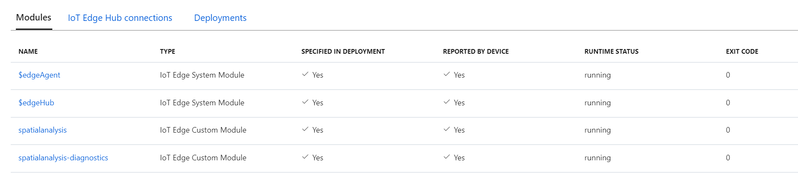
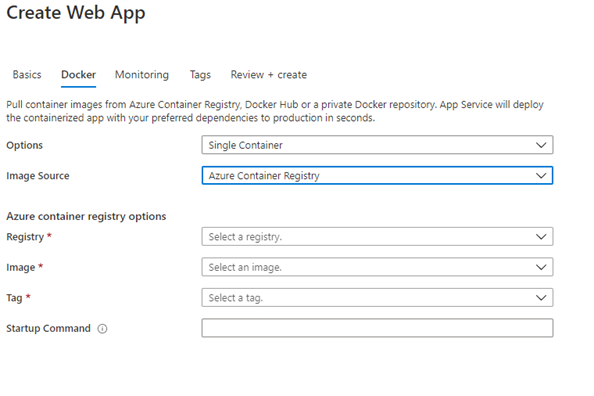
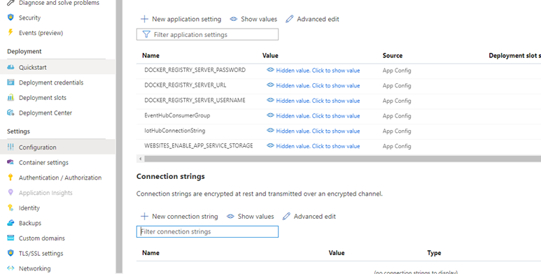
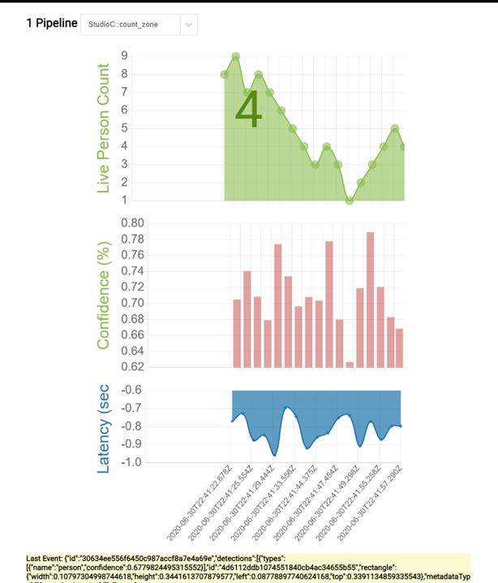

# How to: Deploy a Spatial Analysis web application

Use this article to learn how to deploy a web app which will collect spatial analysis data(insights) from IotHub and visualize it. This can have useful applications across a wide range of scenarios and industries. For example, if a company wants to optimize the use of its real estate space, they are able to quickly create a solution with different scenarios. 

In this tutorial you will learn how to:

* Deploy the Spatial Analysis container
* Configure the operation and camera
* Configure the IoT Hub connection in the Web Application
* Deploy and test the Web Application

This app will showcase below scenarios:

* Count of people entering and exiting a space/store
* Count of people entering and exiting a checkout area/zone and the time spent in the checkout line (dwell time)
* Count of people wearing a face mask 
* Count of people violating social distancing guidelines

## Prerequisites

* Azure subscription - [create one for free](https://azure.microsoft.com/free/cognitive-services/)
* Basic understanding of Azure IoT Edge deployment configurations, and an [Azure IoT Hub](../../iot-hub/index.yml)
* A configured [host computer](spatial-analysis-container.md).

## Deploy the Spatial Analysis container

Follow [the Host Computer Setup](./spatial-analysis-container.md) to configure the host computer and connect an IoT Edge device to Azure IoT Hub. 

### Deploy an Azure IoT Hub service in your subscription

First, create an instance of an Azure IoT Hub service with either the Standard Pricing Tier (S1) or Free Tier (S0). Follow these instructions to create this instance using the Azure CLI.

Fill in the required parameters:
* Subscription: The name or ID of your Azure Subscription
* Resource group: Create a name for your resource group
* Iot Hub Name: Create a name for your IoT Hub
* IoTHub Name: The name of the IoT Hub you created 
* Edge Device Name: Create a name for your Edge Device

```azurecli
az login
az account set --subscription <name or ID of Azure Subscription>
az group create --name "<Resource Group Name>" --location "WestUS"

az iot hub create --name "<IoT Hub Name>" --sku S1 --resource-group "test-resource-group"

az iot hub device-identity create --hub-name "<IoT Hub Name>" --device-id "<Edge Device Name>" --edge-enabled
```

### Deploy the container on Azure IoT Edge on the host computer

The next step is to deploy the **spatial analysis** container as an IoT Module on the host computer using the Azure CLI. The deployment process requires a Deployment Manifest file which outlines the required containers, variables, and configurations for your deployment. A sample Deployment Manifest can be found at [DeploymentManifest.json](https://github.com/Azure-Samples/cognitive-services-spatial-analysis/blob/main/deployment.json) which includes pre-built configurations for  all scenarios.  

### Set environment variables

Most of the **Environment Variables** for the IoT Edge Module are already set in the sample *DeploymentManifest.json* files linked above. In the file, search for the `ENDPOINT` and `APIKEY` environment variables, shown below. Replace the values with the Endpoint URI and the API Key that you created earlier. Ensure that the EULA value is set to "accept". 

```json
"EULA": { 
    "value": "accept"
},
"BILLING":{ 
    "value": "<Use the endpoint from your Vision resource>"
},
"APIKEY":{
    "value": "<Use a key from your Vision resource>"
}
```

### Configure the operation parameters

If you are using the sample [DeploymentManifest.json](https://github.com/Azure-Samples/cognitive-services-spatial-analysis/blob/main/deployment.json) which already has all of the required configurations (operations, recorded video file urls and zones etc.), then you can skip to the **Execute the deployment** section.

Now that the initial configuration of the spatial analysis container is complete, the next step is to configure the operations parameters and add them to the deployment. 

The first step is to update the sample [DeploymentManifest.json](https://github.com/Azure-Samples/cognitive-services-spatial-analysis/blob/main/deployment.json) and configure the desired operation. For example, configuration for cognitiveservices.vision.spatialanalysis-personcount is shown below:

```json
"personcount": {
    "operationId": "cognitiveservices.vision.spatialanalysis-personcount",
    "version": 1,
    "enabled": true,
    "parameters": {
        "VIDEO_URL": "<Replace RTSP URL here>",
        "VIDEO_SOURCE_ID": "<Replace with friendly name>",
        "VIDEO_IS_LIVE":true,
        "DETECTOR_NODE_CONFIG": "{ \"gpu_index\": 0 }",
        "SPACEANALYTICS_CONFIG": "{\"zones\":[{\"name\":\"queue\",\"polygon\":[<Replace with your values>], \"events\": [{\"type\":\"count\"}], \"threshold\":<use 0 for no threshold.}]}"
    }
},
```

After the deployment manifest is updated, follow the camera manufacturer's instructions to install the camera, configure the camera url, and configure the user name and password. 

Next, set `VIDEO_URL` to the RTSP url of the camera, and the credentials for connecting to the camera.

If the edge device has more than one GPU, select the GPU on which to run this operation. Make sure you load balance the operations where there are no more than 8 operations running on a single GPU at a time.  

Next, configure the zone in which you want to count people. To configure the zone polygon, first follow the manufacturer’s instructions to retrieve a frame from the camera. To determine each vertex of the polygon, select a point on the frame, take the x,y pixel coordinates of the point relative to the left, top corner of the frame, and divide by the corresponding frame dimensions. Set the results as x,y coordinates of the vertex. You can set the zone polygon configuration in the `SPACEANALYTICS_CONFIG` field.

This is a sample video frame that shows how the vertex coordinates are being calculated for a frame of size 1920/1080.


You can also select a confidence threshold for when detected people are counted and events are generated. Set the threshold to 0 if you’d like all events to be output.

### Execute the deployment

Now that the deployment manifest is complete, use this command in the Azure CLI to deploy the container on the host computer as an IoT Edge Module.

```azurecli
az login
az extension add --name azure-iot
az iot edge set-modules --hub-name "<IoT Hub name>" --device-id "<IoT Edge device name>" --content DeploymentManifest.json -–subscription "<subscriptionId>"
```

Fill in the required parameters:

* IoT Hub Name: Your Azure IoT Hub name
* DeploymentManifest.json: The name of your deployment file
* IoT Edge device name: The IoT Edge device name of your host computer
* Subscription: Your subscription ID or name

This command will begin the deployment, and you can view the deployment status in your Azure IoT Hub instance in the Azure portal. The status may show as *417 – The device’s deployment configuration is not set* until the device finishes downloading the container images and starts running.

### Validate that the deployment was successful

Locate the *Runtime Status* in the IoT Edge Module Settings for the spatial-analysis module in your IoT Hub instance on the Azure portal. The **Desired Value** and **Reported Value** for the *Runtime Status* should say `Running`. See below for what this will look like on the Azure portal.



At this point, the spatial analysis container is running the operation. It emits AI insights for the operations and routes these insights as telemetry to your Azure IoT Hub instance. To configure additional cameras, you can update the deployment manifest file and execute the deployment again.

## Spatial Analysis Web Application

The Spatial Analysis Web Application enables developers to quickly configure a sample web app, host it in their Azure environment, and use the app to validate E2E events.

## Build Docker Image

Follow the [guide](https://github.com/Azure-Samples/cognitive-services-spatial-analysis/blob/main/README.md#docker-image) to build and push the image to an Azure Container Registry in your subscription.

## Setup Steps

To install the container, create a new Azure App Service and fill in the required parameters. Then go to the **Docker** Tab and select **Single Container**, then **Azure Container Registry**. Use your instance of Azure Container Registry where you pushed the image above.



After entering the above parameters, select **Review+Create** and create the app.

### Configure the app 

Wait for setup to complete, and navigate to your resource in the Azure portal. Go to the **configuration** section and add the following two **application settings**.

* `EventHubConsumerGroup` – The string name of the consumer group from your Azure IoT Hub, you can create a new consumer group in your IoT Hub or use the default group. 
* `IotHubConnectionString` – The connection string to your Azure IoT Hub, this can be retrieved from the keys section of your Azure IoT Hub resource 


Once these 2 settings are added, select **Save**. Then select **Authentication/Authorization** in the left navigation menu, and update it with the desired level of authentication. We recommend Azure Active Directory (Azure AD) express. 

### Test the app

Go to the Azure Service and verify the deployment was successful, and the web app is running. Navigate to the configured url: `<yourapp>.azurewebsites.net` to view the running app.



## Get the PersonCount source code
If you'd like to view or modify the source code for this application, you can find it [on GitHub](https://github.com/Azure-Samples/cognitive-services-spatial-analysis).

## Next steps

* [Configure Spatial Analysis operations](./spatial-analysis-operations.md)
* [Logging and troubleshooting](spatial-analysis-logging.md)
* [Camera placement guide](spatial-analysis-camera-placement.md)
* [Zone and line placement guide](spatial-analysis-zone-line-placement.md)
