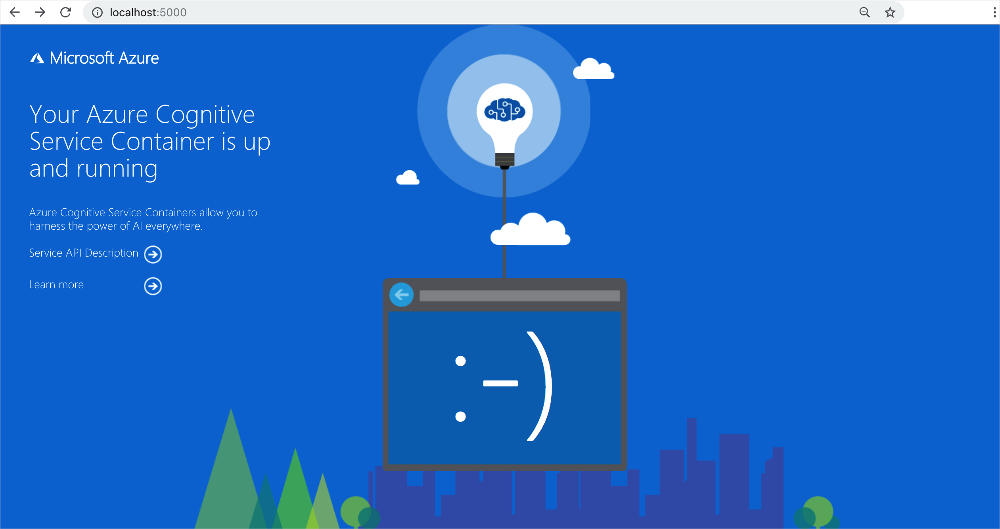

# Deploy and run container on Azure Container Instance

With the following steps, scale Azure AI services applications in the cloud easily with Azure [Container Instances](../../container-instances/index.yml). Containerization helps you focus on building your applications instead of managing the infrastructure. For more information on using containers, see [features and benefits](../cognitive-services-container-support.md#features-and-benefits).

## Prerequisites

The recipe works with any Azure AI services container. The Azure AI services resource must be created before using the recipe. Each Azure AI service that supports containers has a "How to install" article for installing and configuring the service for a container. Some services require a file or set of files as input for the container, it is important that you understand and have used the container successfully before using this solution.

* An Azure resource for the Azure AI service you're using.
* Azure AI service resource **endpoint URL** - review your specific service's "How to install" for the container, to find where the endpoint URL is from within the Azure portal, and what a correct example of the URL looks like. The exact format can change from service to service.
* Azure AI service resource **key** - the keys are on the **Keys** page for the Azure resource. You only need one of the two keys. The key is a string of 32 alpha-numeric characters.

* A single Azure AI services container on your local host (your computer). Make sure you can:
  * Pull down the image with a `docker pull` command.
  * Run the local container successfully with all required configuration settings with a `docker run` command.
  * Call the container's endpoint, getting a response of HTTP 2xx and a JSON response back.

All variables in angle brackets, `<>`, need to be replaced with your own values. This replacement includes the angle brackets.

> [!IMPORTANT]
> The LUIS container requires a `.gz` model file that is pulled in at runtime. The container must be able to access this model file via a volume mount from the container instance. To upload a model file, follow these steps:
> 1. [Create an Azure file share](../../storage/files/storage-how-to-create-file-share.md). Take note of the Azure Storage account name, key, and file share name as you'll need them later.
> 2. [export your LUIS model (packaged app) from the LUIS portal](../LUIS/luis-container-howto.md#export-packaged-app-from-luis). 
> 3. In the Azure portal, navigate to the **Overview** page of your storage account resource, and select **File shares**. 
> 4. Select the file share name that you recently created, then select **Upload**. Then upload your packaged app. 

# [Azure portal](#tab/portal)

[!INCLUDE [Portal instructions for creating an ACI instance](includes/create-container-instances-resource.md)]

# [CLI](#tab/cli)

[!INCLUDE [CLI instructions for creating an ACI instance](../containers/includes/create-container-instances-resource-from-azure-cli.md)]

---

## Use the Container Instance

# [Azure portal](#tab/portal)

1. Select the **Overview** and copy the IP address. It will be a numeric IP address such as `55.55.55.55`.
1. Open a new browser tab and use the IP address, for example, `http://<IP-address>:5000 (http://55.55.55.55:5000`). You will see the container's home page, letting you know the container is running.

    

1. Select **Service API Description** to view the swagger page for the container.

1. Select any of the **POST** APIs and select **Try it out**.  The parameters are displayed including the input. Fill in the parameters.

1. Select **Execute** to send the request to your Container Instance.

    You have successfully created and used Azure AI containers in Azure Container Instance.

# [CLI](#tab/cli)

[!INCLUDE [API documentation](../../../includes/cognitive-services-containers-api-documentation.md)]

> [!NOTE]
> If you're running the Text Analytics for health container, use the following URL to submit queries: `http://localhost:5000/text/analytics/v3.2-preview.1/entities/health`

---
