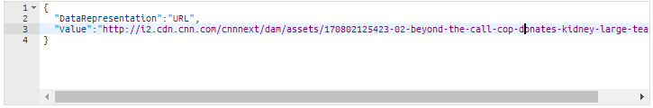
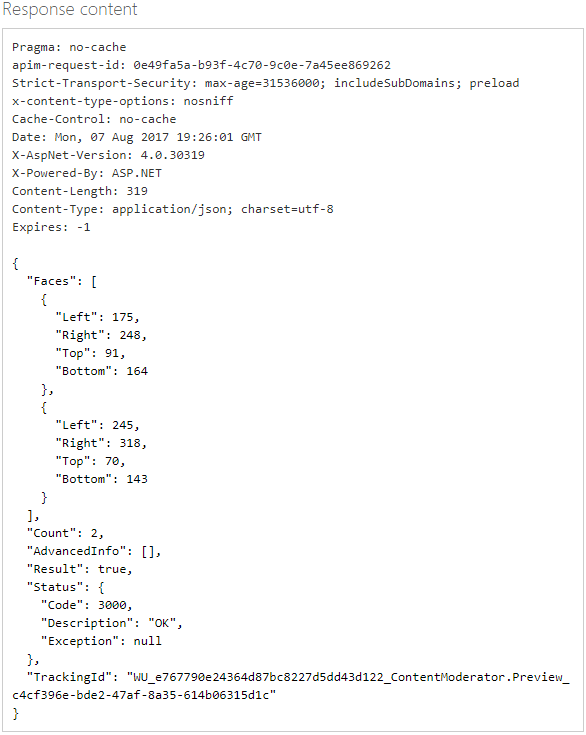

# Moderate images from the API console

Use the [Image Moderation API](https://westus.dev.cognitive.microsoft.com/docs/services/57cf753a3f9b070c105bd2c1/operations/57cf753a3f9b070868a1f66c) in Azure Content Moderator to scan image content. The moderation job scans your content for profanity, and compares it against custom and shared blocklists.

## Use the API console
Before you can test-drive the API in the online console, you need your subscription key. This is located on the **Settings** tab, in the **Ocp-Apim-Subscription-Key** box. For more information, see [Overview](overview.md).

1. Go to [Image Moderation API reference](https://westus.dev.cognitive.microsoft.com/docs/services/57cf753a3f9b070c105bd2c1/operations/57cf753a3f9b070868a1f66c).

   The **Image - Evaluate** image moderation page opens.

2. For **Open API testing console**, select the region that most closely describes your location. 

   
  
   The **Image - Evaluate** API console opens.

3. In the **Ocp-Apim-Subscription-Key** box, enter your subscription key.

   

4. In the **Request body** box, use the default sample image, or specify an image to scan. You can submit the image itself as binary bit data, or specify a publicly accessible URL for an image. 

   For this example, use the path provided in the **Request body** box, and then select **Send**. 

   

   This is the image at that URL:

    

5. Select **Send**.

6. The API returns a probability score for each classification. It also returns a determination of whether the image meets the conditions (**true** or **false**). 

   

## Face detection

You can use the Image Moderation API to locate faces in an image. This option can be useful when you have privacy concerns and want to prevent a specific face from being posted on your platform. 

1. In the [Image Moderation API reference](https://westus.dev.cognitive.microsoft.com/docs/services/57cf753a3f9b070c105bd2c1/operations/57cf753a3f9b070868a1f66c), in the left menu, under **Image**, select **Find Faces**. 

   The **Image - Find Faces** page opens.

2. For **Open API testing console**, select the region that most closely describes your location. 

   

   The **Image - Find Faces** API console opens.

3. Specify an image to scan. You can submit the image itself as binary bit data, or specify a publicly accessible URL to an image. This example links to an image that's used in a CNN story.

   

   

4. Select **Send**. In this example, the API finds two faces, and returns their coordinates in the image.

   

## Text detection via OCR capability

You can use the Content Moderator OCR capability to detect text in images.

1. In the [Image Moderation API reference](https://westus.dev.cognitive.microsoft.com/docs/services/57cf753a3f9b070c105bd2c1/operations/57cf753a3f9b070868a1f66c), in the left menu, under **Image**, select **OCR**. 

   The **Image - OCR** page opens.

2. For **Open API testing console**, select the region that most closely describes your location. 

   

   The **Image - OCR** API console opens.

3. In the **Ocp-Apim-Subscription-Key** box, enter your subscription key.

4. In the **Request body** box, use the default sample image. This is the same image that's used in the preceding section.

5. Select **Send**. The extracted text is displayed in JSON:

   

## Next steps

Use the REST API in your code, or follow the [.NET SDK quickstart](./client-libraries.md?pivots=programming-language-csharp%253fpivots%253dprogramming-language-csharp) to add image moderation to your application.
