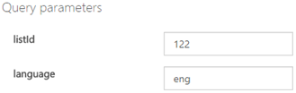
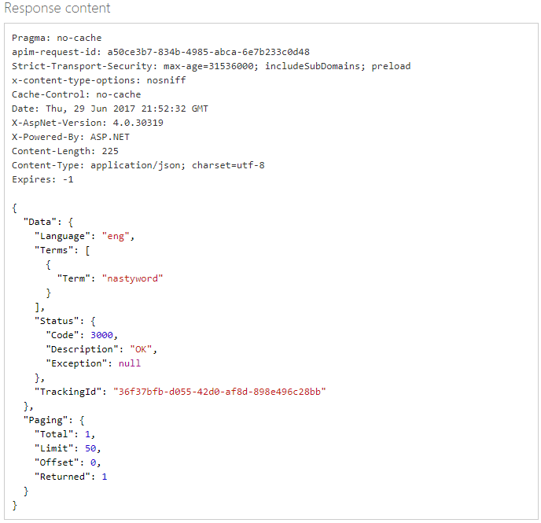
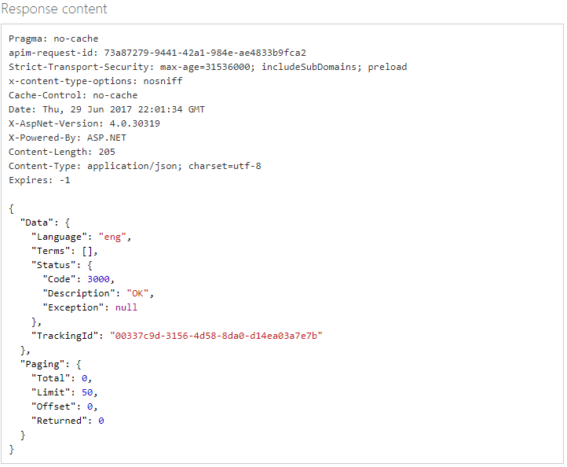

# Moderate with custom term lists in the API console

The default global list of terms in Azure AI Content Moderator is sufficient for most content moderation needs. However, you might need to screen for terms that are specific to your organization. For example, you might want to tag competitor names for further review. 

Use the [List Management API](https://westus.dev.cognitive.microsoft.com/docs/services/57cf755e3f9b070c105bd2c2/operations/57cf755e3f9b070868a1f67f) to create custom lists of terms to use with the Text Moderation API. The **Text - Screen** operation scans your text for profanity, and also compares text against custom and shared blocklists.

> [!NOTE]
> There is a maximum limit of **5 term lists** with each list to **not exceed 10,000 terms**.
>

You can use the List Management API to do the following tasks:
- Create a list.
- Add terms to a list.
- Screen terms against the terms in a list.
- Delete terms from a list.
- Delete a list.
- Edit list information.
- Refresh the index so that changes to the list are included in a new scan.

## Use the API console

Before you can test-drive the API in the online console, you need your subscription key. This key is located on the **Settings** tab, in the **Ocp-Apim-Subscription-Key** box. For more information, see [Overview](overview.md).

## Refresh search index

After you make changes to a term list, you must refresh its index for changes to be included in future scans. This step is similar to how a search engine on your desktop (if enabled) or a web search engine continually refreshes its index to include new files or pages.

1. In the [Term List Management API reference](https://westus.dev.cognitive.microsoft.com/docs/services/57cf755e3f9b070c105bd2c2/operations/57cf755e3f9b070868a1f67f), in the left menu, select **Term Lists**, and then select **Refresh Search Index**. 

   The **Term Lists - Refresh Search Index** page opens.

2. For **Open API testing console**, select the region that most closely describes your location. 

   

   The **Term Lists - Refresh Search Index** API console opens.

3. In the **listId** box, enter the list ID. Enter your subscription key, and then select **Send**.

   

## Create a term list
1. Go to the [Term List Management API reference](https://westus.dev.cognitive.microsoft.com/docs/services/57cf755e3f9b070c105bd2c2/operations/57cf755e3f9b070868a1f67f). 

   The **Term Lists - Create** page opens.

2. For **Open API testing console**, select the region that most closely describes your location. 

   

   The **Term Lists - Create** API console opens.
 
3. In the **Ocp-Apim-Subscription-Key** box, enter your subscription key.

4. In the **Request body** box, enter values for **Name** (for example, MyList) and **Description**.

   

5. Use key-value pair placeholders to assign more descriptive metadata to your list.

    ```json
    {
        "Name": "MyExclusionList",
        "Description": "MyListDescription",
        "Metadata": 
        {
            "Category": "Competitors",
            "Type": "Exclude"
        }
    }
    ```

   Add list metadata as key-value pairs, and not actual terms.
 
6. Select **Send**. Your list is created. Note the **ID** value that is associated with the new list. You need this ID for other term list management functions.

   
 
7. Add terms to MyList. In the left menu, under **Term**, select **Add Term**. 

   The **Term - Add Term** page opens. 

8. For **Open API testing console**, select the region that most closely describes your location. 

   

   The **Term - Add Term** API console opens.
 
9. In the **listId** box, enter the list ID that you generated, and select a value for **language**. Enter your subscription key, and then select **Send**.

   
 
10.	To verify that the term has been added to the list, in the left menu, select **Term**, and then select **Get All Terms**. 

    The **Term - Get All Terms** API console opens.

11. In the **listId** box, enter the list ID, and then enter your subscription key. Select **Send**.

12. In the **Response content** box, verify the terms you entered.

    
 
13.	Add a few more terms. Now that you have created a custom list of terms, try [scanning some text](try-text-api.md) by using the custom term list. 

## Delete terms and lists

Deleting a term or a list is straightforward. You use the API to do the following tasks:

- Delete a term. (**Term - Delete**)
- Delete all the terms in a list without deleting the list. (**Term - Delete All Terms**)
- Delete a list and all of its contents. (**Term Lists - Delete**)

This example deletes a single term.

1. In the [Term List Management API reference](https://westus.dev.cognitive.microsoft.com/docs/services/57cf755e3f9b070c105bd2c2/operations/57cf755e3f9b070868a1f67f), in the left menu, select **Term**, and then select **Delete**. 

   The **Term - Delete** opens.

2. For **Open API testing console**, select the region that most closely describes your location. 

   

   The **Term - Delete** API console opens.
  
3. In the **listId** box, enter the ID of the list that you want to delete a term from. This ID is the number (in our example, **122**) that is returned in the **Term Lists - Get Details** console for MyList. Enter the term and select a language.
 
   

4. Enter your subscription key, and then select **Send**.

5. To verify that the term has been deleted, use the **Term Lists - Get All** console.

   
 
## Change list information

You can edit a list’s name and description, and add metadata items.

1. In the [Term List Management API reference](https://westus.dev.cognitive.microsoft.com/docs/services/57cf755e3f9b070c105bd2c2/operations/57cf755e3f9b070868a1f67f), in the left menu, select **Term Lists**, and then select **Update Details**. 

   The **Term Lists - Update Details** page opens.

2. For **Open API testing console**, select the region that most closely describes your location. 

   

   The **Term Lists - Update Details** API console opens.

3. In the **listId** box, enter the list ID, and then enter your subscription key.

4. In the **Request body** box, make your edits, and then select **Send**.

   
 

## Next steps

Use the REST API in your code or start with the [Term lists .NET quickstart](term-lists-quickstart-dotnet.md) to integrate with your application.
