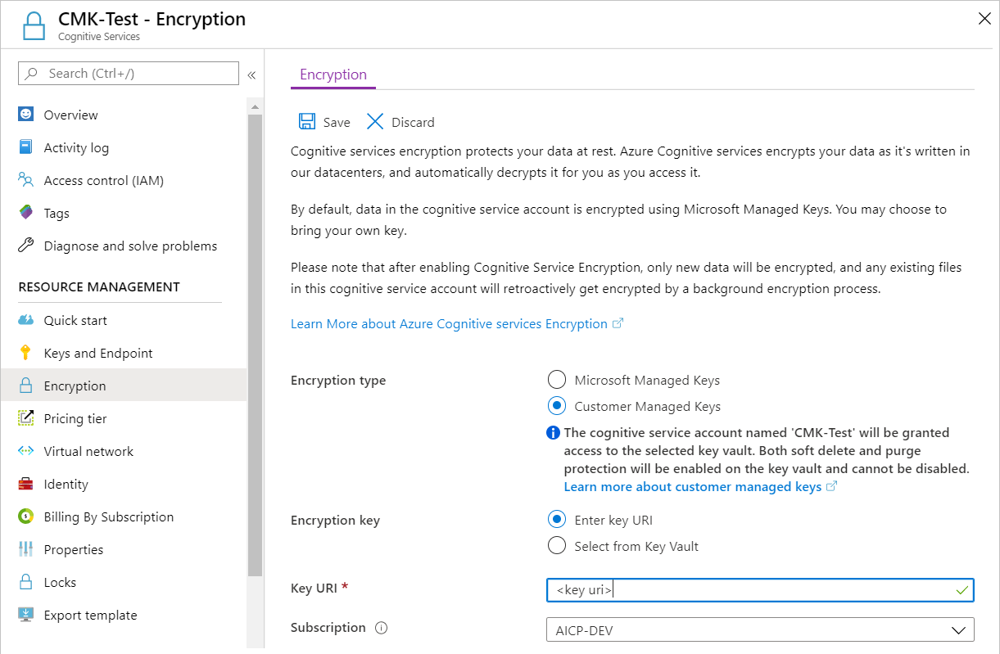
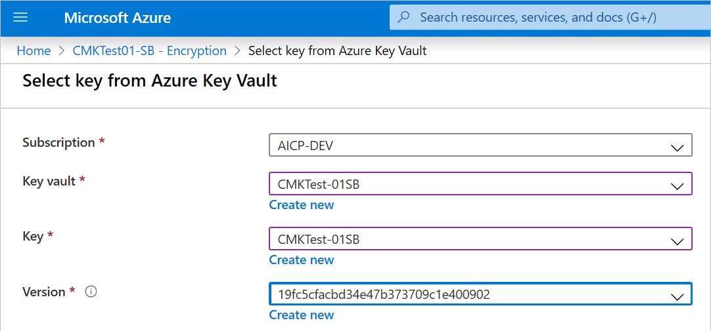

# Azure AI Content Safety encryption of data at rest

Azure AI Content Safety automatically encrypts your data when it's persisted to the cloud. The encryption protects your data and helps you meet your organizational security and compliance commitments. This article covers how Azure AI Content Safety handles encryption of data at rest. 

## About Azure AI services encryption

Azure AI Content Safety is part of Azure AI services. Azure AI services data is encrypted and decrypted using [FIPS 140-2](https://en.wikipedia.org/wiki/FIPS_140-2) compliant [256-bit AES](https://en.wikipedia.org/wiki/Advanced_Encryption_Standard) encryption. Encryption and decryption are transparent, meaning encryption and access are managed for you. Your data is secure by default and you don't need to modify your code or applications to take advantage of encryption.

## About encryption key management

By default, your subscription uses Microsoft-managed encryption keys. There's also the option to manage your subscription with your own keys called customer-managed keys (CMK). CMK offers greater flexibility to create, rotate, disable, and revoke access controls. You can also audit the encryption keys used to protect your data.

> [!IMPORTANT]
> For blocklist names, only MMK encryption is applied by default. Using CMK or not will not change this behavior. All the other data will use either MMK or CMK depending on what you've selected.

## Customer-managed keys with Azure Key Vault

Customer-managed keys (CMK), also known as Bring your own key (BYOK), offer greater flexibility to create, rotate, disable, and revoke access controls. You can also audit the encryption keys used to protect your data.

You must use Azure Key Vault to store your customer-managed keys. You can either create your own keys and store them in a key vault, or you can use the Azure Key Vault APIs to generate keys. The Azure AI services resource and the key vault must be in the same region and in the same Azure Active Directory (Azure AD) tenant, but they can be in different subscriptions. For more information about Azure Key Vault, see [What is Azure Key Vault?](/azure/key-vault/general/overview).

To enable customer-managed keys, you must also enable both the **Soft Delete** and **Do Not Purge** properties on the key vault.

Only RSA keys of size 2048 are supported with Azure AI services encryption. For more information about keys, see **Key Vault keys** in [About Azure Key Vault keys, secrets and certificates](/azure/key-vault/general/about-keys-secrets-certificates).

## Enable customer-managed keys for your resource

To enable customer-managed keys in the Azure portal, follow these steps:

1. Go to your Azure AI services resource.
2. On the left, select **Encryption**.
3. Under **Encryption type**, select **Customer Managed Keys**, as shown in the following screenshot.

:::image type="content" source="../media/encryption.png" alt-text="Screenshot of encryption tab in Azure portal.":::

## Specify a key

After you enable customer-managed keys, you can specify a key to associate with the Azure AI services resource.

### Specify a key as a URI

To specify a key as a URI, follow these steps:

1. In the Azure portal, go to your key vault.

2. Under **Settings**, select **Keys**.

3. Select the desired key, and then select the key to view its versions. Select a key version to view the settings for that version.

4. Copy the **Key Identifier** value, which provides the URI.

   

5. Go back to your Azure AI services resource, and then select **Encryption**.

6. Under **Encryption key**, select **Enter key URI**.

7. Paste the URI that you copied into the **Key URI** box.

   

8. Under **Subscription**, select the subscription that contains the key vault.

9. Save your changes.

### Specify a key from a key vault

To specify a key from a key vault, first make sure that you have a key vault that contains a key. Then follow these steps:

1. Go to your Azure AI services resource, and then select **Encryption**.

2. Under **Encryption key**, select **Select from Key Vault**.

3. Select the key vault that contains the key that you want to use.

4. Select the key that you want to use.

   

5. Save your changes.

## Update the key version

When you create a new version of a key, update the Azure AI services resource to use the new version. Follow these steps:

1. Go to your Azure AI services resource, and then select **Encryption**.
2. Enter the URI for the new key version. Alternately, you can select the key vault and then select the key again to update the version.
3. Save your changes.

## Use a different key

To change the key that you use for encryption, follow these steps:

1. Go to your Azure AI services resource, and then select **Encryption**.
2. Enter the URI for the new key. Alternately, you can select the key vault and then select a new key.
3. Save your changes.

## Rotate customer-managed keys

You can rotate a customer-managed key in Key Vault according to your compliance policies. When the key is rotated, you must update the Azure AI services resource to use the new key URI. To learn how to update the resource to use a new version of the key in the Azure portal, see [Update the key version](../../openai/encrypt-data-at-rest.md#update-the-key-version).

Rotating the key doesn't trigger re-encryption of data in the resource. No further action is required from the user.

## Revoke a customer-managed key

To revoke access to customer-managed keys, use PowerShell or Azure CLI. For more information, see [Azure Key Vault PowerShell](/powershell/module/az.keyvault//) or [Azure Key Vault CLI](/cli/azure/keyvault). Revoking access effectively blocks access to all data in the Azure AI services resource, because the encryption key is inaccessible by Azure AI services.

## Disable customer-managed keys

When you disable customer-managed keys, your Azure AI services resource is then encrypted with Microsoft-managed keys. To disable customer-managed keys, follow these steps:

1. Go to your Azure AI services resource, and then select **Encryption**.
2. Select **Microsoft Managed Keys** > **Save**.

When you previously enabled customer managed keys this also enabled a system assigned managed identity, a feature of Azure AD. Once the system assigned managed identity is enabled, this resource will be registered with Azure Active Directory. After being registered, the managed identity will be given access to the Key Vault selected during customer managed key setup. You can learn more about [Managed Identities](/azure/active-directory/managed-identities-azure-resources/overview).

> [!IMPORTANT]
> If you disable system assigned managed identities, access to the key vault will be removed and any data encrypted with the customer keys will no longer be accessible. Any features depended on this data will stop working.

> [!IMPORTANT]
> Managed identities do not currently support cross-directory scenarios. When you configure customer-managed keys in the Azure portal, a managed identity is automatically assigned under the covers. If you subsequently move the subscription, resource group, or resource from one Azure AD directory to another, the managed identity associated with the resource is not transferred to the new tenant, so customer-managed keys may no longer work. For more information, see **Transferring a subscription between Azure AD directories** in [FAQs and known issues with managed identities for Azure resources](/azure/active-directory/managed-identities-azure-resources/known-issues#transferring-a-subscription-between-azure-ad-directories).

## Next steps
* [Content Safety overview](../overview.md)
