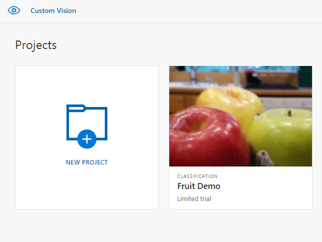
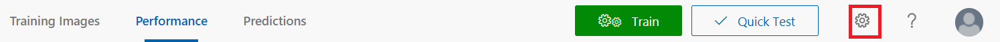
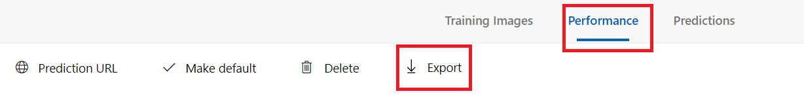

# Export your model for use with mobile devices

Custom Vision Service lets you export your classifiers to run offline. You can embed your exported classifier into an application and run it locally on a device for real-time classification.

## Export options

Custom Vision Service supports the following exports:

* **TensorFlow** for **Android**.
* **TensorFlow.js** for JavaScript frameworks like React, Angular, and Vue. This will run on both **Android** and **iOS** devices.
* **CoreML** for **iOS11**.
* **ONNX** for **Windows ML**, **Android**, and **iOS**.
* **[Vision AI Developer Kit](https://azure.github.io/Vision-AI-DevKit-Pages/)**.
* A **Docker container** for Windows, Linux, or ARM architecture. The container includes a TensorFlow model and service code to use the Custom Vision API.

> [!IMPORTANT]
> Custom Vision Service only exports projects with **compact** domains. The models generated by compact domains are optimized for the constraints of real-time classification on mobile devices. Classifiers built with a compact domain may be slightly less accurate than a standard domain with the same amount of training data.
>
> For information on improving your classifiers, see the [Improving your classifier](getting-started-improving-your-classifier.md) document.

## Convert to a compact domain

> [!NOTE]
> The steps in this section only apply if you have an existing model that is not set to compact domain.

To convert the domain of an existing model, take the following steps:

1. On the [Custom vision website](https://customvision.ai), select the **Home** icon to view a list of your projects.

    

1. Select a project, and then select the **Gear** icon in the upper right of the page.

    

1. In the **Domains** section, select one of the **compact** domains. Select **Save Changes** to save the changes. 

    > [!NOTE]
    > For Vision AI Dev Kit, the project must be created with the **General (Compact)** domain, and you must specify the **Vision AI Dev Kit** option under the **Export Capabilities** section.

    

1. From the top of the page, select **Train** to retrain using the new domain.

## Export your model

To export the model after retraining, use the following steps:

1. Go to the **Performance** tab and select **Export**. 

    

    > [!TIP]
    > If the **Export** entry is not available, then the selected iteration does not use a compact domain. Use the **Iterations** section of this page to select an iteration that uses a compact domain, and then select **Export**.

1. Select your desired export format, and then select **Export** to download the model.

## Next steps

Integrate your exported model into an application by exploring one of the following articles or samples:

* [Use your TensorFlow model with Python](export-model-python.md)
* [Use your ONNX model with Windows Machine Learning](custom-vision-onnx-windows-ml.md)
* See the sample for [CoreML model in an iOS application](https://go.microsoft.com/fwlink/?linkid=857726) for real-time image classification with Swift.
* See the sample for [TensorFlow model in an Android application](https://github.com/Azure-Samples/cognitive-services-android-customvision-sample) for real-time image classification on Android.
* See the sample for [CoreML model with Xamarin](https://github.com/xamarin/ios-samples/tree/master/ios11/CoreMLAzureModel) for real-time image classification in a Xamarin iOS app.
