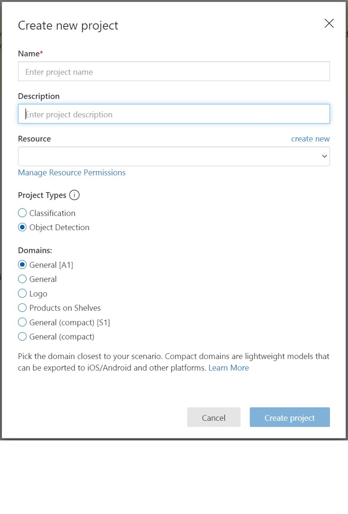
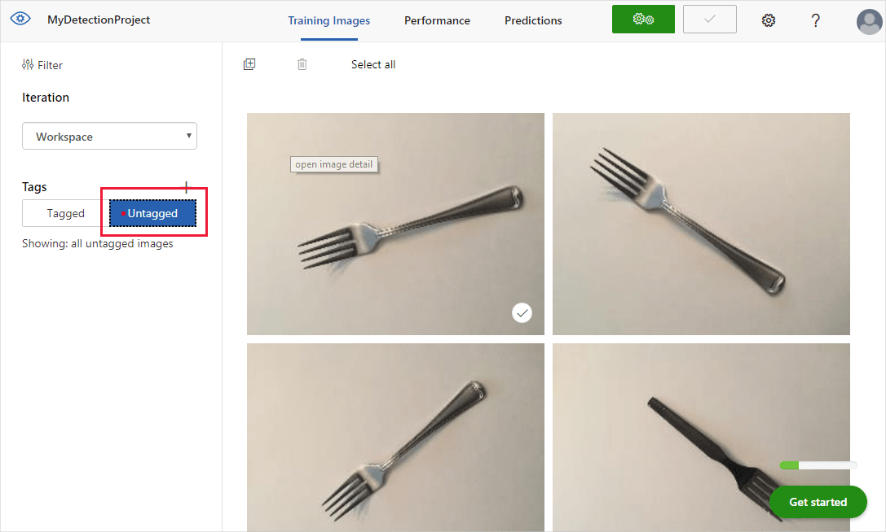
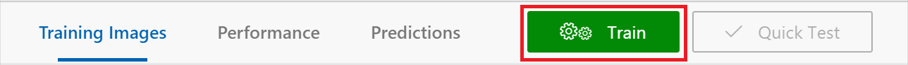
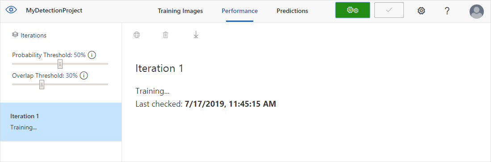

# Quickstart: Build an object detector with the Custom Vision website

In this quickstart, you'll learn how to use the Custom Vision website to create an object detector model. Once you build a model, you can test it with new images and integrate it into your own image recognition app.

If you don't have an Azure subscription, create a [free account](https://azure.microsoft.com/free/cognitive-services/) before you begin.

## Prerequisites

- A set of images with which to train your detector model. You can use the set of [sample images](https://github.com/Azure-Samples/cognitive-services-python-sdk-samples/tree/master/samples/vision/images) on GitHub. Or, you can choose your own images using the tips below.
- A [supported web browser](overview.md#supported-browsers-for-custom-vision-web-portal)

## Create Custom Vision resources

[!INCLUDE [create-resources](includes/create-resources.md)]

## Create a new project

In your web browser, navigate to the [Custom Vision web page](https://customvision.ai) and select __Sign in__. Sign in with the same account you used to sign in to the Azure portal.

1. To create your first project, select **New Project**. The **Create new project** dialog box will appear.

    

1. Enter a name and a description for the project. Then select your Custom Vision Training Resource. If your signed-in account is associated with an Azure account, the Resource dropdown will display all of your compatible Azure resources. 

   > [!NOTE]
   > If no resource is available, please confirm that you have logged into [customvision.ai](https://customvision.ai) with the same account as you used to sign in to the [Azure portal](https://portal.azure.com). Also, please confirm you have selected the same "Directory" in the Custom Vision website as the directory in the Azure portal where your Custom Vision resources are located. In both sites, you may select your directory from the drop down account menu at the top right corner of the screen. 

1. Under 
1. Select __Object Detection__ under __Project Types__.

1. Next, select one of the available domains. Each domain optimizes the detector for specific types of images, as described in the following table. You can change the domain later if you want to.

    |Domain|Purpose|
    |---|---|
    |__General__| Optimized for a broad range of object detection tasks. If none of the other domains are appropriate, or if you're unsure about which domain to choose, select the __General__ domain. |
    |__Logo__|Optimized for finding brand logos in images.|
    |__Products on shelves__|Optimized for detecting and classifying products on shelves.|
    |__Compact domains__| Optimized for the constraints of real-time object detection on mobile devices. The models generated by compact domains can be exported to run locally.|

1. Finally, select __Create project__.

## Choose training images

[!INCLUDE [choose training images](includes/choose-training-images.md)]

## Upload and tag images

In this section, you'll upload and manually tag images to help train the detector. 

1. To add images, select __Add images__ and then select __Browse local files__. Select __Open__ to upload the images.

    

1. You'll see your uploaded images in the **Untagged** section of the UI. The next step is to manually tag the objects that you want the detector to learn to recognize. Select the first image to open the tagging dialog window. 

    

1. Select and drag a rectangle around the object in your image. Then, enter a new tag name with the **+** button, or select an existing tag from the drop-down list. It's important to tag every instance of the object(s) you want to detect, because the detector uses the untagged background area as a negative example in training. When you're done tagging, select the arrow on the right to save your tags and move on to the next image.

    

To upload another set of images, return to the top of this section and repeat the steps.

## Train the detector

To train the detector model, select the **Train** button. The detector uses all of the current images and their tags to create a model that identifies each tagged object. This process can take several minutes.

The training process should only take a few minutes. During this time, information about the training process is displayed in the **Performance** tab.

## Evaluate the detector

After training has completed, the model's performance is calculated and displayed. The Custom Vision service uses the images that you submitted for training to calculate precision, recall, and mean average precision. Precision and recall are two different measurements of the effectiveness of a detector:

- **Precision** indicates the fraction of identified classifications that were correct. For example, if the model identified 100 images as dogs, and 99 of them were actually of dogs, then the precision would be 99%.
- **Recall** indicates the fraction of actual classifications that were correctly identified. For example, if there were actually 100 images of apples, and the model identified 80 as apples, the recall would be 80%.
- **Mean average precision** is the average value of the average precision (AP). AP is the area under the precision/recall curve (precision plotted against recall for each prediction made).

### Probability threshold

[!INCLUDE [probability threshold](includes/probability-threshold.md)]

### Overlap threshold

The **Overlap Threshold** slider deals with how correct an object prediction must be to be considered "correct" in training. It sets the minimum allowed overlap between the predicted object's bounding box and the actual user-entered bounding box. If the bounding boxes don't overlap to this degree, the prediction won't be considered correct.

## Manage training iterations

Each time you train your detector, you create a new _iteration_ with its own updated performance metrics. You can view all of your iterations in the left pane of the **Performance** tab. In the left pane you'll also find the **Delete** button, which you can use to delete an iteration if it's obsolete. When you delete an iteration, you delete any images that are uniquely associated with it.

See [Use your model with the prediction API](./use-prediction-api.md) to learn how to access your trained models programmatically.

## Next steps

In this quickstart, you learned how to create and train an object detector model using the Custom Vision website. Next, get more information on the iterative process of improving your model.

> [!div class="nextstepaction"]
> [Test and retrain a model](test-your-model.md)

* [What is Custom Vision?](./overview.md)
