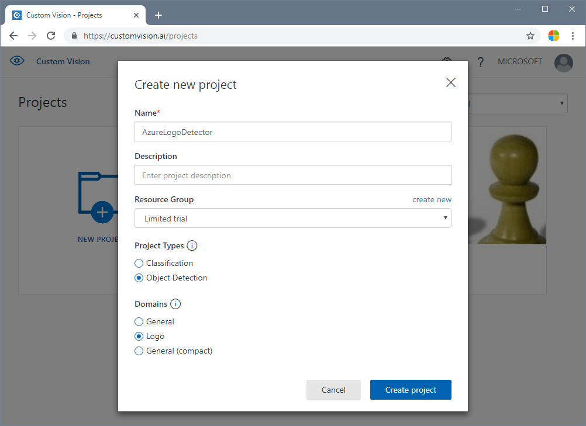
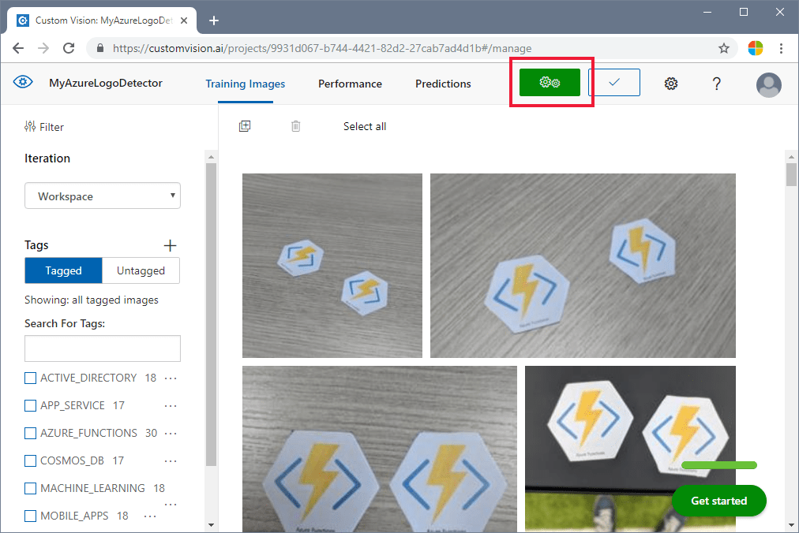
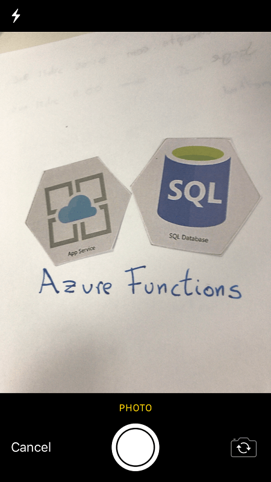

# Tutorial: Recognize Azure service logos in camera pictures

In this tutorial, you'll explore a sample app that uses Custom Vision as part of a larger scenario. The AI Visual Provision app, a Xamarin.Forms application for mobile platforms, analyzes photos of Azure service logos and then deploys those services to the user's Azure account. Here you'll learn how it uses Custom Vision in coordination with other components to deliver a useful end-to-end application. You can run the whole app scenario for yourself, or you can complete only the Custom Vision part of the setup and explore how the app uses it.

This tutorial shows you how to:

> [!div class="checklist"]
> - Create a custom object detector to recognize Azure service logos.
> - Connect your app to Azure AI Vision and Custom Vision.
> - Create an Azure service principal account to deploy Azure services from the app.

If you don't have an Azure subscription, create a [free account](https://azure.microsoft.com/free/cognitive-services/) before you begin. 

## Prerequisites

- [Visual Studio 2017 or later](https://www.visualstudio.com/downloads/)
- The Xamarin workload for Visual Studio (see [Installing Xamarin](/xamarin/cross-platform/get-started/installation/windows))
- An iOS or Android emulator for Visual Studio
- The [Azure CLI](/cli/azure/install-azure-cli-windows) (optional)

## Get the source code

If you want to use the provided web app, clone or download the app's source code from the [AI Visual Provision](https://github.com/Microsoft/AIVisualProvision) repository on GitHub. Open the *Source/VisualProvision.sln* file in Visual Studio. Later, you'll edit some of the project files so you can run the app yourself.

## Create an object detector

Sign in to the [Custom Vision web portal](https://customvision.ai/) and create a new project. Specify an Object Detection project and use the Logo domain; this will let the service use an algorithm optimized for logo detection. 



## Upload and tag images

Next, train the logo detection algorithm by uploading images of Azure service logos and tagging them manually. The AIVisualProvision repository includes a set of training images that you can use. On the website, select the **Add images** button on the **Training Images** tab. Then go to the **Documents/Images/Training_DataSet** folder of the repository. You'll need to manually tag the logos in each image, so if you're only testing out this project, you might want to upload only a subset of the images. Upload at least 15 instances of each tag you plan to use.

After you upload the training images, select the first one on the display. The tagging window will appear. Draw boxes and assign tags for each logo in each image. 


The app is configured to work with specific tag strings. You'll find the definitions in the *Source\VisualProvision\Services\Recognition\RecognitionService.cs* file:

[!code-csharp[Tag definitions](~/AIVisualProvision/Source/VisualProvision/Services/Recognition/RecognitionService.cs?name=snippet_constants)]

After you tag an image, go to the right to tag the next one. Close the tagging window when you finish.

## Train the object detector

In the left pane, set the **Tags** switch to **Tagged** to display your images. Then select the green button at the top of the page to train the model. The algorithm will train to recognize the same tags in new images. It will also test the model on some of your existing images to generate accuracy scores.



## Get the prediction URL

After your model is trained, you're ready to integrate it into your app. You'll need to get the endpoint URL (the address of your model, which the app will query) and the prediction key (to grant the app access to prediction requests). On the **Performance** tab, select the **Prediction URL** button at the top of the page.


Copy the endpoint URL and the **Prediction-Key** value to the appropriate fields in the *Source\VisualProvision\AppSettings.cs* file:

[!code-csharp[Custom Vision fields](~/AIVisualProvision/Source/VisualProvision/AppSettings.cs?name=snippet_cusvis_keys)]

## Examine Custom Vision usage

Open the *Source/VisualProvision/Services/Recognition/CustomVisionService.cs* file to see how the app uses your Custom Vision key and endpoint URL. The **PredictImageContentsAsync** method takes a byte stream of an image file along with a cancellation token (for asynchronous task management), calls the Custom Vision prediction API, and returns the result of the prediction. 

[!code-csharp[Custom Vision fields](~/AIVisualProvision/Source/VisualProvision/Services/Recognition/CustomVisionService.cs?name=snippet_prediction)]

This result takes the form of a **PredictionResult** instance, which itself contains a list of **Prediction** instances. A **Prediction** contains a detected tag and its bounding box location in the image.

[!code-csharp[Custom Vision fields](~/AIVisualProvision/Source/VisualProvision/Services/Recognition/Prediction.cs?name=snippet_prediction_class)]

To learn more about how the app handles this data, start with the **GetResourcesAsync** method. This method is defined in the *Source/VisualProvision/Services/Recognition/RecognitionService.cs* file.  

## Add text recognition

The Custom Vision portion of the tutorial is complete. If you want to run the app, you'll need to integrate the Azure AI Vision service as well. The app uses the Azure AI Vision text recognition feature to supplement the logo detection process. An Azure logo can be recognized by its appearance *or* by the text printed near it. Unlike Custom Vision models, Azure AI Vision is pretrained to perform certain operations on images or videos.

Subscribe to the Azure AI Vision service to get a key and endpoint URL. For help on this step, see [How to obtain keys](../multi-service-resource.md?pivots=azportal).


Next, open the *Source\VisualProvision\AppSettings.cs* file and populate the `ComputerVisionEndpoint` and `ComputerVisionKey` variables with the correct values.

[!code-csharp[Azure AI Vision fields](~/AIVisualProvision/Source/VisualProvision/AppSettings.cs?name=snippet_comvis_keys)]

## Create a service principal

The app requires an Azure service principal account to deploy services to your Azure subscription. A service principal lets you delegate specific permissions to an app using Azure role-based access control. To learn more, see the [service principals guide](/azure-stack/operator/azure-stack-create-service-principals).

You can create a service principal by using either Azure Cloud Shell or the Azure CLI, as shown here. To begin, sign in and select the subscription you want to use.

```azurecli
az login
az account list
az account set --subscription "<subscription name or subscription id>"
```

Then create your service principal. (This process might take some time to finish.)

```azurecli
az ad sp create-for-rbac --name <servicePrincipalName> --role Contributor --scopes /subscriptions/<subscription_id> --password <yourSPStrongPassword>
```

Upon successful completion, you should see the following JSON output, including the necessary credentials.

```json
{
  "clientId": "(...)",
  "clientSecret": "(...)",
  "subscriptionId": "(...)",
  "tenantId": "(...)",
  ...
}
```

Take note of the `clientId` and `tenantId` values. Add them to the appropriate fields in the *Source\VisualProvision\AppSettings.cs* file.

[!code-csharp[Azure AI Vision fields](~/AIVisualProvision/Source/VisualProvision/AppSettings.cs?name=snippet_serviceprincipal)]

## Run the app

At this point, you've given the app access to:

- A trained Custom Vision model
- The Azure AI Vision service
- A service principal account

Follow these steps to run the app:

1. In Visual Studio Solution Explorer, select either the **VisualProvision.Android** project or the **VisualProvision.iOS** project. Choose a corresponding emulator or connected mobile device from the drop-down menu on the main toolbar. Then run the app.

    > [!NOTE]
    > You will need a macOS device to run an iOS emulator.

1. On the first screen, enter your service principal client ID, tenant ID, and password. Select the **Login** button.

    > [!NOTE]
    > On some emulators, the **Login** button might not be activated at this step. If this happens, stop the app, open the *Source/VisualProvision/Pages/LoginPage.xaml* file, find the `Button` element labeled **LOGIN BUTTON**, remove the following line, and then run the app again.
    >  ```xaml
    >  IsEnabled="{Binding IsValid}"
    >  ```
    
    

1. On the next screen, select your Azure subscription from the drop-down menu. (This menu should contain all of the subscriptions to which your service principal has access.) Select the **Continue** button. At this point, the app might prompt you to grant access to the device's camera and photo storage. Grant the access permissions.

    


1. The camera on your device will be activated. Take a photo of one of the Azure service logos that you trained. A deployment window should prompt you to select a region and resource group for the new services (as you would do if you were deploying them from the Azure portal). 

    

    

## Clean up resources

If you've followed all of the steps of this scenario and used the app to deploy Azure services to your account, sign in to the [Azure portal](https://portal.azure.com). There, cancel the services you don't want to use.

If you plan to create your own object detection project with Custom Vision, you might want to delete the logo detection project you created in this tutorial. A free subscription for Custom Vision allows for only two projects. To delete the logo detection project, on the [Custom Vision website](https://customvision.ai), open **Projects** and then select the trash icon under **My New Project**.

## Next steps

In this tutorial, you set up and explored a full-featured Xamarin.Forms app that uses the Custom Vision service to detect logos in mobile camera images. Next, learn the best practices for building a Custom Vision model so that when you create one for your own app, you can make it powerful and accurate.

> [!div class="nextstepaction"]
> [How to improve your classifier](getting-started-improving-your-classifier.md)
