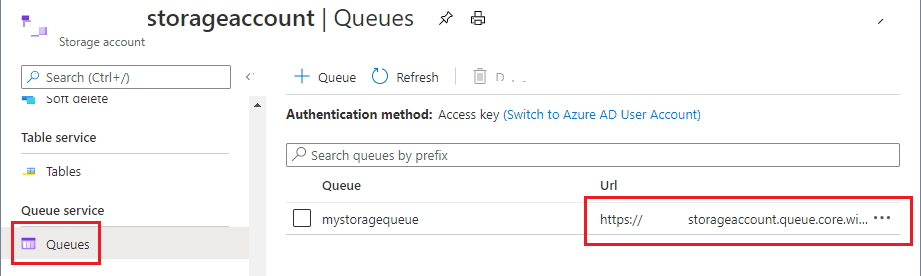
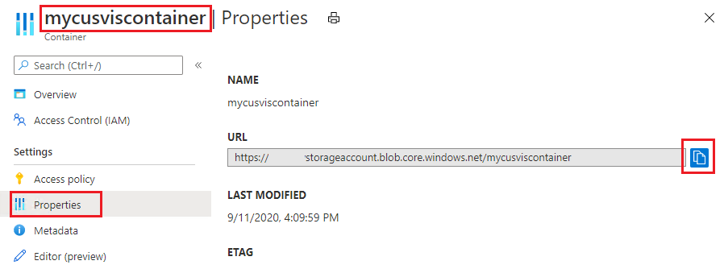

# Integrate Azure storage for notifications and backup

You can integrate your Custom Vision project with an Azure blob storage queue to get push notifications of project training/export activity and backup copies of published models. This feature is useful to avoid continually polling the service for results when long operations are running. Instead, you can integrate the storage queue notifications into your workflow.

This guide shows you how to use these REST APIs with cURL. You can also use an HTTP request service like Postman to issue the requests.

> [!NOTE]
> Push notifications depend on the optional _notificationQueueUri_ parameter in the **CreateProject** API, and model backups require that you also use the optional _exportModelContainerUri_ parameter. This guide will use both for the full set of features.

## Prerequisites

- A Custom Vision resource in Azure. If you don't have one, go to the Azure portal and [create a new Custom Vision resource](https://portal.azure.com/?microsoft_azure_marketplace_ItemHideKey=microsoft_azure_cognitiveservices_customvision#create/Microsoft.CognitiveServicesCustomVision?azure-portal=true). This feature doesn't currently support the [Azure AI services multi-service resource](../multi-service-resource.md).
- An Azure Storage account with a blob container. Follow the [Storage quickstart](../../storage/blobs/storage-quickstart-blobs-portal.md) if you need help with this step.
- [PowerShell version 6.0+](/powershell/scripting/install/installing-powershell-core-on-windows), or a similar command-line application.

## Set up Azure storage integration

Go to your Custom Vision training resource on the Azure portal, select the **Identity** page, and enable system assigned managed identity.

Next, go to your storage resource in the Azure portal. Go to the **Access control (IAM)** page and select **Add role assignment (Preview)**. Then add a role assignment for either integration feature, or both:
* If you plan to use the model backup feature, select the **Storage Blob Data Contributor** role, and add your Custom Vision training resource as a member. Select **Review + assign** to complete.
* If you plan to use the notification queue feature, then select the **Storage Queue Data Contributor** role, and add your Custom Vision training resource as a member. Select **Review + assign** to complete.

For help with role assignments, see [Assign Azure roles using the Azure portal](../../role-based-access-control/role-assignments-portal.md).

### Get integration URLs

Next, you'll get the URLs that allow your Custom Vision resource to access these endpoints.

For the notification queue integration URL, go to the **Queues** page of your storage account, add a new queue, and save its URL to a temporary location.

> [!div class="mx-imgBorder"]
>  

For the model backup integration URL, go to the **Containers** page of your storage account and create a new container. Then select it and go to the **Properties** page. Copy the URL to a temporary location.
 
> [!div class="mx-imgBorder"]
>  


## Integrate Custom Vision project

Now that you have the integration URLs, you can create a new Custom Vision project that integrates the Azure Storage features. You can also update an existing project to add the features.

### Create new project

When you call the [CreateProject](https://westus2.dev.cognitive.microsoft.com/docs/services/Custom_Vision_Training_3.3/operations/5eb0bcc6548b571998fddeae) API, add the optional parameters _exportModelContainerUri_ and _notificationQueueUri_. Assign the URL values you got in the previous section. 

```curl
curl -v -X POST "{endpoint}/customvision/v3.3/Training/projects?exportModelContainerUri={inputUri}&notificationQueueUri={inputUri}&name={inputName}"
-H "Training-key: {subscription key}"
```

If you receive a `200/OK` response, that means the URLs have been set up successfully. You should see your URL values in the JSON response as well:

```json
{
  "id": "00000000-0000-0000-0000-000000000000",
  "name": "string",
  "description": "string",
  "settings": {
    "domainId": "00000000-0000-0000-0000-000000000000",
    "classificationType": "Multiclass",
    "targetExportPlatforms": [
      "CoreML"
    ],
    "useNegativeSet": true,
    "detectionParameters": "string",
    "imageProcessingSettings": {
      "augmentationMethods": {}
},
"exportModelContainerUri": {url}
"notificationQueueUri": {url}
  },
  "created": "string",
  "lastModified": "string",
  "thumbnailUri": "string",
  "drModeEnabled": true,
  "status": "Succeeded"
}
```

### Update existing project

To update an existing project with Azure storage feature integration, call the [UpdateProject](https://westus2.dev.cognitive.microsoft.com/docs/services/Custom_Vision_Training_3.3/operations/5eb0bcc6548b571998fddeb1) API, using the ID of the project you want to update. 

```curl
curl -v -X PATCH "{endpoint}/customvision/v3.3/Training/projects/{projectId}"
-H "Content-Type: application/json"
-H "Training-key: {subscription key}"

--data-ascii "{body}" 
```

Set the request body (`body`) to the following JSON format, filling in the appropriate values for _exportModelContainerUri_ and _notificationQueueUri_:

```json
{
  "name": "string",
  "description": "string",
  "settings": {
    "domainId": "00000000-0000-0000-0000-000000000000",
    "classificationType": "Multiclass",
    "targetExportPlatforms": [
      "CoreML"
    ],
    "imageProcessingSettings": {
      "augmentationMethods": {}
},
"exportModelContainerUri": {url}
"notificationQueueUri": {url}

  },
  "status": "Succeeded"
}
```

If you receive a `200/OK` response, that means the URLs have been set up successfully.

## Verify the connection 

Your API call in the previous section should have already triggered new information in your Azure storage account. 

In your designated container, there should be a test blob inside a **CustomVision-TestPermission** folder. This blob will only exist temporarily.

In your notification queue, you should see a test notification in the following format:
 
```json
{
"version": "1.0" ,
"type": "ConnectionTest",
"Content":
    {
    "projectId": "00000000-0000-0000-0000-000000000000"
    }
}
```

## Get event notifications

When you're ready, call the [TrainProject](https://westus2.dev.cognitive.microsoft.com/docs/services/Custom_Vision_Training_3.3/operations/5eb0bcc7548b571998fddee1) API on your project to do an ordinary training operation.

In your Storage notification queue, you'll receive a notification once training finishes:

```json
{
"version": "1.0" ,
"type": "Training",
"Content":
    {
    "projectId": "00000000-0000-0000-0000-000000000000",
    "iterationId": "00000000-0000-0000-0000-000000000000",
    "trainingStatus": "TrainingCompleted"
    }
}
```

The `"trainingStatus"` field may be either `"TrainingCompleted"` or `"TrainingFailed"`. The `"iterationId"` field is the ID of the trained model.

## Get model export backups

When you're ready, call the [ExportIteration](https://westus2.dev.cognitive.microsoft.com/docs/services/Custom_Vision_Training_3.3/operations/5eb0bcc6548b571998fddece) API to export a trained model into a specified platform.

In your designated storage container, a backup copy of the exported model will appear. The blob name will have the format:

```
{projectId} - {iterationId}.{platformType}
```

Also, you'll receive a notification in your queue when the export finishes. 

```json
{
"version": "1.0" ,
"type": "Export",
"Content":
    {
    "projectId": "00000000-0000-0000-0000-000000000000",
    "iterationId": "00000000-0000-0000-0000-000000000000",
    "exportStatus": "ExportCompleted",
    "modelUri": {url}
    }
}
```

The `"exportStatus"` field may be either `"ExportCompleted"` or `"ExportFailed"`. The `"modelUri"` field will contain the URL of the backup model stored in your container, assuming you integrated queue notifications in the beginning. If you didn't, the `"modelUri"` field will show the SAS URL for your Custom Vision model blob.

## Next steps

In this guide, you learned how to copy and back up a project between Custom Vision resources. Next, explore the API reference docs to see what else you can do with Custom Vision.
* [REST API reference documentation (training)](https://westus2.dev.cognitive.microsoft.com/docs/services/Custom_Vision_Training_3.3/operations/5eb0bcc6548b571998fddeb3)
* [REST API reference documentation (prediction)](https://westus2.dev.cognitive.microsoft.com/docs/services/Custom_Vision_Prediction_3.1/operations/5eb37d24548b571998fde5f3)
