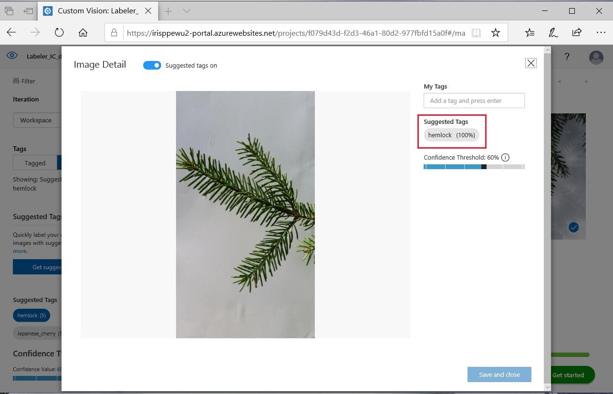
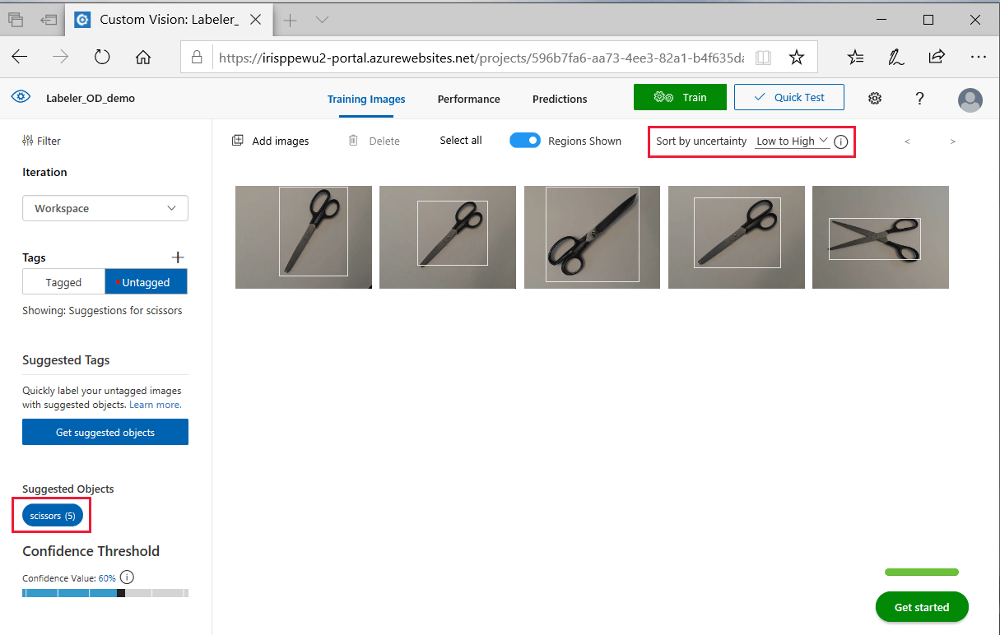

# Tag images faster with Smart Labeler

In this guide, you'll learn how to use Smart Labeler to generate suggested tags for images. This lets you label a large number of images more quickly when you're training a Custom Vision model.

When you tag images for a Custom Vision model, the service uses the latest trained iteration of the model to predict the labels of new images. It shows these predictions as suggested tags, based on the selected confidence threshold and prediction uncertainty. You can then either confirm or change the suggestions, speeding up the process of manually tagging the images for training.

## When to use Smart Labeler

Keep the following limitations in mind:

* You should only request suggested tags for images whose tags have already been trained on once. Don't get suggestions for a new tag that you're just beginning to train.

> [!IMPORTANT]
> The Smart Labeler feature uses the same [pricing model](https://azure.microsoft.com/pricing/details/cognitive-services/custom-vision-service/) as regular predictions. The first time you trigger suggested tags for a set of images, you'll be charged the same as for prediction calls. After that, the service stores the results for the selected images in a database for 30 days, and you can access them anytime for free within that period. After 30 days, you'll be charged if you request their suggested tags again.

## Smart Labeler workflow

Follow these steps to use Smart Labeler:

1. Upload all of your training images to your Custom Vision project.
1. Label part of your data set, choosing an equal number of images for each tag.
    > [!TIP]
    > Make sure you use all of the tags for which you want suggestions later on.
1. Start the training process.
1. When training is complete, navigate to the **Untagged** view and select the **Get suggested tags** button on the left pane.
    > [!div class="mx-imgBorder"]
    > 
1. In the popup window that appears, set the number of images for which you want suggestions. You should only get initial tag suggestions for a portion of the untagged images. You'll get better tag suggestions as you iterate through this process.
1. Confirm the suggested tags, fixing any that aren't correct.
    > [!TIP]
    > Images with suggested tags are sorted by their prediction uncertainty (lower values indicate higher confidence). You can change the sorting order with the **Sort by uncertainty** option. If you set the order to **high to low**, you can correct the high-uncertainty predictions first and then quickly confirm the low-uncertainty ones.
    * In image classification projects, you can select and confirm tags in batches. Filter the view by a given suggested tag, deselect images that are tagged incorrectly, and then confirm the rest in a batch.
        > [!div class="mx-imgBorder"]
        > 

        You can also use suggested tags in individual image mode by selecting an image from the gallery.

        
    * In object detection projects, batch confirmations aren't supported, but you can still filter and sort by suggested tags for a more organized labeling experience. Thumbnails of your untagged images will show an overlay of bounding boxes indicating the locations of suggested tags. If you don't select a suggested tag filter, all of your untagged images will appear without overlaying bounding boxes.
        > [!div class="mx-imgBorder"]
        > 

        To confirm object detection tags, you need to apply them to each individual image in the gallery.

        
1. Start the training process again.
1. Repeat the preceding steps until you're satisfied with the suggestion quality.

## Next steps

Follow a quickstart to get started creating and training a Custom Vision project.

* [Build a classifier](getting-started-build-a-classifier.md)
* [Build an object detector](get-started-build-detector.md)
