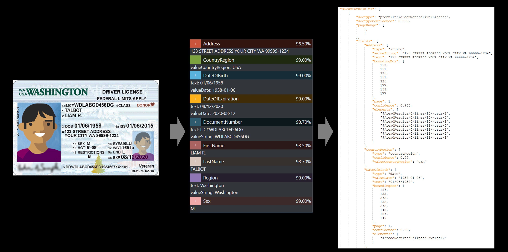
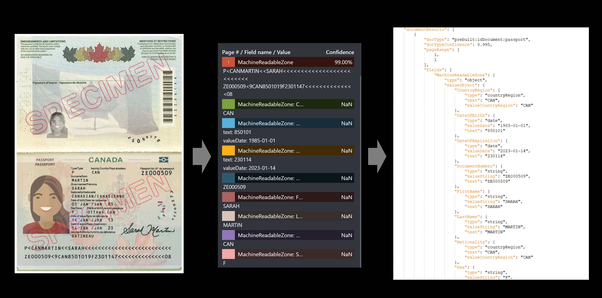

<!-- markdownlint-disable MD033 -->

# Document Intelligence ID document model

::: moniker range="doc-intel-4.0.0"
[!INCLUDE [preview-version-notice](includes/preview-notice.md)]

[!INCLUDE [applies to v4.0](includes/applies-to-v40.md)]
::: moniker-end

::: moniker range="doc-intel-3.1.0"
[!INCLUDE [applies to v3.1](includes/applies-to-v31.md)]
::: moniker-end

::: moniker range="doc-intel-3.0.0"
[!INCLUDE [applies to v3.0](includes/applies-to-v30.md)]
::: moniker-end

::: moniker range="doc-intel-2.1.0"
[!INCLUDE [applies to v2.1](includes/applies-to-v21.md)]
::: moniker-end

::: moniker range=">=doc-intel-3.0.0"

Document Intelligence Identity document (ID) model combines Optical Character Recognition (OCR) with deep learning models to analyze and extract key information from identity documents. The API analyzes identity documents (including the following) and returns a structured JSON data representation:

* Passport book, passport card worldwide
* Driver's license from United States, Europe, India, Canada, and Australia
* United States identification cards, residency permit (green card), social security card, military ID
* European identification cards, residency permits
* India PAN card, Aadhaar card
* Canada identification cards, residency permit (maple card)
* Australia photo card, key-pass ID (including digital version)

::: moniker-end

::: moniker range="doc-intel-2.1.0"

Document Intelligence can analyze and extract information from government-issued identification documents (IDs) using its prebuilt IDs model. It combines our powerful [Optical Character Recognition (OCR)](../../ai-services/computer-vision/overview-ocr.md) capabilities with ID recognition capabilities to extract key information from Worldwide Passports and U.S. Driver's Licenses (all 50 states and D.C.). The IDs API extracts key information from these identity documents, such as first name, last name, date of birth, document number, and more. This API is available in the Document Intelligence v2.1 as a cloud service. 

::: moniker-end

## Identity document processing

Identity document processing involves extracting data from identity documents either manually or by using OCR-based technology. ID document processing is an important step in any business operation that requires proof of identity. Examples include customer verification in banks and other financial institutions, mortgage applications, medical visits, claim processing, hospitality industry, and more. Individuals provide some proof of their identity via driver licenses, passports, and other similar documents so that the business can efficiently verify them before providing services and benefits.

::: moniker range=">=doc-intel-3.0.0"

***Sample U.S. Driver's License processed with [Document Intelligence Studio](https://formrecognizer.appliedai.azure.com/studio/prebuilt?formType=idDocument)***

:::image type="content" source="media/studio/analyze-drivers-license.png" alt-text="Image of a sample driver's license.":::

::: moniker-end

::: moniker range="doc-intel-2.1.0"

## Data extraction

The prebuilt IDs service extracts the key values from worldwide passports and U.S. Driver's Licenses and returns them in an organized structured JSON response.

### **Driver's license example**

### **Passport example**

::: moniker-end

## Development options

::: moniker range="doc-intel-4.0.0"

Document Intelligence v4.0 (2023-10-31-preview) supports the following tools, applications, and libraries:

| Feature | Resources | Model ID |
|----------|-------------|-----------|
|**ID document model**|&bullet; [**Document Intelligence Studio**](https://formrecognizer.appliedai.azure.com) &bullet;  [**REST API**](/rest/api/aiservices/document-models/analyze-document?view=rest-aiservices-2023-10-31-preview&preserve-view=true&tabs=HTTP) &bullet;  [**C# SDK**](quickstarts/get-started-sdks-rest-api.md?view=doc-intel-4.0.0&preserve-view=true) &bullet;  [**Python SDK**](quickstarts/get-started-sdks-rest-api.md?view=doc-intel-4.0.0&preserve-view=true) &bullet;  [**Java SDK**](quickstarts/get-started-sdks-rest-api.md?view=doc-intel-4.0.0&preserve-view=true) &bullet;  [**JavaScript SDK**](quickstarts/get-started-sdks-rest-api.md?view=doc-intel-4.0.0&preserve-view=true)|**prebuilt-idDocument**|
::: moniker-end

::: moniker range="doc-intel-3.1.0"

Document Intelligence v3.1 supports the following tools, applications, and libraries:

| Feature | Resources | Model ID |
|----------|-------------|-----------|
|**ID document model**|&bullet; [**Document Intelligence Studio**](https://formrecognizer.appliedai.azure.com) &bullet;  [**REST API**](/rest/api/aiservices/document-models/analyze-document?view=rest-aiservices-2023-07-31&preserve-view=true&tabs=HTTP) &bullet;  [**C# SDK**](quickstarts/get-started-sdks-rest-api.md?view=doc-intel-3.1.0&preserve-view=true) &bullet;  [**Python SDK**](quickstarts/get-started-sdks-rest-api.md?view=doc-intel-3.1.0&preserve-view=true) &bullet;  [**Java SDK**](quickstarts/get-started-sdks-rest-api.md?view=doc-intel-3.1.0&preserve-view=true) &bullet;  [**JavaScript SDK**](quickstarts/get-started-sdks-rest-api.md?view=doc-intel-3.1.0&preserve-view=true)|**prebuilt-idDocument**|
::: moniker-end

::: moniker range="doc-intel-3.0.0"

Document Intelligence v3.0 supports the following tools, applications, and libraries:

| Feature | Resources | Model ID |
|----------|-------------|-----------|
|**ID document model**|&bullet; [**Document Intelligence Studio**](https://formrecognizer.appliedai.azure.com) &bullet;  [**REST API**](https://westus.dev.cognitive.microsoft.com/docs/services/form-recognizer-api-2022-08-31/operations/AnalyzeDocument) &bullet;  [**C# SDK**](quickstarts/get-started-sdks-rest-api.md?view=doc-intel-3.0.0&preserve-view=true) &bullet;  [**Python SDK**](quickstarts/get-started-sdks-rest-api.md?view=doc-intel-3.0.0&preserve-view=true) &bullet;  [**Java SDK**](quickstarts/get-started-sdks-rest-api.md?view=doc-intel-3.0.0&preserve-view=true) &bullet;  [**JavaScript SDK**](quickstarts/get-started-sdks-rest-api.md?view=doc-intel-3.0.0&preserve-view=true)|**prebuilt-idDocument**|
::: moniker-end

::: moniker range="doc-intel-2.1.0"

Document Intelligence v2.1 supports the following tools, applications, and libraries:

| Feature | Resources |
|----------|-------------------------|
|**ID document model**|&bullet; [**Document Intelligence labeling tool**](https://fott-2-1.azurewebsites.net/prebuilts-analyze) &bullet;  [**REST API**](how-to-guides/use-sdk-rest-api.md?pivots=programming-language-rest-api&view=doc-intel-2.1.0&preserve-view=true&tabs=windows) &bullet;  [**Client-library SDK**](~/articles/ai-services/document-intelligence/how-to-guides/use-sdk-rest-api.md?view=doc-intel-2.1.0&preserve-view=true) &bullet;  [**Document Intelligence Docker container**](containers/install-run.md?tabs=id-document#run-the-container-with-the-docker-compose-up-command)|
::: moniker-end

## Input requirements

::: moniker range=">=doc-intel-3.0.0"

[!INCLUDE [input requirements](./includes/input-requirements.md)]

::: moniker-end

::: moniker range="doc-intel-2.1.0"

* Supported file formats: JPEG, PNG, PDF, and TIFF

* Document Intelligence processes PDF and TIFF files up to 2000 pages or only the first two pages for free-tier subscribers.

* The file size must be less than 50 MB and dimensions at least 50 x 50 pixels and at most 10,000 x 10,000 pixels.

::: moniker-end

### ID document model data extraction

Extract data, including name, birth date, and expiration date, from ID documents. You need the following resources:

* An Azure subscription—you can [create one for free](https://azure.microsoft.com/free/cognitive-services/)

* A [Document Intelligence instance](https://portal.azure.com/#create/Microsoft.CognitiveServicesFormRecognizer) in the Azure portal. You can use the free pricing tier (`F0`) to try the service. After your resource deploys, select **Go to resource** to get your key and endpoint.

 :::image type="content" source="media/containers/keys-and-endpoint.png" alt-text="Screenshot of keys and endpoint location in the Azure portal.":::

::: moniker range=">=doc-intel-3.0.0"

> [!NOTE]
> Document Intelligence Studio is available with v3.1 and v3.0 APIs and later versions.

1. On the Document Intelligence Studio home page, select **Identity documents**

1. You can analyze the sample invoice or upload your own files.

1. Select the **Run analysis** button and, if necessary, configure the **Analyze options** :

    :::image type="content" source="media/studio/run-analysis-analyze-options.png" alt-text="Screenshot of Run analysis and Analyze options buttons in the Document Intelligence Studio.":::

    > [!div class="nextstepaction"]
    > [Try Document Intelligence Studio](https://formrecognizer.appliedai.azure.com/studio/prebuilt?formType=idDocument)
::: moniker-end

::: moniker range="doc-intel-2.1.0"

## Document Intelligence Sample Labeling tool

1. Navigate to the [Document Intelligence Sample Tool](https://fott-2-1.azurewebsites.net/).

1. On the sample tool home page, select the **Use prebuilt model to get data** tile.

    :::image type="content" source="media/label-tool/prebuilt-1.jpg" alt-text="Screenshot of the layout model analyze results operation.":::

1. Select the **Form Type**  to analyze from the dropdown menu.

1. Choose a URL for the file you would like to analyze from the below options:

    * [**Sample invoice document**](https://raw.githubusercontent.com/Azure-Samples/cognitive-services-REST-api-samples/master/curl/form-recognizer/invoice_sample.jpg).
    * [**Sample ID document**](https://raw.githubusercontent.com/Azure-Samples/cognitive-services-REST-api-samples/master/curl/form-recognizer/DriverLicense.png).
    * [**Sample receipt image**](https://raw.githubusercontent.com/Azure-Samples/cognitive-services-REST-api-samples/master/curl/form-recognizer/contoso-allinone.jpg).
    * [**Sample business card image**](https://raw.githubusercontent.com/Azure/azure-sdk-for-python/master/sdk/formrecognizer/azure-ai-formrecognizer/samples/sample_forms/business_cards/business-card-english.jpg).

1. In the **Source** field, select **URL** from the dropdown menu, paste the selected URL, and select the **Fetch** button.

    :::image type="content" source="media/label-tool/fott-select-url.png" alt-text="Screenshot of source location dropdown menu.":::

1. In the **Document Intelligence service endpoint** field, paste the endpoint that you obtained with your Document Intelligence subscription.

1. In the **key** field, paste  the key you obtained from your Document Intelligence resource.

    :::image type="content" source="media/fott-select-form-type.png" alt-text="Screenshot of select document type dropdown menu.":::

1. Select **Run analysis**. The Document Intelligence Sample Labeling tool calls the Analyze Prebuilt API and analyzes the document.

1. View the results - see the key-value pairs extracted, line items, highlighted text extracted and tables detected.

    :::image type="content" source="media/id-example-drivers-license.jpg" alt-text="Screenshot of the identity model analyze results operation.":::

1. Download the JSON output file to view the detailed results.

    * The "readResults" node contains every line of text with its respective bounding box placement on the page.
    * The "selectionMarks" node shows every selection mark (checkbox, radio mark) and whether its status is *selected* or *unselected*.
    * The "pageResults" section includes the tables extracted. For each table, Document Intelligence extracts the text, row, and column index, row and column spanning, bounding box, and more.
    * The "documentResults" field contains key/value pairs information and line items information for the most relevant parts of the document.

> [!NOTE]
> The [Sample Labeling tool](https://fott-2-1.azurewebsites.net/) does not support the BMP file format. This is a limitation of the tool not the Document Intelligence Service.

::: moniker-end

::: moniker range=">=doc-intel-3.0.0"

## Supported document types

| Region | Document types |
|--------|----------------|
|Worldwide|Passport Book, Passport Card|
|United States|Driver License, Identification Card, Residency Permit (Green card), Social Security Card, Military ID|
|Europe|Driver License, Identification Card, Residency Permit|
|India|Driver License, PAN Card, Aadhaar Card|
|Canada|Driver License, Identification Card, Residency Permit (Maple Card)|
|Australia|Driver License, Photo Card, Key-pass ID (including digital version)|

## Field extractions

The following are the fields extracted per document type. The Document Intelligence ID model `prebuilt-idDocument` extracts the following fields in the `documents.*.fields`. The json output includes all the extracted text in the documents, words, lines, and styles.

### `idDocument.driverLicense`

| Field | Type | Description | Example |
|:------|:-----|:------------|:--------|
|`CountryRegion`|`countryRegion`|Country or region code|USA|
|`Region`|`string`|State or province|Washington|
|`DocumentNumber`|`string`|Driver license number|WDLABCD456DG|
|`DocumentDiscriminator`|`string`|Driver license document discriminator|12645646464554646456464544|
|`FirstName`|`string`|Given name and middle initial if applicable|LIAM R.|
|`LastName`|`string`|Surname|TALBOT|
|`Address`|`address`|Address|123 STREET ADDRESS YOUR CITY WA 99999-1234|
|`DateOfBirth`|`date`|Date of birth|01/06/1958|
|`DateOfExpiration`|`date`|Date of expiration|08/12/2020|
|`DateOfIssue`|`date`|Date of issue|08/12/2012|
|`EyeColor`|`string`|Eye color|BLU|
|`HairColor`|`string`|Hair color|BRO|
|`Height`|`string`|Height|5'11"|
|`Weight`|`string`|Weight|185LB|
|`Sex`|`string`|Sex|M|
|`Endorsements`|`string`|Endorsements|L|
|`Restrictions`|`string`|Restrictions|B|
|`VehicleClassifications`|`string`|Vehicle classification|D|

### `idDocument.passport`

| Field | Type | Description | Example |
|:------|:-----|:------------|:--------|
|`DocumentNumber`|`string`|Passport number|340020013|
|`FirstName`|`string`|Given name and middle initial if applicable|JENNIFER|
|`MiddleName`|`string`|Name between given name and surname|REYES|
|`LastName`|`string`|Surname|BROOKS|
|`Aliases`|`array`|||
|`Aliases.*`|`string`|Also known as|MAY LIN|
|`DateOfBirth`|`date`|Date of birth|1980-01-01|
|`DateOfExpiration`|`date`|Date of expiration|2019-05-05|
|`DateOfIssue`|`date`|Date of issue|2014-05-06|
|`Sex`|`string`|Sex|F|
|`CountryRegion`|`countryRegion`|Issuing country or organization|USA|
|`DocumentType`|`string`|Document type|P|
|`Nationality`|`countryRegion`|Nationality|USA|
|`PlaceOfBirth`|`string`|Place of birth|MASSACHUSETTS, U.S.A.|
|`PlaceOfIssue`|`string`|Place of issue|LA PAZ|
|`IssuingAuthority`|`string`|Issuing authority|United States Department of State|
|`PersonalNumber`|`string`|Personal ID. No.|A234567893|
|`MachineReadableZone`|`object`|Machine readable zone (MRZ)|P<USABROOKS<<JENNIFER<<<<<<<<<<<<<<<<<<<<<<< 3400200135USA8001014F1905054710000307<715816|
|`MachineReadableZone.FirstName`|`string`|Given name and middle initial if applicable|JENNIFER|
|`MachineReadableZone.LastName`|`string`|Surname|BROOKS|
|`MachineReadableZone.DocumentNumber`|`string`|Passport number|340020013|
|`MachineReadableZone.CountryRegion`|`countryRegion`|Issuing country or organization|USA|
|`MachineReadableZone.Nationality`|`countryRegion`|Nationality|USA|
|`MachineReadableZone.DateOfBirth`|`date`|Date of birth|1980-01-01|
|`MachineReadableZone.DateOfExpiration`|`date`|Date of expiration|2019-05-05|
|`MachineReadableZone.Sex`|`string`|Sex|F|

### `idDocument.nationalIdentityCard`

| Field | Type | Description | Example |
|:------|:-----|:------------|:--------|
|`CountryRegion`|`countryRegion`|Country or region code|USA|
|`Region`|`string`|State or province|Washington|
|`DocumentNumber`|`string`|National identity card number|WDLABCD456DG|
|`DocumentDiscriminator`|`string`|National identity card document discriminator|12645646464554646456464544|
|`FirstName`|`string`|Given name and middle initial if applicable|LIAM R.|
|`LastName`|`string`|Surname|TALBOT|
|`Address`|`address`|Address|123 STREET ADDRESS YOUR CITY WA 99999-1234|
|`DateOfBirth`|`date`|Date of birth|01/06/1958|
|`DateOfExpiration`|`date`|Date of expiration|08/12/2020|
|`DateOfIssue`|`date`|Date of issue|08/12/2012|
|`EyeColor`|`string`|Eye color|BLU|
|`HairColor`|`string`|Hair color|BRO|
|`Height`|`string`|Height|5'11"|
|`Weight`|`string`|Weight|185LB|
|`Sex`|`string`|Sex|M|

### `idDocument.residencePermit`

| Field | Type | Description | Example |
|:------|:-----|:------------|:--------|
|`CountryRegion`|`countryRegion`|Country or region code|USA|
|`DocumentNumber`|`string`|Residence permit number|WDLABCD456DG|
|`FirstName`|`string`|Given name and middle initial if applicable|LIAM R.|
|`LastName`|`string`|Surname|TALBOT|
|`DateOfBirth`|`date`|Date of birth|01/06/1958|
|`DateOfExpiration`|`date`|Date of expiration|08/12/2020|
|`DateOfIssue`|`date`|Date of issue|08/12/2012|
|`Sex`|`string`|Sex|M|
|`PlaceOfBirth`|`string`|Place of birth|Germany|
|`Category`|`string`|Permit category|DV2|
|`Address`|`string`|Address|123 STREET ADDRESS YOUR CITY WA 99999-1234|

### `idDocument.usSocialSecurityCard`

| Field | Type | Description | Example |
|:------|:-----|:------------|:--------|
|`DocumentNumber`|`string`|Social security card number|WDLABCD456DG|
|`FirstName`|`string`|Given name and middle initial if applicable|LIAM R.|
|`LastName`|`string`|Surname|TALBOT|
|`DateOfIssue`|`date`|Date of issue|08/12/2012|

### `idDocument`

| Field | Type | Description | Example |
|:------|:-----|:------------|:--------|
|`Address`|`address`|Address|123 STREET ADDRESS YOUR CITY WA 99999-1234|
|`DocumentNumber`|`string`|Driver license number|WDLABCD456DG|
|`FirstName`|`string`|Given name and middle initial if applicable|LIAM R.|
|`LastName`|`string`|Surname|TALBOT|
|`DateOfBirth`|`date`|Date of birth|01/06/1958|
|`DateOfExpiration`|`date`|Date of expiration|08/12/2020|

::: moniker-end

::: moniker range="doc-intel-2.1.0"

## Supported document types

 The ID document model currently supports US driver licenses and the biographical page from international passports (excluding visa and other travel documents) extraction.

## Fields extracted

|Name| Type | Description | Value |
|:-----|:----|:----|:----|
|  Country | country | Country code compliant with ISO 3166 standard | "USA" |
|  DateOfBirth | date | DOB in YYYY-MM-DD format | "1980-01-01" |
|  DateOfExpiration | date | Expiration date in YYYY-MM-DD format | "2019-05-05" |
|  DocumentNumber | string | Relevant passport number, driver's license number, etc. | "340020013" |
|  FirstName | string | Extracted given name and middle initial if applicable | "JENNIFER" |
|  LastName | string | Extracted surname | "BROOKS" |
|  Nationality | country | Country code compliant with ISO 3166 standard | "USA" |
|  Sex | gender | Possible extracted values include "M" "F" "X" | "F" |
|  MachineReadableZone | object | Extracted Passport MRZ including two lines of 44 characters each | "P<USABROOKS<<JENNIFER<<<<<<<<<<<<<<<<<<<<<<< 3400200135USA8001014F1905054710000307<715816" |
|  DocumentType | string | Document type, for example, Passport, Driver's License | "passport" |
|  Address | string | Extracted address (Driver's License only) | "123 STREET ADDRESS YOUR CITY WA 99999-1234"|
|  Region | string | Extracted region, state, province, etc. (Driver's License only) | "Washington" |

### Migration guide

* Follow our [**Document Intelligence v3.1 migration guide**](v3-1-migration-guide.md) to learn how to use the v3.0 version in your applications and workflows.

::: moniker-end

## Next steps

::: moniker range=">=doc-intel-3.0.0"

* Try processing your own forms and documents with the [Document Intelligence Studio](https://formrecognizer.appliedai.azure.com/studio)

* Complete a [Document Intelligence quickstart](quickstarts/get-started-sdks-rest-api.md?view=doc-intel-3.0.0&preserve-view=true) and get started creating a document processing app in the development language of your choice.

::: moniker-end

::: moniker range="doc-intel-2.1.0"

* Try processing your own forms and documents with the [Document Intelligence Sample Labeling tool](https://fott-2-1.azurewebsites.net/)

* Complete a [Document Intelligence quickstart](quickstarts/get-started-sdks-rest-api.md?view=doc-intel-2.1.0&preserve-view=true) and get started creating a document processing app in the development language of your choice.

::: moniker-end
