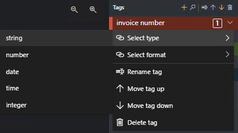

<!-- markdownlint-disable MD001 -->
<!-- markdownlint-disable MD024 -->
<!-- markdownlint-disable MD033 -->
<!-- markdownlint-disable MD034 -->
# Train a custom model using the Sample Labeling tool

**This content applies to:**  **v2.1**.

>[!TIP]
>
> * For an enhanced experience and advanced model quality, try the [Document Intelligence v3.0 Studio](https://formrecognizer.appliedai.azure.com/studio).
> * The v3.0 Studio supports any model trained with v2.1 labeled data.
> * You can refer to the [API migration guide](v3-1-migration-guide.md) for detailed information about migrating from v2.1 to v3.0.
> * *See* our [**REST API**](quickstarts/get-started-sdks-rest-api.md?view=doc-intel-3.0.0&preserve-view=true) or [**C#**](quickstarts/get-started-sdks-rest-api.md?view=doc-intel-3.0.0&preserve-view=true), [**Java**](quickstarts/get-started-sdks-rest-api.md?view=doc-intel-3.0.0&preserve-view=true), [**JavaScript**](quickstarts/get-started-sdks-rest-api.md?view=doc-intel-3.0.0&preserve-view=true), or [Python](quickstarts/get-started-sdks-rest-api.md?view=doc-intel-3.0.0&preserve-view=true) SDK quickstarts to get started with the V3.0.

In this article, you use the Document Intelligence REST API with the Sample Labeling tool to train a custom model with manually labeled data.

> [!VIDEO https://learn.microsoft.com/Shows/Docs-Azure/Azure-Form-Recognizer/player]

## Prerequisites

 You need the following resources to complete this project:

* Azure subscription - [Create one for free](https://azure.microsoft.com/free/cognitive-services)
* Once you have your Azure subscription, <a href="https://portal.azure.com/#create/Microsoft.CognitiveServicesFormRecognizer"  title="Create a Document Intelligence resource"  target="_blank">create a Document Intelligence resource </a> in the Azure portal to get your key and endpoint. After it deploys, select **Go to resource**.
  * You need the key and endpoint from the resource you create to connect your application to the Document Intelligence API. You paste your key and endpoint into the code later in the quickstart.
  * You can use the free pricing tier (`F0`) to try the service, and upgrade later to a paid tier for production.
* A set of at least six forms of the same type. You use this data to train the model and test a form. You can use a [sample data set](https://go.microsoft.com/fwlink/?linkid=2090451) (download and extract *sample_data.zip*) for this quickstart. Upload the training files to the root of a blob storage container in a standard-performance-tier Azure Storage account.

## Create a Document Intelligence resource

[!INCLUDE [create resource](includes/create-resource.md)]

## Try it out

Try out the [**Document Intelligence Sample Labeling tool**](https://fott-2-1.azurewebsites.net/) online:

> [!div class="nextstepaction"]
> [Try Prebuilt Models](https://fott-2-1.azurewebsites.net/)

You need an Azure subscription ([create one for free](https://azure.microsoft.com/free/cognitive-services)) and a [Document Intelligence resource](https://portal.azure.com/#create/Microsoft.CognitiveServicesFormRecognizer) endpoint and key to try out the Document Intelligence service.

## Set up the Sample Labeling tool

> [!NOTE]
>
> If your storage data is behind a VNet or firewall, you must deploy the **Document Intelligence Sample Labeling tool** behind your VNet or firewall and grant access by creating a [system-assigned managed identity](managed-identities.md "Azure managed identity is a service principal that creates a Microsoft Entra identity and specific permissions for Azure managed resources").

You use the Docker engine to run the Sample Labeling tool. Follow these steps to set up the Docker container. For a primer on Docker and container basics, see the [Docker overview](https://docs.docker.com/engine/docker-overview/).

> [!TIP]
> The OCR Form Labeling Tool is also available as an open source project on GitHub. The tool is a TypeScript web application built using React + Redux. To learn more or contribute, see the [OCR Form Labeling Tool](https://github.com/microsoft/OCR-Form-Tools/blob/master/README.md#run-as-web-application) repo. To try out the tool online, go to the [Document Intelligence Sample Labeling tool website](https://fott-2-1.azurewebsites.net/).

1. First, install Docker on a host computer. This guide shows you how to use local computer as a host. If you want to use a Docker hosting service in Azure, see the [Deploy the Sample Labeling tool](deploy-label-tool.md) how-to guide.

   The host computer must meet the following hardware requirements:

    | Container | Minimum | Recommended|
    |:--|:--|:--|
    |Sample Labeling tool|`2` core, 4-GB memory|`4` core, 8-GB memory|

    Install Docker on your machine by following the appropriate instructions for your operating system:

   * [Windows](https://docs.docker.com/docker-for-windows/)
   * [macOS](https://docs.docker.com/docker-for-mac/)
   * [Linux](https://docs.docker.com/install/)

1. Get the Sample Labeling tool container with the `docker pull` command.

    ```console
     docker pull mcr.microsoft.com/azure-cognitive-services/custom-form/labeltool:latest-2.1
    ```

1. Now you're ready to run the container with `docker run`.

    ```console
     docker run -it -p 3000:80 mcr.microsoft.com/azure-cognitive-services/custom-form/labeltool:latest-2.1 eula=accept
    ```

   This command makes the sample-labeling tool available through a web browser. Go to `http://localhost:3000`.

> [!NOTE]
> You can also label documents and train models using the Document Intelligence REST API. To train and Analyze with the REST API, see [Train with labels using the REST API and Python](https://github.com/Azure-Samples/cognitive-services-quickstart-code/blob/master/python/FormRecognizer/rest/python-labeled-data.md).

## Set up input data

First, make sure all the training documents are of the same format. If you have forms in multiple formats, organize them into subfolders based on common format. When you train, you need to direct the API to a subfolder.

### Configure cross-domain resource sharing (CORS)

Enable CORS on your storage account. Select your storage account in the Azure portal and then choose the **CORS** tab on the left pane. On the bottom line, fill in the following values. Select **Save** at the top.

* Allowed origins = *
* Allowed methods = \[select all\]
* Allowed headers = *
* Exposed headers = *
* Max age = 200

> [!div class="mx-imgBorder"]
> 

## Connect to the Sample Labeling tool

 The Sample Labeling tool connects to a source (your original uploaded forms) and a target (created labels and output data).

Connections can be set up and shared across projects. They use an extensible provider model, so you can easily add new source/target providers.

To create a new connection, select the **New Connections** (plug) icon, in the left navigation bar.

Fill in the fields with the following values:

* **Display Name** - The connection display name.
* **Description** - Your project description.
* **SAS URL** - The shared access signature (SAS) URL of your Azure Blob Storage container. [!INCLUDE [get SAS URL](includes/sas-instructions.md)]

   :::image type="content" source="media/quickstarts/get-sas-url.png" alt-text="SAS URL retrieval":::

:::image type="content" source="media/label-tool/connections.png" alt-text="Connection settings of Sample Labeling tool.":::

## Create a new project

In the Sample Labeling tool, projects store your configurations and settings. Create a new project and fill in the fields with the following values:

* **Display Name** - the project display name
* **Security Token** - Some project settings can include sensitive values, such as keys or other shared secrets. Each project generates a security token that can be used to encrypt/decrypt sensitive project settings. You can find security tokens in the Application Settings by selecting the gear icon at the bottom of the left navigation bar.
* **Source Connection** - The Azure Blob Storage connection you created in the previous step that you would like to use for this project.
* **Folder Path** - Optional - If your source forms are located in a folder on the blob container, specify the folder name here
* **Document Intelligence Service Uri** - Your Document Intelligence endpoint URL.
* **Key** - Your Document Intelligence key.
* **Description** - Optional - Project description

:::image type="content" source="media/label-tool/new-project.png" alt-text="New project page on Sample Labeling tool.":::

## Label your forms

When you create or open a project, the main tag editor window opens. The tag editor consists of three parts:

* A resizable v3.0 pane that contains a scrollable list of forms from the source connection.
* The main editor pane that allows you to apply tags.
* The tags editor pane that allows users to modify, lock, reorder, and delete tags.

### Identify text and tables

Select **Run Layout on unvisited documents** on the left pane to get the text and table layout information for each document. The labeling tool draws bounding boxes around each text element.

The labeling tool also shows which tables have been automatically extracted. Select the table/grid icon on the left hand of the document to see the extracted table. In this quickstart, because the table content is automatically extracted, we don't label the table content, but rather rely on the automated extraction.

:::image type="content" source="media/label-tool/table-extraction.png" alt-text="Table visualization in Sample Labeling tool.":::

In v2.1, if your training document doesn't have a value filled in, you can draw a box where the value should be. Use **Draw region** on the upper left corner of the window to make the region taggable.

### Apply labels to text

Next, you create tags (labels) and apply them to the text elements that you want the model to analyze.

1. First, use the tags editor pane to create the tags you'd like to identify.
   1. Select **+** to create a new tag.
   1. Enter the tag name.
   1. Press Enter to save the tag.
1. In the main editor, select words from the highlighted text elements or a region you drew in.
1. Select the tag you want to apply, or press the corresponding keyboard key. The number keys are assigned as hotkeys for the first 10 tags. You can reorder your tags using the up and down arrow icons in the tag editor pane.
1. Follow these steps to label at least five of your forms.
    > [!Tip]
    > Keep the following tips in mind when you're labeling your forms:
    >
    > * You can only apply one tag to each selected text element.
    > * Each tag can only be applied once per page. If a value appears multiple times on the same form, create different tags for each instance. For example: "invoice# 1", "invoice# 2" and so on.
    > * Tags cannot span across pages.
    > * Label values as they appear on the form; don't try to split a value into two parts with two different tags. For example, an address field should be labeled with a single tag even if it spans multiple lines.
    > * Don't include keys in your tagged fields&mdash;only the values.
    > * Table data should be detected automatically and will be available in the final output JSON file. However, if the model fails to detect all of your table data, you can manually tag these fields as well. Tag each cell in the table with a different label. If your forms have tables with varying numbers of rows, make sure you tag at least one form with the largest possible table.
    > * Use the buttons to the right of the **+** to search, rename, reorder, and delete your tags.
    > * To remove an applied tag without deleting the tag itself, select the tagged rectangle on the document view and press the delete key.
    >

:::image type="content" source="media/label-tool/main-editor-2-1.png" alt-text="Main editor window of Sample Labeling tool.":::

### Specify tag value types

You can set the expected data type for each tag. Open the context menu to the right of a tag and select a type from the menu. This feature allows the detection algorithm to make assumptions that improve the text-detection accuracy. It also ensures that the detected values are returned in a standardized format in the final JSON output. Value type information is saved in the **fields.json** file in the same path as your label files.

> [!div class="mx-imgBorder"]
> 

The following value types and variations are currently supported:

* `string`
  * default, `no-whitespaces`, `alphanumeric`

* `number`
  * default, `currency`
  * Formatted as a Floating point value.
  * Example: 1234.98 on the document is formatted into 1234.98 on the output

* `date`
  * default, `dmy`, `mdy`, `ymd`

* `time`
* `integer`
  * Formatted as an integer value.
  * Example: 1234.98 on the document is formatted into 123498 on the output.
* `selectionMark`

> [!NOTE]
> See these rules for date formatting:
>
> You must specify a format (`dmy`, `mdy`, `ymd`) for date formatting to work.
>
> The following characters can be used as date delimiters: `, - / . \`. Whitespace cannot be used as a delimiter. For example:
>
> * 01,01,2020
> * 01-01-2020
> * 01/01/2020
>
> The day and month can each be written as one or two digits, and the year can be two or four digits:
>
> * 1-1-2020
> * 1-01-20
>
> If a date string has eight digits, the delimiter is optional:
>
> * 01012020
> * 01 01 2020
>
> The month can also be written as its full or short name. If the name is used, delimiter characters are optional. However, this format may be recognized less accurately than others.
>
> * 01/Jan/2020
> * 01Jan2020
> * 01 Jan 2020

### Label tables (v2.1 only)

At times, your data might lend itself better to being labeled as a table rather than key-value pairs. In this case, you can create a table tag by selecting **Add a new table tag**. Specify whether the table has a fixed number of rows or variable number of rows depending on the document and define the schema.

:::image type="content" source="media/label-tool/table-tag.png" alt-text="Configuring a table tag.":::

Once you've defined your table tag, tag the cell values.

:::image type="content" source="media/table-labeling.png" alt-text="Labeling a table.":::

## Train a custom model

Choose the Train icon on the left pane to open the Training page. Then select the **Train** button to begin training the model. Once the training process completes, you see the following information:

* **Model ID** - The ID of the model that was created and trained. Each training call creates a new model with its own ID. Copy this string to a secure location; you need it if you want to do prediction calls through the [REST API](~/articles/ai-services/document-intelligence/how-to-guides/use-sdk-rest-api.md?view=doc-intel-2.1.0&preserve-view=true?pivots=programming-language-rest-api&tabs=preview%2cv2-1) or [client library guide](~/articles/ai-services/document-intelligence/how-to-guides/use-sdk-rest-api.md?view=doc-intel-2.1.0&preserve-view=true).
* **Average Accuracy** - The model's average accuracy. You can improve model accuracy by adding and labeling more forms, then retraining to create a new model. We recommend starting by labeling five forms and adding more forms as needed.
* The list of tags, and the estimated accuracy per tag.


:::image type="content" source="media/label-tool/train-screen.png" alt-text="Training view.":::

After training finishes, examine the **Average Accuracy** value. If it's low, you should add more input documents and repeat the labeling steps. The documents you've already labeled remain in the project index.

> [!TIP]
> You can also run the training process with a REST API call. To learn how to do this, see [Train with labels using Python](https://github.com/Azure-Samples/cognitive-services-quickstart-code/blob/master/python/FormRecognizer/rest/python-labeled-data.md).

## Compose trained models

With Model Compose, you can compose up to 200 models to a single model ID. When you call Analyze with the composed `modelID`, Document Intelligence classifies the form you submitted, choose the best matching model, and then return results for that model. This operation is useful when incoming forms may belong to one of several templates.

* To compose models in the Sample Labeling tool, select the Model Compose (merging arrow) icon from the navigation bar.
* Select the models you wish to compose together. Models with the arrows icon are already composed models.
* Choose the **Compose button**. In the pop-up, name your new composed model and select **Compose**.
* When the operation completes, your newly composed model should appear in the list.

:::image type="content" source="media/label-tool/model-compose.png" alt-text="Model compose UX view.":::

## Analyze a form

Select the Analyze icon from the navigation bar to test your model. Select source *Local file*. Browse for a file and select a file from the sample dataset that you unzipped in the test folder. Then choose the **Run analysis** button to get key/value pairs, text and tables predictions for the form. The tool applies tags in bounding boxes and reports the confidence of each tag.

:::image type="content" source="media/analyze.png" alt-text="Screenshot of analyze-a-custom-form window":::

> [!TIP]
> You can also run the Analyze API with a REST call. To learn how to do this, see [Train with labels using Python](https://github.com/Azure-Samples/cognitive-services-quickstart-code/blob/master/python/FormRecognizer/rest/python-labeled-data.md).

## Improve results

Depending on the reported accuracy, you may want to do further training to improve the model. After you've done a prediction, examine the confidence values for each of the applied tags. If the average accuracy training value is high, but the confidence scores are low (or the results are inaccurate), add the prediction file to the training set, label it, and train again.

The reported average accuracy, confidence scores, and actual accuracy can be inconsistent when the analyzed documents differ from documents used in training. Keep in mind that some documents look similar when viewed by people but can look distinct to the AI model. For example, you might train with a form type that has two variations, where the training set consists of 20% variation A and 80% variation B. During prediction, the confidence scores for documents of variation A are likely to be lower.

## Save a project and resume later

To resume your project at another time or in another browser, you need to save your project's security token and reenter it later.

### Get project credentials

Go to your project settings page (slider icon) and take note of the security token name. Then go to your application settings (gear icon), which shows all of the security tokens in your current browser instance. Find your project's security token and copy its name and key value to a secure location.

### Restore project credentials

When you want to resume your project, you first need to create a connection to the same blob storage container. To do so, repeat the steps. Then, go to the application settings page (gear icon) and see if your project's security token is there. If it isn't, add a new security token and copy over your token name and key from the previous step. Select **Save** to retain your settings.

### Resume a project

Finally, go to the main page (house icon) and select **Open Cloud Project**. Then select the blob storage connection, and select your project's `.fott` file. The application loads all of the project's settings because it has the security token.

## Next steps

In this quickstart, you've learned how to use the Document Intelligence Sample Labeling tool to train a model with manually labeled data. If you'd like to build your own utility to label training data, use the REST APIs that deal with labeled data training.

> [!div class="nextstepaction"]
> [Train with labels using Python](https://github.com/Azure-Samples/cognitive-services-quickstart-code/blob/master/python/FormRecognizer/rest/python-labeled-data.md)

* [What is Document Intelligence?](overview.md)
* [Document Intelligence quickstart](~/articles/ai-services/document-intelligence/how-to-guides/use-sdk-rest-api.md?view=doc-intel-2.1.0&preserve-view=true)
