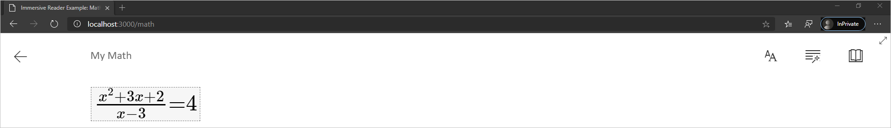

# How to display math in the Immersive Reader

The Immersive Reader can display math when provided in the form of Mathematical Markup Language ([MathML](https://developer.mozilla.org/docs/Web/MathML)).
The MIME type can be set through the Immersive Reader [chunk](../reference.md#chunk). See [supported MIME types](../reference.md#supported-mime-types) for more information.

## Send Math to the Immersive Reader
In order to send math to the Immersive Reader, supply a chunk containing MathML, and set the MIME type to ```application/mathml+xml```;

For example, if your content were the following:

```html
<div id='ir-content'>
    <math xmlns='http://www.w3.org/1998/Math/MathML'>
        <mfrac>
            <mrow>
                <msup>
                    <mi>x</mi>
                    <mn>2</mn>
                </msup>
                <mo>+</mo>
                <mn>3</mn>
                <mi>x</mi>
                <mo>+</mo>
                <mn>2</mn>
            </mrow>
            <mrow>
                <mi>x</mi>
                <mo>−</mo>
                <mn>3</mn>
            </mrow>
        </mfrac>
        <mo>=</mo>
        <mn>4</mn>
    </math>
</div>
```

Then you could display your content by using the following JavaScript.

```javascript
const data = {
    title: 'My Math',
    chunks: [{
        content: document.getElementById('ir-content').innerHTML.trim(),
        mimeType: 'application/mathml+xml'
    }]
};

ImmersiveReader.launchAsync(YOUR_TOKEN, YOUR_SUBDOMAIN, data, YOUR_OPTIONS);
```

When you launch the Immersive Reader, you should see:



## Next steps

* Explore the [Immersive Reader SDK](https://github.com/microsoft/immersive-reader-sdk) and the [Immersive Reader SDK Reference](../reference.md)
