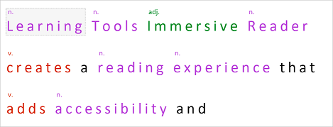
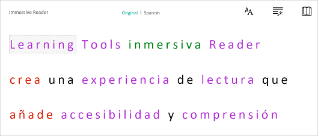

# What is Azure AI Immersive Reader?

[!INCLUDE [Azure AI services rebrand](../includes/rebrand-note.md)]

[Immersive Reader](https://www.onenote.com/learningtools) is part of [Azure AI services](../../ai-services/what-are-ai-services.md), and is an inclusively designed tool that implements proven techniques to improve reading comprehension for new readers, language learners, and people with learning differences such as dyslexia. With the Immersive Reader client library, you can leverage the same technology used in Microsoft Word and Microsoft One Note to improve your web applications. 

This documentation contains the following types of articles:  

* **[Quickstarts](quickstarts/client-libraries.md)** are getting-started instructions to guide you through making requests to the service.
* **[How-to guides](how-to-create-immersive-reader.md)** contain instructions for using the service in more specific or customized ways.

## Use Immersive Reader to improve reading accessibility 

Immersive Reader is designed to make reading easier and more accessible for everyone. Let's take a look at a few of Immersive Reader's core features.

### Isolate content for improved readability

Immersive Reader isolates content to improve readability. 

  

### Display pictures for common words

For commonly used terms, the Immersive Reader will display a picture.

  

### Highlight parts of speech

Immersive Reader can be use to help learners understand parts of speech and grammar by highlighting verbs, nouns, pronouns, and more.

  

### Read content aloud

Speech synthesis (or text-to-speech) is baked into the Immersive Reader service, which lets your readers select text to be read aloud. 

  

### Translate content in real-time

Immersive Reader can translate text into many languages in real-time. This is helpful to improve comprehension for readers learning a new language.

  

### Split words into syllables

With Immersive Reader you can break words into syllables to improve readability or to sound out new words.

  

## How does Immersive Reader work?

Immersive Reader is a standalone web application. When invoked using the Immersive Reader client library is displayed on top of your existing web application in an `iframe`. When your web application calls the Immersive Reader service, you specify the content to show the reader. The Immersive Reader client library handles the creation and styling of the `iframe` and communication with the Immersive Reader backend service. The Immersive Reader service processes the content for parts of speech, text to speech, translation, and more.

## Get started with Immersive Reader

The Immersive Reader client library is available in C#, JavaScript, Java (Android),  Kotlin (Android), and Swift (iOS). Get started with:

* [Quickstart: Use the Immersive Reader client library](quickstarts/client-libraries.md)
