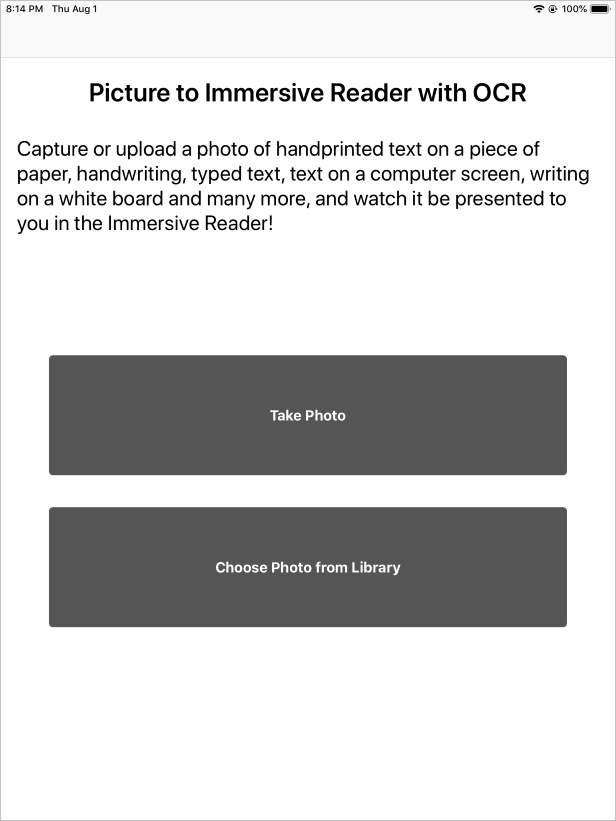

# Tutorial: Create an iOS app that launches the Immersive Reader with content from a photo (Swift)

The [Immersive Reader](https://www.onenote.com/learningtools) is an inclusively designed tool that implements proven techniques to improve reading comprehension.

The [Azure AI Vision Read API](../../ai-services/computer-vision/overview-ocr.md) detects text content in an image using Microsoft's latest recognition models and converts the identified text into a machine-readable character stream.

In this tutorial, you will build an iOS app from scratch and integrate the Read API, and the Immersive Reader by using the Immersive Reader SDK. A full working sample of this tutorial is available [here](https://github.com/microsoft/immersive-reader-sdk/tree/master/js/samples/ios).

If you don't have an Azure subscription, create a [free account](https://azure.microsoft.com/free/cognitive-services/) before you begin.

## Prerequisites

* [Xcode](https://apps.apple.com/us/app/xcode/id497799835?mt=12)
* An Immersive Reader resource configured for Microsoft Entra authentication. Follow [these instructions](./how-to-create-immersive-reader.md) to get set up. You will need some of the values created here when configuring the sample project properties. Save the output of your session into a text file for future reference.
* Usage of this sample requires an Azure subscription to the Azure AI Vision service. [Create an Azure AI Vision resource in the Azure portal](https://portal.azure.com/#create/Microsoft.CognitiveServicesComputerVision).

## Create an Xcode project

Create a new project in Xcode.


Choose **Single View App**.


## Get the SDK CocoaPod

The easiest way to use the Immersive Reader SDK is via CocoaPods. To install via Cocoapods:

1. [Install CocoaPods](http://guides.cocoapods.org/using/getting-started.html) - Follow the getting started guide to install Cocoapods.

2. Create a Podfile by running `pod init` in your Xcode project's root directory.

3. Add the CocoaPod to your Podfile by adding `pod 'immersive-reader-sdk', :path => 'https://github.com/microsoft/immersive-reader-sdk/tree/master/iOS/immersive-reader-sdk'`. Your Podfile should look like the following, with your target's name replacing picture-to-immersive-reader-swift:

   ```ruby
   platform :ios, '9.0'

   target 'picture-to-immersive-reader-swift' do
   use_frameworks!
   # Pods for picture-to-immersive-reader-swift
   pod 'immersive-reader-sdk', :git => 'https://github.com/microsoft/immersive-reader-sdk.git'
   end
   ```

4. In the terminal, in the directory of your Xcode project, run the command `pod install` to install the Immersive Reader SDK pod.

5. Add `import immersive_reader_sdk` to all files that need to reference the SDK.

6. Ensure to open the project by opening the `.xcworkspace` file and not the `.xcodeproj` file.

<a name='acquire-an-azure-ad-authentication-token'></a>

## Acquire a Microsoft Entra authentication token

You need some values from the Microsoft Entra authentication configuration prerequisite step above for this part. Refer back to the text file you saved of that session.

````text
TenantId     => Azure subscription TenantId
ClientId     => Azure AD ApplicationId
ClientSecret => Azure AD Application Service Principal password
Subdomain    => Immersive Reader resource subdomain (resource 'Name' if the resource was created in the Azure portal, or 'CustomSubDomain' option if the resource was created with Azure CLI PowerShell. Check the Azure portal for the subdomain on the Endpoint in the resource Overview page, for example, 'https://[SUBDOMAIN].cognitiveservices.azure.com/')
````

In the main project folder, which contains the ViewController.swift file, create a Swift class file called Constants.swift. Replace the class with the following code, adding in your values where applicable. Keep this file as a local file that only exists on your machine and be sure not to commit this file into source control, as it contains secrets that should not be made public. It is recommended that you do not keep secrets in your app. Instead, we recommend using a backend service to obtain the token, where the secrets can be kept outside of the app and off of the device. The backend API endpoint should be secured behind some form of authentication (for example, [OAuth](https://oauth.net/2/)) to prevent unauthorized users from obtaining tokens to use against your Immersive Reader service and billing; that work is beyond the scope of this tutorial.

## Set up the app to run without a storyboard

Open AppDelegate.swift and replace the file with the following code.

```swift
import UIKit

@UIApplicationMain
class AppDelegate: UIResponder, UIApplicationDelegate {
    
    var window: UIWindow?
    
    var navigationController: UINavigationController?

    func application(_ application: UIApplication, didFinishLaunchingWithOptions launchOptions: [UIApplication.LaunchOptionsKey: Any]?) -> Bool {
        // Override point for customization after application launch.
        
        window = UIWindow(frame: UIScreen.main.bounds)
        
        // Allow the app run without a storyboard
        if let window = window {
            let mainViewController = PictureLaunchViewController()
            navigationController = UINavigationController(rootViewController: mainViewController)
            window.rootViewController = navigationController
            window.makeKeyAndVisible()
        }
        return true
    }

    func applicationWillResignActive(_ application: UIApplication) {
        // Sent when the application is about to move from active to inactive state. This can occur for certain types of temporary interruptions (such as an incoming phone call or SMS message) or when the user quits the application and it begins the transition to the background state.
        // Use this method to pause ongoing tasks, disable timers, and invalidate graphics rendering callbacks. Games should use this method to pause the game.
    }

    func applicationDidEnterBackground(_ application: UIApplication) {
        // Use this method to release shared resources, save user data, invalidate timers, and store enough application state information to restore your application to its current state in case it is terminated later.
        // If your application supports background execution, this method is called instead of applicationWillTerminate: when the user quits.
    }

    func applicationWillEnterForeground(_ application: UIApplication) {
        // Called as part of the transition from the background to the active state; here you can undo many of the changes made on entering the background.
    }

    func applicationDidBecomeActive(_ application: UIApplication) {
        // Restart any tasks that were paused (or not yet started) while the application was inactive. If the application was previously in the background, optionally refresh the user interface.
    }

    func applicationWillTerminate(_ application: UIApplication) {
        // Called when the application is about to terminate. Save data if appropriate. See also applicationDidEnterBackground:.
    }

}
```

## Add functionality for taking and uploading photos

Rename ViewController.swift to PictureLaunchViewController.swift and replace the file with the following code.

```swift
import UIKit
import immersive_reader_sdk

class PictureLaunchViewController: UIViewController, UINavigationControllerDelegate, UIImagePickerControllerDelegate {

    private var photoButton: UIButton!
    private var cameraButton: UIButton!
    private var titleText: UILabel!
    private var bodyText: UILabel!
    private var sampleContent: Content!
    private var sampleChunk: Chunk!
    private var sampleOptions: Options!
    private var imagePicker: UIImagePickerController!
    private var spinner: UIActivityIndicatorView!
    private var activityIndicatorBackground: UIView!
    private var textURL = "vision/v2.0/read/core/asyncBatchAnalyze";
    
    override func viewDidLoad() {
        super.viewDidLoad()
        
        view.backgroundColor = .white
        
        titleText = UILabel()
        titleText.text = "Picture to Immersive Reader with OCR"
        titleText.font = UIFont.boldSystemFont(ofSize: 32)
        titleText.textAlignment = .center
        titleText.lineBreakMode = .byWordWrapping
        titleText.numberOfLines = 0
        view.addSubview(titleText)
        
        bodyText = UILabel()
        bodyText.text = "Capture or upload a photo of handprinted text on a piece of paper, handwriting, typed text, text on a computer screen, writing on a white board and many more, and watch it be presented to you in the Immersive Reader!"
        bodyText.font = UIFont.systemFont(ofSize: 18)
        bodyText.lineBreakMode = .byWordWrapping
        bodyText.numberOfLines = 0
        let screenSize = self.view.frame.height
        if screenSize <= 667 {
            // Font size for smaller iPhones.
            bodyText.font = bodyText.font.withSize(16)

        } else if screenSize <= 812.0 {
            // Font size for medium iPhones.
            bodyText.font = bodyText.font.withSize(18)
            
        } else if screenSize <= 896  {
            // Font size for larger iPhones.
            bodyText.font = bodyText.font.withSize(20)
            
        } else {
            // Font size for iPads.
            bodyText.font = bodyText.font.withSize(26)
        }
        view.addSubview(bodyText)
        
        photoButton = UIButton()
        photoButton.backgroundColor = .darkGray
        photoButton.contentEdgeInsets = UIEdgeInsets(top: 10, left: 5, bottom: 10, right: 5)
        photoButton.layer.cornerRadius = 5
        photoButton.setTitleColor(.white, for: .normal)
        photoButton.setTitle("Choose Photo from Library", for: .normal)
        photoButton.titleLabel?.font = UIFont.systemFont(ofSize: 18, weight: .bold)
        photoButton.addTarget(self, action: #selector(selectPhotoButton(sender:)), for: .touchUpInside)
        view.addSubview(photoButton)
        
        cameraButton = UIButton()
        cameraButton.backgroundColor = .darkGray
        cameraButton.contentEdgeInsets = UIEdgeInsets(top: 10, left: 5, bottom: 10, right: 5)
        cameraButton.layer.cornerRadius = 5
        cameraButton.setTitleColor(.white, for: .normal)
        cameraButton.setTitle("Take Photo", for: .normal)
        cameraButton.titleLabel?.font = UIFont.systemFont(ofSize: 18, weight: .bold)
        cameraButton.addTarget(self, action: #selector(takePhotoButton(sender:)), for: .touchUpInside)
        view.addSubview(cameraButton)
        
        activityIndicatorBackground = UIView()
        activityIndicatorBackground.backgroundColor = UIColor.black
        activityIndicatorBackground.alpha = 0
        view.addSubview(activityIndicatorBackground)
        view.bringSubviewToFront(_: activityIndicatorBackground)
        
        spinner = UIActivityIndicatorView(style: .whiteLarge)
        view.addSubview(spinner)
        
        let layoutGuide = view.safeAreaLayoutGuide
        
        titleText.translatesAutoresizingMaskIntoConstraints = false
        titleText.topAnchor.constraint(equalTo: layoutGuide.topAnchor, constant: 25).isActive = true
        titleText.leadingAnchor.constraint(equalTo: layoutGuide.leadingAnchor, constant: 20).isActive = true
        titleText.trailingAnchor.constraint(equalTo: layoutGuide.trailingAnchor, constant: -20).isActive = true
        
        bodyText.translatesAutoresizingMaskIntoConstraints = false
        bodyText.topAnchor.constraint(equalTo: titleText.bottomAnchor, constant: 35).isActive = true
        bodyText.leadingAnchor.constraint(equalTo: layoutGuide.leadingAnchor, constant: 20).isActive = true
        bodyText.trailingAnchor.constraint(equalTo: layoutGuide.trailingAnchor, constant: -20).isActive = true

        cameraButton.translatesAutoresizingMaskIntoConstraints = false
        if screenSize > 896  {
            // Constraints for iPads.
            cameraButton.heightAnchor.constraint(equalToConstant: 150).isActive = true
            cameraButton.leadingAnchor.constraint(equalTo: layoutGuide.leadingAnchor, constant: 60).isActive = true
            cameraButton.trailingAnchor.constraint(equalTo: layoutGuide.trailingAnchor, constant: -60).isActive = true
            cameraButton.topAnchor.constraint(equalTo: bodyText.bottomAnchor, constant: 150).isActive = true
        } else {
            // Constraints for iPhones.
            cameraButton.heightAnchor.constraint(equalToConstant: 100).isActive = true
            cameraButton.leadingAnchor.constraint(equalTo: layoutGuide.leadingAnchor, constant: 30).isActive = true
            cameraButton.trailingAnchor.constraint(equalTo: layoutGuide.trailingAnchor, constant: -30).isActive = true
            cameraButton.topAnchor.constraint(equalTo: bodyText.bottomAnchor, constant: 100).isActive = true
        }
        cameraButton.bottomAnchor.constraint(equalTo: photoButton.topAnchor, constant: -40).isActive = true
        
        photoButton.translatesAutoresizingMaskIntoConstraints = false
        if screenSize > 896  {
            // Constraints for iPads.
            photoButton.heightAnchor.constraint(equalToConstant: 150).isActive = true
            photoButton.leadingAnchor.constraint(equalTo: layoutGuide.leadingAnchor, constant: 60).isActive = true
            photoButton.trailingAnchor.constraint(equalTo: layoutGuide.trailingAnchor, constant: -60).isActive = true
        } else {
            // Constraints for iPhones.
            photoButton.heightAnchor.constraint(equalToConstant: 100).isActive = true
            photoButton.leadingAnchor.constraint(equalTo: layoutGuide.leadingAnchor, constant: 30).isActive = true
            photoButton.trailingAnchor.constraint(equalTo: layoutGuide.trailingAnchor, constant: -30).isActive = true
        }
        
        spinner.translatesAutoresizingMaskIntoConstraints = false
        spinner.centerXAnchor.constraint(equalTo: view.centerXAnchor).isActive = true
        spinner.centerYAnchor.constraint(equalTo: view.centerYAnchor).isActive = true
        
        activityIndicatorBackground.translatesAutoresizingMaskIntoConstraints = false
        activityIndicatorBackground.topAnchor.constraint(equalTo: layoutGuide.topAnchor).isActive = true
        activityIndicatorBackground.bottomAnchor.constraint(equalTo: layoutGuide.bottomAnchor).isActive = true
        activityIndicatorBackground.leadingAnchor.constraint(equalTo: layoutGuide.leadingAnchor).isActive = true
        activityIndicatorBackground.trailingAnchor.constraint(equalTo: layoutGuide.trailingAnchor).isActive = true
        
        // Create content and options.
        sampleChunk = Chunk(content: bodyText.text!, lang: nil, mimeType: nil)
        sampleContent = Content(title: titleText.text!, chunks: [sampleChunk])
        sampleOptions = Options(uiLang: nil, timeout: nil, uiZIndex: nil)
    }
    
    @IBAction func selectPhotoButton(sender: AnyObject) {
            // Launch the photo picker.
            imagePicker =  UIImagePickerController()
            imagePicker.delegate = self
            self.imagePicker.sourceType = .photoLibrary
            self.imagePicker.allowsEditing = true
            self.present(self.imagePicker, animated: true, completion: nil)
            self.photoButton.isEnabled = true
    }
    
    @IBAction func takePhotoButton(sender: AnyObject) {
        if !UIImagePickerController.isSourceTypeAvailable(.camera) {
            // If there is no camera on the device, disable the button
            self.cameraButton.backgroundColor = .gray
            self.cameraButton.isEnabled = true
            
        } else {
            // Launch the camera.
            imagePicker =  UIImagePickerController()
            imagePicker.delegate = self
            self.imagePicker.sourceType = .camera
            self.present(self.imagePicker, animated: true, completion: nil)
            self.cameraButton.isEnabled = true
        }
    }

    func imagePickerController(_ picker: UIImagePickerController, didFinishPickingMediaWithInfo info: [UIImagePickerController.InfoKey : Any]) {
        imagePicker.dismiss(animated: true, completion: nil)
        photoButton.isEnabled = false
        cameraButton.isEnabled = false
        self.spinner.startAnimating()
        activityIndicatorBackground.alpha = 0.6
        
        // Retrieve the image.
        let image = (info[.originalImage] as? UIImage)!
        
        // Retrieve the byte array from image.
        let imageByteArray = image.jpegData(compressionQuality: 1.0)
        
        // Call the getTextFromImage function passing in the image the user takes or chooses.
        getTextFromImage(subscriptionKey: Constants.computerVisionSubscriptionKey, getTextUrl: Constants.computerVisionEndPoint + textURL, pngImage: imageByteArray!, onSuccess: { cognitiveText in
            print("cognitive text is: \(cognitiveText)")
            DispatchQueue.main.async {
                self.photoButton.isEnabled = true
                self.cameraButton.isEnabled = true
            }
            
            // Create content and options with the text from the image.
            let sampleImageChunk = Chunk(content: cognitiveText, lang: nil, mimeType: nil)
            let sampleImageContent = Content(title: "Text from image", chunks: [sampleImageChunk])
            let sampleImageOptions = Options(uiLang: nil, timeout: nil, uiZIndex: nil)
            
            // Callback to get token for Immersive Reader.
            self.getToken(onSuccess: {cognitiveToken in
                
                DispatchQueue.main.async {
                    
                    launchImmersiveReader(navController: self.navigationController!, token: cognitiveToken, subdomain: Constants.subdomain, content: sampleImageContent, options: sampleImageOptions, onSuccess: {
                        self.spinner.stopAnimating()
                        self.activityIndicatorBackground.alpha = 0
                        self.photoButton.isEnabled = true
                        self.cameraButton.isEnabled = true
                        
                    }, onFailure: { error in
                        print("An error occured launching the Immersive Reader: \(error)")
                        self.spinner.stopAnimating()
                        self.activityIndicatorBackground.alpha = 0
                        self.photoButton.isEnabled = true
                        self.cameraButton.isEnabled = true
                        
                    })
                }

            }, onFailure: { error in
                DispatchQueue.main.async {
                    self.photoButton.isEnabled = true
                    self.cameraButton.isEnabled = true
                    
                }
                print("An error occured retrieving the token: \(error)")
            })
            
        }, onFailure: { error in
            DispatchQueue.main.async {
                self.photoButton.isEnabled = true
                self.cameraButton.isEnabled = true
            }
            
        })
    }
    
    /// Retrieves the token for the Immersive Reader using Azure Active Directory authentication
    ///
    /// - Parameters:
    ///     -onSuccess: A closure that gets called when the token is successfully recieved using Azure Active Directory authentication.
    ///     -theToken: The token for the Immersive Reader recieved using Azure Active Directory authentication.
    ///     -onFailure: A closure that gets called when the token fails to be obtained from the Azure Active Directory Authentication.
    ///     -theError: The error that occured when the token fails to be obtained from the Azure Active Directory Authentication.
    func getToken(onSuccess: @escaping (_ theToken: String) -> Void, onFailure: @escaping ( _ theError: String) -> Void) {
        
        let tokenForm = "grant_type=client_credentials&resource=https://cognitiveservices.azure.com/&client_id=" + Constants.clientId + "&client_secret=" + Constants.clientSecret
        let tokenUrl = "https://login.windows.net/" + Constants.tenantId + "/oauth2/token"
        
        var responseTokenString: String = "0"
        
        let url = URL(string: tokenUrl)!
        var request = URLRequest(url: url)
        request.httpBody = tokenForm.data(using: .utf8)
        request.httpMethod = "POST"
        
        let task = URLSession.shared.dataTask(with: request) { data, response, error in
            guard let data = data,
                let response = response as? HTTPURLResponse,
                // Check for networking errors.
                error == nil else {
                    print("error", error ?? "Unknown error")
                    onFailure("Error")
                    return
            }
            
            // Check for http errors.
            guard (200 ... 299) ~= response.statusCode else {
                print("statusCode should be 2xx, but is \(response.statusCode)")
                print("response = \(response)")
                onFailure(String(response.statusCode))
                return
            }
            
            let responseString = String(data: data, encoding: .utf8)
            print("responseString = \(String(describing: responseString!))")
            
            let jsonResponse = try? JSONSerialization.jsonObject(with: data, options: [])
            guard let jsonDictonary = jsonResponse as? [String: Any] else {
                onFailure("Error parsing JSON response.")
                return
            }
            guard let responseToken = jsonDictonary["access_token"] as? String else {
                onFailure("Error retrieving token from JSON response.")
                return
            }
            responseTokenString = responseToken
            onSuccess(responseTokenString)
        }
        
        task.resume()
    }
    
    /// Returns the text string after it has been extracted from an Image input.
    ///
    /// - Parameters:
    ///     -subscriptionKey: The Azure subscription key.
    ///     -pngImage: Image data in PNG format.
    /// - Returns: a string of text representing the
    func getTextFromImage(subscriptionKey: String, getTextUrl: String, pngImage: Data, onSuccess: @escaping (_ theToken: String) -> Void, onFailure: @escaping ( _ theError: String) -> Void) {
        
        let url = URL(string: getTextUrl)!
        var request = URLRequest(url: url)
        request.setValue(subscriptionKey, forHTTPHeaderField: "Ocp-Apim-Subscription-Key")
        request.setValue("application/octet-stream", forHTTPHeaderField: "Content-Type")
        
        // Two REST API calls are required to extract text. The first call is to submit the image for processing, and the next call is to retrieve the text found in the image.
        
        // Set the body to the image in byte array format.
        request.httpBody = pngImage
        
        request.httpMethod = "POST"
        
        let task = URLSession.shared.dataTask(with: request) { data, response, error in
            guard let data = data,
                let response = response as? HTTPURLResponse,
                // Check for networking errors.
                error == nil else {
                    print("error", error ?? "Unknown error")
                    onFailure("Error")
                    return
            }
            
            // Check for http errors.
            guard (200 ... 299) ~= response.statusCode else {
                print("statusCode should be 2xx, but is \(response.statusCode)")
                print("response = \(response)")
                onFailure(String(response.statusCode))
                return
            }
            
            let responseString = String(data: data, encoding: .utf8)
            print("responseString = \(String(describing: responseString!))")
            
            // Send the second call to the API. The first API call returns operationLocation which stores the URI for the second REST API call.
            let operationLocation = response.allHeaderFields["Operation-Location"] as? String
            
            if (operationLocation == nil) {
                print("Error retrieving operation location")
                return
            }
            
            // Wait 10 seconds for text recognition to be available as suggested by the Text API documentation.
            print("Text submitted. Waiting 10 seconds to retrieve the recognized text.")
            sleep(10)
            
            // HTTP GET request with the operationLocation url to retrieve the text.
            let getTextUrl = URL(string: operationLocation!)!
            var getTextRequest = URLRequest(url: getTextUrl)
            getTextRequest.setValue(subscriptionKey, forHTTPHeaderField: "Ocp-Apim-Subscription-Key")
            getTextRequest.httpMethod = "GET"
            
            // Send the GET request to retrieve the text.
            let taskGetText = URLSession.shared.dataTask(with: getTextRequest) { data, response, error in
                guard let data = data,
                    let response = response as? HTTPURLResponse,
                    // Check for networking errors.
                    error == nil else {
                        print("error", error ?? "Unknown error")
                        onFailure("Error")
                        return
                }
                
                // Check for http errors.
                guard (200 ... 299) ~= response.statusCode else {
                    print("statusCode should be 2xx, but is \(response.statusCode)")
                    print("response = \(response)")
                    onFailure(String(response.statusCode))
                    return
                }
                
                // Decode the JSON data into an object.
                let customDecoding = try! JSONDecoder().decode(TextApiResponse.self, from: data)
                
                // Loop through the lines to get all lines of text and concatenate them together.
                var textFromImage = ""
                for textLine in customDecoding.recognitionResults[0].lines {
                    textFromImage = textFromImage + textLine.text + " "
                }
                
                onSuccess(textFromImage)
            }
            taskGetText.resume()

        }
        
        task.resume()
    }
    
    // Structs used for decoding the Text API JSON response.
    struct TextApiResponse: Codable {
        let status: String
        let recognitionResults: [RecognitionResult]
    }

    struct RecognitionResult: Codable {
        let page: Int
        let clockwiseOrientation: Double
        let width, height: Int
        let unit: String
        let lines: [Line]
    }

    struct Line: Codable {
        let boundingBox: [Int]
        let text: String
        let words: [Word]
    }

    struct Word: Codable {
        let boundingBox: [Int]
        let text: String
        let confidence: String?
    }
    
}
```

## Build and run the app

Set the archive scheme in Xcode by selecting a simulator or device target.
<br/>


In Xcode, press Ctrl + R or select the play button to run the project and the app should launch on the specified simulator or device.

In your app, you should see:



Inside the app, take or upload a photo of text by pressing the 'Take Photo' button or 'Choose Photo from Library' button and the Immersive Reader will then launch displaying the text from the photo.


## Next steps

* Explore the [Immersive Reader SDK Reference](./reference.md)
