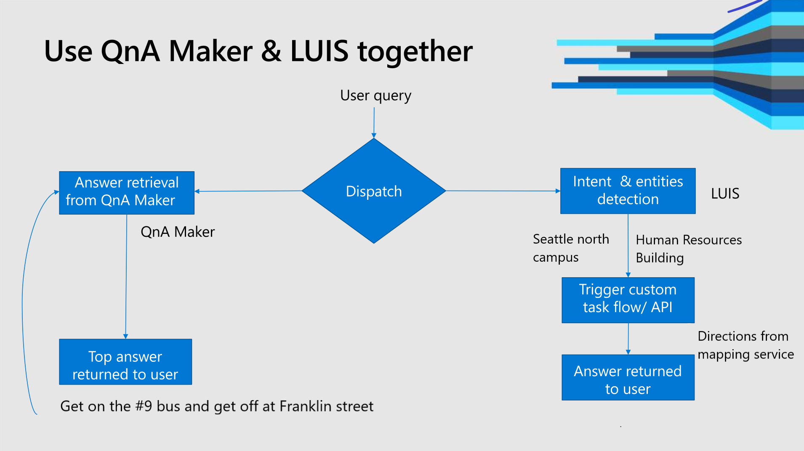

Azure AI services provides two natural language processing services, [Language Understanding](../luis/what-is-luis.md) and [QnA Maker](../qnamaker/overview/overview.md), each with a different purpose. Understand when to use each service and how they compliment each other.

Natural language processing (NLP) allows your client application, such as a chat bot, to work with your users, using natural language. A user enters a sentence or phrase. The user's text can have poor grammar, spelling, and punctuation. The Azure AI service can work through the user sentence anyway, returning information the chat bot needs to help the user.

## Azure AI services with NLP

Language Understanding (LUIS) and QnA Maker provide NLP. The client application submits natural language text. The service takes the text, processes it, and returns a result.

## When to use each service

Language Understanding (LUIS) and QnA Maker solve different issues. LUIS determines the intent of a user's text (known as an utterance), while QnA Maker determines the answer to a user's text (known as a query).

In order to pick the correct service, you need to understand the user text coming from the client application, and what information the client application needs to get from the Azure AI service.

If your chat bot receives the text `How do I get to the Human Resources building on the Seattle North campus?`, use the chart below to understand how each service works with the text.

|Service|Client application determines|
|--|--|
|LUIS|**Determines user's intention** of text - the service doesn't return the answer to the question. For example, this text is classified as matching the `FindLocation` intent. |
|QnA Maker|**Returns the answer to the question** from a custom knowledge base. For example, this text is determined as a question with the static text answer of  `Get on the #9 bus and get off at Franklin street`.|
|||

> [!div class="mx-imgBorder"]
> 

## When do you use LUIS?

Use LUIS when you need to know the intention of the utterance as part of a process in the chat bot. Continuing with the example text, `How do I get to the Human Resources building on the Seattle North campus?`, once you know the user's intention is to find a location, you can pass details about the utterance (pulled out with entities) to another service, such as a transportation server, to get the answer.

You don't need to combine LUIS and QnA Maker to determine intent.

You might combine the two services for this utterance, if the chat bot needs to process the text based on intentions and entities (using LUIS) as well as find the specific static text answer (using QnA Maker).

## When do you use QnA Maker?

Use QnA Maker when you have a static knowledge base of answers. This knowledge base is custom to your needs, which you've built with documents such as PDFs and URLs.

Continuing with the example utterance, `How do I get to the Human Resources building on the Seattle North campus?`, send the text, as a query, to your published QnA Maker service and receive the best answer.

You don't need to combine LUIS and QnA Maker to determine the answer to the question.

You might combine the two services for this utterance, if the chat bot needs to process the text based on intentions and entities (using LUIS) as well as find the answer (using QnA Maker).

## Use both services when your knowledge base is incomplete

If you are building your QnA Maker knowledge base but know the subject domain is changing (such as timely information), you could combine LUIS and QnA Maker services. This allows you to use the information in your knowledge base but also use LUIS to determine a user's intention. Once the client application has the intention, it can request relevant information from another source.

Your client application would need to monitor both LUIS and QnA Maker responses for scores. If the score from QnA Maker is below some arbitrary threshold, use the intent and entity information returned from LUIS to pass the information on to a third-party service.

Continuing with the example text, `How do I get to the Human Resources building on the Seattle North campus?`, suppose that QnA Maker returns a low confidence score. Use the intent returned from LUIS, `FindLocation` and any extracted entities, such as `Human Resources building` and `Seattle North campus`, to send this information to a mapping or search service for another answer.

You can present this third-party answer to the user for validation. Once you have the user's approval, you can go back to QnA Maker to add the information to grow your knowledge.

## Use both services when your chat bot needs more information

If your chat bot needs more information than either service provides, to continue through a decision tree, use both services and process both responses in the client application.

Use the Bot framework **[Dispatch CLI](https://github.com/Microsoft/botbuilder-tools/tree/master/packages/Dispatch)** tool to help build a process to work with both services. This tool builds a top LUIS app of intents that dispatches between LUIS and QnA Maker as child apps. [Learn more](/azure/bot-service/bot-builder-tutorial-dispatch?tabs=cs) about integrating with LUIS, QnA Maker, and Bot framework.

Use the Bot builder sample, **NLP with dispatch**, in [C#](https://github.com/microsoft/BotBuilder-Samples/tree/main/archive/samples/csharp_dotnetcore/14.nlp-with-orchestrator) or [Node.js](https://github.com/microsoft/BotBuilder-Samples/tree/main/archive/samples/javascript_nodejs/14.nlp-with-orchestrator), to implement this type of chat bot.

## Best practices

Implement best practices for each service:

* [LUIS](../luis/faq.md) best practices
* [QnA Maker](../qnamaker/concepts/best-practices.md) best practices

## See also

* [Language Understanding (LUIS)](../luis/what-is-luis.md)
* [QnA Maker](../qnamaker/overview/overview.md)
* [Dispatch CLI](https://github.com/Microsoft/botbuilder-tools/tree/master/packages/Dispatch)
* [Bot framework samples](https://github.com/Microsoft/BotBuilder-Samples)
* [Azure AI Bot Service](/azure/bot-service/bot-service-overview-introduction)
* [Azure bot emulator](https://github.com/Microsoft/BotFramework-Emulator)
* [Bot framework web chat](https://github.com/microsoft/BotFramework-WebChat)
