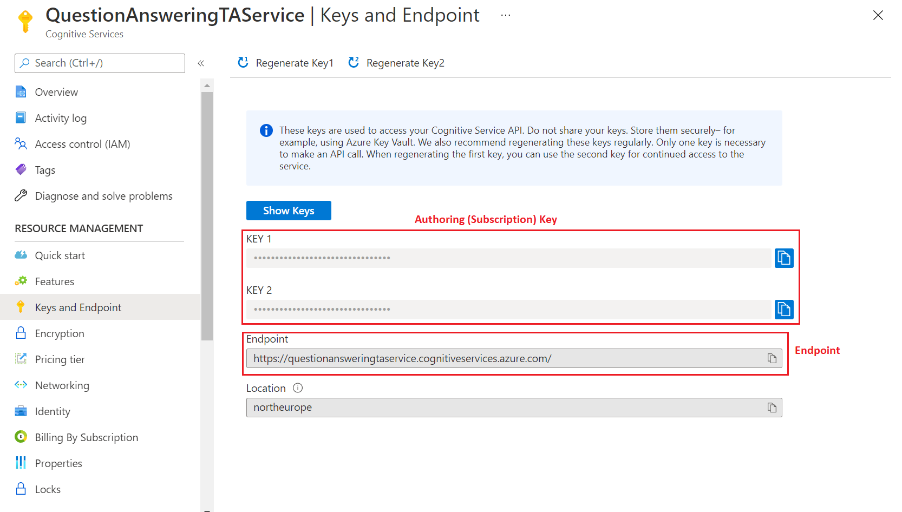

# Azure resources for question answering

Question answering uses several Azure sources, each with a different purpose. Understanding how they are used individually allows you to plan for and select the correct pricing tier or know when to change your pricing tier. Understanding how resources are used _in combination_ allows you to find and fix problems when they occur.

## Resource planning

> [!TIP]
> "Knowledge base" and "project" are equivalent terms in question answering and can be used interchangeably.

When you first develop a project, in the prototype phase, it is common to have a single resource for both testing and production.

When you move into the development phase of the project, you should consider:

* How many languages will your project hold?
* How many regions you need your project to be available in?
* How many documents will your system hold in each domain?

## Pricing tier considerations

Typically there are three parameters you need to consider:

* **The throughput you need**:

    * The throughput for question answering is currently capped at 10 text records per second for both management APIs and prediction APIs.

    * This should also influence your Azure **Cognitive Search** SKU selection, see more details [here](../../../../search/search-sku-tier.md). Additionally, you may need to adjust Cognitive Search [capacity](../../../../search/search-capacity-planning.md) with replicas.

* **Size and the number of projects**: Choose the appropriate [Azure search SKU](https://azure.microsoft.com/pricing/details/search/) for your scenario. Typically, you decide the number of projects you need based on number of different subject domains. One subject domain (for a single language) should be in one project.

    With custom question answering, you have a choice to set up your language resource in a single language or multiple languages. You can make this selection when you create your first project in the [Language Studio](https://language.azure.com/).

    > [!IMPORTANT]
    > You can publish N-1 projects of a single language or N/2 projects of different languages in a particular tier, where N is the maximum indexes allowed in the tier. Also check the maximum size and the number of documents allowed per tier.

    For example, if your tier has 15 allowed indexes, you can publish 14 projects of the same language (one index per published project). The 15th index is used for all the projects for authoring and testing. If you choose to have projects in different languages, then you can only publish seven projects.

* **Number of documents as sources**: There are no limits to the number of documents you can add as sources in question answering.

The following table gives you some high-level guidelines.

|                            |Azure Cognitive Search | Limitations                      |
| -------------------------- |------------ | -------------------------------- |
| **Experimentation**        |Free Tier    | Publish Up to 2 KBs, 50 MB size  |
| **Dev/Test Environment**   |Basic        | Publish Up to 14 KBs, 2 GB size    |
| **Production Environment** |Standard     | Publish Up to 49 KBs, 25 GB size |

## Recommended settings

The throughput for question answering is currently capped at 10 text records per second for both management APIs and prediction APIs. To target 10 text records per second for your service, we recommend the S1 (one instance) SKU of Azure Cognitive Search.

## Keys in question answering

Your custom question answering feature deals with two kinds of keys: **authoring keys** and **Azure Cognitive Search keys** used to access the service in the customer’s subscription.

Use these keys when making requests to the service through APIs.

|Name|Location|Purpose|
|--|--|--|
|Authoring/Subscription key|[Azure portal](https://azure.microsoft.com/free/cognitive-services/)|These keys are used to access the Language service APIs). These APIs let you edit the questions and answers in your project, and publish your project. These keys are created when you create a new resource.  Find these keys on the **Azure AI services** resource on the **Keys and Endpoint** page.|
|Azure Cognitive Search Admin Key|[Azure portal](../../../../search/search-security-api-keys.md)|These keys are used to communicate with the Azure cognitive search service deployed in the user’s Azure subscription. When you associate an Azure Cognitive Search resource with the custom question answering feature, the admin key is automatically passed to question answering.   You can find these keys on the **Azure Cognitive Search** resource on the **Keys** page.|

### Find authoring keys in the Azure portal

You can view and reset your authoring keys from the Azure portal, where you added the custom question answering feature in your language resource.

1. Go to the language resource in the Azure portal and select the resource that has the *Azure AI services* type:

    > [!div class="mx-imgBorder"]
    > 

2. Go to **Keys and Endpoint**:

    > [!div class="mx-imgBorder"]
    > 

### Management service region

In custom question answering, both the management and the prediction services are colocated in the same region.

## Resource purposes

Each Azure resource created with Custom question answering feature has a specific purpose:

* Language resource (Also referred to as a Text Analytics resource depending on the context of where you are evaluating the resource.)
* Cognitive Search resource

### Language resource

The language resource with custom question answering feature provides access to the authoring and publishing APIs, hosts the ranking runtime as well as provides telemetry.

### Azure Cognitive Search resource

The [Cognitive Search](../../../../search/index.yml) resource is used to:

* Store the question and answer pairs
* Provide the initial ranking (ranker #1) of the question and answer pairs at runtime

#### Index usage

You can publish N-1 projects of a single language or N/2 projects of different languages in a particular tier, where N is the maximum number of indexes allowed in the Azure Cognitive Search tier. Also check the maximum size and the number of documents allowed per tier.

For example, if your tier has 15 allowed indexes, you can publish 14 projects of the same language (one index per published project). The 15th index is used for all the projects for authoring and testing. If you choose to have projects in different languages, then you can only publish seven projects.

#### Language usage

With custom question answering, you have a choice to set up your service for projects in a single language or multiple languages. You make this choice during the creation of the first project in your language resource.

## Next steps

* Learn about the question answering [projects](../How-To/manage-knowledge-base.md)
