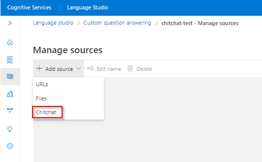
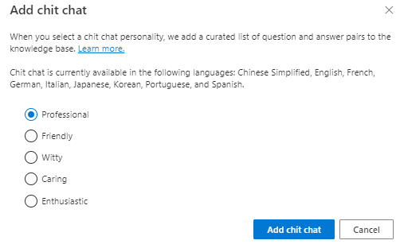
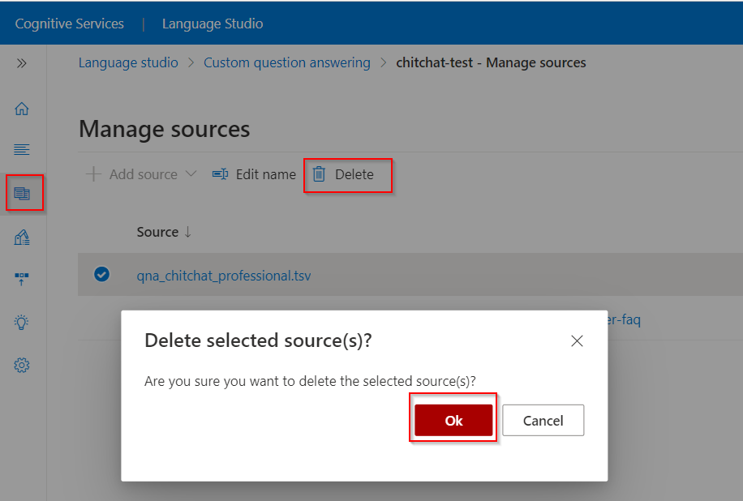

# Use chitchat with a project

Adding chitchat to your bot makes it more conversational and engaging. The chitchat feature in custom question answering allows you to easily add a pre-populated set of the top chitchat, into your project. This can be a starting point for your bot's personality, and it will save you the time and cost of writing them from scratch.

This dataset has about 100 scenarios of chitchat in the voice of multiple personas, like Professional, Friendly and Witty. Choose the persona that most closely resembles your bot's voice. Given a user query, question answering tries to match it with the closest known chitchat question and answer.

Some examples of the different personalities are below. You can see all the personality [datasets](https://github.com/microsoft/botframework-cli/blob/main/packages/qnamaker/docs/chit-chat-dataset.md) along with details of the personalities.

For the user query of `When is your birthday?`, each personality has a styled response:

<!-- added quotes so acrolinx doesn't score these sentences -->
|Personality|Example|
|--|--|
|Professional|Age doesn't really apply to me.|
|Friendly|I don't really have an age.|
|Witty|I'm age-free.|
|Caring|I don't have an age.|
|Enthusiastic|I'm a bot, so I don't have an age.|
||

## Language support

Chitchat data sets are supported in the following languages:

|Language|
|--|
|Chinese|
|English|
|French|
|Germany|
|Italian|
|Japanese|
|Korean|
|Portuguese|
|Spanish|

## Add chitchat source
After you create your project you can add sources from URLs, files, as well as chitchat from the **Manage sources** pane.

> [!div class="mx-imgBorder"]
> 

Choose the personality that you want as your chitchat base.

> [!div class="mx-imgBorder"]
> 

## Edit your chitchat questions and answers

When you edit your project, you will see a new source for chitchat, based on the personality you selected. You can now add altered questions or edit the responses, just like with any other source.

> [!div class="mx-imgBorder"]
> 

To turn the views for context and metadata on and off, select **Show columns** in the toolbar.

## Add more chitchat questions and answers

You can add a new chitchat question pair that is not in the predefined data set. Ensure that you are not duplicating a question pair that is already covered in the chitchat set. When you add any new chitchat question pair, it gets added to your **Editorial** source. To ensure the ranker understands that this is chitchat, add the metadata key/value pair "Editorial: chitchat", as seen in the following image:

:::image type="content" source="../media/chit-chat/add-new-chit-chat.png" alt-text="Add chitchat question answer pairs" lightbox="../media/chit-chat/add-new-chit-chat.png":::

## Delete chitchat from your project

Select the **manage sources** pane, and choose your chitchat source. Your specific chitchat source is listed as a tsv file, with the selected personality name. Select **Delete** from the toolbar.

> [!div class="mx-imgBorder"]
> 

## Next steps

