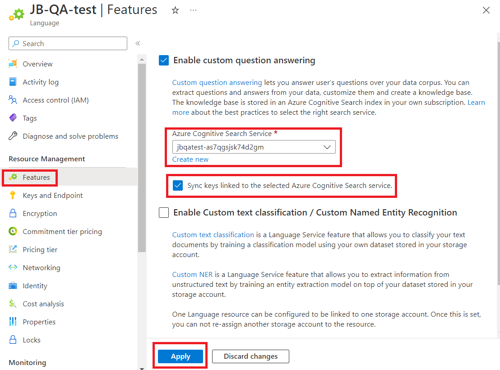

# Configure custom question answering enabled resources

You can configure question answering to use a different Azure AI Search resource.

## Change Azure AI Search resource

> [!WARNING]
> If you change the Azure Search service associated with your language resource, you will lose access to all the projects already present in it. Make sure you export the existing projects before you change the Azure Search service.

If you create a language resource and its dependencies (such as Search) through the Azure portal, a Search service is created for you and linked to the language resource. After these resources are created, you can update the Search resource in the **Features** tab.

1.  Go to your language resource in the Azure portal.

2.  Select **Features** and select the Azure AI Search service you want to link with your language resource.
    
    > [!NOTE]
    > Your Language resource will retain your Azure AI Search keys. If you update your search resource (for example, regenerating your keys), you will need to select **Update Azure AI Search keys for the current search service**.
    
    > [!div class="mx-imgBorder"]
    > 
    
3.  Select **Save**.

## Next steps

* [Encrypt data at rest](./encrypt-data-at-rest.md)
