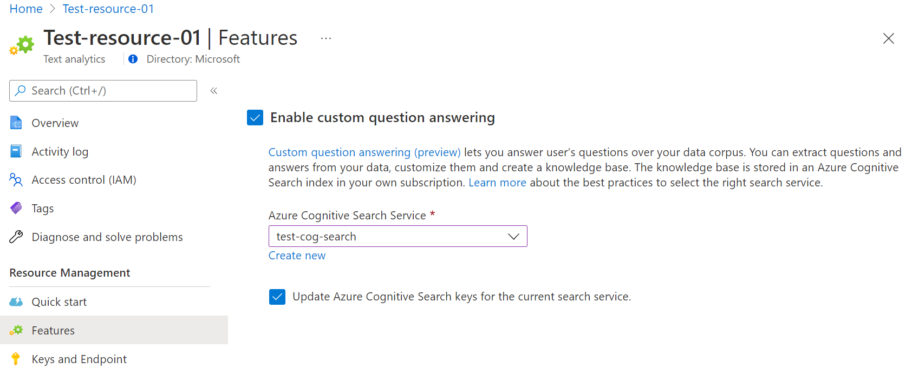
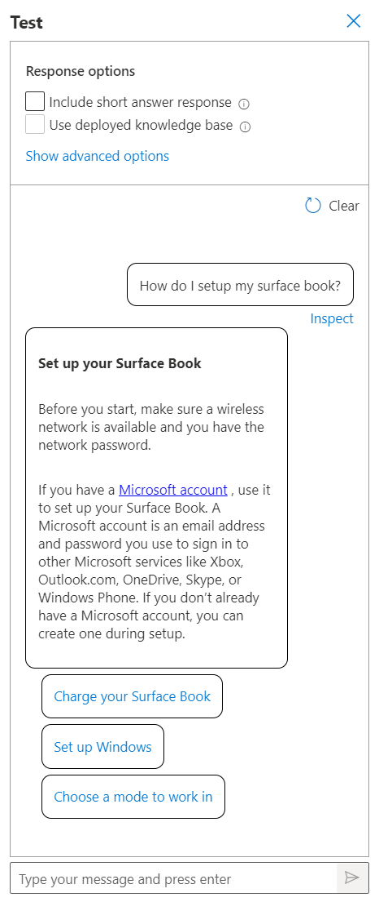
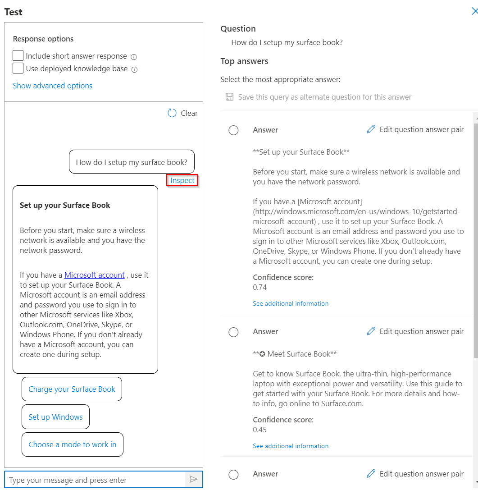
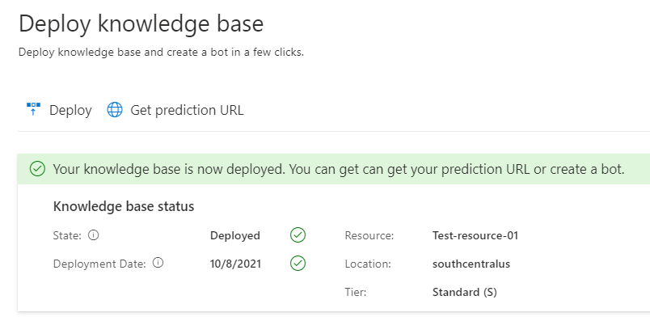

# Create, test, and deploy a custom question answering project

You can create a question answering project from your own content, such as FAQs or product manuals. This article includes an example of creating a question answering project from a product manual, to answer questions.

## Prerequisites

> [!div class="checklist"]
> * If you don't have an Azure subscription, create a [free account](https://azure.microsoft.com/free/cognitive-services/) before you begin.
> * A [language resource](https://aka.ms/create-language-resource) with the custom question answering feature enabled.

## Create your first question answering project

1. Sign in to the [Language Studio](https://language.azure.com/) with your Azure credentials.

2. Scroll down to the **Understand questions and conversational language** section and select **Open custom question answering**.

    > [!div class="mx-imgBorder"]
    > 

3. If your resource is not yet connected to Azure Search select **Connect to Azure Search**. This will open a new browser tab to **Features** pane of your resource in the Azure portal.

    > [!div class="mx-imgBorder"]
    > 

4. Select **Enable custom question answering**, choose the Azure Search resource to link to, and then select **Apply**.

    > [!div class="mx-imgBorder"]
    > 

5. Return to the Language Studio tab. You may need to refresh this page for it to register the change to your resource. Select **Create new project**.

6. Choose the option **I want to set the language for all projects created in this resource** > select **English** > Select **Next**.

7. Enter a project name of **Sample-project**, a description of **My first question answering project**, and leave the default answer with a setting of **No answer found**.

8. Review your choices and select **Create project**

9. From the **Manage sources** page select **Add source** > **URLS**.

10. Select **Add url** enter the following values and then select **Add all**:

    |URL Name|URL Value|
    |--------|---------|
    |Surface Book User Guide |https://download.microsoft.com/download/7/B/1/7B10C82E-F520-4080-8516-5CF0D803EEE0/surface-book-user-guide-EN.pdf |

    The extraction process takes a few moments to read the document and identify questions and answers. Question and answering will determine if the underlying content is structured or unstructured.

    After successfully adding the source, you can then edit the source contents to add more custom question answer sets.

## Test your project

1. Select the link to your source, this will open the edit project page.

2. Select **Test** from the menu bar > Enter the question **How do I setup my surface book?**. An answer will be generated based on the question answer pairs that were automatically identified and extracted from your source URL:

    > [!div class="mx-imgBorder"]
    > 

    If you check the box for **include short answer response** you will also see a precise answer, if available, along with the answer passage in the test pane when you ask a question.

3. Select **Inspect** to examine the response in more detail. The test window is used to test your changes to your project before deploying your project.

    > [!div class="mx-imgBorder"]
    > 

    From the **Inspect** interface, you can see the level of confidence that this response will answer the question and directly edit a given question and answer response pair.

## Deploy your project

1. Select the Deploy project icon to enter the deploy project menu.

    > [!div class="mx-imgBorder"]
    > 

    When you deploy a project, the contents of your project move from the `test` index to a `prod` index in Azure Search.

2. Select **Deploy** > and then when prompted select **Deploy** again.

    > [!div class="mx-imgBorder"]
    > 

    Your project is now successfully deployed. You can use the endpoint to answer questions in your own custom application to answer or in a bot.

## Clean up resources

If you will not continue to test custom question answering, you can delete the associated resource.

## Next steps

