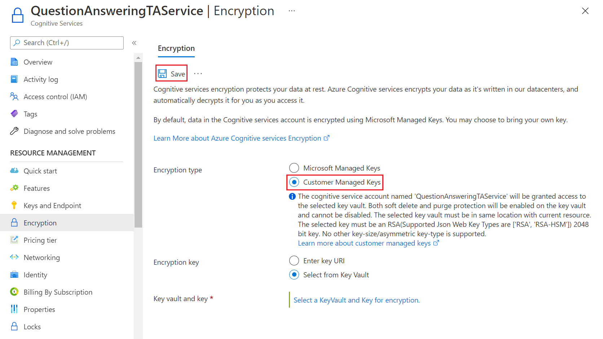

# Custom question answering encryption of data at rest

Question answering automatically encrypts your data when it is persisted to the cloud, helping to meet your organizational security and compliance goals.

## About encryption key management

By default, your subscription uses Microsoft-managed encryption keys. There is also the option to manage your resource with your own keys called customer-managed keys (CMK). CMK offers greater flexibility to create, rotate, disable, and revoke access controls. You can also audit the encryption keys used to protect your data. If CMK is configured for your subscription, double encryption is provided, which offers a second layer of protection, while allowing you to control the encryption key through your Azure Key Vault.

Question answering uses CMK support from Azure search, and associates the provided CMK to encrypt the data stored in Azure search index. Please follow the steps listed in [this article](../../../../search/search-security-manage-encryption-keys.md) to configure Key Vault access for the Azure search service.

> [!IMPORTANT]
> Your Azure Search service resource must have been created after January 2019 and cannot be in the free (shared) tier. There is no support to configure customer-managed keys in the Azure portal.

## Enable customer-managed keys

Follow these steps to enable CMKs:

1.	Go to the **Encryption** tab of your language resource with custom question answering enabled.
2.	Select the **Customer Managed Keys** option. Provide the details of your [customer-managed keys](../../../../storage/common/customer-managed-keys-configure-key-vault.md?tabs=portal) and select **Save**.

> [!div class="mx-imgBorder"]
> 
   
3.	On a successful save, the CMK will be used to encrypt the data stored in the Azure Search Index.

> [!IMPORTANT]
> It is recommended to set your CMK in a fresh Azure AI Search service before any projects are created. If you set CMK in a language resource with existing projects, you might lose access to them. Read more about [working with encrypted content](../../../../search/search-security-manage-encryption-keys.md#work-with-encrypted-content) in Azure AI Search.

## Regional availability

Customer-managed keys are available in all Azure Search regions.

## Encryption of data in transit

Language Studio runs in the user's browser. Every action triggers a direct call to the respective Azure AI services API. Hence, question answering is compliant for data in transit.

## Next steps

* [Encryption in Azure Search using CMKs in Azure Key Vault](../../../../search/search-security-manage-encryption-keys.md)
* [Data encryption at rest](../../../../security/fundamentals/encryption-atrest.md)
* [Learn more about Azure Key Vault](../../../../key-vault/general/overview.md)
