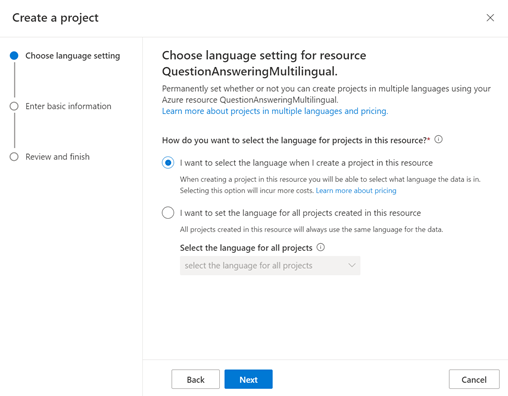
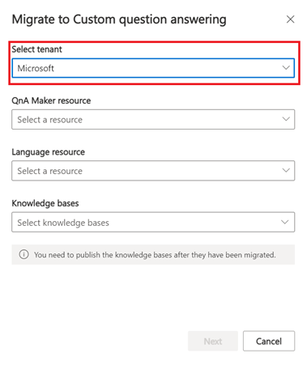
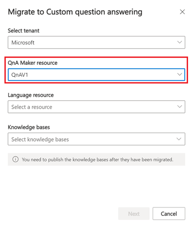
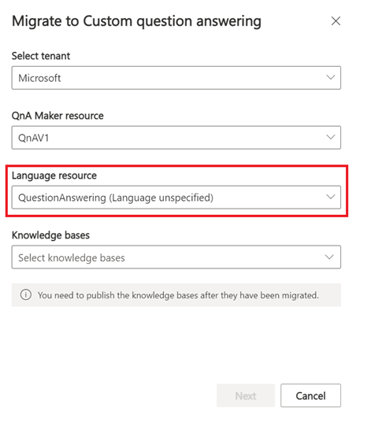
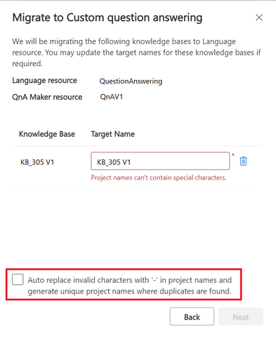
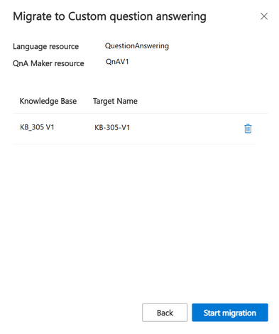
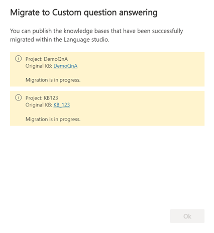

# Migrate from QnA Maker to custom question answering

Custom question answering, a feature of Azure AI Language was introduced in May 2021 with several new capabilities including enhanced relevance using a deep learning ranker, precise answers, and end-to-end region support. Each custom question answering project is equivalent to a knowledge base in QnA Maker. You can easily migrate knowledge bases from a QnA Maker resource to custom question answering projects within a [language resource](https://aka.ms/create-language-resource). You can also choose to migrate knowledge bases from multiple QnA Maker resources to a specific language resource.

To successfully migrate knowledge bases, **the account performing the migration needs contributor access to the selected QnA Maker and language resource**. When a knowledge base is migrated, the following details are copied to the new custom question answering project:

- QnA pairs including active learning suggestions.
- Synonyms and default answer from the QnA Maker resource.
- Knowledge base name is copied to project description field.

Resource level settings such as Role-based access control (RBAC) are not migrated to the new resource. These resource level settings would have to be reconfigured for the language resource post migration. You will also need to [re-enable analytics](analytics.md) for the language resource.

## Steps to migrate SDKs

This [SDK Migration Guide](https://github.com/Azure/azure-sdk-for-net/blob/Azure.AI.Language.QuestionAnswering_1.1.0-beta.1/sdk/cognitivelanguage/Azure.AI.Language.QuestionAnswering/MigrationGuide.md) is intended to assist in the migration to the new Question Answering client library, [Azure.AI.Language.QuestionAnswering](https://www.nuget.org/packages/Azure.AI.Language.QuestionAnswering), from the old one, [Microsoft.Azure.CognitiveServices.Knowledge.QnAMaker](https://www.nuget.org/packages/Microsoft.Azure.CognitiveServices.Knowledge.QnAMaker). It will focus on side-by-side comparisons for similar operations between the two packages.

## Steps to migrate knowledge bases

You can follow the steps below to migrate knowledge bases:

1. Create a [language resource](https://aka.ms/create-language-resource) with custom question answering enabled in advance. When you create the language resource in the Azure portal, you will see the option to enable custom question answering. When you select that option and proceed, you will be asked for Azure Search details to save the knowledge bases.

2. If you want to add knowledge bases in multiple languages to your language resource, visit [Language Studio](https://language.azure.com/) to create your first custom question answering project and select the first option as shown below. Language settings for the language resource can be specified only when creating a project. If you want to migrate existing knowledge bases in a single language to the language resource, you can skip this step.

   > [!div class="mx-imgBorder"]
   > 

3. Visit [https://www.qnamaker.ai](https://www.qnamaker.ai) and select **Start Migration** in the migration note on the knowledge base page. A dialog box will open to initiate the migration.

   :::image type="content" source="../media/migrate-qnamaker/start-migration.png" alt-text="Start Migration button that appears in a banner on qnamaker.ai" lightbox="../media/migrate-qnamaker/start-migration.png":::

4. Fill in the details required to initiate migration. The tenant will be auto-selected. You can choose to switch the tenant.

   > [!div class="mx-imgBorder"]
   > 

5. Select the QnA Maker resource, which contains the knowledge bases to be migrated.

   > [!div class="mx-imgBorder"]
   > 

6. Select the language resource to which you want to migrate the knowledge bases. You will only be able to see those language resources that have custom question answering enabled. The language setting for the language resource is displayed in the options. You won’t be able to migrate knowledge bases in multiple languages from QnA Maker resources to a language resource if its language setting is not specified.

   > [!div class="mx-imgBorder"]
   > 

    If you want to migrate knowledge bases in multiple languages to the language resource, you must enable the multiple language setting when creating the first custom question answering project for the language resource. You can do so by following the instructions in step #2. **If the language setting for the language resource is not specified, it is assigned the language of the selected QnA Maker resource**.

7. Select all the knowledge bases that you wish to migrate > select **Next**.

   > [!div class="mx-imgBorder"]
   > 

8. You can review the knowledge bases you plan to migrate. There could be some validation errors in project names as we follow stricter validation rules for custom question answering projects. To resolve these errors occurring due to invalid characters, select the checkbox (in red) and select **Next**. This is a one-click method to replace the problematic characters in the name with the accepted characters. If there's a duplicate, a new unique project name is generated by the system.

    > [!CAUTION]
    > If you migrate a knowledge base with the same name as a project that already exists in the target language resource, **the content of the project will be overridden** by the content of the selected knowledge base.

    > [!div class="mx-imgBorder"]
    > 

9. After resolving the validation errors, select **Start migration**

    > [!div class="mx-imgBorder"]
    > 

10. It will take a few minutes for the migration to occur. Do not cancel the migration while it is in progress. You can navigate to the migrated projects within the [Language Studio](https://language.azure.com/) post migration.

    > [!div class="mx-imgBorder"]
    > 

    If any knowledge bases fail to migrate to custom question answering projects, an error will be displayed. The most common migration errors occur when:
    
    - Your source and target resources are invalid.
    - You are trying to migrate an empty knowledge base (KB).
    - You have reached the limit for an Azure Search instance linked to your target resources.

    > [!div class="mx-imgBorder"]
    > 

    Once you resolve these errors, you can rerun the migration.

11. The migration will only copy the test instances of your knowledge bases. Once your migration is complete, you will need to manually deploy the knowledge bases to copy the test index to the production index.

## Next steps

- Learn how to re-enable analytics with [Azure Monitor diagnostic logs](analytics.md).
