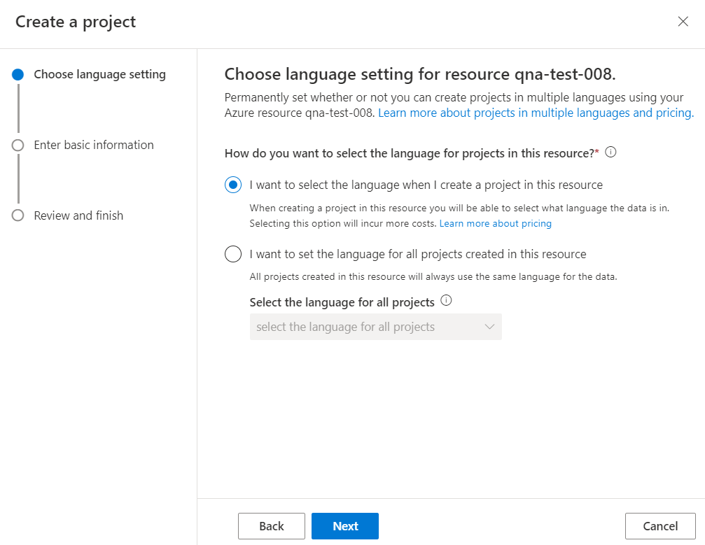

# Language support for custom question answering and projects

This article describes the language support options for custom question answering enabled resources and projects.

In custom question answering, you have the option to either select the language each time you add a new project to a resource allowing multiple language support, or you can select a language that will apply to all future projects for a resource.

## Supporting multiple languages in one custom question answering enabled resource

> [!div class="mx-imgBorder"]
> 

* When you are creating the first project in your service, you get a choice pick the language each time you create a new project. Select this option, to create projects belonging to different languages within one service.
* Language setting option cannot be modified for the service, once the first project is created.
* If you enable multiple languages for the project, then instead of having one test index for the service you will have one test index per project.

## Supporting multiple languages in one project

If you need to support a project system, which includes several languages, you can:

* Use the [Translator service](../../translator/translator-overview.md) to translate a question into a single language before sending the question to your project. This allows you to focus on the quality of a single language and the quality of the alternate questions and answers.
* Create a custom question answering enabled language resource, and a project inside that resource, for every language. This allows you to manage separate alternate questions and answer text that is more nuanced for each language. This gives you much more flexibility but requires a much higher maintenance cost when the questions or answers change across all languages.

## Single language per resource

If you **select the option to set the language used by all projects associated with the resource**, consider the following: 
* A language resource, and all its projects, will support one language only.
* The language is explicitly set when the first project of the service is created.
* The language can't be changed for any other projects associated with the resource.
* The language is used by the Cognitive Search service (ranker #1) and Custom question answering (ranker #2) to generate the best answer to a query.

## Languages supported

The following list contains the languages supported for a question answering resource.

| Language |
|--|
| Arabic |
| Armenian |
| Bangla |
| Basque |
| Bulgarian |
| Catalan |
| Chinese_Simplified |
| Chinese_Traditional |
| Croatian |
| Czech |
| Danish |
| Dutch |
| English |
| Estonian |
| Finnish |
| French |
| Galician |
| German |
| Greek |
| Gujarati |
| Hebrew |
| Hindi |
| Hungarian |
| Icelandic |
| Indonesian |
| Irish |
| Italian |
| Japanese |
| Kannada |
| Korean |
| Latvian |
| Lithuanian |
| Malayalam |
| Malay |
| Norwegian |
| Polish |
| Portuguese |
| Punjabi |
| Romanian |
| Russian |
| Serbian_Cyrillic |
| Serbian_Latin |
| Slovak |
| Slovenian |
| Spanish |
| Swedish |
| Tamil |
| Telugu |
| Thai |
| Turkish |
| Ukrainian |
| Urdu |
| Vietnamese |

## Query matching and relevance
Custom question answering depends on [Azure Cognitive Search language analyzers](/rest/api/searchservice/language-support) for providing results.

While the Azure Cognitive Search capabilities are on par for supported languages, question answering has an additional ranker that sits above the Azure search results. In this ranker model, we use some special semantic and word-based features in the following languages.

|Languages with additional ranker|
|--|
|Chinese|
|Czech|
|Dutch|
|English|
|French|
|German|
|Hungarian|
|Italian|
|Japanese|
|Korean|
|Polish|
|Portuguese|
|Spanish|
|Swedish|

This additional ranking is an internal working of the custom question answering's ranker.

## Next steps

