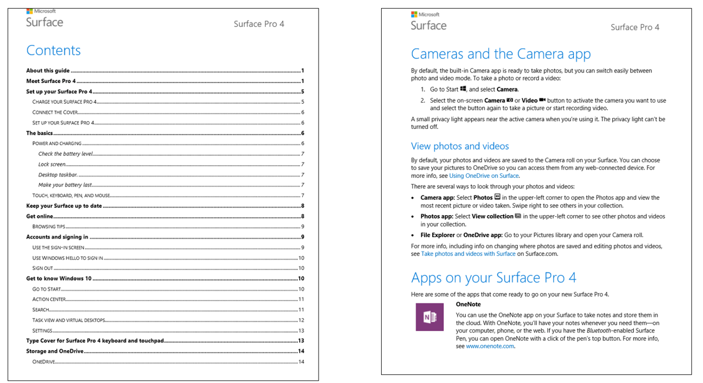
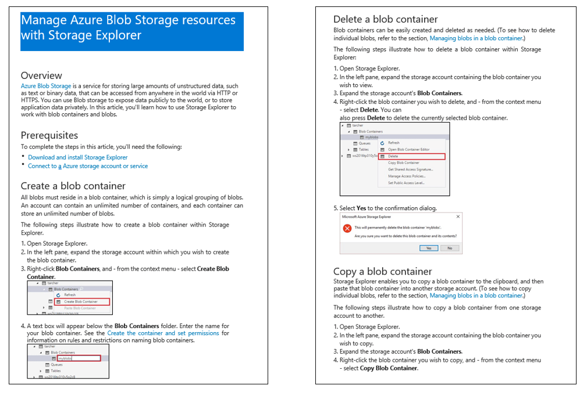
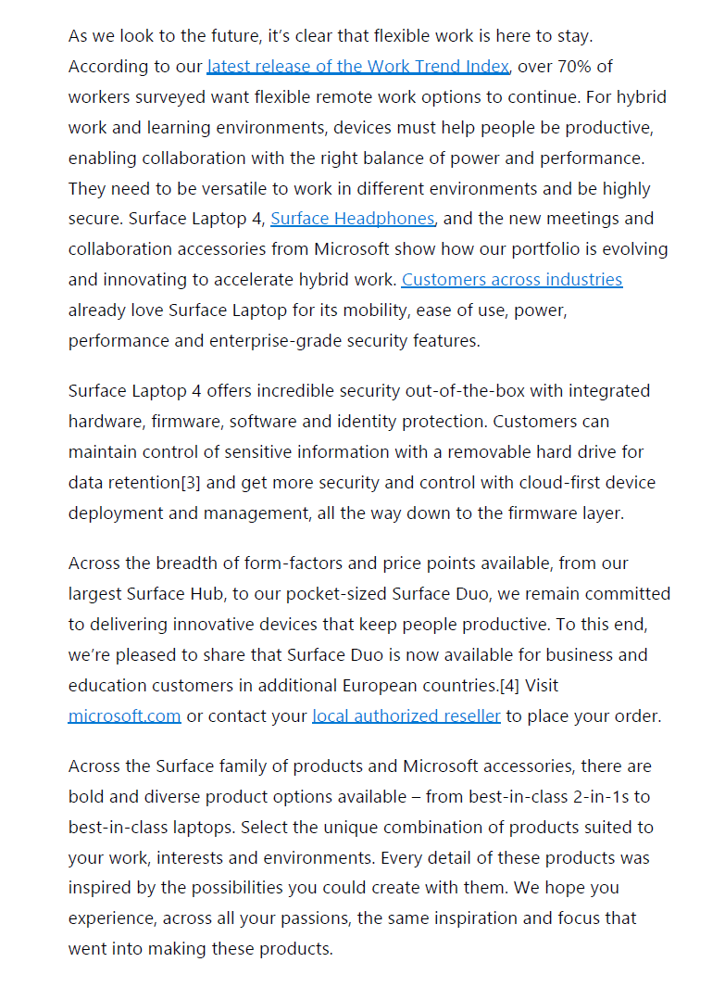
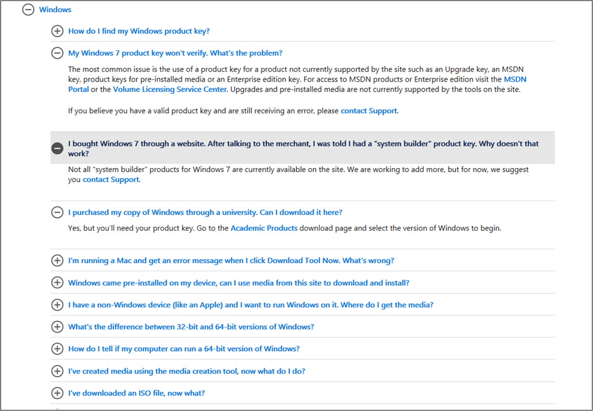

# Format guidelines for question answering

Review these formatting guidelines to get the best results for your content.

## Formatting considerations

After importing a file or URL, question answering converts and stores your content in the [markdown format](https://en.wikipedia.org/wiki/Markdown). The conversion process adds new lines in the text, such as `\n\n`. A knowledge of the markdown format helps you to understand the converted content and manage your project content.

If you add or edit your content directly in your project, use **markdown formatting** to create rich text content or change the markdown format content that is already in the answer. Question answering supports much of the markdown format to bring rich text capabilities to your content. However, the client application, such as a chat bot may not support the same set of markdown formats. It is important to test the client application's display of answers.

## Basic document formatting

Question answering identifies sections and subsections and relationships in the file based on visual clues like:

* font size
* font style
* numbering
* colors

> [!NOTE]
> We don't support extraction of images from uploaded documents currently.

### Product manuals

A manual is typically guidance material that accompanies a product. It helps the user to set up, use, maintain, and troubleshoot the product. When question answering processes a manual, it extracts the headings and subheadings as questions and the subsequent content as answers. See an example [here](https://download.microsoft.com/download/2/9/B/29B20383-302C-4517-A006-B0186F04BE28/surface-pro-4-user-guide-EN.pdf).

Below is an example of a manual with an index page, and hierarchical content

> [!div class="mx-imgBorder"]
> 

> [!NOTE]
> Extraction works best on manuals that have a table of contents and/or an index page, and a clear structure with hierarchical headings.

### Brochures, guidelines, papers, and other files

Many other types of documents can also be processed to generate question answer pairs, provided they have a clear structure and layout. These include: Brochures, guidelines, reports, white papers, scientific papers, policies, books, etc. See an example [here](https://qnamakerstore.blob.core.windows.net/qnamakerdata/docs/Manage%20Azure%20Blob%20Storage.docx).

Below is an example of a semi-structured doc, without an index:

> [!div class="mx-imgBorder"]
> 

### Unstructured document support

Custom question answering now supports unstructured documents. A  document that does not have its content organized in a well-defined hierarchical manner, is missing a set structure or has its content free flowing can be considered as an unstructured document.

Below is an example of an unstructured PDF document:

> [!div class="mx-imgBorder"]
> 

> [!NOTE]
> QnA pairs are not extracted in the "Edit sources" tab for unstructured sources.

> [!IMPORTANT]
> Support for unstructured file/content is available only in question answering.

### Structured question answering document

The format for structured question-answers in DOC files, is in the form of alternating questions and answers per line, one question per line followed by its answer in the following line, as shown below:

```text
Question1

Answer1

Question2

Answer2
```

Below is an example of a structured question answering word document:

> [!div class="mx-imgBorder"]
> 

### Structured *TXT*, *TSV* and *XLS* Files

Question answering in the form of structured *.txt*, *.tsv* or *.xls* files can also be uploaded to question answering to create or augment a project.  These can either be plain text, or can have content in RTF or HTML. Question answer pairs have an optional metadata field that can be used to group question answer pairs into categories.

| Question  | Answer  | Metadata (1 key: 1 value) |
|-----------|---------|-------------------------|
| Question1 | Answer1 | <code>Key1:Value1 &#124; Key2:Value2</code> |
| Question2 | Answer2 |      `Key:Value`           |

Any additional columns in the source file are ignored.

### Structured data format through import

Importing a project replaces the content of the existing project. Import requires a structured .tsv file that contains data source information. This information helps group the question-answer pairs and attribute them to a particular data source. Question answer pairs have an optional metadata field that can be used to group question answer pairs into categories. The import format needs to be similar to the exported knowledgebase format.

| Question  | Answer  | Source| Metadata (1 key: 1 value) | QnaId |
|-----------|---------|----|---------------------|------|
| Question1 | Answer1 | Url1 | <code>Key1:Value1 &#124; Key2:Value2</code> | QnaId 1 |
| Question2 | Answer2 | Editorial|    `Key:Value`       | QnaId 2 |

<a href="#formatting-considerations"></a>

### Multi-turn document formatting

* Use headings and subheadings to denote hierarchy. For example, You can h1 to denote the parent question answer and h2 to denote the question answer that should be taken as prompt. Use small heading size to denote subsequent hierarchy. Do not use style, color, or some other mechanism to imply structure in your document, question answering will not extract the multi-turn prompts.
* First character of heading must be capitalized.
* Do not end a heading with a question mark, `?`.

**Sample documents**:<br>[Surface Pro (docx)](https://github.com/Azure-Samples/cognitive-services-sample-data-files/blob/master/qna-maker/data-source-formats/multi-turn.docx)<br>[Contoso Benefits (docx)](https://github.com/Azure-Samples/cognitive-services-sample-data-files/blob/master/qna-maker/data-source-formats/Multiturn-ContosoBenefits.docx)<br>[Contoso Benefits (pdf)](https://github.com/Azure-Samples/cognitive-services-sample-data-files/blob/master/qna-maker/data-source-formats/Multiturn-ContosoBenefits.pdf)

## FAQ URLs

Question answering can support FAQ web pages in three different forms:

* Plain FAQ pages
* FAQ pages with links
* FAQ pages with a Topics Homepage

### Plain FAQ pages

This is the most common type of FAQ page, in which the answers immediately follow the questions in the same page.

### FAQ pages with links

In this type of FAQ page, questions are aggregated together and are linked to answers that are either in different sections of the same page, or in different pages.

Below is an example of an FAQ page with links in sections that are on the same page:

> [!div class="mx-imgBorder"]
> 

### Parent Topics page links to child answers pages

This type of FAQ has a Topics page where each topic is linked to a corresponding set of questions and answers on a different page. Question answer crawls all the linked pages to extract the corresponding questions & answers.

Below is an example of a Topics page with links to FAQ sections in different pages.

> [!div class="mx-imgBorder"]
> 

### Support URLs

Question answering can process semi-structured support web pages, such as web articles that would describe how to perform a given task, how to diagnose and resolve a given problem, and what are the best practices for a given process. Extraction works best on content that has a clear structure with hierarchical headings.

> [!NOTE]
> Extraction for support articles is a new feature and is in early stages. It works best for simple pages, that are well structured, and do not contain complex headers/footers.

## Import and export project

**TSV and XLS files**, from exported projects, can only be used by importing the files from the **Settings** page in Language Studio. They cannot be used as data sources during project creation or from the **+ Add file** or **+ Add URL** feature on the **Settings** page.

When you import the project through these **TSV and XLS files**, the question answer pairs get added to the editorial source and not the sources from which the question and answers were extracted in the exported project.

## Next steps

* [Tutorial: Create an FAQ bot](../tutorials/bot-service.md)
