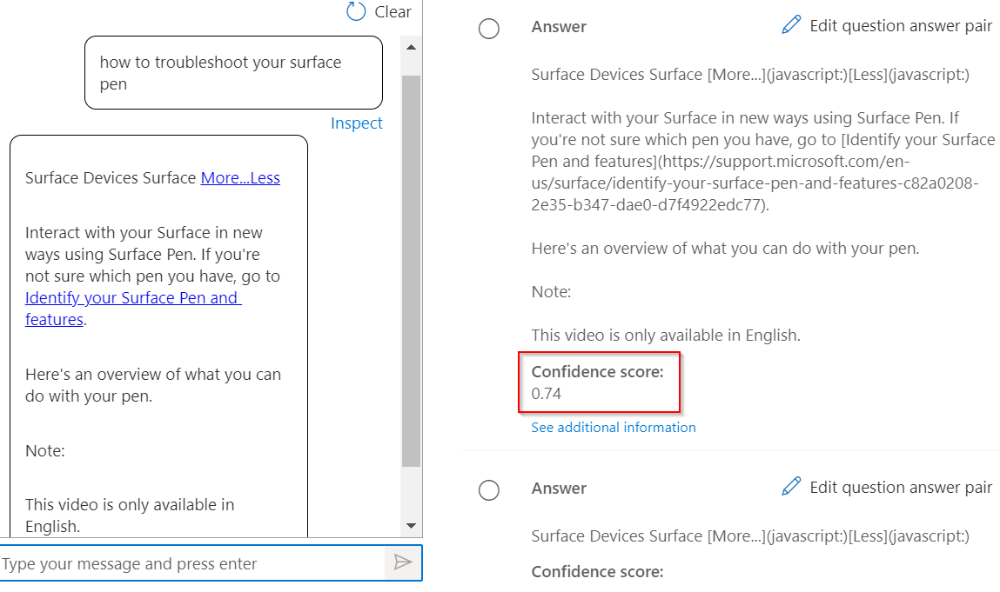
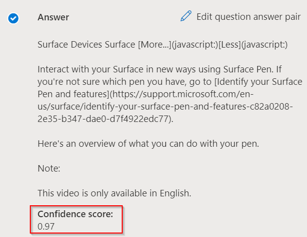

# Improve quality of response with synonyms

In this tutorial, you learn how to:

> [!div class="checklist"]
> * Add synonyms to improve the quality of your responses
> * Evaluate the response quality via the inspect option of the Test pane

This tutorial will show you how you can improve the quality of your responses by using synonyms. Let's assume that users are not getting an accurate response to their queries, when they use alternate forms, synonyms or acronyms of a word. So, they decide to improve the quality of the response by using [Authoring API](../how-to/authoring.md) to add synonyms for keywords.

## Add synonyms using Authoring API

Let’s us add the following words and their alterations to improve the results:

|Word | Alterations|
|--------------|--------------------------------|
| fix problems | `troubleshoot`, `diagnostic`|
| whiteboard   | `white board`, `white canvas`   |
| bluetooth    | `blue tooth`, `BT`     |

```json
{
    "synonyms": [
        {
            "alterations": [
                "fix problems",
                "troubleshoot",
                "diagnostic",
                ]
        },
        {
            "alterations": [
                "whiteboard",
                "white board",
                "white canvas"
            ]
        },
        {
            "alterations": [
                "bluetooth",
                "blue tooth",
                "BT"
            ]
        }
    ]
}

```

For the question and answer pair “Fix problems with Surface Pen”, we compare the response for a query made using its synonym “troubleshoot”.

## Response before addition of synonym

> [!div class="mx-imgBorder"]
> [  ]( ../media/adding-synonyms/score.png#lightbox)

## Response after addition of synonym

> [!div class="mx-imgBorder"]
> [  ]( ../media/adding-synonyms/score-improvement.png#lightbox)

As you can see, when `troubleshoot` was not added as a synonym, we got a low confidence response to the query “How to troubleshoot your surface pen”. However, after we add `troubleshoot` as a synonym to “fix problems”, we received the correct response to the query with a higher confidence score. Once, these synonyms were added, the relevance of results improved thereby improving user experience.

> [!IMPORTANT]
> Synonyms are case insensitive. Synonyms also might not work as expected if you add stop words as synonyms. The list of stop words can be found here: [List of stop words](https://github.com/Azure-Samples/azure-search-sample-data/blob/master/STOPWORDS.md).
> For instance, if you add the abbreviation **IT** for Information technology, the system might not be able to recognize Information Technology because **IT** is a stop word and is filtered when a query is processed.

## Notes
* Synonyms can be added in any order. The ordering is not considered in any computational logic.
* Synonyms can only be added to a project that has at least one question and answer pair.
* Synonyms can be added only when there is at least one question and answer pair present in a project.
* In case of overlapping synonym words between 2 sets of alterations, it may have unexpected results and it is not recommended to use overlapping sets.
* Special characters are not allowed for synonyms. For hyphenated words like "COVID-19", they are treated the same as "COVID 19", and "space" can be used as a term separator. Following is the list of special characters **not allowed**:

|Special character | Symbol|
|--------------|--------------------------------|
|Comma | ,|
|Question mark | ?|
|Colon| :|
|Semicolon| ;|
|Double quotation mark| \"|
|Single quotation mark| \'|
|Open parenthesis|(|
|Close parenthesis|)|
|Open brace|{|
|Close brace|}|
|Open bracket|[|
|Close bracket|]|
|Hyphen/dash|-|
|Plus sign|+|
|Period|.|
|Forward slash|/|
|Exclamation mark|!|
|Asterisk|\*|
|Underscore|\_|
|Ampersand|@|
|Hash|#|


## Next steps

