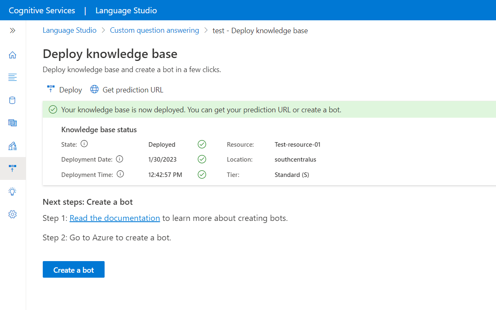
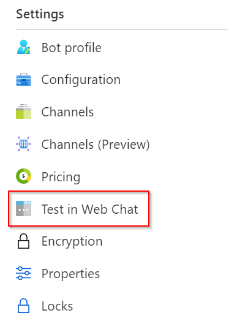

# Tutorial: Create a FAQ bot

Create a FAQ Bot with custom question answering and Azure [Bot Service](https://azure.microsoft.com/services/bot-service/) with no code.

In this tutorial, you learn how to:

<!-- green checkmark -->
> [!div class="checklist"]
> * Link a question answering project to an Azure AI Bot Service
> * Deploy a Bot
> * Chat with the Bot in web chat
> * Enable the Bot in supported channels

## Create and publish a project

Follow the [getting started article](../how-to/create-test-deploy.md). Once the project has been successfully deployed, you will be ready to start this article.

## Create a bot

After deploying your project, you can create a bot from the **Deploy project** page:

* You can create several bots quickly, all pointing to the same project for different regions or pricing plans for the individual bots.

* When you make changes to the project and redeploy, you don't need to take further action with the bot. It's already configured to work with the project, and works with all future changes to the project. Every time you publish a project, all the bots connected to it are automatically updated.

1. In Language Studio, on the question answering **Deploy project** page, select the **Create a bot** button.

    > [!div class="mx-imgBorder"]
    > 

1. A new browser tab opens for the Azure portal, with the Azure AI Bot Service's creation page. Configure the Azure AI Bot Service and hit the **Create** button.

    |Setting |Value|
    |----------|---------|
    | Bot handle| Unique identifier for your bot. This value needs to be distinct from your App name |
    | Subscription | Select your subscription |
    | Resource group | Select an existing resource group or create a new one |
    | Location | Select your desired location |
    | Pricing tier | Choose pricing tier |
    |App name | App service name for your bot |
    |SDK language | C# or Node.js. Once the bot is created, you can download the code to your local development environment and continue the development process. |
    | Language Resource Key  | This key is automatically populated deployed question answering project |
    | App service plan/Location | This value is automatically populated, do not change this value |

1. After the bot is created, open the **Bot service** resource.
1. Under **Settings**, select **Test in Web Chat**.

    > [!div class="mx-imgBorder"]
    > 

1. At the chat prompt of **Type your message**, enter:

    `How do I setup my surface book?`

    The chat bot responds with an answer from your project.

    > [!div class="mx-imgBorder"]
    > 

## Integrate the bot with channels

Select **Channels** in the Bot service resource that you have created. You can activate the Bot in additional [supported channels](/azure/bot-service/bot-service-manage-channels).

   >[!div class="mx-imgBorder"]
   >

## Clean up resources

If you're not going to continue to use this application, delete the associate question answering and bot service resources.

## Next steps

Advance to the next article to learn how to customize your FAQ bot with multi-turn prompts.
